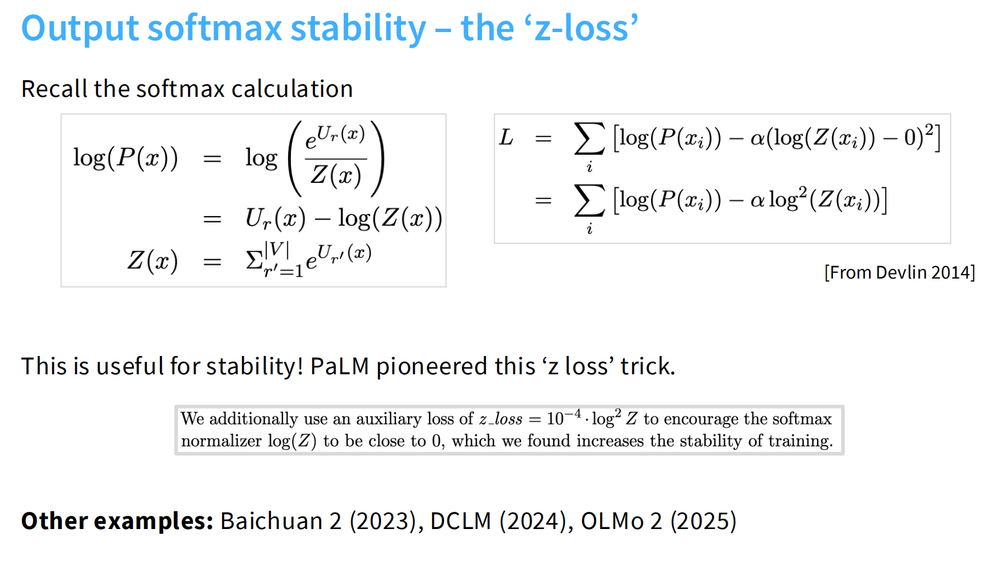
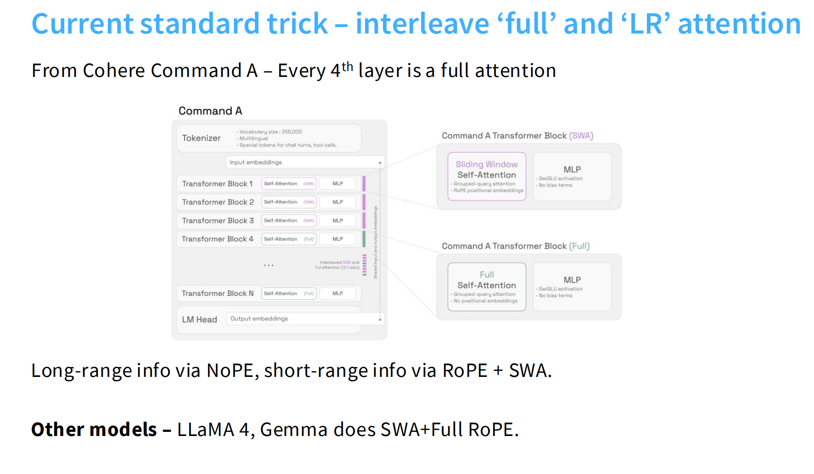

方法：研读相关论文，分析其中的变与不变，找出关键的设计要素，让 Transformer 发挥最佳性能——**实践出真知**

# Transformer 架构

# 归一化层

## Pre-vs-post norm

Pre-Norm 的核心优势：保持 residual path 的数值稳定性，让梯度能平滑地穿过上百层网络。

## LayerNorm vs RMSNorm

1. **计算更少**：LN 需要计算均值和方差，RMSNorm 只要**平方和一次归约**即可；同时相比于 LN,RMSNorm 还少加了一个偏置项，虽然加法等在计算中占比很少，但是其内存调转引起的时延占比非常非常高（见上图图7）；
2. **反向传播简单**：没有取均值与方差项，梯度表达式更简单，数值更稳定（尤其混合精度、低比特场景）。
3. **能够保留均值（偏移）信息**：LN 强制零均值，RMSNorm 不会抹去均值方向上的信息；实践上，在**预归一化（Pre-Norm）Transformer**的残差通路里，这常常配合得很好（许多现代解码式 LLM——如 LLaMA 系列、Mistral 等——采用 RMSNorm）。
详细讲解可看[assignment1各模块实现讲解](https://github.com/CliffKai/assignment1-basics/blob/main/Note/assignment1%E5%90%84%E6%A8%A1%E5%9D%97%E5%AE%9E%E7%8E%B0%E8%AE%B2%E8%A7%A3.ipynb) 9.4部分。

## dropping bias terms

可以总结成以下三条：

1. **归一化已抵消偏移作用**：
　在 Pre-Norm + RMSNorm 架构中，输入已被标准化，bias 只会重新引入不必要的偏移，破坏数值平衡。

2. **提升训练稳定性**：
　去掉 bias 后，层间激活均值更稳定、梯度分布更平滑，尤其在混合精度训练中更容易收敛。

3. **减少内存与计算负担**：
　少一组参数、少一次广播加法，对大模型可节省显存并提高计算效率。

# 激活函数

# 位置编码

RoPE

# 超参数

## FFN

传统 GELU-MLP 用 $d_{\text{ff}}=4d$ 且只有两次投影（$d\to4d\to d$），参数量约 $8d^2$。
SwiGLU 有 **三** 次投影（两入一出）：参数量 $\approx 3 d\cdot d_{\text{ff}}$。
为了和传统 MLP 的参数/算力预算相当，令 $3 d\cdot d_{\text{ff}}\approx 8d^2\Rightarrow d_{\text{ff}}\approx \frac{8}{3}d$。

## 模型维度

$(head_{dim} * head_{num}) : d_{model}$ 一般取 $1:1$。

$d_{model} : n_{layer}$ 一般取 $128$ 左右。

# 权重衰减

现在在 LLM 中使用 weight decay 并不是为了防止过拟合（regularization），而是为了优化训练动态，让模型训练得更稳定、更有效。

这一部分课程中没有讲原因，我个人理解如下：

在现代大模型（比如 70 层、100 层 Transformer）里，一个输入 token 的信号会：
$$
x_0 \xrightarrow{W_1} x_1 \xrightarrow{W_2} x_2 \xrightarrow{W_3} \dots \xrightarrow{W_L} x_L
$$
也就是说它会经过成百上千次线性变换 + 非线性激活 + 残差连接。

如果其中某一层的参数 $W_i$ 过大，比如 scale 变成原来的 1.2 倍，
它会在信号流的每一层都放大一点点：
$$
|x_L| \propto \prod_{i=1}^L |W_i|
$$
即便每层只放大 1.01 倍，经过 100 层也变成：
$$
1.01^{100} \approx 2.7
$$
这会造成激活分布漂移、梯度爆炸、正则化不再有效。

最重要的是：**Adam 优化器不会“自然发现”这个问题**

因为 Adam 对梯度进行了逐维归一化，它看不到参数的绝对大小，它只管“梯度相对变化”，不会自动去约束参数的范数。

所以当某些层的参数变大时：

* Adam 不会惩罚它；
* 正则化会“部分抵消”表面上的放大；
* 但**反向传播的梯度分布却会一点一点漂移**；
* 结果模型整体 scale 不断上升（即所谓的 “norm inflation”）。

Weight Decay 在这里起到的作用就像：“在每一层都安装一个微弱的阻尼器，防止参数的尺度慢慢积累到危险值”。

它确保：
$$
|W_i| \text{ 在整个训练过程中保持在合理范围内。}
$$

这就让深层堆叠不会发生指数放大，从而使得学习率调度仍然有效。

# 模型输出前的 softmax + z-loss

我废了好大的劲才看明白这个问题，**才看明白这个问题！！！（心累😩）**

## 1. 为什么 softmax 会出现不稳定的问题

要弄懂这个问题，就要从交叉熵函数的优化开始。

### 1）. **交叉熵损失函数的计算**

交叉熵损失函数通常用于分类任务，它的定义是：
$$
\mathcal{L} = -\log(p_y)
$$
其中 $ p_y $ 是模型对目标类别 $ y $ 的预测概率，通常通过 softmax 函数计算出来。具体来说，softmax 对每个类别 $ k $ 的概率计算为：
$$
p_k = \frac{e^{u_k}}{\sum_j e^{u_j}}
$$
其中，$ u_k $ 是类别 $ k $ 的 logit（即模型的原始输出），$ p_k $ 是 softmax 计算出的概率。

## 2. **softmax 对全局偏移的“平移不敏感性”**

**关键概念**：softmax 函数对所有 logits 加上一个常数 $ c $ 后，输出的概率分布**不变**。换句话说：
$$
p_k = \frac{e^{u_k + c}}{\sum_j e^{u_j + c}} = \frac{e^{u_k}}{\sum_j e^{u_j}}
$$
也就是说，如果你对 logits $ u_k $ 中的每个值都加上一个常数（例如，给每个 logit 都加上一个常量 $ c $），softmax 输出的概率分布不会受到影响。

**为什么没有影响？**

* softmax 计算的是每个类别的概率**相对其他类别**的概率。因此，所有的 logits 都加上同一个常数 $ c $，这些常数对概率分布的相对关系没有影响。

### 3）. **全局偏置的“无目的漂移”**（我知道前面的应该是大家都明白的道理，前面只是铺垫，这个是关键）

* 当我们训练神经网络时，**我们并不直接控制 logits 的数值**，而是通过梯度下降来优化损失函数。假设我们在训练过程中并没有约束 logits 的整体数值尺度，那么在某些情况下，**所有 logits 可能会“无目的地漂移”**。
* 具体来说，**如果你没有对 logits 做限制，优化过程中可能会出现这样的情况**：logits 可能会随着训练不断增大或减小，但这并不会影响 softmax 输出的概率分布，因为 softmax 本身对所有 logits 加同一个常数不敏感。
* 也就是说，我全都增大到特别大也没关系，只要保证正确标签的那个值输出的更大即可。
* 但这样的“漂移”可能会引发数值不稳定性，比如：

  * **数值溢出（overflow）**：如果 logits 的值变得非常大，指数函数 $ e^{u_k} $ 可能会导致数值溢出（这个问题相对来说很好解决，只需要所有值都减去 $max(u_i)$ 即可，也就是取 $ {\sum_j e^{{u_j}-{max(u_j)}}} $，但是，这解决的只是计算时的问题，解决不了训来年过程中梯度消失或爆炸的问题。
  * **梯度消失或爆炸**：在深层网络中，logits 的尺度如果不加以控制，梯度在反向传播时可能会变得非常小（梯度消失）或非常大（梯度爆炸），影响模型训练的稳定性。

> 这里很简单，计算一下 $ u_1 = 1000, u_2 = 1001, u_3 = 2000 $ 情况下的 $ p_k $ 就明白了。

### 4）. **为什么需要 z-loss 约束这种漂移？**

z-loss 的作用就是通过惩罚项约束 logits 的整体尺度，**避免 logits 之间的差距过大**，从而**减少这种漂移**，让训练过程更加稳定。具体来说，z-loss 惩罚的是 $ \log Z(x) ,  的平方，强制 logits 的总体尺度保持在一个合适的范围内，从而避免了上述的数值不稳定和梯度问题。

## 2. **z-loss 的原理是什么？**

### **目标：控制 logits 的整体尺度**

z-loss 的设计目的是确保 **softmax 的归一化因子**（即 $Z(x)$）保持在一个稳定的范围内，特别是希望它接近于 1，避免出现数值溢出或梯度爆炸的问题。z-loss 的公式如下：
$$
\mathcal{L}_{\text{aux}} = -\alpha (\log Z(x))^2
$$
其中，$ Z(x) = \sum_j e^{u_j(x)} $ 是 logits 归一化因子，$\alpha$ 是一个很小的常数，控制 z-loss 的惩罚强度。

### **z-loss 惩罚的是 $\log Z(x)$**

* **$ Z(x) $** 是 softmax 归一化因子，即所有 logits 指数的总和：
  $$
  Z(x) = \sum_{r=1}^{|V|} e^{u_r(x)}
  $$
  它决定了 softmax 输出的概率的大小。

* **$\log Z(x)$** 是 $Z(x)$ 的对数，它是衡量 logits “整体尺度”的一个重要指标。**如果 $\log Z(x)$ 很大或很小**，说明 logits 的数值范围不平衡（这里可以自己手动推导一下，因为地方写不下我就直接给结论：$\log Z(x) ≈ logits 的“平均数值” + 一个常数\log|V|$），可能导致数值不稳定、梯度消失/爆炸等问题。

* **惩罚项 $(\log Z(x))^2$**：z-loss 惩罚的是 $\log Z(x)$ 的平方。**当 $\log Z(x)$ 离 0 越远时，z-loss 的惩罚越大**，这样就会通过梯度下降的方式，强迫模型调整 logits 的尺度，使得 $\log Z(x)$ 接近 0。理论上，**当 $\log Z(x)$ 趋近 0 时，模型的 logits 就会保持在一个合适的范围内**，从而避免了数值不稳定和梯度问题。

## 3. **为什么 z-loss 能稳定 softmax 的输出？**

### **1) 避免 logits 差距过大**

logits 中不同类别之间的差距过大，会导致 **softmax 输出过于极端**，比如概率分布几乎是 one-hot（即一个类别的概率接近 1，其他类别的概率接近 0）。这种极端的输出会使得梯度变得非常小（因为 softmax 的梯度和概率之间存在反比关系）。使用 z-loss 后，**$\log Z(x)$ 趋向 0**，意味着 logits 的整体尺度得到了限制，类别之间的差距不会太大，**softmax 输出变得更加平滑**，从而避免了梯度消失的问题。

例如，假设在没有 z-loss 的情况下，logits 为：
$$
u_1 = 1000, \quad u_2 = 1000, \quad u_3 = -1000
$$
softmax 输出可能会是：
$$
p_1 \approx p_2 \approx 0.5, \quad p_3 \approx 0
$$
此时，由于 logits 之间差距过大，**softmax 输出极端化**，导致反向传播时梯度几乎为 0，不利于训练。加上 z-loss 后，模型会被迫让 $\log Z(x)$ 接近 0，保持 logits 之间的差距较小，从而保证 softmax 输出的平滑性。

### **2) 使得 logits 规模更可控**

z-loss 的一个重要作用是**控制 logits 的整体规模**。在训练中，如果 logits 的值太大或太小，可能导致 **数值溢出/下溢**，或者 **梯度爆炸/消失**。z-loss 通过惩罚 $\log Z(x)$ 的平方，**限制了 logits 规模的过大**，从而避免了指数计算时的溢出或过小的数值导致下溢。

例如，在没有 z-loss 的情况下，如果 logits 非常大：
$$
u_1 = 10000, \quad u_2 = 10000, \quad u_3 = 10000
$$
softmax 输出将会出现溢出，导致数值不稳定。使用 z-loss 后，通过限制 $\log Z(x)$ 使其接近 0，模型会减小 logits 的规模，从而避免了这种不稳定。

### **3) 平滑梯度，避免梯度爆炸**

通过约束 logits 的尺度，z-loss **平滑了梯度的计算**，使得训练过程中梯度不会变得过大或过小。当 logits 的差距过大时，softmax 的梯度会变得非常小（如果某个类别的概率接近 1，其他类别接近 0，梯度几乎为 0）。这种情况下，模型更新缓慢，甚至会导致训练停滞。通过 z-loss，**模型强制 logits 之间的差距适中**，梯度变得更均匀，有利于模型稳定收敛。

### **4) 自归一化特性**

z-loss 通过强制 $\log Z(x)$ 接近 0，使得 logits 的输出变得自归一化（self-normalizing）。**这种自归一化特性**使得模型的 softmax 输出在数值上变得更加稳定，从而避免了由于 logits 极端化所导致的训练问题。

例如，假设在没有 z-loss 的情况下，logits 输出的差距非常大，可能导致 softmax 输出非常不稳定。而加上 z-loss 后，模型会控制 logits 的整体尺度，使得输出概率保持在合适范围内，进而提高训练的稳定性。

# Attention 中的 softmax + QK norm

## 1.softmax 不稳定的根源

在标准的注意力机制中：
$$
\text{Attention}(Q, K, V) = \text{softmax}\left( \frac{QK^T}{\sqrt{d_k}} \right) V
$$

这里的关键问题是：

* 如果 **Q 或 K 的范数（norm）过大**，那么 ( QK^T ) 的值也会变得很大；
* softmax 对输入的 **数值尺度非常敏感**；
* 当输入太大时，softmax 输出会接近 one-hot（几乎全是 0 和 1），导致梯度几乎为零；
* 当输入太小时，softmax 输出又接近平均分布，模型学习不到有效注意力模式。

> 还是前面的原因

因此，**Q 和 K 的数值尺度会直接影响 softmax 的稳定性**。

## 2.“QK norm” 的原理

> “The query and keys are Layer (RMS) normed before going into the softmax operation.”

意思是：

* 在计算 ( QK^T ) 之前，**对 Q 和 K 进行 RMSNorm（或 LayerNorm）归一化**；
* 也就是说，把它们的范数都约束在一个比较固定的范围内（通常是 1）。

这样：
$$
|Q| \approx 1, \quad |K| \approx 1
$$
那么 ( QK^T ) 的数值范围就会变得可控，softmax 的输入分布更稳定。

## 4.图中每个步骤解释

上半部分的 Attention 流程：

1. **LN → QKV**
   输入向量先经过 LayerNorm，再线性映射成 Q、K、V。
2. **Split**
   分成多个头。
3. **LN (on Q and K)**
   再次对 Q 和 K 分别做 LayerNorm（或 RMSNorm）——这就是 “QK norm” 的核心。
4. **BMM1 (Batch Matrix Multiply 1)**
   计算 $ QK^T $。
5. **Softmax**
   对每个 Query 的结果做 softmax 得到注意力权重。
6. **BMM2**
   计算权重加权后的 $ V $。
7. **Proj**
   输出投影。
8. **Residual**
   加上原始输入（残差连接）。

## 5.为什么这样能提高稳定性

归一化 Q 和 K 的作用是：

* 保证它们的内积不会因为尺度过大而导致 softmax 输入爆炸；
* softmax 的输出范围稳定；
* 梯度不会因为数值过小或过大而消失或爆炸；
* 训练时更平稳、更容易收敛。

换句话说，**QK norm 是一种防止注意力分数过度极化的正则化手段**。

> 其实原理和前面类似，只不过 QK norm 是在 softmax 前控制输入分布的稳定性（防止 logits 太极端），z-loss 是在 softmax 后控制输出概率分布的稳定性（防止概率过度极化）

再补充一点：**在推理的时候 QK norm 也是要保持激活的**，因为其中有已经学到了的参数，如果在推理的时候不进行激活，那么行就不知道怎么处理这种超出学习分布的数据了。

# KV Cache

## 1.KV cache 是什么？

**KV cache（Key-Value Cache）** 是在 Transformer 模型（尤其是自回归生成模型，如 GPT 系列）中 **缓存注意力机制中的 K（Key）和 V（Value）张量** 的一种技术。

它的主要目的是：

> **在推理（inference）阶段避免重复计算已生成 token 的注意力表示，从而大幅加速生成速度。**

## 2.为什么需要 KV cache？

Transformer 的自注意力机制计算公式为：

$$
\text{Attention}(Q, K, V) = \text{softmax}\left(\frac{Q K^T}{\sqrt{d_k}}\right)V
$$

在自回归生成中（例如 GPT 生成一句话时），模型是**逐个 token 生成**的。

* 第 1 个 token：计算 Q₁, K₁, V₁
* 第 2 个 token：计算 Q₂, K₂, V₂
  但是它还要与 **之前所有 token（1,2,...,t-1）的 K,V** 做注意力
  $$
  \text{Attention}_t = \text{softmax}(Q_t [K_1, K_2, ..., K_t]^T)V
  $$
* 所以如果每一步都重新计算之前所有 token 的 K 和 V，就会产生巨大的重复计算。

## 3.KV cache 的原理

KV cache 就是：

> **在生成第一个 token 时，把每一层的 K 和 V 存起来**；
> **之后生成新 token 时，直接把新的 K,V 拼接到缓存中，而不是重新算旧的。**

举个例子（以自回归推理为例）：

| 步骤 | 输入 token | 做什么                            | KV cache 内容            |
| -- | -------- | ------------------------------ | ---------------------- |
| 1  | "I"      | 计算 K₁,V₁                       | [K₁], [V₁]             |
| 2  | "am"     | 计算 K₂,V₂，与 K₁,V₁ 一起注意力         | [K₁,K₂], [V₁,V₂]       |
| 3  | "a"      | 计算 K₃,V₃，与 [K₁,K₂,V₁,V₂] 一起注意力 | [K₁,K₂,K₃], [V₁,V₂,V₃] |

这样每步生成时，只需计算当前 token 的 Q,K,V，而不是重新计算全部历史的。

非常好问题！我们来系统讲清楚 👇

# GQA and MQA

## 1.GQA 是什么？

**GQA** 全称 **Grouped Query Attention**，中文一般译为「分组查询注意力」。

它是 **在多头注意力（Multi-Head Attention, MHA）和多查询注意力（Multi-Query Attention, MQA）之间的一个折中方案**，旨在 **降低解码（推理）阶段的显存与带宽开销**，同时保持较好的模型性能。

### 1.1 标准 MHA 的瓶颈

在普通的多头注意力中，每个注意力头都有自己的：
$$
Q_i, K_i, V_i
$$
也就是：

* $h_q = h_k = h_v = h$
* 每个头都有独立的 Key/Value。

**问题在于：**
在推理（生成）时，我们需要缓存每个头的所有历史 (K,V)：
$$
\text{KV cache size} \propto h \times n \times d_h
$$
例如一个 32 头、4096 维的模型，序列长度 8K 时，这部分显存开销巨大。
而且每步都要从显存读取这些 (K,V)，**带宽消耗非常大**（显存也大），尤其在长上下文、batch 小时。

### 1.2 MQA 的做法

**MQA (Multi-Query Attention)**：
让所有 Query 头共享同一组 Key/Value：
$$
K_1 = K_2 = \dots = K_h, \quad V_1 = V_2 = \dots = V_h
$$
也就是：
$$
h_q = h, \quad h_k = h_v = 1
$$

✅ 优点：

* KV cache 体积直接缩小约 (1/h) 倍；
* 推理带宽也减少约 (1/h)。

❌ 缺点：

* 所有头都看同一个 KV，会导致**注意力多样性下降**，在复杂任务上性能略降（尤其是长上下文、推理任务）。

### 1.3 折中方案

**GQA (Grouped Query Attention)**：
将多个 Query 头分为若干组，每组共享同一组 Key/Value。

形式上：
$$
h_q = h, \quad h_k = h_v = g < h
$$
其中每组包含 (h / g) 个 Query 头。

例如：

* 原本 32 个头；
* 分 8 组，每组 4 个头共享 1 组 KV；
* 则 (h_q = 32, h_{kv} = 8)。

✅ **这样得到的效果是：**

* **显存/带宽减少约 4 倍；**
* **但注意力多样性仍保留 8 组的独立性；**
* **性能几乎不损失。**

## 2.什么是 MQA？

**MQA（Multi-Query Attention）** 是对传统多头注意力（MHA）的改进，
它的核心思想是：

> **多个 Query 头共享同一组 Key/Value。**

### 2.1 标准 MHA

看前面

### 2.2 MQA 的改进思想

**Multi-Query Attention** 让所有头共享同一组 K/V：

$$
K_1 = K_2 = \dots = K_h = K, \quad V_1 = V_2 = \dots = V_h = V
$$

也就是：

* 每个头仍然有自己的 $Q_i$；
* 但 **所有头使用同一组 Key/Value**。

**效果：**

* 计算量几乎不变（QKᵀ 仍然每头算一次）；
* 但 **KV 缓存大小直接缩小约 $1/h$**；
* 每步从显存读取的带宽减少约 $1/h$。

> 举例：
> 假设模型有 32 个头，每个头 128 维：
>
> * MHA 缓存：32 × n × 128 = 4096n；
> * MQA 缓存：1 × n × 128 = 128n；
>   → 缩小 **32 倍**！

### 2.3 MQA 的实现形式

在实际实现中：

* $Q$ 仍然是多头（不同 $W_Q$）；
* $K,V$ 各只有一组权重 $W_K, W_V$；
* 计算时每个头的注意力权重是：
  $$
  \text{softmax}(Q_i K^T / \sqrt{d_h}) V
  $$

也就是说：

* 每个 Query 头仍有自己的关注模式；
* 但它们都基于同样的 Key/Value 空间。

> 这里顺序有点问题，其实应该先讲 MQA 再讲 GQA 的，算了就这样吧。

# 总结一下 MHA、MQA、GQA

## 1.三者定义与核心思想

| 类型      | 全称                      | 核心思想                  | Q 头 | K/V 头   | 代表模型                        |
| ------- | ----------------------- | --------------------- | --- | ------- | --------------------------- |
| **MHA** | Multi-Head Attention    | 每个头都有独立的 Q/K/V，最大灵活性  | h   | h       | Transformer, BERT, GPT-2    |
| **GQA** | Grouped Query Attention | 多个 Query 头分组共享同一组 K/V | h   | g (g<h) | LLaMA 2/3, Falcon, Mistral  |
| **MQA** | Multi-Query Attention   | 所有 Query 头共享同一组 K/V   | h   | 1       | PaLM, GPT-3.5-turbo, Gemini |

## 2.什么时候用哪一种？

| 场景                          | 推荐机制           | 原因                                                        |
| --------------------------- | -------------- | --------------------------------------------------------- |
| **模型训练阶段**               | **MHA**（或 GQA） | 训练是全并行计算（compute-bound），算力是瓶颈，显存可控；MHA 保证最大特征表达能力。        |
| **推理 / 文本生成（inference）** | **GQA / MQA**  | 推理是增量生成（memory-bound），带宽和显存是瓶颈；GQA/MQA 可极大减轻 KV cache 负担。 |
| **长上下文生成（>4K tokens）**   | **GQA 或 MQA**  | 上下文越长，KV 缓存越大，节省显存与带宽的收益越明显。                              |
| **小 batch 在线推理（聊天/问答）**   | **MQA 最佳**     | 小 batch 时 GPU 算力利用率低，MQA 大幅减少显存读写、提高吞吐。                   |
| **高精度/逻辑任务（代码生成、数学、推理）** | **GQA 优于 MQA** | GQA 保留部分头的独立性，性能损失比 MQA 小。                                |
| **边缘部署/轻量模型**           | **MQA**        | 极致压缩 KV 缓存、降低带宽，推理端资源消耗最小。                                |

## 3.显存占用对比（KV Cache 为主）

推理阶段主要的显存压力来自 **KV cache**。
假设：

* (h_q = 32)（Query 头数）
* 每个头维度 (d_h = 128)
* 序列长度 (n = 8k)
* batch 大小 (b = 1)

| 类型            | KV cache 大小（比例） | 定量估算                                                                  | 说明           |
| ------------- | --------------- | --------------------------------------------------------------------- | ------------ |
| **MHA**       | 100% baseline   | $b \times n \times h_q \times d_h = 1 \times 8k \times 32 \times 128$ | 每个头独立缓存      |
| **GQA $g=8$** | ≈25%            | $b \times n \times g \times d_h = 8k \times 8 \times 128$             | 每组共享 1 组 K/V |
| **MQA**       | ≈3%             | $b \times n \times 1 \times d_h = 8k \times 128$                      | 所有头共享同一组 K/V |

> 可见：
> MQA 显存消耗 ≈ MHA 的 1/32，
> GQA（g=8）显存消耗 ≈ MHA 的 1/4。

## 4.带宽占用对比

带宽（memory bandwidth）是推理性能瓶颈。
解码每生成一个 token，模型需要从显存读取所有缓存的 K/V。

| 类型      | 带宽开销           | 说明                                     |
| ------- | -------------- | -------------------------------------- |
| **MHA** | 最高（baseline） | 每步读取所有 h 组 K/V，带宽压力最大                  |
| **GQA** | 中等           | 每步读取 g 组 K/V（通常是 h/4 或 h/8），带宽降低 4～8 倍 |
| **MQA** | 最低           | 所有头共用一组 K/V，每步读取量 ≈ 原来的 1/h（32 倍减少）    |

> 对于自回归生成（如 LLM 解码），**带宽**通常是关键瓶颈。
> 所以 **MQA 在推理阶段几乎总是最快的方案**。

## 5.三者的优劣全面对比

| 特性           | **MHA**     | **GQA**           | **MQA**                     |
| ------------ | ----------- | ----------------- | --------------------------- |
| **表达能力**     | 🌟🌟🌟🌟🌟  | 🌟🌟🌟🌟          | 🌟🌟                        |
| **推理速度**     | 🌟          | 🌟🌟🌟            | 🌟🌟🌟🌟🌟                  |
| **显存占用（KV）** | 🌟          | 🌟🌟🌟            | 🌟🌟🌟🌟🌟                  |
| **带宽占用**     | 🌟          | 🌟🌟🌟            | 🌟🌟🌟🌟🌟                  |
| **实现复杂度**    | 简单          | 中等                | 最简单（最轻量）                    |
| **注意力多样性**   | 最强（每头独立）    | 较强（按组共享）          | 弱（所有头共享）                    |
| **训练稳定性**    | 非常稳定        | 稍需调参              | 初期不稳定（需 warmup）             |
| **典型使用阶段**   | 训练阶段        | 推理阶段（平衡）          | 推理阶段（极致效率）                  |
| **代表模型**     | GPT-2, BERT | LLaMA 2/3, Falcon | PaLM, Gemini, GPT-3.5-turbo |

下面把这张图讲清楚（它总结了目前“长上下文”模型里很常见的一招：**在网络中交替使用“全局注意力（Full）”和“局部/滑窗注意力（LR/SWA）”**）。

# Current standard trick – interleave ‘full’ and ‘LR’ attention

## 图含义

* 含义：在层之间**交替插入**两种注意力层：大多数层用便宜的**滑动窗口注意力（Sliding Window Attention, SWA）**，每隔若干层（例如 **每 4 层**）放一个昂贵的**全局注意力（Full Attention）**。

* Command A ：一个 Transformer 堆叠，其中“Self-Attention (SWA)”与“Self-Attention (Full)”交替出现，并配有 MLP。

* **SWA block**

  * *Sliding Window Self-Attention*、*Grouped-Query Attention*（GQA）、*RoPE positional embeddings*。
  * 含义：注意力只在**固定窗口大小 w** 内做（局部上下文），用 **RoPE** 提供相对位置信息；用 **GQA** 减 KV 开销。

* **Full block**

  * *Full Self-Attention*、*No positional embeddings (NoPE)*（这里是是 NoPE，但是有的模型也会在 Full 里继续用 RoPE）。
  * 含义：该层允许**全序列两两交互**，不受窗口限制，用 NoPE 以增强远距离泛化（不同模型实现略有差异）。

* 总结：

  * **长程信息由 NoPE（无位置编码的全局层）承载**，
  * **短程细节由 RoPE + SWA 承载**。
  * “Other models – LLaMA-4、Gemma 做的是 SWA + Full（RoPE）”：意思是别的模型也用“滑窗+全局”的交替，但**全局层里继续用 RoPE**，而不是 NoPE。

## 为什么要交替？

1. **计算/带宽省得多**：

   * Full 层复杂度 ~ $𝒪(n²)$，KV Cache 要保留全部历史；
   * SWA 层复杂度 ~ $𝒪(n·w)$，只保留最近 w 个 token 的 KV。
   * 若“每 4 层放 1 个 Full”（比例 p=1/4），整体开销近似
     $$
     \text{Cost} \approx p\cdot n^2 + (1-p)\cdot n w
     $$
     当 $n≫w$ 时，开销大幅下降，推理带宽/显存压力也显著降低。
2. **信息仍能“全局混合”**：
   纯滑窗会“信息卡在窗口里”。插入 Full 层让**所有位置周期性地彼此沟通**，把不同窗口的信息“搅拌”在一起，避免长程依赖丢失。
3. **位置归纳偏置的互补**：

   * **RoPE+SWA** 对短距离建模很强，局部模式稳定；
   * **Full+NoPE/或RoPE** 给到长距离连接或跨段汇聚的能力，提升长上下文任务。

## 以 Cohere Command A 为例

* **策略**：**每 4 层一个 Full**；其余 3 层用 **SWA（带 GQA 与 RoPE）**。
* **SWA 层**：

  * 只看局部窗口（提升速度 & KV 更小）；
  * **GQA**（多查询共享更少组的 K/V）进一步压缩 KV 带宽与占用；
  * **RoPE** 提供稳定的相对位置信号，足够应对短程模式。
* **Full 层**：

  * 允许任意两 token 交互，实现全局汇聚；
  * 该图注记为 **NoPE**（不加位置编码）来增强长度外推；但**其他模型（LLaMA-4、Gemma）在 Full 层依然用 RoPE**。

## 对训练与推理的影响

* **推理 KV-cache**：

  * SWA 层：每层只缓存最近 w 个 K/V；
  * Full 层：要缓存**全部**过去的 K/V（开销大），但因为比例小，所以总体可控。
* **带宽**：多数层是 SWA+GQA → **读写 KV 明显更少**；偶尔的 Full 层承担“全局同步”的代价。
* **有效感受野**：经过若干层堆叠，“SWA 的局部 + 周期 Full 的全局”让信息能**逐层扩散到全序列**，不牺牲建模力。

## 可调的两个关键超参

1. **Full 的间隔 k**（例：k=4）：k 越大 → 更省算/带宽，但全局混合变慢；k 越小 → 反之。
2. **滑窗大小 w**：w 越大 → 局部层更贵但短程能力更强；w 越小 → 更省但可能丢近邻细节。

