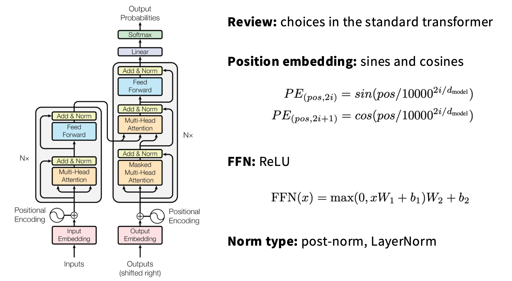
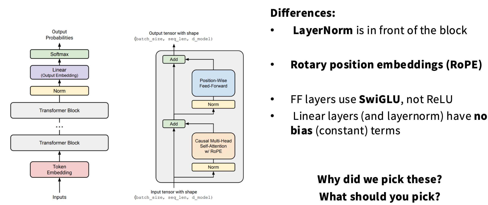
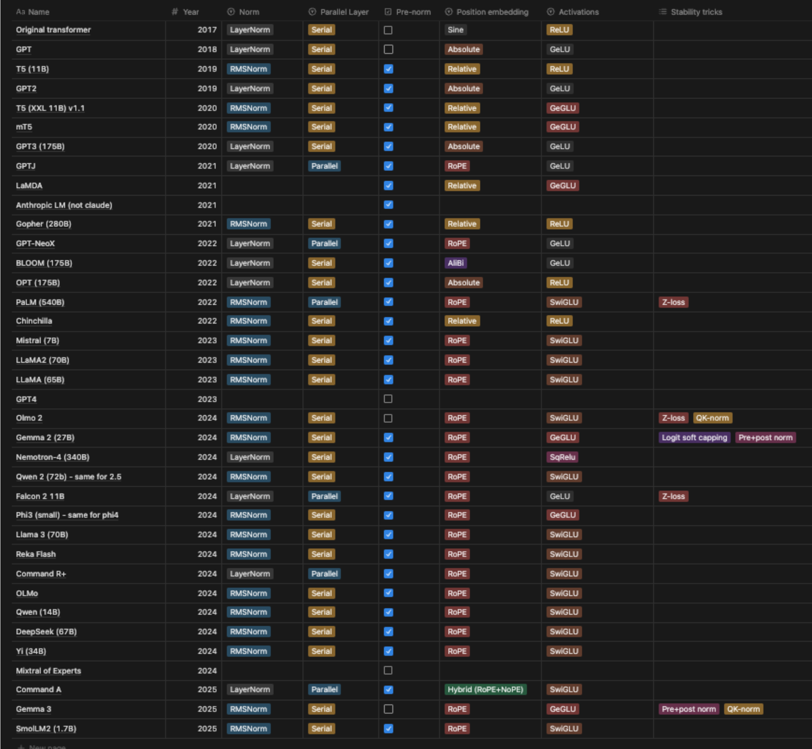
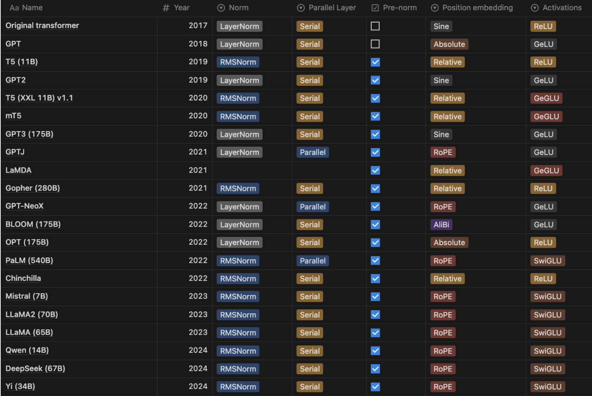
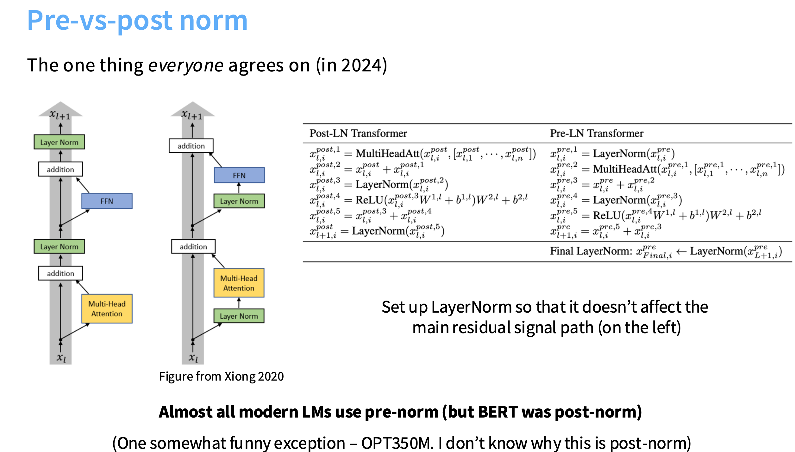
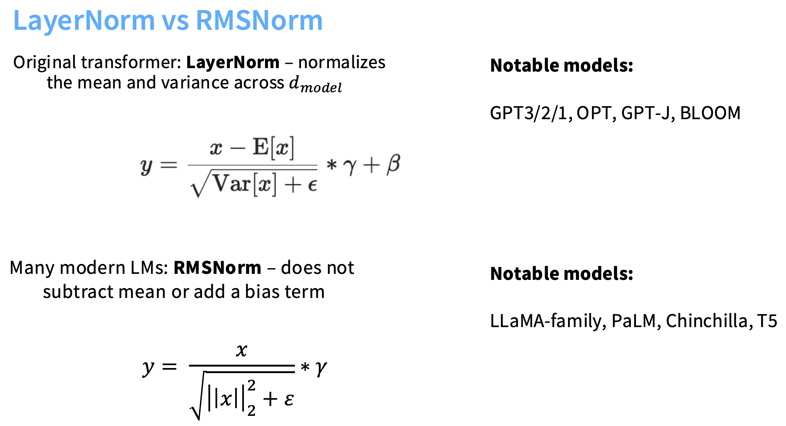
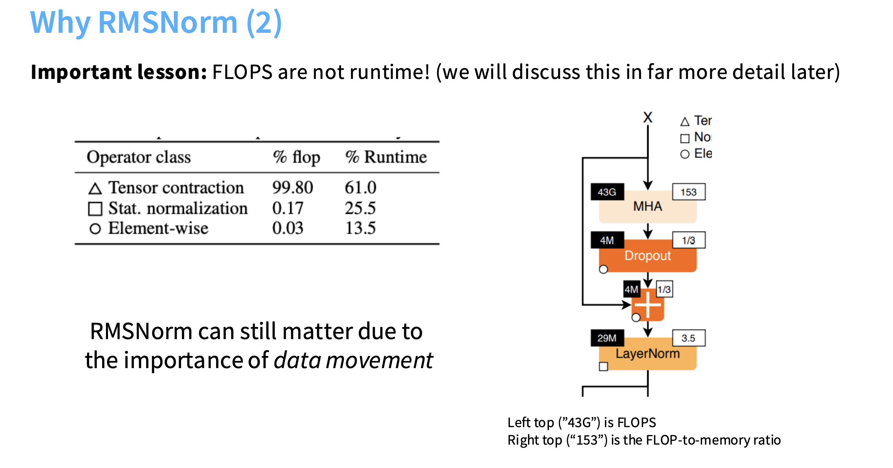
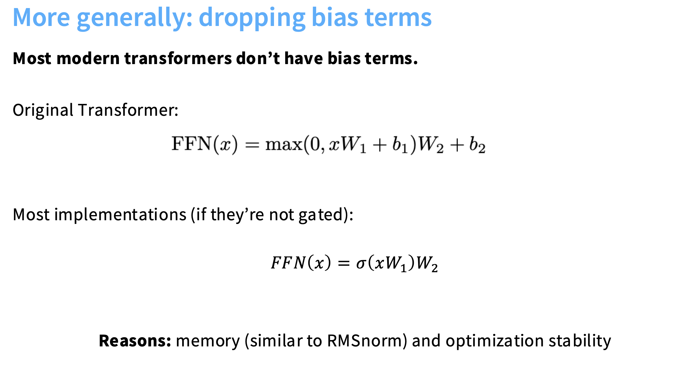
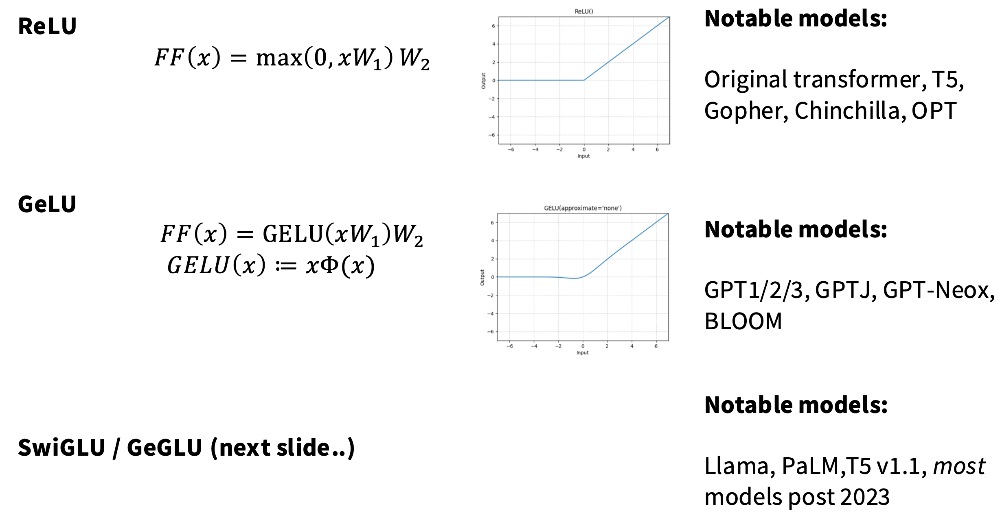
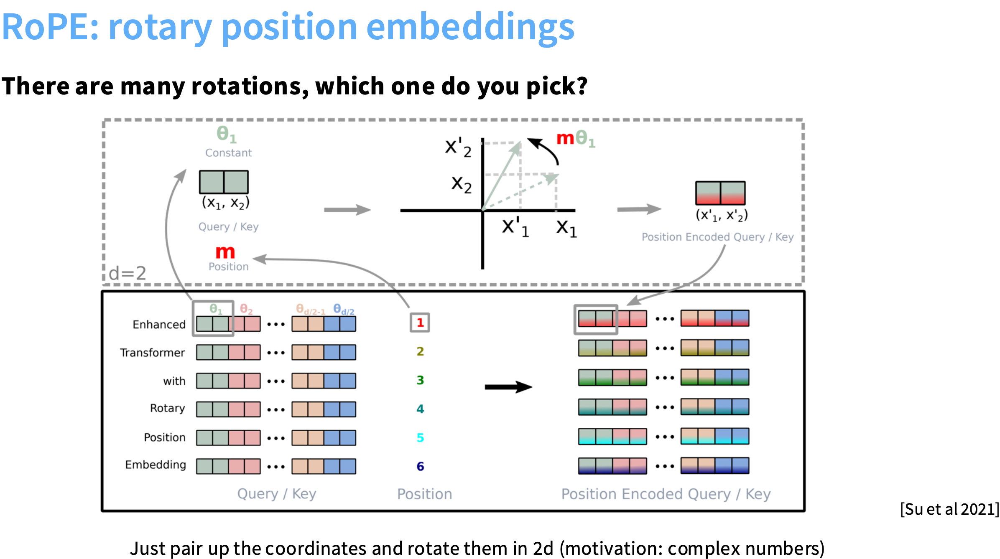

方法：研读相关论文，分析其中的变与不变，找出关键的设计要素，让 Transformer 发挥最佳性能——**实践出真知**

# Transformer 架构

# 归一化层

## Pre-vs-post norm

Pre-Norm 的核心优势：保持 residual path 的数值稳定性，让梯度能平滑地穿过上百层网络。

## LayerNorm vs RMSNorm

1. **计算更少**：LN 需要计算均值和方差，RMSNorm 只要**平方和一次归约**即可；同时相比于 LN,RMSNorm 还少加了一个偏置项，虽然加法等在计算中占比很少，但是其内存调转引起的时延占比非常非常高（见上图图7）；
2. **反向传播简单**：没有取均值与方差项，梯度表达式更简单，数值更稳定（尤其混合精度、低比特场景）。
3. **能够保留均值（偏移）信息**：LN 强制零均值，RMSNorm 不会抹去均值方向上的信息；实践上，在**预归一化（Pre-Norm）Transformer**的残差通路里，这常常配合得很好（许多现代解码式 LLM——如 LLaMA 系列、Mistral 等——采用 RMSNorm）。
详细讲解可看[assignment1各模块实现讲解](https://github.com/CliffKai/assignment1-basics/blob/main/Note/assignment1%E5%90%84%E6%A8%A1%E5%9D%97%E5%AE%9E%E7%8E%B0%E8%AE%B2%E8%A7%A3.ipynb) 9.4部分。

## dropping bias terms

可以总结成以下三条：

1. **归一化已抵消偏移作用**：
　在 Pre-Norm + RMSNorm 架构中，输入已被标准化，bias 只会重新引入不必要的偏移，破坏数值平衡。

2. **提升训练稳定性**：
　去掉 bias 后，层间激活均值更稳定、梯度分布更平滑，尤其在混合精度训练中更容易收敛。

3. **减少内存与计算负担**：
　少一组参数、少一次广播加法，对大模型可节省显存并提高计算效率。

# 激活函数

# 位置编码

RoPE

# 超参数

