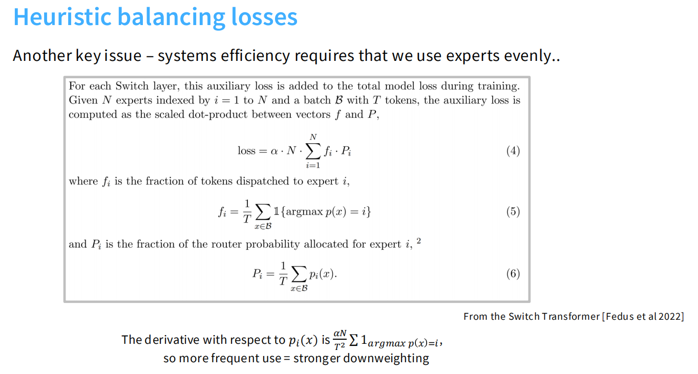
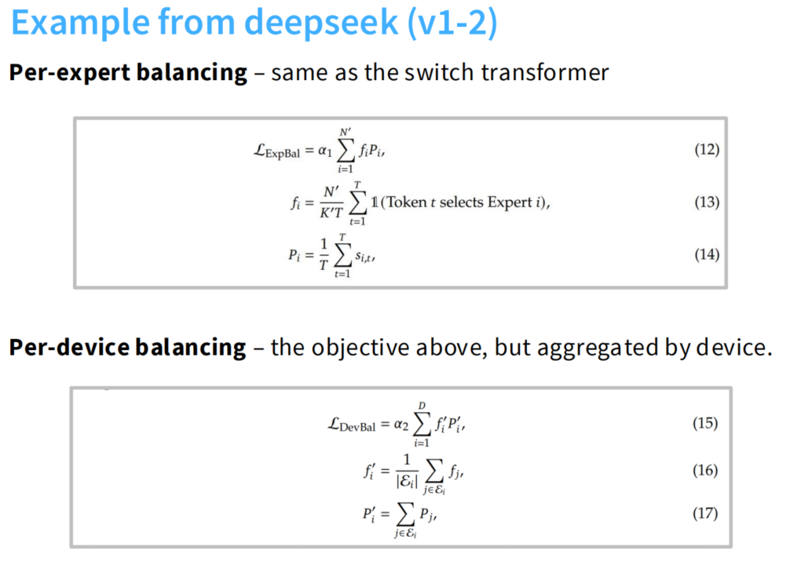
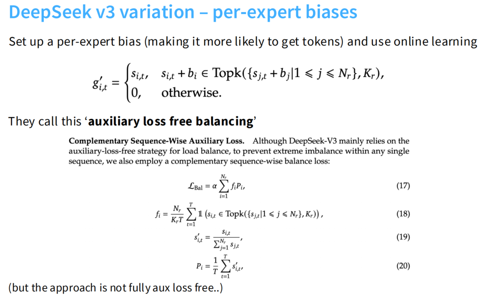

# 什么是 MoE？


## 1.MoEs 是什么？（直观理解）

MoE（Mixture of Experts）架构是一种让模型“部分激活”的结构：
它不让所有参数都对每个输入起作用，而是让模型根据输入内容，动态选择部分子网络（专家）来处理。

## 2.MoE 的基本结构

MoE 通常替换掉 Transformer 中的 前馈网络（FFN）层：

1. Dense FFN 层

每个 token 都经过同一个 FFN：
$$
y = W_2 \, \sigma(W_1 x + b_1) + b_2
$$

2. MoE 层

用多个 FFN 专家 $E_1, E_2, \ldots, E_N $代替原先的一个：
$y = \sum_{i \in \text{Top-}k(x)} g_i(x) \, E_i(x)$
其中：
- $E_i(x)$：第 i 个专家（独立 FFN）
- $g_i(x)$：门控网络输出的权重（表示当前 token 分配给每个专家的概率/得分）
- “Top-k”：只激活得分最高的 k 个专家（通常 k=1 或 2），其余专家不计算。

## 3.门控网络（Gating Network）

门控层是 MoE 的“路由器”。
它输入一个 token 的表示 x，输出 N 个分数：
$$
g(x) = \text{softmax}(W_g x)
$$
然后选出 top-k 专家，并做归一化加权。

常见实现：
- Top-1（Switch Transformer, 2021）：每个 token 只选 1 个专家，最简单最快；
- Top-2（GShard, GLaM 等）：每个 token 选两个专家，效果更好但计算稍多；
- Noisy gating：在分数中加入噪声帮助负载均衡。

# MoEs 的优势

## 1.同样计算量（FLOPs），参数量更大 → 模型能力更强


左图是 测试损失 vs 模型参数量（在相同 FLOPs 下）：
- 横轴：稀疏模型的总参数量（从 1e 到 256e 专家）；
- 纵轴：测试损失（Test Loss）。

参数量越大（即专家越多），测试损失越低 —— 在计算量不变的前提下性能显著提升。

右图是 训练收敛曲线（Perplexity vs Training Step）：
- 不同颜色表示不同专家数（16e, 32e, 64e, 128e）。
- 越多专家 → 越快收敛、最终困惑度更低。

**MoE 能在同等计算量下拥有更强的表达能力和更好的泛化性能。**

## 2.训练更快、收敛效率更高


左：
- 横轴：训练时间
- 纵轴：负对数困惑度（负 log perplexity）

**MoE 模型达到同等性能的速度比 dense 模型快 7 倍。**

右：MoE vs Dense 对比
- 粉色：Dense
- 蓝色：MoE
  
结论：
- MoE 在相同 token 数下收敛更快；
- 需要的 FLOPs 更少（可减少 2×～3×）；
- 达到同样验证损失的时间缩短一半以上。

原因：
- 每个 token 只激活少量专家，梯度更新集中在与该 token 相关的专家上；
- 专家专注于不同样本类型，训练更有针对性；
- 更快拟合、损失下降更稳定。

**MoE 的稀疏激活让训练效率极高，在相同算力下能更快达到相同精度。**

## 3.同等激活参数下性能更强（高性价比）


- 横轴：Activated Parameters（激活的参数量）——即推理时实际使用的参数。
- 纵轴：Performance（MMLU 精度）。

可以看出：
- MoE 模型（如 DeepSeek-V2、Mixtral） 在同等激活参数下（如 13B、34B），性能显著高于同等规模的 dense 模型（如 LLaMA-2、Command-R）。

**MoE 拥有更高的参数利用率，同样的推理成本下性能远超稠密模型。**

## 4.天然可并行、可扩展性强


MoE Transformer 编码器的并行化结构。

左边：普通 Transformer（单机单 FFN）
右边：MoE Transformer（专家分布在不同设备）

关键点：
- 每个专家（FFN₁, FFN₂, …）可放在不同 GPU；
- 门控层（Gating）负责路由 token 到对应专家；
- 使用 “All-to-All Dispatch / Combine” 实现跨设备 token 分发与聚合；
- 专家之间几乎无权重共享，并行度天然高。

优点：
- 可水平扩展到数百或上千 GPU；
- 不需要增加每张卡的显存；
- 与模型并行（Model Parallel）天然兼容；
- DeepSeek、Mixtral、GLaM 都用这种“专家并行 + 通信优化”实现大规模训练。

**MoE 结构天然适合大规模分布式训练，可在多设备上轻松扩展，提升吞吐与训练速度。**


# MoEs 的难点

尽管 MoE 架构很强大、有诸多优点，但它在实际工程落地中仍然存在不少困难与缺陷。


## 1.基础设施复杂（Infrastructure is complex）

“At a high level, sparsity is good when you have many accelerators (e.g. GPU/TPU)… Therefore, sparse models are good when training with data parallelism and/or have high throughput while serving: training/serving on many machines which can host all of the parameters.”

1. MoE 模型的“稀疏性”虽然节省计算量，但增加了工程复杂性。
     - 每个专家是独立的 FFN，模型参数量非常大。
     - 这些专家往往需要分布在不同设备（GPU/TPU）上。
     - 因此需要复杂的跨设备通信（All-to-All Dispatch / Combine）来将 token 路由到对应专家。
2. MoE 训练依赖“多机多卡”环境。
     - 单机 GPU 无法容纳所有专家参数；
     - 需要结合 Data Parallel + Model Parallel + Expert Parallel；
     - 同时通信带宽成为瓶颈；
     - 在小规模硬件上几乎无法训练。
3. 适用场景受限：
     - 在拥有大量 GPU/TPU 的环境（中非常合适；
     - 但对于资源有限的情况来说，部署和维护成本高。

**MoE 的硬件基础设施要求高，需要复杂的并行与通信机制，因此工程实现难度大，限制了普及。**

## 2.训练目标启发式、稳定性差

“Sparse models often suffer from training instabilities worse than those observed in standard densely-activated Transformers.”

从 MoE 与 Dense Transformer 的训练损失曲线可以看出来：
- MoEs：Loss 在训练中期突然发散、震荡，甚至爆炸。
- Dense：Loss 稳定下降；

原因：
1.	MoE 训练更容易不稳定：
    - 门控网络的路由过程是离散的（Top-k 选择），不可微分，没有办法求梯度；
    - 导致梯度传播不连续；
    - 一些专家可能长时间得不到梯度更新（“专家饥饿”问题）。
2.	负载均衡难控制：
    - 如果所有 token 都集中到少数专家，计算会不均衡；
    - 为此引入了额外的 负载均衡损失（load balancing loss）；
    - 但这种损失往往是启发式（heuristic），需要反复调参才能稳定。
3.	收敛过程更脆弱：
    - 小批量训练或不合适的学习率都会导致路由分布坍缩；
    - 一旦 gate 分布过于极端，模型性能会急剧下降。

> 启发式（heuristic）：一种基于经验、规则或直觉设计出来的方法，不是严格数学推导得到的最优解。

**MoE 的训练过程比稠密模型更复杂、更不稳定，需要额外的正则化和技巧来防止发散。**


总结：**MoE 模型的主要瓶颈在于“工程复杂 + 训练不稳”。**
它非常强大，但要想充分发挥潜力，必须有足够的硬件规模和稳定的路由机制。
这也是为什么直到 DeepSeek-V2、Mixtral、GLaM 等引入高效通信与负载均衡优化后，MoE 才真正进入主流。

# Routing function
MoE 的三种不同的“路由策略”，
可以总结为三类思路：


## 1.什么是路由函数（Routing Function）

在 MoE 模型中：
- 每个 token 都会经过一个 gating 网络，得到一个“得分矩阵”
$G \in \mathbb{R}^{(\text{Experts} \times \text{Tokens})}$
- 行表示专家$E₁, E₂, …$
- 列表示 token$T₁, T₂, …$
- 每个元素 $g_{ij} $表示专家$ Eᵢ $对 token$ Tⱼ $的打分。

以此来决定：每个 token 应该分配给哪个专家（或哪些专家）。

## 2.Token chooses expert

> 几乎所有的 MoEs 模型用的都是这种方法

方法：每个 token 看自己对应的一列，然后 选出 top-k 个专家（得分最高的前 k 个）。每个 token 独立决策。
$$
\text{Experts}(T_j) = \text{Top-}k(g_{:,j})
$$

特点：
- 实现最简单、最常用；
- 计算量小；
- Google 的 Switch Transformer（k=1）和 GLaM（k=2）都用这种方法。

缺点：
- 没有考虑专家的“负载平衡”；
- 可能导致某几个专家太忙、其他专家闲置；
- 所以需要额外的负载均衡损失（load balancing loss）。

## 3.Expert chooses token

方法：每个专家看自己的一行（横向），决定想处理哪些 token（例如 top-k token）。
$$
\text{Tokens}(E_i) = \text{Top-}k(g_{i,:})
$$

特点：
- 专家能更主动地决定处理内容；
- 可以避免专家过载；
- 但实现起来麻烦（多个专家可能选中同一个 token，要再协调）。

缺点：
- 需要解决冲突（多个专家争同一 token）；
- 通信和同步更复杂；
- 实际应用较少。

## 4.Global routing via optimization（全局优化式路由）

方法：把整个分配过程视为一个全局优化问题：
$$
\min_{A} \sum_{i,j} g_{ij} A_{ij}
$$
在满足：
- 每个 token 分配给 k 个专家；
- 每个专家处理的 token 数不超过容量上限；
- $A_{ij} \in \{0,1\} $表示是否分配。
- 也就是 全局地决定专家分配（joint optimization）。

特点：
- 理论最优；
- 可实现完美负载均衡；
- 能最大化整体路由质量；
- 一些新研究（例如 Google GShard、DeepSeek-MoE 的 routing refinement）在尝试用近似优化实现。

缺点：
- 计算成本高；
- 需要额外同步；
- 不易在大规模分布式中使用；
- 一般只能在小规模模型或推理优化阶段用。

# Top-K routing in detail


这是几乎所有现代 MoE 模型（包括 **DeepSeek-V1/V2/V3、Mixtral、Qwen、DBRX** 等）都在使用的路由方式。
下面我们来逐行讲清楚图里的公式和含义。

## 1.总体逻辑

在 MoE 层中，我们要把每个 token 的输入向量 $u_t^l$ 分配给若干个专家（FFN）。
但不是所有专家都参与，而是只选 **Top-K 个最合适的专家** 来计算，这就是 “Top-K routing”。

整个过程分三步：
1. 用一个线性层（或 logistic regressor）计算每个专家的“打分”；
2. 选出得分最高的 K 个专家（Top-K）；
3. 用这些专家的输出做加权求和，得到最终输出。

## 2.公式拆解讲解

### 1).打分阶段（Scoring / Gate logits）

$$
s_{i,t} = \text{Softmax}_i ( {u_t^l}^\top e_i^l )
$$

* $u_t^l$：第 $l$ 层中，第 $t$ 个 token 的输入表示。
* $e_i^l$：第 $i$ 个专家的“门控权重向量”（router 的参数）。
* $s_{i,t}$：代表专家 $i$ 对 token $t$ 的激活分数（经过 softmax 归一化）。

也就是说：
路由器是一个线性层，它学习一个“专家选择概率分布”。
每个专家都有一个可学习的向量 $e_i^l$，token 向量与它点乘后，通过 softmax 得到一组分数。

### 2).选择阶段（Top-K Selection）

$$
g_{i,t} =
\begin{cases}
s_{i,t}, & s_{i,t} \in \text{TopK}({ s_{j,t} | 1 \le j \le N }, K) \\
0, & \text{otherwise}
\end{cases}
$$

意思是：

* 对于每个 token $t$，我们只保留得分最高的 **K 个专家**；
* 其他专家的权重 $g_{i,t}$ 设为 0，不计算。

举例：
若共有 8 个专家，K=2，则 token 只路由到 2 个专家；
每个 token 的计算量保持稳定（因为只激活 2 个 FFN）。

### 3.混合输出阶段（Weighted Combination）

$$
h_t^l = \sum_{i=1}^N ( g_{i,t} \cdot \text{FFN}_i(u_t^l) ) + u_t^l
$$

解释：

* 每个被选中的专家 $i$ 对 token $t$ 的输入 $u_t^l$ 做一次前馈计算；
* 结果乘以权重 $g_{i,t}$；
* 然后将多个专家的结果加起来；
* 再加上残差连接 $u_t^l$。

## 3.不同模型间的细微差异

右边文字部分解释了几种主流模型在 Top-K 路由上的实现差异：

| 模型                                   | 路由策略说明                                       |
| ------------------------------------ | -------------------------------------------- |
| **DeepSeek-V1/V2**、**Grok**、**Qwen** | 先 softmax → 再取 Top-K（即公式如图所示）                |
| **Mixtral**、**DBRX**、**DeepSeek-V3** | 先取 Top-K → 再在选中的专家上做 softmax（归一化 Top-K 内部得分） |

区别在于 softmax 的应用顺序：

* 前者在所有专家上 softmax（可能让尾部专家有极小权重）；
* 后者只在 Top-K 专家间 softmax，使得权重更平衡（更稳定、更高效）。

## 4.Top-K 路由的优点

1. **稀疏计算**

   * 每个 token 只激活 K 个专家，计算量 ∝ K，而与专家总数 N 无关；
   * 可以极大扩展模型容量而不增加 FLOPs。

2. **动态选择**

   * 不同 token 可选择不同专家；
   * 模型能自动学出任务分工。

3. **高效训练与推理**

   * 只需路由表（token → expert 索引）和少量通信；
   * 支持并行分布式训练（expert parallel）。

## 5.Top-K 路由的难点

* **非连续性**：Top-K 操作不可导，梯度传播困难；
* **负载不均衡**：有些专家被选太多，有些几乎不被用；
* **稳定性问题**：如果 gating 学不好，训练可能发散。
  （因此常加负载均衡损失或噪声路由，如 noisy top-k）

# How to training MoE

## 1.Stochastic Routing

$$
G(x) = \text{Softmax}(\text{KeepTopK}(H(x), k))
$$

* 对输入 token 的表示 ( x )，路由器输出打分 ( H(x) )；
* 只保留 top-k 个分数（其余设为 −∞）；
* 对这 top-k 个分数做 softmax，得到**专家选择概率分布**。


$$
H(x)_i = (x \cdot W_g)*i + \text{StandardNormal()} \cdot \text{Softplus}((x \cdot W*{noise})_i)
$$

* $ (x \cdot W_g)_i $：专家 i 的原始打分（门控分数）；
* $ \text{StandardNormal()} $：从标准高斯分布采样的随机噪声；
* $ \text{Softplus}((x \cdot W_{noise})_i) $：噪声幅度（动态决定每个 token 的扰动强度）；
* 整个项相当于：在每个 token → expert 打分上**加入高斯噪声**。


$$
\text{KeepTopK}(v, k)_i =
\begin{cases}
v_i, & \text{if } v_i \text{ in top } k\\
-\infty, & \text{otherwise}
\end{cases}
$$

表示只保留 top-k 的打分，其他置为负无穷（softmax 后概率≈0）。

**核心思想**:

> 路由决策是带高斯噪声的随机决策（stochastic routing with gaussian perturbations）。

* 在训练中引入噪声，让不同专家都有机会被选中；
* 这能**缓解专家塌陷（collapse）**——即所有 token 被送到少数几个专家；
* 同时 softmax 使模型能学习如何“排序”专家；
* 这种随机性让专家更**鲁棒（robust）**、**多样化（diverse）**。

## 2.Stochastic Jitter

```python
if is_training:
    # Add noise for exploration across experts.
    router_logits += mtf.random_uniform(
        shape=router_logits.shape,
        minval=1-eps,
        maxval=1+eps
    )

router_logits = mtf.to_float32(router_logits)
router_probs = mtf.softmax(router_logits, axis=-1)
```

* 在训练阶段，给路由 logits（即 token→expert 的打分）**乘以一个随机扰动因子$1±ε$**；
* 相当于在每次训练中对专家打分**施加轻微随机乘法抖动（multiplicative perturbation）**；
* 目的：**让专家更有探索性（exploration）**，防止被固定选择、提升模型鲁棒性；
* 最后仍通过 softmax 归一化成概率分布。


| Method               | Fraction Stable | Quality (↑)       |
| -------------------- | --------------- | ----------------- |
| Baseline             | 4/6             | **-1.755 ± 0.02** |
| Input jitter (10^-2) | 3/3             | -1.777 ± 0.03     |
| Dropout (0.1)        | 3/3             | -1.822 ± 0.11     |

解释：

* **Fraction Stable** 表示模型在多次实验中是否收敛稳定；
* **Quality** 表示模型性能指标（越高越好）；
* baseline 最好，但略微不稳定；
* jitter 与 dropout 让模型更稳定（更不容易塌陷），但质量略降；
* 所以：**随机扰动确实增强了稳定性（robustness），但略损性能。**

## 3.Switch Transformer



### 3.1 问题背景

MoE/ Switch 层中，路由器会把每个 token 分配给某个专家（通常 top-1，Switch）。如果部分专家被过度使用、另一些很少被用到，就会：

* 造成系统**吞吐与显存利用率低**（热门专家拥塞，冷门专家闲置），
* 甚至训练不稳（梯度/负载不均）。

因此需要一个**辅助损失**去鼓励“平均使用专家”。

### 3.2 符号与定义

* 一层有 **N** 个专家，一批有 **T** 个 token（批 B）。
* 路由器对 token $x$ 输出对每个专家的概率 $p_i(x)$。
* **实际使用占比** $f_i$：这批里被**真正派给**专家 i 的 token 比例（用硬决策 $\arg\max p(x)$ 统计）
  $$
  f_i=\frac{1}{T}\sum_{x\in B}\mathbf{1}{\arg\max p(x)=i}
  $$
* **概率分配占比** $P_i$：这批里路由器对专家 i 的**平均概率质量(probability mass)**
  $$
  P_i=\frac{1}{T}\sum_{x\in B}p_i(x)
  $$

### 3.3 辅助损失（图中式(4)）

$$
\text{loss}=\alpha \cdot N \cdot \sum_{i=1}^{N} (f_i \cdot P_i)
$$

* $\alpha$ 是权重（小常数，训练时与主损失相加）。
* 这个式子惩罚 **“高使用 + 高分配概率” 在同一专家上同时出现**。
  直觉：如果某个专家既被选得多（$f_i$ 大），又被分到很多概率质量（$P_i$ 大），那么 $f_iP_i$ 就大，惩罚大 → 促使路由把概率往别的专家挪，**拉平使用率**。

> 由于 $\sum_i f_i=1, \sum_i P_i=1$，在这些和固定的前提下，$\sum_i f_iP_i$ 在**分布越均匀**、或者两者越“错开”时越小；当“热门对热门”强对齐时最大。因此最小化该项会鼓励**均匀使用专家**。

### 3.4 梯度含义

对单个 token 的概率 $p_i(x)$ 求导，可得到（省略常数与换元）：
$$
\frac{\partial \text{loss}}{\partial p_i(x)}
=\frac{\alpha N}{T^2}\sum_{x'\in B}\mathbf{1}{\arg\max p(x')=i}
=\frac{\alpha N}{T} \cdot f_i
$$
这说明：

* **某专家被用得越频繁（$f_i$ 大）**，它对应的概率 $p_i(x)$ 就受到**更强的下压梯度**（“more frequent use = stronger downweighting”）。
* 训练中这会把过热专家的路由概率压低，把冷门专家拉高，实现**负载均衡**。

### 3.5 DeepSeek v1-v2 的例子



**DeepSeek(v1–2) 的“负载均衡损失”两种层级：按专家（per-expert）和按设备（per-device）**。它把 Switch Transformer 的均衡思路（$ \sum f_i P_i $）先用在每个专家上，又**聚合到机器/设备维度**，以同时解决“专家不均衡”和“设备不均衡”的系统瓶颈。

#### 1) Per-expert balancing（与 Switch 相同）

上半框等式 (12)–(14)：

$$
\mathcal{L}_{\text{ExpBal}} = \alpha_1 \sum_{i=1}^{N'} f_i P_i
$$

* $N'$：这一层里参与路由的**专家数**（或每组/每设备的专家数，视实现而定）。
* $T$：本批 token 数。
* $K'$：每个 token 选的专家个数（top-(K')）——在 Switch 通常 (K'=1)。
* $f_i$：**实际使用比例**（硬路由后，去到专家 (i) 的 token 占比），这里写成
  $$
  f_i=\frac{N'}{K'T}\sum_{t=1}^{T}\mathbf{1}({\text{Token }t\text{ Select Expert }i})
  $$

  > 多了 $\frac{N'}{K'T}$ 的缩放，使量级更稳定/可比（不同 $N',K'$ 时不会飘）。
* $P_i$：**平均概率质量**（路由 softmax 对专家 $i$ 的平均概率）
  $$
  P_i=\frac{1}{T}\sum_{t=1}^{T} s_{i,t}
  $$
  这里的 $s_{i,t}$ 就是第 $t$ 个 token 对专家 $i$ 的 softmax 概率 $p_i(x_t)$。

直觉：如果某个专家既**被频繁选中**（$f_i$ 大），又**被分配了很多概率**（$P_i$ 大），则 $f_iP_i$ 大，损失会**惩罚它**，把概率往其他专家挪——实现**专家层面的均衡**。

#### 2) Per-device balancing（设备聚合层）

下半框等式 (15)–(17)：

$$
\mathcal{L}_{\text{DevBal}}=\alpha_2 \sum_{i=1}^{D} f'_i P'_i
$$

* $D$：设备/主机数（GPU/TPU 卡的个数）。
* 令 $\varepsilon_i$ 是**设备 (i)** 上承载的专家集合（该卡负责的 experts）。
* 把专家层的统计**按设备聚合**：
  $$
  f'_i=\frac{1}{|\varepsilon_i|}\sum_{j\in \varepsilon_i} f_j ,\qquad
  P'_i=\sum_{j\in \varepsilon_i} P_j \tag{16–17}
  $$

  * $f'_i$：设备 $i$ 上**平均实际使用比例**（把该设备上的所有专家的 $f_j$ 取平均）。
  * $P'_i$：设备 $i$ 上**总概率质量**（把该设备上所有专家的 $P_j$ 相加）。

直觉：哪台设备上的专家**又热又被高概率偏好**，($f'_iP'_i$) 就大，会被**下调**；冷设备则被**上调**。这样就不仅让“专家之间”均衡，也让“**设备之间**”负载均衡，避免某几张卡拥塞、其他卡闲置——**提升整体吞吐与稳定性**。

#### 为什么要加“按设备”的一层？

在大规模 MoE 中，专家是分布在不同设备上的（expert parallel）。仅做 per-expert 均衡不一定等价于设备均衡：

* 即使专家层看着均匀，如果多数活跃专家**恰好集中在同几张卡**，这些卡会溢出，成为**系统瓶颈**。
* 加上 $\mathcal{L}_{\text{DevBal}}$ 后，训练会把路由概率**跨设备拉平**，提升利用率与并行效率。

## 4.DeepSeek-v3 



**DeepSeek-v3 的一种“按专家加偏置”的路由均衡做法**，以及他们仍然保留的一个**序列级（sequence-wise）补充均衡损失**。核心思想：**不再主要靠辅助损失去拉平专家负载，而是给每个专家加一个可学习/在线更新的偏置 $b_i$**，直接影响被选为 Top-K 的机会，从而“自平衡”。

### 4.1 按专家加偏置（per-expert biases）

$$
g'_{i,t}=
\begin{cases}
s_{i,t}, & \text{若 } s_{i,t}+b_i \in \text{Topk}\big(\{s_{j,t}+b_j \mid 1\le j\le N_r\},K_r\big)\\
0, & \text{否则}
\end{cases}
$$

含义逐条看：

* $s_{i,t}$：路由器对第 $t$ 个 token 送到专家 $i$ 的**原始得分/概率**（softmax 前或后得分，取决于实现）。
* $b_i$：**每个专家自己的偏置**。

  * **冷门专家**（最近被用得少）→ $b_i$ 被**增大**，提高被选中概率；
  * **热门专家** → $b_i$ 被**减小**，降低被选中概率。
  * 这个 $b_i$ 通过在线/运行中统计的负载来更新（论文称为 online learning / bandit-style 更新；直觉就是“少用多补、常用少给”）。
* **决策机制**：是否进入 Top-K 的**排序**用的是 $s_{i,t}+b_i$（带偏置的分数）；
  但**真正送入专家的权重/门值**仍用 **原始** $s_{i,t}$（被选中则 $g'_{i,t}=s_{i,t}$，否则 0）。
  这样偏置只改变“谁被选中”，不直接放大某个专家的前向权重。

> 这套做法被称为 **auxiliary-loss-free balancing**：主要靠 $b_i$ 的在线调整来均衡，不必像 Switch 那样强依赖 $\sum f_i P_i$ 这类辅助损失去推平。

### 4.2 仍保留一个**序列级**补充均衡损失

图中下半部分：尽管 v3 主要靠“无辅助损失”的偏置策略，但**仍然加了一个补充的 sequence-wise balancing loss**，防止**单条序列**内部出现极端不均衡。

写法与 Switch 思路类似（但按序列统计）：
$$
\mathcal{L}_{\text{Bal}}=\alpha \sum_{i=1}^{N_r} f_i,P_i 
$$
其中
$$
f_i = \frac{N_r}{K_r T} \sum_{t=1}^{T} 
\mathbf{1}\!\left(s_{i,t} \in \text{Top}k(\{s_{j,t} \mid 1 \le j \le N_r\}, K_r)\right),
$$
$$
s'_{i,t}=\frac{s_{i,t}}{\sum_{j=1}^{N_r}s_{j,t}},
$$
$$
P_i=\frac{1}{T}\sum_{t=1}^{T}s'_{i,t}
$$

要点：

* $f_i$：这条序列内，**实际被选中**到专家 $i$ 的比例（带了 $\frac{N_r}{K_rT}$ 的归一化缩放，便于不同 $N_r,K_r$ 可比）。
* $s'_{i,t}$：对同一时刻 $t$ 的所有专家把分数归一化，使它们在该时刻求和为 1（得到“概率质量”）。
* $P_i$：这条序列内，分到专家 $i$ 的**平均概率质量**。
* $\sum f_i P_i$ 越大，说明“模型既想用又实际在用”的专家越集中（热门更热），损失会惩罚它，促使更均衡。

> 也因此旁注写着：**“but the approach is not fully aux loss free..”**
> ——因为虽然主要靠偏置 $b_i$ 来均衡，他们**并没有完全取消**辅助损失，只是把它降为**序列级的小补充项**。

