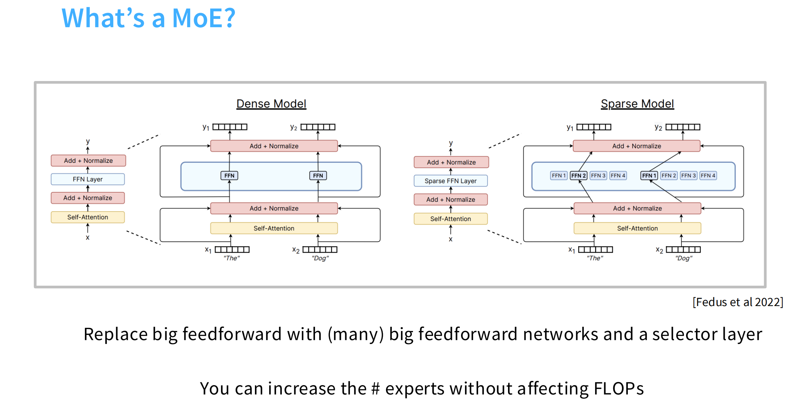
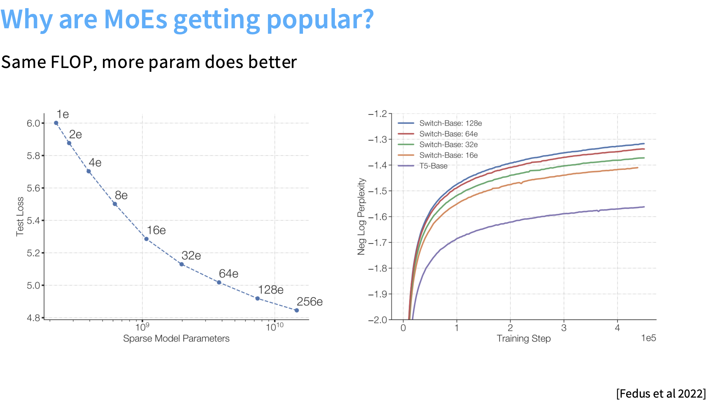
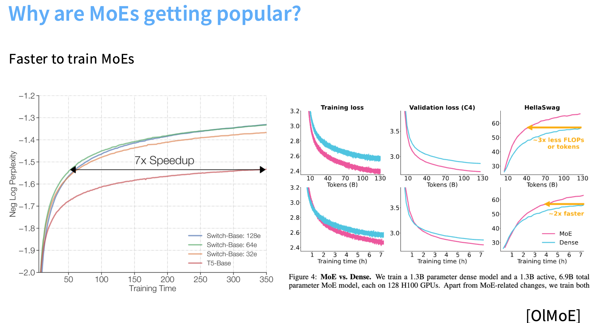
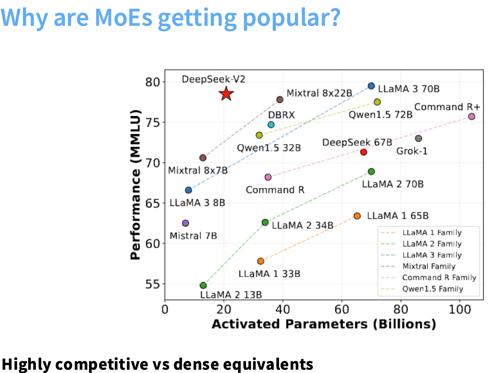
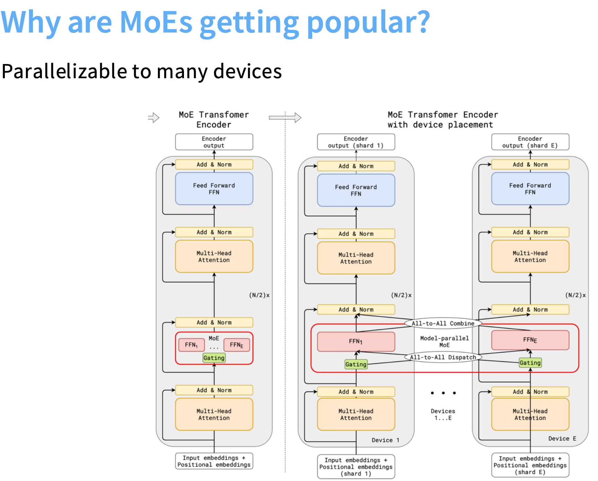
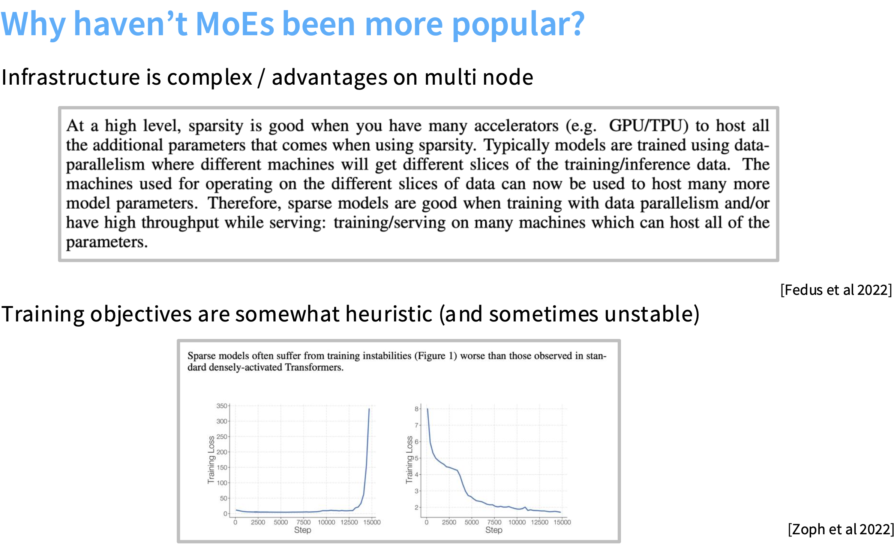
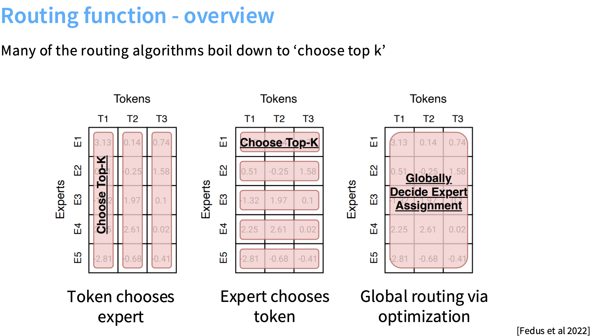
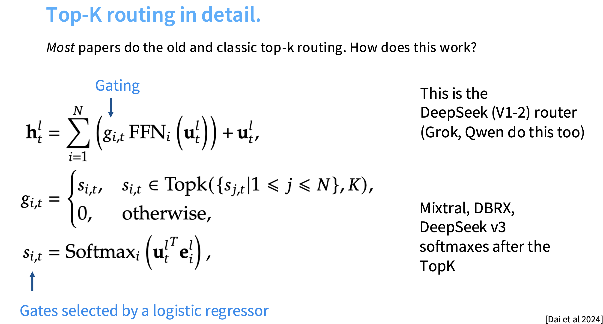

# 什么是 MoE？

## 1.MoEs 是什么？（直观理解）

MoE（Mixture of Experts）架构是一种让模型“部分激活”的结构：
它不让所有参数都对每个输入起作用，而是让模型根据输入内容，动态选择部分子网络（专家）来处理。

## 2.MoE 的基本结构

MoE 通常替换掉 Transformer 中的 前馈网络（FFN）层：

1. Dense FFN 层

每个 token 都经过同一个 FFN：
$$
y = W_2 \, \sigma(W_1 x + b_1) + b_2
$$

2. MoE 层

用多个 FFN 专家 $E_1, E_2, \ldots, E_N $代替原先的一个：
$y = \sum_{i \in \text{Top-}k(x)} g_i(x) \, E_i(x)$
其中：
- $E_i(x)$：第 i 个专家（独立 FFN）
- $g_i(x)$：门控网络输出的权重（表示当前 token 分配给每个专家的概率/得分）
- “Top-k”：只激活得分最高的 k 个专家（通常 k=1 或 2），其余专家不计算。

## 3.门控网络（Gating Network）

门控层是 MoE 的“路由器”。
它输入一个 token 的表示 x，输出 N 个分数：
$$
g(x) = \text{softmax}(W_g x)
$$
然后选出 top-k 专家，并做归一化加权。

常见实现：
- Top-1（Switch Transformer, 2021）：每个 token 只选 1 个专家，最简单最快；
- Top-2（GShard, GLaM 等）：每个 token 选两个专家，效果更好但计算稍多；
- Noisy gating：在分数中加入噪声帮助负载均衡。

# MoEs 的优势

## 1.同样计算量（FLOPs），参数量更大 → 模型能力更强

左图是 测试损失 vs 模型参数量（在相同 FLOPs 下）：
- 横轴：稀疏模型的总参数量（从 1e 到 256e 专家）；
- 纵轴：测试损失（Test Loss）。

参数量越大（即专家越多），测试损失越低 —— 在计算量不变的前提下性能显著提升。

右图是 训练收敛曲线（Perplexity vs Training Step）：
- 不同颜色表示不同专家数（16e, 32e, 64e, 128e）。
- 越多专家 → 越快收敛、最终困惑度更低。

**MoE 能在同等计算量下拥有更强的表达能力和更好的泛化性能。**

## 2.训练更快、收敛效率更高

左：
- 横轴：训练时间
- 纵轴：负对数困惑度（负 log perplexity）

**MoE 模型达到同等性能的速度比 dense 模型快 7 倍。**

右：MoE vs Dense 对比
- 粉色：Dense
- 蓝色：MoE
  
结论：
- MoE 在相同 token 数下收敛更快；
- 需要的 FLOPs 更少（可减少 2×～3×）；
- 达到同样验证损失的时间缩短一半以上。

原因：
- 每个 token 只激活少量专家，梯度更新集中在与该 token 相关的专家上；
- 专家专注于不同样本类型，训练更有针对性；
- 更快拟合、损失下降更稳定。

**MoE 的稀疏激活让训练效率极高，在相同算力下能更快达到相同精度。**

## 3.同等激活参数下性能更强（高性价比）

- 横轴：Activated Parameters（激活的参数量）——即推理时实际使用的参数。
- 纵轴：Performance（MMLU 精度）。

可以看出：
- MoE 模型（如 DeepSeek-V2、Mixtral） 在同等激活参数下（如 13B、34B），性能显著高于同等规模的 dense 模型（如 LLaMA-2、Command-R）。

**MoE 拥有更高的参数利用率，同样的推理成本下性能远超稠密模型。**

## 4.天然可并行、可扩展性强

MoE Transformer 编码器的并行化结构。

左边：普通 Transformer（单机单 FFN）
右边：MoE Transformer（专家分布在不同设备）

关键点：
- 每个专家（FFN₁, FFN₂, …）可放在不同 GPU；
- 门控层（Gating）负责路由 token 到对应专家；
- 使用 “All-to-All Dispatch / Combine” 实现跨设备 token 分发与聚合；
- 专家之间几乎无权重共享，并行度天然高。

优点：
- 可水平扩展到数百或上千 GPU；
- 不需要增加每张卡的显存；
- 与模型并行（Model Parallel）天然兼容；
- DeepSeek、Mixtral、GLaM 都用这种“专家并行 + 通信优化”实现大规模训练。

**MoE 结构天然适合大规模分布式训练，可在多设备上轻松扩展，提升吞吐与训练速度。**

# MoEs 的难点

尽管 MoE 架构很强大、有诸多优点，但它在实际工程落地中仍然存在不少困难与缺陷。

## 1.基础设施复杂（Infrastructure is complex）

“At a high level, sparsity is good when you have many accelerators (e.g. GPU/TPU)… Therefore, sparse models are good when training with data parallelism and/or have high throughput while serving: training/serving on many machines which can host all of the parameters.”

1. MoE 模型的“稀疏性”虽然节省计算量，但增加了工程复杂性。
     - 每个专家是独立的 FFN，模型参数量非常大。
     - 这些专家往往需要分布在不同设备（GPU/TPU）上。
     - 因此需要复杂的跨设备通信（All-to-All Dispatch / Combine）来将 token 路由到对应专家。
2. MoE 训练依赖“多机多卡”环境。
     - 单机 GPU 无法容纳所有专家参数；
     - 需要结合 Data Parallel + Model Parallel + Expert Parallel；
     - 同时通信带宽成为瓶颈；
     - 在小规模硬件上几乎无法训练。
3. 适用场景受限：
     - 在拥有大量 GPU/TPU 的环境（中非常合适；
     - 但对于资源有限的情况来说，部署和维护成本高。

**MoE 的硬件基础设施要求高，需要复杂的并行与通信机制，因此工程实现难度大，限制了普及。**

## 2.训练目标启发式、稳定性差

“Sparse models often suffer from training instabilities worse than those observed in standard densely-activated Transformers.”

从 MoE 与 Dense Transformer 的训练损失曲线可以看出来：
- MoEs：Loss 在训练中期突然发散、震荡，甚至爆炸。
- Dense：Loss 稳定下降；

原因：
1.	MoE 训练更容易不稳定：
    - 门控网络的路由过程是离散的（Top-k 选择），不可微分，没有办法求梯度；
    - 导致梯度传播不连续；
    - 一些专家可能长时间得不到梯度更新（“专家饥饿”问题）。
2.	负载均衡难控制：
    - 如果所有 token 都集中到少数专家，计算会不均衡；
    - 为此引入了额外的 负载均衡损失（load balancing loss）；
    - 但这种损失往往是启发式（heuristic），需要反复调参才能稳定。
3.	收敛过程更脆弱：
    - 小批量训练或不合适的学习率都会导致路由分布坍缩；
    - 一旦 gate 分布过于极端，模型性能会急剧下降。

> 启发式（heuristic）：一种基于经验、规则或直觉设计出来的方法，不是严格数学推导得到的最优解。

**MoE 的训练过程比稠密模型更复杂、更不稳定，需要额外的正则化和技巧来防止发散。**

总结：**MoE 模型的主要瓶颈在于“工程复杂 + 训练不稳”。**
它非常强大，但要想充分发挥潜力，必须有足够的硬件规模和稳定的路由机制。
这也是为什么直到 DeepSeek-V2、Mixtral、GLaM 等引入高效通信与负载均衡优化后，MoE 才真正进入主流。

# Routing function
MoE 的三种不同的“路由策略”，
可以总结为三类思路：

## 1.什么是路由函数（Routing Function）

在 MoE 模型中：
- 每个 token 都会经过一个 gating 网络，得到一个“得分矩阵”
$G \in \mathbb{R}^{(\text{Experts} \times \text{Tokens})}$
- 行表示专家$E₁, E₂, …$
- 列表示 token$T₁, T₂, …$
- 每个元素 $g_{ij} $表示专家$ Eᵢ $对 token$ Tⱼ $的打分。

以此来决定：每个 token 应该分配给哪个专家（或哪些专家）。

## 2.Token chooses expert

> 几乎所有的 MoEs 模型用的都是这种方法

方法：每个 token 看自己对应的一列，然后 选出 top-k 个专家（得分最高的前 k 个）。每个 token 独立决策。
$$
\text{Experts}(T_j) = \text{Top-}k(g_{:,j})
$$

特点：
- 实现最简单、最常用；
- 计算量小；
- Google 的 Switch Transformer（k=1）和 GLaM（k=2）都用这种方法。

缺点：
- 没有考虑专家的“负载平衡”；
- 可能导致某几个专家太忙、其他专家闲置；
- 所以需要额外的负载均衡损失（load balancing loss）。

## 3.Expert chooses token

方法：每个专家看自己的一行（横向），决定想处理哪些 token（例如 top-k token）。
$$
\text{Tokens}(E_i) = \text{Top-}k(g_{i,:})
$$

特点：
- 专家能更主动地决定处理内容；
- 可以避免专家过载；
- 但实现起来麻烦（多个专家可能选中同一个 token，要再协调）。

缺点：
- 需要解决冲突（多个专家争同一 token）；
- 通信和同步更复杂；
- 实际应用较少。

## 4.Global routing via optimization（全局优化式路由）

方法：把整个分配过程视为一个全局优化问题：
$$
\min_{A} \sum_{i,j} g_{ij} A_{ij}
$$
在满足：
- 每个 token 分配给 k 个专家；
- 每个专家处理的 token 数不超过容量上限；
- $A_{ij} \in \{0,1\} $表示是否分配。
- 也就是 全局地决定专家分配（joint optimization）。

特点：
- 理论最优；
- 可实现完美负载均衡；
- 能最大化整体路由质量；
- 一些新研究（例如 Google GShard、DeepSeek-MoE 的 routing refinement）在尝试用近似优化实现。

缺点：
- 计算成本高；
- 需要额外同步；
- 不易在大规模分布式中使用；
- 一般只能在小规模模型或推理优化阶段用。

# Top-K routing in detail

