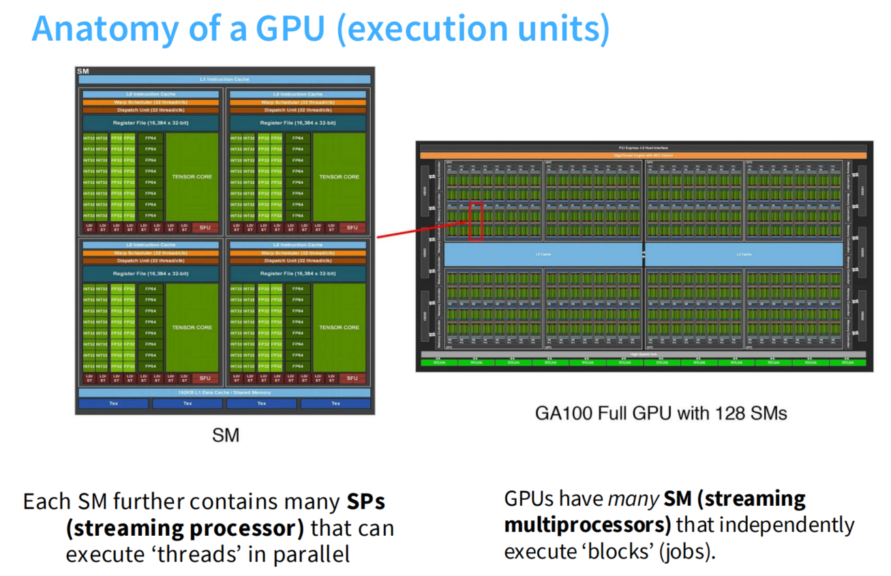
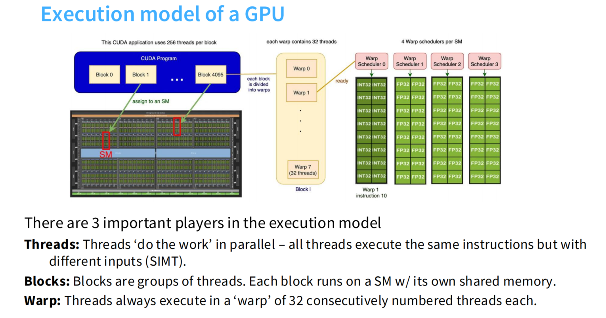
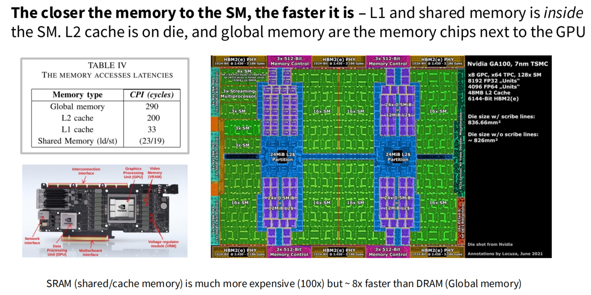

看完这节课应该是可以做到：
1. 理解 GPU 大致的工作原理；
2. 尝试加速算法某些部分的能力（比如对于一个新架构如何结合硬件来优化它）。

# 一、Anatomy of GPU(execution units)

## 1.execution units：SP 与 SM

### 核心概念：层级关系

在微观架构上，GPU 的计算核心是一个层级结构：
**GPU → GPC (图形处理集群) → TPC (纹理处理集群) → SM (流式多处理器) → SP (流式处理器/CUDA核心)**

* **SM (Streaming Multiprocessor)**：是 GPU 的**核心功能模块**，类似于 CPU 的一个“核”（但它是为并行计算优化的）。一个 GPU 通常包含几十到上百个 SM。
* **SP (Streaming Processor)**：是 SM 内部最基本的**执行单元**，也常被称为 **CUDA Core**。一个 SM 内部通常包含几十到上百个 SP。

### 1.1 SP (Streaming Processor)

SP 是 GPU 中最基本的计算单元，有如下特性：

* **功能单一**：SP 的主要职责是执行最基础的浮点运算（FP32）和整数运算（INT32）。
* **听从指挥**：SP 自己没有复杂的控制逻辑，它只负责接收来自 SM 的指令并埋头苦干。
* **人多势众**：单个 SP 的计算能力远不如 CPU 的单个核心强大，但 GPU 的优势在于 SP 的数量极其庞大（例如 RTX 4090 拥有 16384 个 CUDA Cores/SPs）。

> 在现代架构中，NVIDIA 更多地使用“CUDA Core”来指代 SP。此外，除了传统的 SP，现代 SM 中还有其他核心，如 **Tensor Core**（专为此深度学习矩阵运算设计）和 **RT Core**（专为光线追踪设计）。

### 1.2 SM (Streaming Multiprocessor)

SM 是一个功能完备的**独立任务处理单元**，一个典型的 SM 包含以下关键组件：

* **计算核心 (Cores)**：
    * **SP / CUDA Cores**：负责基础的 FP32/INT32 运算。
    * **Tensor Cores** (Volta架构后加入)：负责 AI 相关的矩阵乘加运算 (MMA)。
    * **Special Function Units (SFU)**：负责超越函数（如 sin, cos, log 等）运算。
* **控制单元 (Control Logic)**：
    * **Warp Scheduler (线程束调度器)**：这是 SM 的调度器。GPU 为了提高效率，不是一个一个线程执行，而是将 32 个线程打包成一个 **Warp (线程束)**。调度器负责将指令分发给 SP 去执行。
    * **Dispatch Unit (分发单元)**：负责解码指令并发送给执行单元。
* **存储资源 (Memory Resources)**：
    * **Register File (寄存器堆)**：SM 拥有极其庞大且快速的寄存器资源，这是 GPU 能够进行极高并发的基础。
    * **Shared Memory / L1 Cache**：SM 内部共享的高速缓存，用于同一个 SM 内不同线程间的数据交换，速度极快。

### 1.3 SM 与 SP 如何协同工作 (SIMT 模型)

理解它们协同工作的关键在于 **SIMT (Single Instruction, Multiple Threads，单指令多线程)**：

1.  **任务分配**：当 GPU 要执行一个计算任务（Kernel）时，会启动成千上万个线程。这些线程被组织成“线程块 (Thread Block)”。
2.  **SM 接活**：一个线程块会被完整地分配给一个 SM 去执行。一旦分配，该 SM 就全权负责这个块里的所有线程。
3.  **Warp 执行**：SM 内部将这些线程每 32 个分为一组，称为一个 **Warp**。
4.  **SP 干活**：SM 的调度器读取一条指令（比如“做一次加法”），然后指挥它麾下的 32 个 SP **同时**对 32 个不同的数据执行这同一个加法操作。

> SM 就像一个合唱团指挥（调度器），SP 就像合唱团成员。指挥棒一挥（一条指令），所有成员（SP）同时唱出同一个音符（执行相同操作），但每个人的音色（处理的数据）可能不同。

## 2.Execution model of a GPU

### 2.1 纯软件概念 (编程模型)

**CUDA 编程时需要定义和管理的**“逻辑”单元。它们是抽象的，不存在实体。

* **Thread (线程):**
    * 能定义的**最小逻辑执行单元**。
    * 在代码（Kernel）里写的 `if...else...` 逻辑，就是每个 Thread 独立执行的。
* **Block (块 / 线程块):**
    * 定义的一个 **Thread 的集合**（比如 128、256 或 1024 个线程）。
    * **关键特性：** 同一个 Block 内的线程可以**协同工作**，比如通过高速的 **Shared Memory (共享内存)** 交换数据，也可以进行同步（`__syncthreads()`）。
* **Grid (网格):**
    * 在启动一个 Kernel (CUDA C 函数) 时，所创建的**所有 Block 的集合**。
    * 如果启动了 4096 个 Block，这 4096 个 Block 就组成了一个 Grid。

### 2.2 纯硬件概念 (物理芯片)

这些是 GPU 芯片上**真实存在的**、可以用晶体管衡量的“物理”单元。

* **GPU (图形处理器):**
    * 指整张显卡上的那块核心计算芯片。
* **SM (Streaming Multiprocessor, 流式多处理器):**
    * **GPU 芯片的核心组成部分**。一块 GPU 芯片上包含几十个（如 H100 有 132 个）SM。
    * 它是一个**完整的、独立的处理器**，有自己的调度器、计算单元和内存。
* **CUDA Core (CUDA 核心，也就是前面说的 SP):**
    * **SM 内部的最小计算单元**。
    * 一个 SM 内部包含很多 CUDA Cores（比如 128 个）。
* **Warp Scheduler (Warp 调度器):**
    * **SM 内部的物理逻辑单元**。
    * 它负责决定在下一个时钟周期，SM 应该执行哪一个 Warp。

### 2.3 核心桥梁：Warp (线程束)

**Warp (线程束)** 是最特殊的，它**是连接软件和硬件的桥梁**。

* **从软件看：** **不能**直接定义 Warp。它是硬件自动对 **Block** 进行**切分**的结果。一个 Block 会被切分为 $(Block内的线程数 / 32)$ 个 Warps。
* **从硬件看：** **Warp 是 SM 进行调度、执行、和管理的“基本单位”**。硬件（Warp Scheduler）不认识单个的 Thread，它只认识 Warp。

---

### 4. 包含关系 (层级结构)

#### 软件层级
`Grid` -> `Block` -> `Thread`
* 一个 **Grid** 包含（你定义的）多个 **Blocks**。
* 一个 **Block** 包含（你定义的）多个 **Threads**。

#### 硬件层级
`GPU` -> `SM` -> `(CUDA Cores + Warp Schedulers + Shared Memory ...)`
* 一块 **GPU** 芯片包含多个 **SM**。
* 一个 **SM** 包含多个 **CUDA Cores** 和多个 **Warp Schedulers** 以及其他单元。

---

### 5. 软硬件的对应关系 (执行流程)

这部分是把上面所有内容串起来的关键：

1.  **启动 (S -> H):**
    * 您（软件）启动一个 Kernel，定义了一个 **Grid**（比如由 4096 个 **Blocks** 组成，每个 **Block** 有 256 个 **Threads**）。
2.  **分配 (S -> H):**
    * GPU 驱动和硬件（硬件）会将这 4096 个 **Blocks** **分配(assign)** 给 GPU 芯片上所有可用的 **SM**（车间）。
    * **核心规则 1：** 一个 Block **只会**在 1 个 SM 上运行，**不能**被拆分到 2 个 SM 上。
    * **核心规则 2：** 1 个 SM **可以同时**管理和运行**多个** Blocks（只要它资源够用）。
3.  **打包 (S -> S/H):**
    * 当一个 Block（256 个 Threads）被分配到 SM 上时，SM 会**立即**将其**打包**成 $256 / 32 = 8$ 个 **Warps**。
4.  **调度 (H -> H):**
    * SM 内部的 **Warp Schedulers**（小组长）开始从这 8 个 Warps（以及来自 SM 上其他 Blocks 的 Warps）中挑选“准备就绪”的 **Warp**。
5.  **执行 (H -> H):**
    * 调度器选中一个 Warp，取出它要执行的**一条指令**。
    * 它将这条**相同的指令**发送给 SM 内部的 32 个 **CUDA Cores**（工具）。
    * 这 32 个 Cores **同时**执行这条指令（但操作的是这个 Warp 中 32 个线程各自的**不同数据**）。这就是 **SIMT**。

### 总结表格

| 概念 (中文) | 软件 (S) / 硬件 (H) | 描述 (它是做什么的？) |
| :--- | :--- | :--- |
| **Grid (网格)** | **S (软件)** | 程序员启动的一次 Kernel 任务，包含所有 Blocks。 |
| **Block (块)** | **S (软件)** | 程序员定义的一组**协同工作**的线程。 |
| **Thread (线程)** | **S (软件)** | 程序员能控制的**最小逻辑单元**。 |
| | | |
| **GPU** | **H (硬件)** | 物理芯片。 |
| **SM (流式多处理器)** | **H (硬件)** | 芯片上的一个完整处理器（“车间”），**Block 在 SM 上运行**。 |
| **CUDA Core** | **H (硬件)** | SM 内部的最小数学计算单元（“工具”），**Thread 的指令在 Core 上运行**。 |
| **Warp Scheduler** | **H (硬件)** | SM 内部的调度单元（“小组长”），**它调度 Warps**。 |
| | | |
| **Warp (线程束)** | **桥梁 (S/H)** | **硬件调度的基本单位**。由硬件将 Block 自动打包成 32 个线程一组。 |

希望这个严格的分类和对应关系能帮您彻底搞清楚它们！您还有哪个环节感觉不清晰吗？

## 3.memory

内存访问时延。