# Part 1 recap

1. 新的计算单元 —— 数据中心 (New unit of compute – the datacenter)
2. 多机扩展的理想目标 (What we want from multi-machine scaling) :
   - 线性内存扩展 (Linear memory scaling)
   - 线性算力扩展 (Linear compute scaling)
3. 简单的集合通信原语 (Simple collective comms primitives)

这三条便是构建现代 AI 基础设施的三大基石：
1. 宏观架构：把数据中心当成一台电脑用。
2. 性能目标：加多少卡，就得涨多少显存和速度（拒绝边际效应递减）。
3. 通信基础：需要标准化的通信方式来连接这些卡。

> 课程中，在评估一个分布式系统的性能时，通过计算**集合通信原语（Collective Communications Primitives）**的数量来进行推理，不会在这里深入探讨网速、带宽、延迟毫秒数等，也不去探讨通信算法的底层实现细节

## 1.1 basics about collective communication

首先来认识一下并行计算中五种最核心的 “集体通信” (Collective Communication) 操作。

这张图详细解释了并行计算中五种最核心的 **“集体通信” (Collective Communication)** 操作。

"集体通信"是指在一个并行计算集群中（例如，由多个 GPU 或多个服务器节点组成），所有参与的进程（图中的 "rank" 可以理解为一个个独立的计算单元，比如一个 GPU）**同时参与**的数据交换操作。

这些操作是实现大规模分布式计算的基石。

以下是图中五种操作的详细讲解：

### 1） All reduce (全归约)

* **操作前:** 每个 "rank"（rank 0, 1, 2, 3）都持有一份自己的输入数据（`in0`, `in1`, `in2`, `in3`）。
* **操作过程:**
    1.  **Reduce (归约):** 系统对所有 "rank" 的输入数据执行一个归约操作（例如 `sum` 求和）。`result = in0 + in1 + in2 + in3`。
    2.  **All (全部):** 将这个最终的计算结果（`out`）分发给**所有**的 "rank"。
* **操作后:** **所有 "rank"** 都拥有了相同的、归约后的最终结果 `out`。
* **常见用途:** 在数据并行训练中，每个GPU计算出自己的梯度（`in0`...`in3`），`All reduce` 用来计算所有梯度的总和，并将这个总和（`out`）分发回给每个GPU，以便它们能同步更新模型。

* **通信量：** 一次 all reduce 的通信量大概是本次 all reducing 的数据的两倍。

### 2） Broadcast (广播)

* **操作前:** 只有一个 "rank"（称为 "root"，例如图的 `rank 2`）持有数据（`in`）。
* **操作过程:** "root" 进程将其数据（`in`）发送给组内所有其他的进程。
* **操作后:** **所有 "rank"** (包括 "root" 自己) 都拥有了 `rank 2` 原始数据的副本（`out`）。
* **常见用途:** 在训练开始时，由 "root" 进程（rank 0 或 2）加载模型权重，然后 `Broadcast` 给所有其他GPU，确保大家从同一个起点开始。

### 3） Reduce (归约)

* **操作前:** 和 `All reduce` 一样，每个 "rank" 都持有一份自己的输入数据（`in0`, `in1`, `in2`, `in3`）。
* **操作过程:** 系统对所有 "rank" 的输入数据执行一个归约操作（例如 `sum` 求和）。
* **操作后:** **只有 "root" 进程**（图中指定了 `rank 2`）接收并存储了这个最终的归约结果（`out`）。其他 "rank" 不会收到这个结果。
* **区别 (Reduce vs All reduce):** `Reduce` 只把结果给 "root"；`All reduce` 把结果给所有人。

### 4） All Gather (全收集)

* **操作前:** 每个 "rank" 都持有**一部分**数据（`in0`, `in1`, `in2`, `in3`）。
* **操作过程:** 系统从所有 "rank" 收集它们各自的数据，并将这些数据**按 "rank" 的顺序拼接**（concatenate）成一个完整的大数据集。然后，系统将这个完整的数据集分发给所有 "rank"。
* **操作后:** **所有 "rank"** 都拥有了完整的、拼接后的数据集（`out`），这个 `out` 包含了 `in0`, `in1`, `in2`, `in3` 的所有内容。
* **常见用途:** 在模型并行或张量并行中，如果一个张量被切分到不同GPU上，`All Gather` 可以将这些分片收集起来，在每个GPU上还原出完整的张量。

### 5） Reduce Scatter (归约-分散)

* **操作前:** 每个 "rank" 都持有一份**完整的输入数据**。请注意图中每个 "rank" 的输入数据都被分成了四块（对应4个 "rank"）。
* **操作过程:** 可以先将每一块上的数据看作被分为了四块，`in0` 变成了 `in00,in01,in02,in03`，`in1,in2,in3`同理，然后每块 `rank` 分别负责自己对应的那一部分，`rank0` 负责 `out0 = in00 + in10 + in20 + in30`，`rank1,rank2,rank3` 同理。
* **操作后:** 每个 "rank" 只接收到**对应于自己 "rank" 编号的那一块**数据的归约结果。
* **常见用途:** 这是 `All reduce` 的一种高效变体。在某些算法中，每个进程在归约后只需要自己负责的那部分结果，使用 `Reduce Scatter` 可以减少不必要的数据传输。

> 注意：这里只是简单的讲述了一下数据的起始和最终的分布情况，具体到实际计算中会有很多各种各样针对硬件设备的优化，会有着很多很多的方法。

## 1.2 Important detail

这两者在结果和性能能耗等各方面就是一样的，这里的意思就是 all reduce 可以看作是 reduce-scatter + all-gather 两次操作之和。

还有一个角度可以更清晰的理解为什么等式两边等价，那就是：为什么一次 All-Reduce 操作中，**每张 GPU** 需要发送和接收的数据量大约是数据量的 2 倍？
> 这里指 **Ring All-Reduce**（这是目前深度学习训练中最常用的算法，如 NVIDIA NCCL 库所采用）

如果待传输数据大小（比如梯度）为 $M$ 字节，GPU 数量为 $N$，那么每张 GPU 需要传输的总数据量是：
$$\text{Traffic per GPU} = 2 \cdot \frac{N-1}{N} \cdot M$$
当 GPU 数量 $N$ 较大时（比如 $N \ge 8$），$\frac{N-1}{N}$ 趋近于 1，因此我们通常直接估算为：**$2M$**。
Ring All-Reduce 详细推导过程:
为了理解这个 $2M$ 是怎么来的，我们需要看 Ring All-Reduce 算法的两个阶段。假设有 $N$ 个 GPU，围成一个环：
#### 第一阶段：Scatter-Reduce（分散归约）
* **目标**：把巨大的梯度向量切成 $N$ 块，让每个 GPU 最终负责计算其中 1 块的总和。
* **过程**：每个 GPU 将自己的数据传给下一个 GPU，经过 $N-1$ 步传输后，每个 GPU 都拥有了它负责的那一小块数据的“全剧终总和”。
* **通信量**：每个 GPU 发送了 $\frac{N-1}{N} \times M$ 的数据。
#### 第二阶段：All-Gather（全收集）
* **目标**：现在每个 GPU 只知道自己那一小块的和，它需要把这个和分享给其他所有 GPU，同时从其他 GPU 拿回剩下的部分。
* **过程**：每个 GPU 把它手里那块计算好的总和传给下一个 GPU，再经过 $N-1$ 步。
* **通信量**：每个 GPU 又发送了 $\frac{N-1}{N} \times M$ 的数据。
#### 总计
$$\text{Total} = \text{Scatter-Reduce} + \text{All-Gather} = \frac{N-1}{N} M + \frac{N-1}{N} M = 2 \frac{N-1}{N} M$$

**基本就是：梯度多大，通信量就是它的 2 倍。**

> 这是详细的理解过程：
> #### **1. 准备阶段**
> * **硬件：** $N$ 个 GPU，标记为 $GPU_0, GPU_1, \dots, GPU_{N-1}$。
> * **数据：** 模型梯度总大小为 $M$（字节）。
> * **切分：** 将每个 GPU 上的梯度向量逻辑切分为 $N$ 个小块（Chunks）。
>     * **单块大小：** $\frac{M}{N}$。
>     * **标记：** $GPU_i$ 持有的数据第 $j$ 块数据记为 $G_{i,j}$。
> #### **2. 计算阶段 (Local Computation)**
> * 各 GPU 根据分配给自己的那部分 Batch 数据，独立进行反向传播。
> * **结果：**
>     * $GPU_0$ 算出自己的梯度向量 $G_0$（包含 $G_{0,0}, \dots, G_{0,N-1}$）。
>     * $GPU_1$ 算出自己的梯度向量 $G_1$（包含 $G_{1,0}, \dots, G_{1,N-1}$）。
>     * ... 以此类推。
>     * *此时，所有 GPU 的梯度数值都不一样。*
> #### **3. 第一阶段：Reduce-Scatter (分散求和)**
> * **目标：** 让每个 GPU 负责计算**其中某一块**梯度的全局总和。
>     * 让 $GPU_0$ 拥有第 0 块的全局和：$\sum_{i=0}^{N-1} G_{i,0}$。
>     * 让 $GPU_1$ 拥有第 1 块的全局和：$\sum_{i=0}^{N-1} G_{i,1}$。
>     * ...
>     * 让 $GPU_k$ 拥有第 $k$ 块的全局和。
> * **过程：**
>     * 为了凑齐某一块的全局和，需要所有其他 $N-1$ 个 GPU 把它们手里的那块对应数据传出来。
>     * 每个 GPU 都需要把自己手里**除了自己负责的那一块以外**的所有数据块发送出去。
> * **通信量计算 (每张卡)：**
>     * 总共 $N$ 块，自己留 1 块，发送 $N-1$ 块。
>     * 发送量 = $(N-1) \times \text{单块大小}$
>     * $$\text{Traffic}_{scatter} = (N-1) \times \frac{M}{N} = \frac{N-1}{N} M$$
> #### **4. 第二阶段：All-Gather (全收集/广播)**
> * **当前状态：** Reduce-Scatter 结束后，$GPU_k$ 手里只有第 $k$ 块的完美梯度的和，其他 $N-1$ 块它是缺失的（或者说是旧的）。
> * **目标：** 让每个 GPU 都拥有**完整的**、包含所有 $N$ 块的全局梯度和。
> * **过程：**
>     * 每个 GPU 把自己刚刚算好的、负责的那**唯一一块**完整梯度和，分享给其他所有的 $N-1$ 个 GPU。
>     * （在 Ring 算法中，这意味着这块数据要在环里转 $N-1$ 次才能到达所有人手中）。
> * **通信量计算 (每张卡)：**
>     * 每个 GPU 需要发送自己负责的那 1 块数据给其他 $N-1$ 个节点（逻辑上）。
>     * 发送量 = $(N-1) \times \text{单块大小}$
>     * $$\text{Traffic}_{gather} = (N-1) \times \frac{M}{N} = \frac{N-1}{N} M$$
> #### **5. 总计 (Total Communication Cost)**
> 将两个阶段的通信量相加：
> $$
> \text{Total Traffic} = \text{Reduce-Scatter} + \text{All-Gather}
> $$
> $$
> = \left( \frac{N-1}{N} M \right) + \left( \frac{N-1}{N} M \right)
> $$
> $$
> = 2 \cdot \frac{N-1}{N} \cdot M
> $$
> #### **结论：**
> 当 $N$（GPU 数量）很大时，比如 $N=8, 64, 1024$：
> $$\frac{N-1}{N} \approx 1$$
> **所以，单次 All-Reduce 操作，每张 GPU 的总通信量近似为：**
> $$\mathbf{2M}$$

### 1） TPU 与 GPU的设计对比

| 维度 | **Google TPU** | **NVIDIA GPU** |
| :--- | :--- | :--- |
| **网络拓扑** | **2D/3D Toroidal Mesh (环形网格)** | **Hierarchical All-to-All (层级化全互联)** |
| **连接方式** | **芯片直连 (Direct Connect)**。 没有中心交换机，芯片只和邻居（上下左右）相连。 | **交换机网络 (Switch Fabric)**。 通过 NVSwitch/InfiniBand 交换机，实现任意节点间的高速跳转。 |
| **设计哲学** | **“专车专用，够用就好”**。 针对深度学习中最确定的通信模式（如矩阵乘法、All-Reduce）进行极致精简和优化。 | **“大力出奇迹，灵活第一”**。 用极其昂贵的网络带宽和交换设备，解决所有可能的通信问题，不让通信成为瓶颈。 |

### 2） Dense Training 计算场景

*代表模型：Llama 2, BERT, 早期 GPT-3*

在这类模型中，每一层的计算都需要所有参数参与，通信模式主要是 **All-Reduce**（同步梯度）。

  * **TPU 的优势：极致的性价比与能效**

      * **原因：** 最高效的 `All-Reduce` 算法通常是 **Ring-based（环状）** 的。这种算法只要求节点和“邻居”通信。
      * **结论：** TPU 的网格结构（Mesh）**天生匹配** Ring 算法。硬件上没有浪费任何一根连线，也没有昂贵的交换机闲置。这就是为什么课程中讲的“如果只考虑集体通信，TPU 的设计更合理”。它用最少的硬件实现了同等的效果。

  * **GPU 的表现：**

      * **原因：** GPU 的全互联网络当然也能跑 Ring 算法，但就像“开着法拉利去送快递”，虽然送得很快，但有些大材小用。NVIDIA 必须通过软件（NCCL）来模拟环状路径，虽然性能很强，但硬件成本（BOM Cost）极高。

### 3） Mixture-of-Experts 计算场景

*代表模型：GPT-4, Mixtral 8x7B, DeepSeek-V3*

这类模型引入了“稀疏性”。对于每一个 token，网络会动态选择几个“专家”（Experts）来处理，而这些专家可能分布在不同的显卡上。

  * **GPU 的优势：统治级的灵活性**

      * **原因：** MoE 的通信模式是 **All-to-All (Shuffle/Dispatch)**。
          * 比如：GPU 1 上的数据突然想找 GPU 56 上的专家，下一秒 GPU 1 上的数据又要找 GPU 200 上的专家。
          * 这种通信是**随机的、跳跃的**。
          * NVIDIA 的 **NVSwitch** 允许 GPU 1 直接跳到 GPU 56，延迟极低。
      * **结论：** 在处理这种乱序、长距离通信时，GPU 的全互联架构展现了碾压级的优势。

  * **TPU 的劣势：多跳带来的延迟 (Multi-hop Latency)**

      * **原因：** 在 Mesh 网络中，如果 TPU 1 想发数据给 TPU 56，数据可能需要经过 2-\>3-\>...-\>55 这么多跳。
          * 这不仅增加了**延迟**（Latency）。
          * 更糟糕的是会造成**数据拥塞**（Congestion）。中间的芯片不仅要算自己的数，还得帮别人传数据，带宽被挤占了。
      * **结论：** 虽然 TPU 也可以通过软件优化 MoE，但在大规模 MoE 训练上，TPU 的网格结构会面临严重的通信瓶颈，效率通常不如同档次的 GPU 集群。

# Part 2 Standard LLM parallelization primitives

这一部分讲述的是标准 LLM 的并行化原语。

并行化训练 LLM 的三大核心技术路线：
1. Data parallelism (数据并行，分割数据)：
   - Naïve data parallel
   - ZeRO levels 1-3
2. Model parallelism (模型并行，分割模型，训练大模型的方法)：
   - Pipeline parallel (流水线并行)
   - Tensor parallel (张量并行)
3. Activation parallelism (激活值并行，处理长序列)：
   - Sequence parallel (序列并行)

## 2.1 Naïve data parallel

### 1）**“朴素数据并行”（Naïve Data Parallelism）** 的基本原理及其优缺点。

它是分布式训练中最基础的形式，理解了它，就能理解为什么后来会出现 ZeRO、FSDP 这些更高级的技术。

1. 随机梯度下降（SGD）的标准公式：
$$\theta_{t+1} = \theta_t - \eta \sum_{i=1}^B \nabla f(x_i)$$
* **含义：** 为了更新模型参数 $\theta$，我们需要计算一个批次（Batch Size = $B$）中所有数据的梯度总和。
* **挑战：** 当 $B$ 很大时，单张卡算不过来，或者存不下这么多数据。

2. Naïve parallelism 的做法：
* **核心策略：** 将这个大小为 $B$ 的大批次数据，切分成 $M$ 份（假设有 $M$ 台机器/GPU）。
* **分工：** 每台机器只拿到一小部分数据（$B/M$），算出这一小部分的梯度。
* **同步：** 算完后，所有机器之间进行通信（Exchange gradients），把大家的梯度加起来平均，确保每个人更新后的模型参数是一模一样的。

3. How does this do?
从三个维度评估了这种方法：

* **计算扩展性 (Compute scaling) —— 好**
    * "each GPU gets B/M examples."
    * 任务被完美平分了。GPU 越多，每张卡处理的数据越少，计算速度越快。

* **通信开销 (Communication overhead) —— 一般**
    * "transmits 2x # params every batch."
    * 这正好验证了你刚才问的问题！每跑完一个 Batch，都需要进行一次 All-Reduce，通信量是模型参数量的 **2 倍**。
    * 如果 Batch 很大（计算时间很长），这部分通信时间可以被掩盖；如果模型太大或 Batch 太小，通信就会成为瓶颈。

* **内存扩展性 (Memory scaling) —— 极差**
    * "none. Every GPU needs # params at least"
    * **这是朴素数据并行的最大死穴。**
    * 即使你有 1000 张 GPU，**每张 GPU 都必须完整地存储一份模型参数**。
    * **结果：** 如果模型是 80GB，而 GPU 只有 40GB 显存，哪怕有 1 万张卡也跑不起来，因为单卡连模型都装不下。

4. **显存问题（Memory Issue）** 困境

在现代深度学习训练（特别是使用**混合精度训练**和 **Adam 优化器**）时，显存到底是被什么吃掉的？

- 基础部分（4 字节）：这是模型前向传播和反向传播必须的部分：
    * **2 字节 (FP/BF16 Model Parameters):** 模型当前的权重，通常使用半精度（FP16 或 BF16）来加速计算。
    * **2 字节 (FP/BF16 Gradients):** 反向传播计算出的梯度，也是半精度。

- 优化器状态部分（12 字节，即 "Optimizer State"）：这是为了保证训练稳定性和收敛效果（特别是使用 Adam 优化器时）所产生的巨大额外开销：
  * **4 字节 (FP32 Master Weights):** 这是一个**高精度（FP32）的权重备份**。
      * *为什么需要？* 因为 FP16 的精度不够，直接更新可能会导致数值下溢（Underflow）或精度丢失。优化器在 FP32 副本上进行更新，然后再转回 FP16 供下一次计算使用。
  * **4 字节 (Adam First Moment):** Adam 优化器记录的一阶动量（Momentum），通常需要 FP32 精度。
  * **4 字节 (Adam Second Moment):** Adam 优化器记录的二阶动量（Variance），通常也需要 FP32 精度。

* 也就是说总共需要 $2 + 2 + 4 + 4 + 4 = 16$ 字节/参数。
* **实际影响：** 如果使用朴素数据并行（Naïve Data Parallelism），**每张 GPU** 都必须完整地存储这一整套东西。
    * 例如：一个 **100亿参数（10B）** 的模型。
    * 显存需求：$10 \times 10^9 \times 16 \text{ Bytes} \approx 160 \text{ GB}$。
    * **结果：** 单张 A100 (80GB) 根本放不下，直接 OOM (Out of Memory)，连 Batch Size 为 1 都跑不起来。

### 2）ZeRO (Zero Redundancy Optimizer)的基本原理及优缺点

这张图是分布式训练领域非常经典的一张图，它展示了 **ZeRO (Zero Redundancy Optimizer)** 技术是如何一步步解决上一张图中提到的“显存爆炸”问题的。

核心思想是：**既然数据是并行的，为什么我们要让每块 GPU 都存一份完全一样的模型和状态呢？我们应该把这些数据切分（Partition/Shard）到不同的 GPU 上。**

图中从上到下展示了四个阶段（Baseline + ZeRO的三个阶段），每一行代表一种策略，右边的数字展示了在相同条件下显存占用的巨大变化（从 120GB 降到 1.9GB）。

1. 图例说明：首先看底部的三个颜色条，这对应了显存占用的三个主要部分：
   * 🟦 **蓝色 (Parameters):** 模型参数 (FP16/BF16)。
   * 🟧 **橙色 (Gradients):** 梯度 (FP16/BF16)。
   * 🟩 **绿色 (Optimizer States):** 优化器状态 (FP32 Master weights + Momentum + Variance)。**这是占用显存最大的部分**。

2. 符号说明
   * $\Psi$: 模型参数量（例如 7.5 Billion）。
   * $K$: 优化器状态的倍率（这里取 12，上一节说了）。
   * $N_d$: GPU 的数量（这里假设有 64 张卡）。

3. ZeRO 的三个阶段

    **第一行：Baseline (朴素数据并行)**
    * **状态：** 所有的 GPU ($gpu_0$ 到 $gpu_{N-1}$) 都拥有**完整**的蓝色、橙色和绿色条。
    * **逻辑：** 每张卡都存一份完整的副本。
    * **显存公式：** $(2 + 2 + K) * \Psi$。即所有东西都乘 1。
    * **结果：** **120 GB**。这非常大，单张 A100 (80GB) 直接报错 (OOM)。

    **第二行：$P_{os}$ (ZeRO Stage 1)**
    * **含义：** Partition Optimizer States (切分优化器状态)。
    * **变化：** 注意看 **绿色条（Optimizer States）**。它不再是完整的长条，而是被切碎了，每张 GPU 只维护其中的 $\frac{1}{N_d}$。
    * **逻辑：** $gpu_0$ 只负责更新模型的前 1/64 的参数，$gpu_1$ 负责接下来的 1/64，以此类推。蓝色和橙色条保持不变（依然复制）。
    * **显存公式：** $2\Psi + 2\Psi + \frac{K*\Psi}{N_d}$。
    * **结果：** **31.4 GB**。
    * **点评：** 仅仅切分了优化器状态，显存占用就下降了 4 倍！这是性价比最高的一步，也是目前工业界最常用的默认配置（DeepSpeed ZeRO-1）。

    **第三行：$P_{os+g}$ (ZeRO Stage 2)**
    * **含义：** Partition Optimizer States + Gradients (切分优化器状态 + 梯度)。
    * **变化：** 现在 **橙色条（Gradients）** 也被切分了。
    * **逻辑：** 当每张卡算出梯度后，不需要把完整梯度的结果汇总给每个人。只需要把自己那部分梯度发送给负责对应参数更新的 GPU 即可。
    * **显存公式：** $2\Psi + \frac{(2+K)*\Psi}{N_d}$。
    * **结果：** **16.6 GB**。
    * **点评：** 显存进一步减半，且通信开销并没有显著增加。

    **第四行：$P_{os+g+p}$ (ZeRO Stage 3)**
    * **含义：** Partition Optimizer States + Gradients + Parameters (全切分)。
    * **变化：** 连 **蓝色条（Parameters）** 也被切分了。
    * **逻辑：** 每张 GPU 显存里**只有自己负责的那一小部分参数**。
        * *这怎么计算呢？* 当 $gpu_0$ 做前向传播需要用到它没有的参数时，它会临时从其他 GPU 那里广播（Broadcast）过来，算完立刻删掉。
    * **显存公式：** $\frac{(2+2+K)*\Psi}{N_d}$。即总显存除以 GPU 数量。
    * **结果：** **1.9 GB**。
    * **点评：** 实现了真正的**显存线性扩展**。你有 64 张卡，就能跑比单卡大 64 倍的模型。虽然通信量会增加（因为要频繁广播参数），但在大模型训练中是必不可少的。

首先明确一下：**ABCDE** 符号的意义，**A=FP16权重, B=FP32权重, C=一阶动量, D=二阶动量, E=FP16梯度**，我们有神经网络 **4层（L1-L4）** 和 GPU 四张 **4卡（G0-G3）**。
在朴素数据并行中，GPU 算出数据后，**产出的只有 E（梯度）**。A、B、C、D 是用来做更新的，它们在反向传播过程中并不产生，而是在最后一步更新时才用到（因为大家都有完整的 ABCD，交换完 E 后直接更新就又都是完整的 ABCD ）。
 * **Naïve DP 最大的浪费在于：** 大家交换完 E 之后，所有人手里的 E 是一样的，A 也是一样的，所以大家**各自**在自己的显存里，用同样的公式计算了一遍 B、C、D 的更新。**明明算的是一样的东西，却算了 4 遍，存了 4 份。**
 * **模型：** 4层，$L_1, L_2, L_3, L_4$。
 * **数据：** 0, 1, 2, 3 号数据包。
 * **分工（ZeRO的核心）：** 我们规定：
      * **G0** 是 $L_1$ 的管家。
      * **G1** 是 $L_2$ 的管家。
      * **G2** 是 $L_3$ 的管家。
      * **G3** 是 $L_4$ 的管家。
#### 1. 朴素数据并行 (Naïve DP)
每个人都要扛所有的重物，做重复的计算。
* **存储（显存里有什么）：**
    * **G0, G1, G2, G3 全都有：** $L_1-L_4$ 的全套 **ABCDE**。
* **计算过程：**
    1.  **Forward/Backward:**
        * G0 算数据0，算出 $L_1-L_4$ 的梯度 **$E_0$**。
        * G1 算数据1，算出 **$E_1$**... 以此类推。
    2.  **通信 (All-Reduce):**
        * 大家停下来，互相交换 **E**。
        * **注意：只交换 E！** 不交换 B、C、D。
        * 交换后，G0-G3 手里都有了完整的**总梯度 E** (即 $E_{total} = E_0+E_1+E_2+E_3$)。
    3.  **Update (最浪费的一步):**
        * G0 用总 E，去更新自己的 B, C, D，算出新的 A。
        * G1 用**一样**的总 E，去更新自己的 B, C, D，算出**一模一样**的新 A。
        * ...
        * **结局：** 4张卡显存全满，且存的数值完全一样。
#### 2. ZeRO Stage 1：切分优化器 ($P_{os}$)
既然 Update 步骤大家算的都一样，那我们**分工更新**。
* **存储（显存里有什么）：**
    * **A (权重):** 大家都有完整的 $L_1-L_4$（为了算梯度）。
    * **E (梯度):** 大家都有完整的 $L_1-L_4$（为了方便）。
    * **B, C, D (优化器状态):** **切分了！**
        * G0 **只存** $L_1$ 的 B,C,D。
        * G1 **只存** $L_2$ 的 B,C,D...
* **计算过程：**
  1.  **Forward/Backward:** 同上，大家各自算出局部梯度 E（这里的局部是指对数据的局部，每个人存储的梯度大小还是一样的）。
  2.  **通信 (Reduce Scatter):** 同上，大家交换 E，每个人都拿到各自负责那一部分参数 L 对应的梯度 E。
  3.  **Update (变化开始):**
        * **G0:** "我是 $L_1$ 的管家，我有 $L_1$ 的完整的梯度 E1，以此对 L1 的 B,C,D 进行更新。"G0 更新 $L_1$ 的 A。
        * **G1:** "我是 $L_2$ 的管家，我有 $L_2$ 的完整的梯度 E2，以此对 L2 的 B,C,D 进行更新。"G1 更新 $L_2$ 的 A。
        * 此时，G0 手里的 $L_1$ 是新的，但 $L_2, L_3, L_4$ 还是旧的。
  4.  **通信 (All Gather):**
        * G0 把新的 $L_1$ 权重 A 广播给所有人。
        * G1 把新的 $L_2$ 权重 A 广播给所有人...
        * **结局：** 大家又都有了完整的新 A，准备下一轮。**节省了 3/4 的 B,C,D 显存。**
#### 3. ZeRO Stage 2：切分梯度 ($P_{os+g}$)
问题：G0 既然只负责更新 $L_1$，那它为什么要一直囤积 $L_2, L_3, L_4$ 的梯度 E 呢？

* **存储（显存里有什么）：**
    * **A (权重):** 大家都有完整的（为了进行计算）。
    * **B, C, D (优化器状态):** 切分了（同 Stage 1）。
    * **E (梯度):** **也切分了！** G0 显存里最终只留 $L_1$ 的总梯度，其他层的梯度算完就扔。

* **计算过程（时序变了！）：**
    1.  **Forward:** 正常前向传播，大家算出 Loss。
    2.  **Backward + Communication (边算、边传、边扔):**
        * **算 $L_4$:** 大家各自算出 $L_4$ 的梯度。
        * **立刻 Reduce-Scatter:** 大家把 $L_4$ 的梯度发给“管家 G3”。
        * **立刻 Delete:** 发完后，G0, G1, G2 **立刻删除** 显存里的 $L_4$ 梯度（释放空间！）。G3 保留 $L_4$ 的总梯度。
        * **算 $L_3$:** 显存腾出来了，大家接着算 $L_3$ 的梯度...
        * **立刻 Reduce-Scatter & Delete...**
        * **结局:** Backward 结束时，G0 显存里**只有 $L_1$ 的总梯度**。显存峰值从未爆表。
    3.  **Update:**
        * G0 用手里的 $L_1$ 总梯度 + $L_1$ 的 B,C,D 状态，更新 $L_1$ 的 A。
    4.  **通信 (All-Gather):**
        * G0 把更新好的 $L_1$ 权重 A 广播给大家。
        * G1 把更新好的 $L_2$ 权重 A 广播给大家...
* **结局：** **不但节省了 3/4 的 B,C,D，还节省了 3/4 的 E 显存。** 此时显存里只剩下一份完整的 A 是冗余的了。

#### 4. ZeRO Stage 3：切分参数 ($P_{os+g+p}$)
如果说 Stage 2 是“用完梯度就扔”，那么 Stage 3 就是 **“连模型权重（Parameters）本身都不存完整的，用的时候现借，用完立马扔”**。

 - **核心概念 ：Shard Everything**

   1.  **极端切分：**
       * $P_{os+g+p}$：不仅仅是优化器和梯度被切分了，连**参数 Parameters** 也被切分了。
       * **现状：** G0 手里只有 $L_1$ 的权重。G1 手里只有 $L_2$ 的权重。**没有任何一个人拥有完整的模型。**
       * **收益：** 显存占用降到了极致（1.9GB）。显存占用随 GPU 数量线性减少。

   2.  **核心问题：**
       * 模型计算（Forward/Backward）是需要完整权重的。比如 G0 要算 $L_2$ 的输出，但他手里没有 $L_2$ 的权重，怎么办？
       * **策略：** **On-demand (按需获取)**。走到哪一层，就问别人借哪一层的权重。

 - **基础流程：how it works**:一个 **Layer（层）** 在训练时的生命周期核心逻辑是：**All-Gather (借) -> Compute -> Free**。

   1. **Forward Pass (前向传播):**
   假设我们要算 $L_2$ 层，但我是 G0（我不持有 $L_2$）：
      1.  **All-Gather Parameters:** G0 向持有 $L_2$ 的管家（比如 G1）发起请求，把 $L_2$ 的权重拉过来。
      2.  **Forward (Local):** 现在 G0 显存里有完整的 $L_2$ 权重了，开始计算前向传播。
      3.  **Free Full Weights (关键点):** 算完后，G0 **立刻删除** $L_2$ 的权重。
          * *为什么要删？* 为了省显存给下一层 ($L_3$) 腾地方。
          * *此时 G0 显存里又是空的了。*

   2. **Backward Pass (反向传播):**
   等到反向传播回来，又要算 $L_2$ 的梯度了：
      1.  **All-Gather Parameters:** 没错！因为刚才删了，所以现在**必须重新把 $L_2$ 的权重再借一遍**。
      2.  **Backward (Local):** 算出 $L_2$ 的梯度。
      3.  **Reduce-Scatter Gradients:** (同 Stage 2) 把算好的梯度发给 $L_2$ 的管家 G1。
      4.  **Free Full Weights:** 再次删除 $L_2$ 的权重。

 **代价：** 我们会发现通信量变大了（权重被反复传输了两次），是用**时间（通信带宽）换空间（显存）**。

 - **进阶优化 (Overlapping / Prefetching)**：解决了痛点，**“如果每次都要等权重传过来才能开始算，那 GPU 岂不是总是要停下来等人？”**，这就引入了 **Overlapping (通信与计算重叠)** 和 **Prefetching (预取)** 技术。

   1.  **三条流水线 (Streams):**
       * **GPU Comp. Stream:** 负责计算 (FWD/BWD)。
       * **GPU Comm. Stream:** 负责通信 (All-Gather / Reduce-Scatter)。
       * **CPU:** 发号施令。

   2.  **工作原理:**
       * **FWD0 (计算第0层):** 当 GPU 正在拼命计算第 0 层时...
       * **AG1 (All-Gather 第1层):** 通信流并没有闲着，它已经在**后台**偷偷把第 1 层的权重拉过来了（预取）。
       * **无缝衔接:** 等 GPU 算完第 0 层，第 1 层的权重刚好到货，直接开始算 `FWD1`，不需要停顿等待。

   3.  **公式 $ (W_1 W_0 + W_2 W_0)x = y $:**
       * 这表示把大矩阵拆成小块计算，利用线性代数的性质，使得结果等价。

总结下来：ZeRO 就是在保持“数据并行”计算逻辑不变的前提下（每个卡算不同的数据），通过将“存储压力”进行极致的分工切片（Shard），并将原本静态存储的数据转化为动态的“按需通信”获取，从而打破单卡显存的限制。

#### 5. 通信代价

1. 基准线 (Baseline: DDP)
* **成本：** $2 \times$ 参数量 ($2 * \#param$)。
* **来源：** 传统的 `All-Reduce` 操作，在数学上等价于一次 `Reduce-Scatter` + 一次 `All-Gather`。一来一回，所以系数是 2。

2. ZeRO Stage 1 & Stage 2
* **"It's free! - you might as well always do it"**
* **成本：** 依然是 $2 \times$ 参数量。
* **原因：**
    * 我们在前面的分析中提到过，Stage 1 和 Stage 2 只是把 `All-Reduce` 拆开做了。
    * 先做 `Reduce-Scatter` (传梯度)，再更新，最后做 `All-Gather` (传参数)。
    * 拆开做，总流量没变，还是 $1 + 1 = 2$。
* **结论：** **完全没理由不用 Stage 1/2**。显存省了，速度还没变慢（CPU 开销极小，可忽略）。

3. ZeRO Stage 3
* **"3 * # param – 1.5x comm cost"**（3 倍参数量，也就是 1.5 倍的通信成本）。
* **为什么是 3 倍？** 让我们回到刚才的例子算一下：
    1.  **Forward:** 为了计算，大家要借参数 $\rightarrow$ **All-Gather (1 倍)**。
    2.  **Backward:** 为了算梯度，大家又要借一次参数 $\rightarrow$ **All-Gather (1 倍)**。
    3.  **Backward:** 算完梯度，大家要汇聚梯度 $\rightarrow$ **Reduce-Scatter (1 倍)**。
    * **Total:** $1 + 1 + 1 = 3$ 倍。
* **性价比：**
    * 原来的成本是 2，现在是 3。通信量增加了 **50% (1.5x)**。
    * **理由：** 付出了 50% 的额外通信时间，换来的是**显存占用随着 GPU 数量呈线性下降**（可以训练几十倍大的模型）。对于超大模型来说，还是可以的。

#### 6. 效果与不足

##### ZeRO in practice: will it fit?
**ZeRO 对显存的节省能力**
**设定：** 8 张 A100 (80GB) 显卡，使用 BF16 训练。
* **Baseline (普通 DDP):**
    * 只能塞得下 **66 亿 (6.6B)** 参数的模型。
    * 这在今天连个像样的 LLM 都算不上。
* **ZeRO Stage 1:**
    * 能塞下 **160 亿 (16B)**。
    * 提升了 2.5 倍。
* **ZeRO Stage 2:**
    * 能塞下 **240 亿 (24B)**。
    * 进一步提升。
* **ZeRO Stage 3 (FSDP):**
    * 能塞下 **530 亿 (53.33B)**。
    * **质的飞跃！** 从 6B 到 53B，在硬件不变的情况下，模型容量扩大了 **8 倍**。这证明了“切分一切”的威力。

##### 数据并行的隐患 A - 批次大小 (Issues remain with data parallel – compute scaling)
**核心信息：** 数据并行（包括 ZeRO）有一个**数学上的死穴**。

* **原理：** 数据并行是“堆人头”。加一张卡，全局 Batch Size (Global Batch Size) 就要变大一点。
* **问题：**
    * 如果有 1000 张卡，为了保证每张卡都有活干，那么 Global Batch Size 可能会变得**极其巨大**（比如几百万）。
    * **Ineffective Scaling (无效扩展):** 深度学习理论告诉我们，Batch Size 太大，模型的收敛效果会变差（或者说训练效率变低）。
* **结论：** 显卡不能无限制地加下去，因为 Batch Size 不能无限制地变大。

##### 数据并行的隐患 B - 效率与激活值 (Issues remain... models don't fit)
**核心信息：** ZeRO 虽然能塞下模型，但在大规模下**速度可能会崩**，且它**漏掉了一个显存大户**。

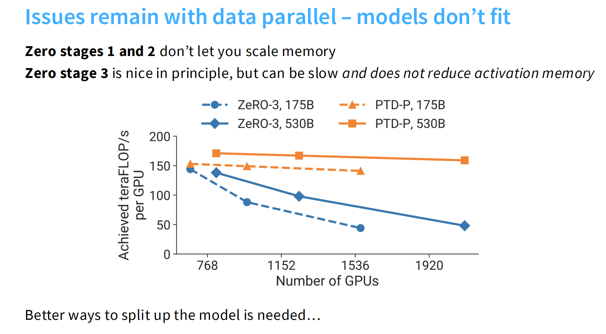

1.  **速度崩塌:**
    * **蓝色线 (ZeRO-3):** 随着 GPU 数量增加，每张卡的计算效率（TFLOPS）**急剧下降**。
    * **橙色线 (PTD-P, 混合并行):** 效率保持得很好。
    * **原因：** ZeRO-3 需要频繁通信（借参数）。卡越多，通信越堵，很多卡都在等参数，一直没东西算。

2.  **漏掉的大户 - 激活值 (Activation Memory):**
    * ZeRO 切分了参数、梯度、优化器状态。
    * **但是！** 它没有切分 **Activations (中间层的输出结果)**。
    * 对于超长上下文（Context Length）的模型，Activation 占用的显存可能比模型本身还大。ZeRO 对此束手无策。

> 为什么会存储完整的激活值呢？因为在 ZeRO 中，每个模型只是负责的部分不同，但是所有的前向过程都还是要做的。

## 2.2 Model Parallelism:Pipeline Parallelism（Layer-wise parallel）

### 1） 详细讲解

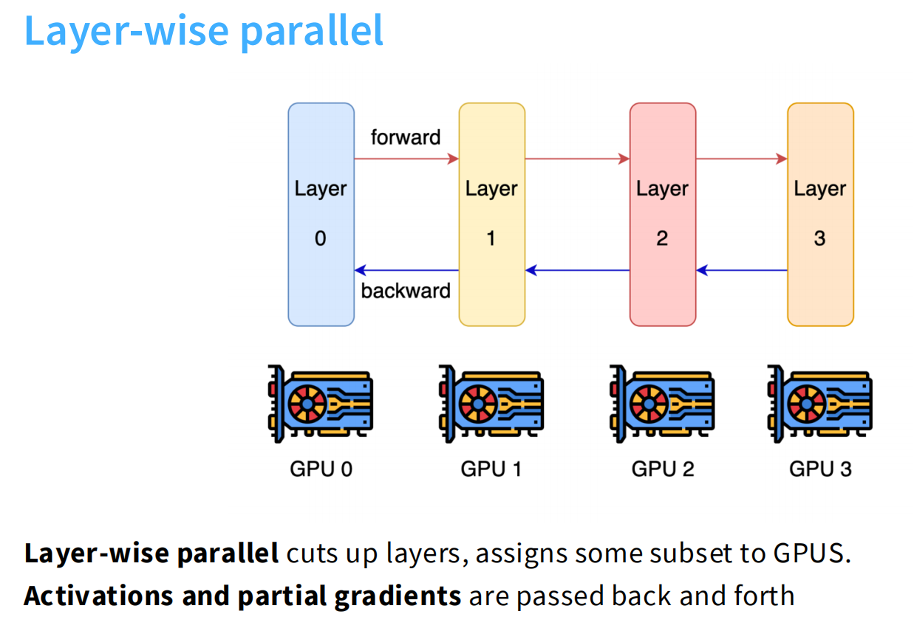

#### 1. 核心概念：按层切分（Cuts up layers）

* **硬件分配：**
    * **Layer 0** 被分配给 **GPU 0**
    * **Layer 1** 被分配给 **GPU 1**
    * **Layer 2** 被分配给 **GPU 2**
    * **Layer 3** 被分配给 **GPU 3**
* 这意味着每个 GPU 只负责模型的一部分参数和计算。

#### 2. 数据流向（Data Flow）

* **前向传播（Forward Pass）**
    * 数据从 Layer 0 开始输入。
    * GPU 0 计算完毕后，将输出的 **激活值（Activations）** 传递给 GPU 1。
    * GPU 1 接着计算，传给 GPU 2，以此类推，直到 GPU 3 输出最终结果（并计算 Loss）。

* **反向传播（Backward Pass）**
    * 计算完 Loss 后，需要更新参数。
    * GPU 3 计算它那一层的梯度，并将 **部分梯度（Partial Gradients）** 回传给 GPU 2。
    * GPU 2 根据传来的梯度继续计算，回传给 GPU 1，以此类推，直到回到 GPU 0。

这四张图串联起来，非常完整地讲述了**流水线并行（Pipeline Parallelism）**的故事：从朴素方法的**问题**，到**解决方案**，再到**存在的理由**以及**性能瓶颈**。

这是一套非常经典的深度学习系统课程（如 CS231n 或并行计算相关课程）的讲义逻辑。我将为你逐张图详细拆解：

### 2） 深入分析

#### 问题：效率低

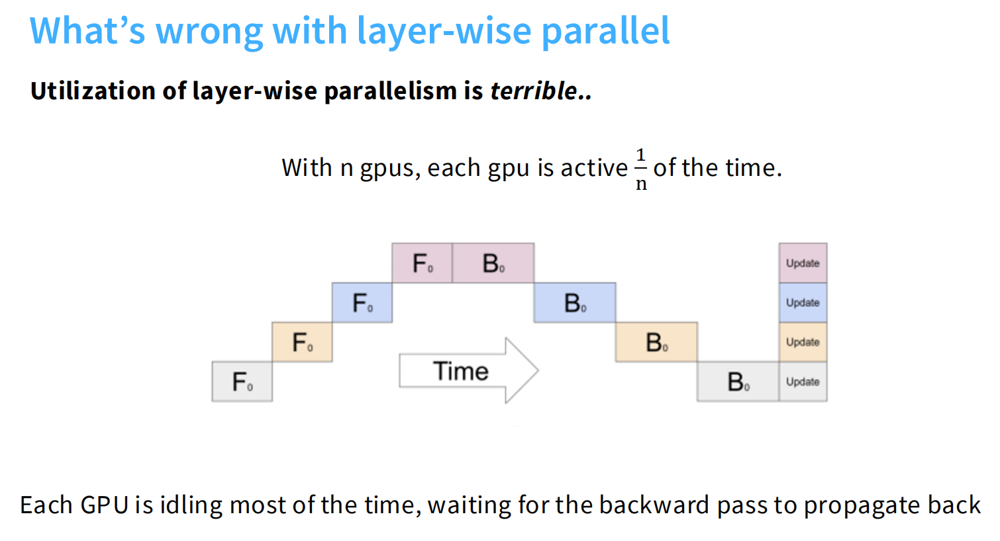

* **核心观点：** 这种方法的 GPU 利用率（Utilization）非常糟糕。
* **数学解释：** 如果有 $n$ 个 GPU，那么每个 GPU 只有 $\frac{1}{n}$ 的时间在工作。
* **原因：**
    * 图中的阶梯状色块展示了时间轴。
    * 当 GPU 0 在计算第一层的 Forward ($F_0$) 时，GPU 1, 2, 3 都在**闲置（Idle）**。
    * 数据传给 GPU 1 后，GPU 0 变成了闲置状态，直到反向传播（Backward, $B_0$）的数据传回来。
    * **结论：** 大部分时间 GPU 都在“等”，这造成了极大的算力浪费。

#### 解决方案：引入“微批次” (Micro-batches)

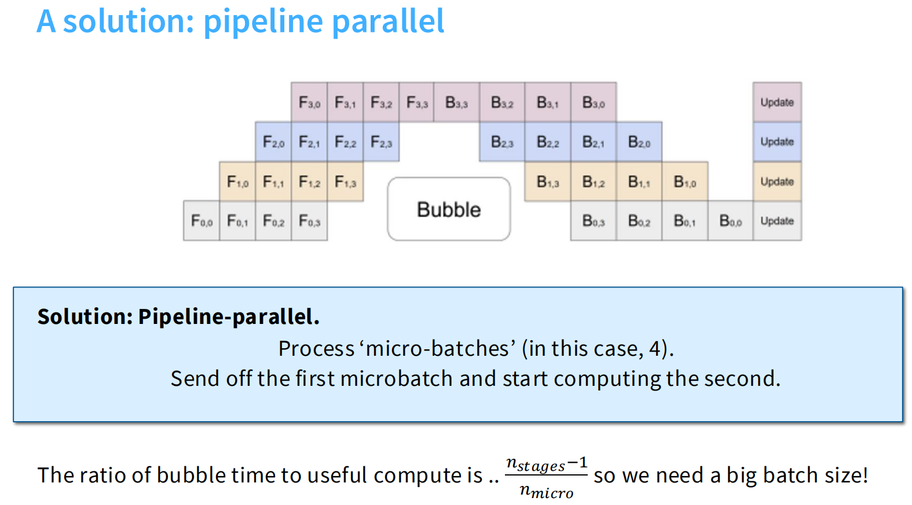

为了解决“闲置”问题，我们引入了流水线并行（Pipeline Parallelism，通常指 GPipe 这种模式）。

* **核心机制：**
    * 不把整个 Batch（大批次）一次性塞进去，而是把它切分成多个小的 **Micro-batches（微批次）**。
    * 如图所示，$F_{0,0}, F_{0,1}, F_{0,2} \dots$ 代表第 0 组数据的第 0、1、2 个微批次。
    * **流水线填充：** 当 GPU 0 处理完第一个微批次并发给 GPU 1 后，它**立刻**开始处理第二个微批次，而不是干等着。
* **气泡（Bubble）：**
    * 图中中间和角落留白的部分被称为 **"Bubble" (气泡)**。这代表虽然比朴素方法好多了，但仍然存在部分 GPU 在等待数据“填满”流水线或“排空”流水线的时间。
    * 气泡时间占比公式：$\frac{n_{stages}-1}{n_{micro}}$。
    * $n_{stages}$ 是 GPU 的数量，$n_{micro}$ 是微批次的数量。**微批次切得越多（$n_{micro}$ 越大），气泡占总时间的比例就越小，效率越高。**

#### 既然有气泡，为什么还要用它？

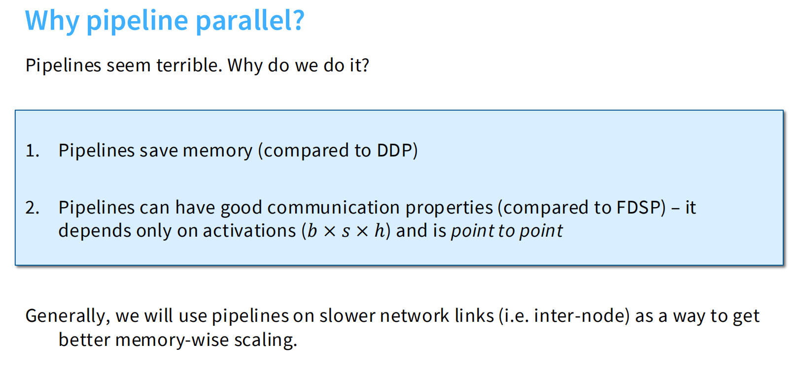

这种方法实现起来很麻烦，而且还有 bubble 浪费，为什么不直接用其他方法（比如数据并行 DDP）？

* **原因 1：节省显存 (Saves Memory)**
    * 相比于 DDP（分布式数据并行，每个 GPU 都要存一份完整的模型副本），流水线并行将模型切分了。每个 GPU 只存 $\frac{1}{n}$ 的模型参数。这使得我们可以训练**单卡显存放不下**的超大模型。
* **原因 2：通信特性好 (Good Communication)**
    * 相比于 FSDP（全分片数据并行，通信量巨大且是多对多），流水线并行的通信是 **点对点 (Point-to-Point)** 的。
    * GPU 0 只和 GPU 1 说话，GPU 1 只和 GPU 2 说话。
    * 传输的数据量仅限于**激活值 (Activations)**，大小为 $b \times s \times h$ (Batch $\times$ Sequence $\times$ Hidden size)。
* **应用场景：**
    * 正因为它是点对点通信，它非常适合**跨节点 (Inter-node)** 训练。比如有两台机器，中间网线比较慢，用流水线并行正好，因为不需要两台机器的所有显卡高吞吐的互通数据。

#### 限制：性能高度依赖 Batch Size

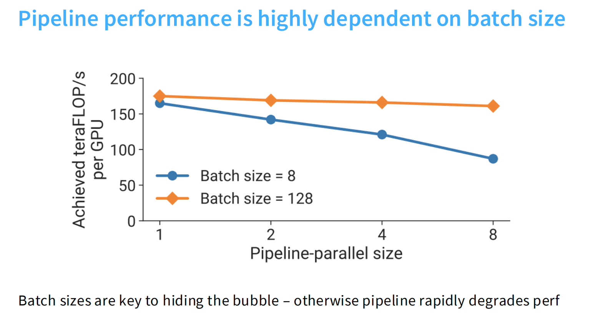

在使用流水线并行时必须注意的超参数。

* **图表：**
    * X 轴：流水线并行的大小（GPU 数量）。
    * Y 轴：每个 GPU 的实际算力（TFLOPS）。
* **两条线的对比：**
    * **橙线 (Batch size = 128)：** 即使 GPU 数量增加，每个 GPU 的效率依然很高且平稳。这是因为 Batch size 够大，切分出的微批次（Micro-batches）够多，成功“掩盖”了气泡时间。
    * **蓝线 (Batch size = 8)：** 随着 GPU 数量增加，效率**急剧下降**。因为 Batch 太小，没法切分出足够的微批次，导致大部分时间 GPU 都在闲置。
* **结论：** 要想流水线并行效率高，**必须使用大 Batch Size**。

### 3）如何进一步优化

#### 1. Zero Bubble Pipelining（算法层面）

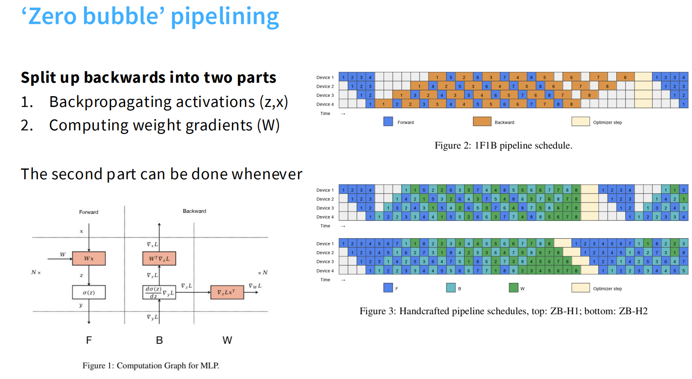

这张图介绍了一种非常巧妙的算法优化，核心思想是将反向传播拆解，利用时间差来填充气泡。

##### 优化核心

通常我们认为反向传播（Backward）是一个整体，但图中指出它可以拆分为两个独立的部分：
1.  **计算输入的梯度（Backpropagating activations, $B$）：** 计算 $\frac{\partial L}{\partial x}$。这是**紧急任务**，因为前一个 GPU（Layer $i-1$）急需这个梯度才能开始它自己的反向传播。
2.  **计算权重的梯度（Computing weight gradients, $W$）：** 计算 $\frac{\partial L}{\partial W}$。这是**非紧急任务**，只要在最终更新参数（Optimizer step）之前算完就行，不需要传给别的 GPU。

##### 调度策略（Scheduling）

* **旧方法（Figure 2: 1F1B）：** 可以看到大片的空白（气泡）。因为 GPU 必须按顺序做完 F（前向）和 B（反向），导致等待时间很长。
* **新方法（Figure 3: Handcrafted schedules）：**
    * 图中的 **$B$（浅蓝色块）** 代表计算输入梯度，它必须尽快传给上一个 GPU。
    * 图中的 **$W$（绿色块）** 代表计算权重梯度，它被“塞”进了原本是气泡的空白时间里。
    * **结果：** 整个时间线被填满了（变成了实心的矩形），几乎实现了 **Zero Bubble（零气泡）**，GPU 利用率达到 100%。

#### 2. Trading bandwidth for utilization（架构层面）

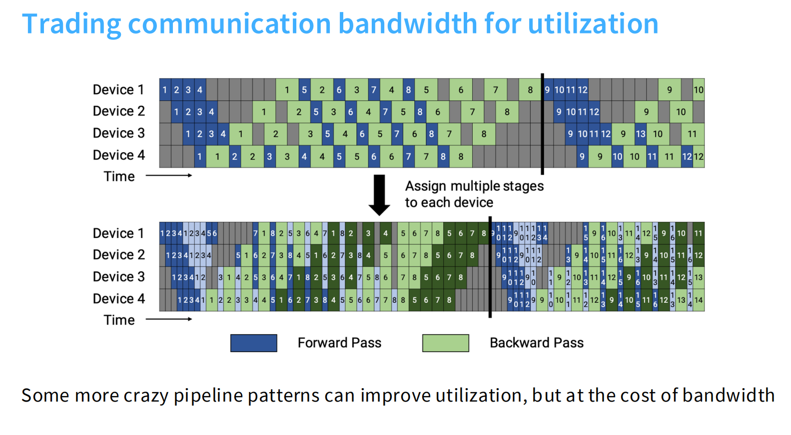

这种方法通常被称为**交错式流水线（Interleaved Pipeline）**。

##### 核心思想
* **上方图（朴素流水线）：**
    * 每个 GPU 负责连续的一大块层。比如 GPU 1 负责 Layer 1-4，GPU 2 负责 Layer 5-8。
    * 能看到明显的深灰色区域（闲置/气泡）。
* **下方图（交错式流水线）：**
    * **"Assign multiple stages to each device"**：每个 GPU 不再只负责一大块，而是负责多个“小块”。
    * 例如：GPU 1 可能负责 Layer 1-2 **和** Layer 9-10；GPU 2 负责 Layer 3-4 **和** Layer 11-12。
    * 这意味着数据在处理过程中，会多次回到同一个 GPU。

##### 优缺点权衡（Trade-off）
* **优点（Utilization）：** 气泡变小了。因为每个阶段（Stage）变短了，流水线“填满”和“排空”所需的时间显著减少。图中下方的彩色块更加紧密，深灰色的闲置区域明显变少了。
* **缺点（Bandwidth）：** 通信量变大了。
    * 原本数据只需要在 GPU 1 $\rightarrow$ GPU 2 $\rightarrow$ ... 传一次。
    * 现在数据要在 GPU 之间来回跳跃（GPU 1 $\rightarrow$ GPU 2 $\rightarrow$ ... $\rightarrow$ GPU 1 $\rightarrow$ GPU 2）。
    * 这就显著增加了**通信带宽**的压力。

#### 3. Tensor Parallelism

**张量并行（简称 TP）**。

如果说之前的“流水线并行”是横着切蛋糕（按层切），那么“张量并行”就是**竖着切蛋糕（按计算图的宽度切）**。

##### 核心理念：按宽度切分（Width Axes）

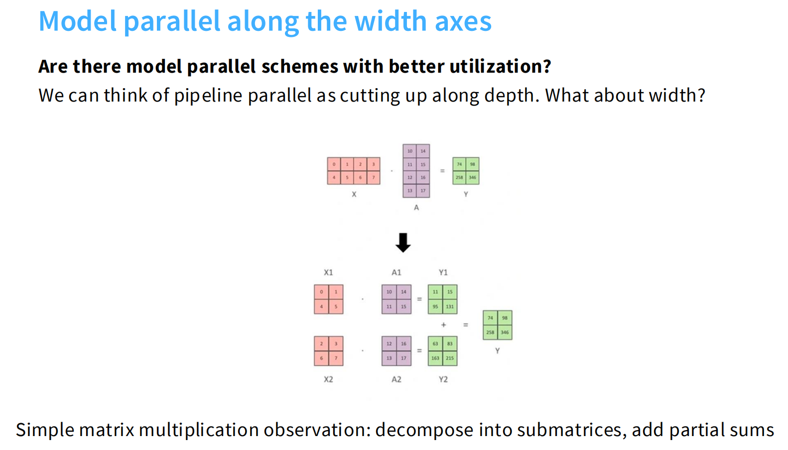
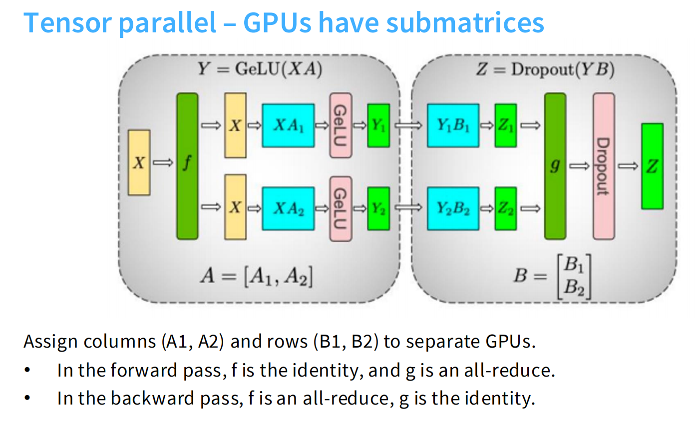

* **基本原理（图 14）：**
    * 流水线并行是把深度（Depth）切开，比如 Layer 1 给 GPU A，Layer 2 给 GPU B。
    * 张量并行则是把**同一个矩阵乘法**切开。
    * 图 14 展示了简单的数学原理：要把输入 $X$ 乘以大矩阵 $A$，我们可以把 $A$ 拆成两半 $A_1$ 和 $A_2$。GPU 1 算 $X \times A_1$，GPU 2 算 $X \times A_2$，最后拼起来就行。

* **在神经网络中的实现（图 15 - 经典的 Megatron-LM 架构）：**
    * 这是一个典型的 MLP（多层感知机）模块：Linear $\rightarrow$ GeLU $\rightarrow$ Linear。
    * **第一层（左边）：** 采用 **列并行（Column Parallel）**。权重 $A$ 被竖着切分，两个 GPU 独立计算，得到切分后的输出 $Y_1, Y_2$。
    * **第二层（右边）：** 采用 **行并行（Row Parallel）**。为了配合上一层的输出，第二层的权重 $B$ 被横着切分。
    * **All-Reduce（关键通信）：** 注意最右边的绿色块 $g$。虽然中间计算不需要通信，但在最后输出 $Z$ 之前，必须把两个 GPU 的结果加起来（Sum）。这就需要由 **All-Reduce** 操作来完成。

##### 优缺点：与流水线并行的对比

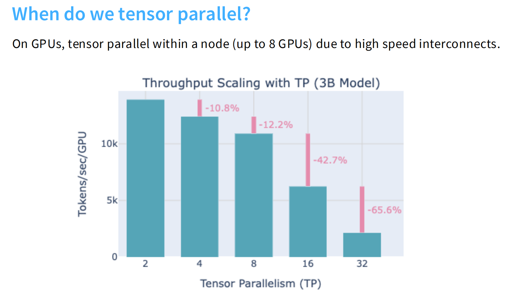

这张图非常重要，它解释了为什么我们不能只用张量并行。

* **优点（Pros）：**
    * **没有气泡（No bubble）：** 所有 GPU 始终在同时工作，不需要像流水线那样“等数据流过来”。
    * **适合小 Batch Size：** 不需要为了填满流水线而堆积大量的 micro-batches。
* **缺点（Cons）：**
    * **通信量巨大（Much larger communication）：**
        * 流水线并行只需要传少量的激活值（点对点通信）。
        * 张量并行在每一层（Layer）结束时都需要进行 **All-Reduce**。这意味着所有 GPU 都要互相广播数据。
    * **通信频率极高：** 每一层都要通讯，而不是每几层才通一次。

##### 应用场景：什么时候用 TP？

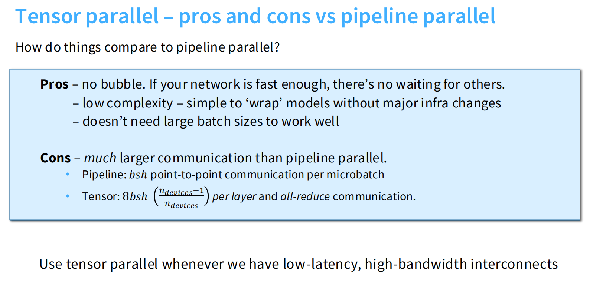

* **结论：仅在单机内部使用（Intra-node）。**
    * 因为 TP 的通信量极大，它必须依赖极高带宽的连接（如 NVIDIA 的 **NVLink**）。
    * 通常一个计算节点（Node）里有 8 张 GPU，它们之间有 NVLink。所以我们通常把 TP 的大小限制在 8 以内。
    * 一旦跨机器（跨节点），走的是以太网或 InfiniBand，速度远不如 NVLink，使用 TP 会导致速度慢到无法接受。

* **图表：**
    * 柱状图显示了随着 TP 规模增大（2 -> 4 -> 8 -> 16...），每个 GPU 的吞吐量（效率）在下降。
    * 特别是当 TP=32 时（肯定跨节点了），效率暴跌 65.6%。

### 4） **如何通过序列并行（Sequence Parallelism）解决激活值（Activations）显存占用过大的问题。**

这组图的逻辑非常严密，我们可以按照“发现问题 -> 分析瓶颈 -> 提出方案 -> 最终效果”的顺序来解读。

#### 1. 发现问题：显存大头其实是“激活值”

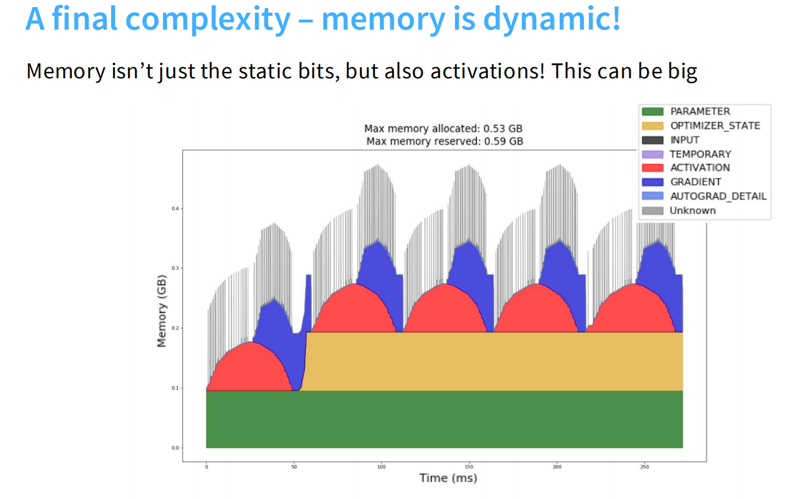
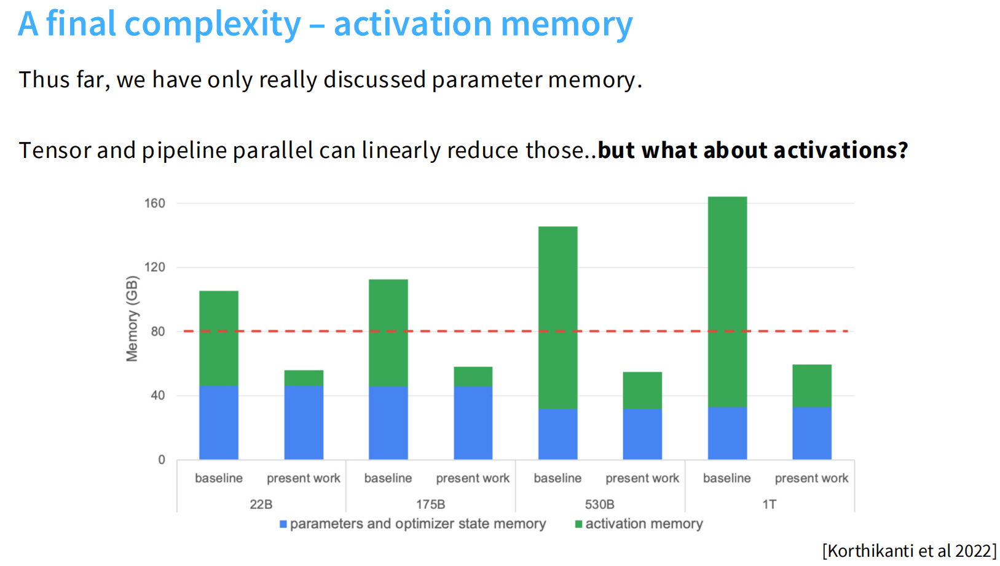

* **图 19 (Memory is dynamic):** 这张堆叠面积图展示了训练过程中的显存变化。
    * 底部的绿色/黄色（参数和优化器状态）是**静态的**，虽然大但比较稳定。
    * 中间红色的波峰（**Activation**）是**动态的**，随着前向传播急剧增长。
* **图 19 (Bar chart):** 对比。
    * 蓝色柱子（参数显存）可以通过我们之前讲的 Tensor Parallel (TP) 和 Pipeline Parallel (PP) 线性减少（切分到不同 GPU 上）。
    * 但是**绿色柱子（激活值显存）** 并没有显著减少，甚至在 1T 参数的模型中，激活值占用的显存远超参数本身。
    * **结论：** 只切分参数是不够的，如果不管激活值，显存很快就会爆掉。

#### 2. 分析瓶颈：张量并行（TP）做得还不够彻底

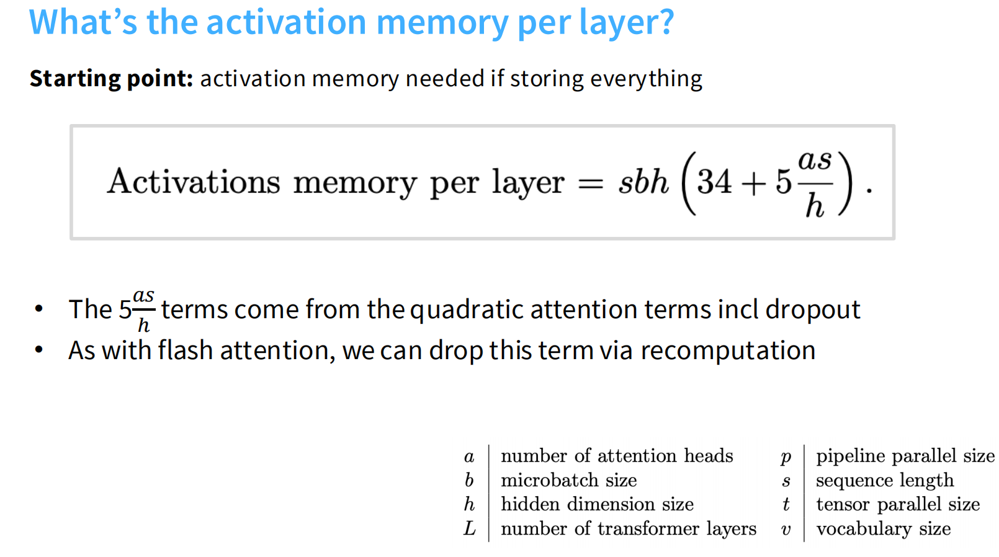
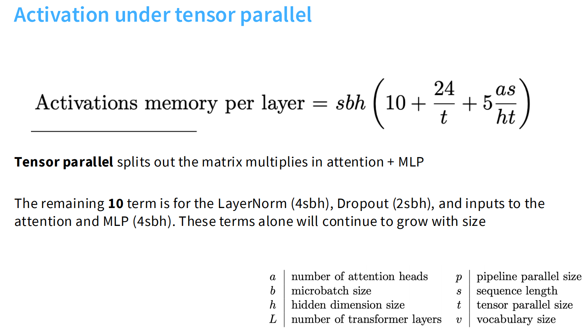

这里通过数学公式量化了问题：
* **基线公式：** 单层激活值显存 $\approx sbh(34 + \dots)$。其中 $s$ 是序列长度，$b$ 是批次大小，$h$ 是隐藏层维度。
* **TP 的局限性：** 采用了张量并行（Tensor Parallel, 大小为 $t$）后，公式变成了：
    $$sbh(10 + \frac{24}{t} + \dots)$$
* **原理：**
    * $\frac{24}{t}$：这部分很好，对应矩阵乘法（Linear Layers），被 $t$ 个 GPU 分摊了，显存占用随 GPU 数量线性下降。
    * **10 (The Stubborn Constant)：** 这部分**没有被除以 $t$**！这意味着无论你加多少个 GPU，这部分显存占用**雷打不动**。
    * **来源：** 这“顽固的 10”来自 **LayerNorm** 和 **Dropout** 以及相关输入。在标准的 TP 中，这些操作需要在每个 GPU 上存一份完整的副本（Replicated），导致无法节省显存。

#### 3. 解决方案：序列并行（Sequence Parallelism）

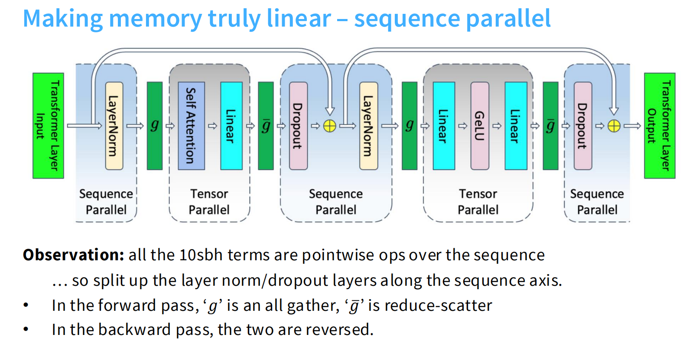

为了消灭那个顽固的常数“10”，我们引入了**序列并行（Sequence Parallelism, SP）**。

* **核心思想：**
    * 既然 LayerNorm 和 Dropout 是逐元素（Point-wise）操作，它们在序列维度（Sequence Dimension）上是独立的。
    * 我们不需要在每个 GPU 上都存完整的 $s$（序列长度），而是把序列切开，每个 GPU 只存 $\frac{s}{t}$。
* **流程变化（如图所示）：**
    * **TP 区域（Tensor Parallel）：** 依然负责繁重的矩阵乘法（Linear, Attention）。
    * **SP 区域（Sequence Parallel）：** 在进入 LayerNorm/Dropout 之前，不做 All-Gather（收集全量数据），而是保持切分状态，只计算自己那一部分序列的 LayerNorm/Dropout。
* **通信变化：** 把通信操作（$g$ 和 $\bar{g}$）的位置微调，将 All-Reduce 拆解为 Reduce-Scatter 和 All-Gather，巧妙地穿插在计算中。

#### 4. 最终效果：真正的线性扩展

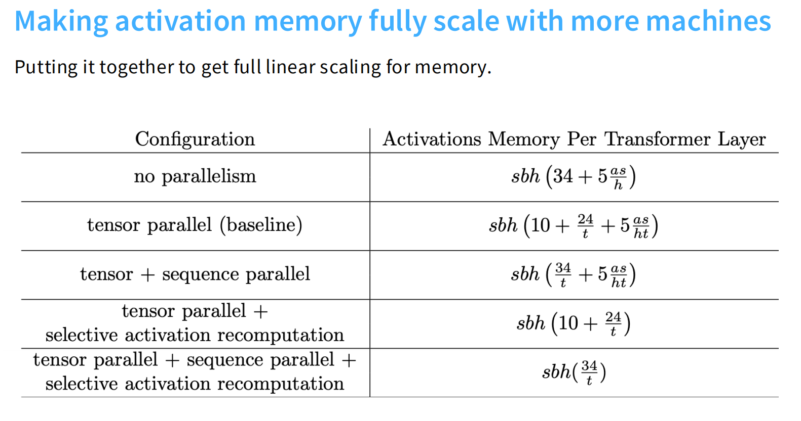

这张表格总结了进化的终局：

1.  **No Parallel:** 系数是 $34$。
2.  **Tensor Parallel (TP):** 系数是 $10 + \frac{24}{t}$。（那个 10 拖了后腿）。
3.  **Tensor + Sequence Parallel (SP):** 系数变成了 $\frac{34}{t}$！
    * 注意：原本的 $10$ 和 $24$ 现在都被 $t$ 除掉了。
    * **意义：** 激活值显存终于实现了**完全的线性扩展（Full Linear Scaling）**。如果你显存不够，加一倍 GPU，单卡的激活值显存占用就确确实实减半。

这套技术（通常在 NVIDIA 的 **Megatron-LM** 项目中实现）解决了大模型训练中显存优化的最后一块短板：
通过**序列并行（Sequence Parallelism）**，将 LayerNorm 和 Dropout 等操作沿序列维度切分，消除了张量并行中遗留的显存冗余，使得超长序列（Long Sequence）的大模型训练成为可能。