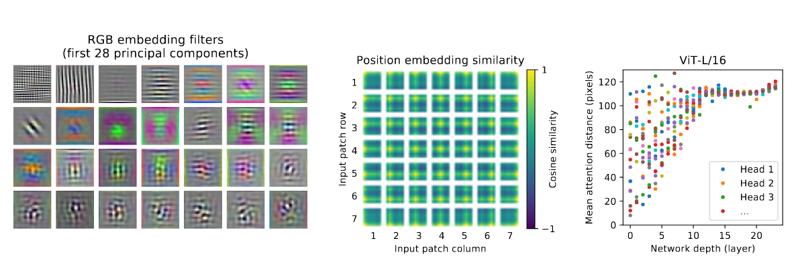

学习MoCo的时候，当然不止MoCo，前面还有BERT、ViT与MAE，虽然我学习的并不多，但是我似乎有一种感觉，在视觉领域中自监督学习才是一条真正可行的道路，原因如下：
1. 人类很难去将所有的数据集都尽可能好的尽可能完全的去标注完，这样的工作量是根本无法完成的。
2. 图片中有很多人类根本无法捕捉到的潜在特征，这个是重中之重，为什么MAE和MoCo能做到这样的程度呢？我认为关键点有以下几点：
    - **Transformer**：相比于CNN，Transformer少了很多归纳偏置（inductive bias），但我认为这并不是缺点，而是优点，因为在视觉中CNN的归纳偏置虽然可以让模型不需要那么多的数据便可以学习到一个令人较为满意的地步，但这种提升是有限的，归纳偏置让CNN无法学到一些其他潜在的特征，反而Transformer没有这些限制，它的所有特点都是在数据中学习得来的，举个例子：ViT中随着模型深度的提升attention-head的注意距离都会变化（可以看下面图的最右侧图表 ），Transformer不再依赖一些初始就有的特征，所以才能走的更远，这就像两个小孩一起学习，一个小孩一开始教授他一些trick，并且告诉他这些trick是绝对正确永远都不许违背的，那么这个小孩在以后遇到一些和trick相违背的东西时就会认为这个东西不值得学习或是记忆，而另一个小孩则如同一张白纸一样，什么都要自己去学，这样虽然后者一开始比前者慢一些但是我认为后者肯定能走的更远。
            

    - **模型不再使用人类为其标注的标签去学习**：人为标注的标签总归是有局限性的，如果模型只是按照人类为其标注的数据去学习，能学到的东西是非常有限的，但是使用自监督学习，让模型自己从数据中去学习数据的特征，模型是能学到很多人们根本无法观察到的一些特征的，因此我认为自监督学习才是一条真正可行的路。