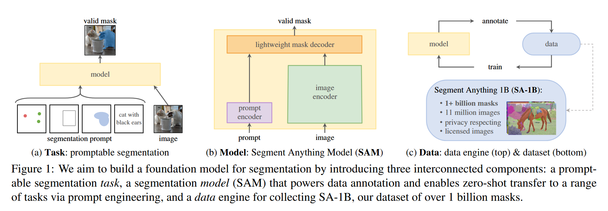

# Introduction

目标：训练一个类似于 GPT 一样通用的分割模型，通过提示词即可完成各种分割分任务（点、框、文本等等）

关键：
1. 任务：给定提示，返回有效的分割掩码
2. 模型：能够支持灵活提示并实时输出掩码的模型
3. 数据：因为数据缺乏，所以提出了**数据引擎**

# 任务：带提示词类型的分割任务

* **输入：**

  * 一张图像；
  * 一个 prompt，可以是：

    * 点（红绿点）；
    * 框；
    * 已有掩码；
    * 文本（例如 “cat with black ears”）。

* **输出：**

  * 一个 valid mask ，即模型根据提示生成的分割结果。

这一部分定义了 SAM 的任务：

> “给定任意提示，模型应输出一个合理的分割掩码。”

这是 SAM 成为通用分割模型的基础。

# 模型: Segment Anything Model (SAM)

**“分割模型结构”**

* 模型由三个模块组成：

  1. **Image Encoder**：
     提取整张图片的语义特征表示 embedding。
  2. **Prompt Encoder**：
     把输入的提示（点、框、文字等）转化为同样的特征空间表示。
  3. **Lightweight Mask Decoder**：
     将图像特征与提示特征结合，输出最终的掩码。

## Image Encoder

使用 MAE 预训练的 ViT 为基础

## Prompt Encoder

## Decoder

DETR 框架思想的 Transformer 架构

# 数据引擎与数据：Data Engine & Dataset (SA-1B)

**“数据引擎与数据集”**

* 分为上下两部分：

  * **上半部分为 data engine**：
    模型和数据之间的循环：

    1. 使用模型辅助人工标注；
    2. 收集到新数据后，用这些数据训练模型；
    3. 经过多轮迭代，模型和数据共同进化。
  * **下半部分为 dataset SA-1B**：
    最终生成的超大数据集：

    * 11 million 张图片；
    * 1 + billion 个掩码；
    * 图像来源受许可并保护隐私。

# 