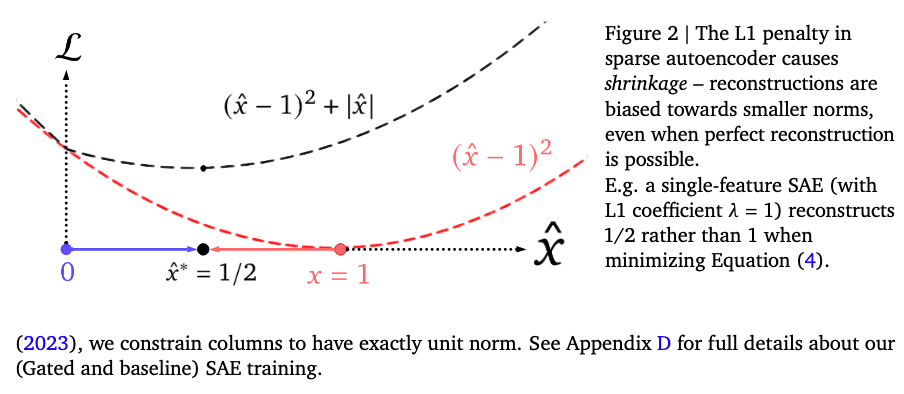
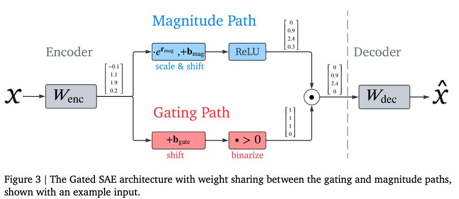
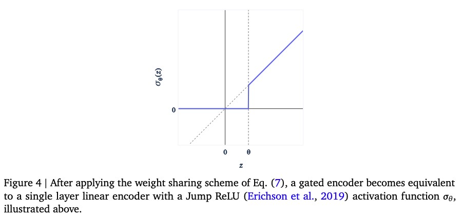
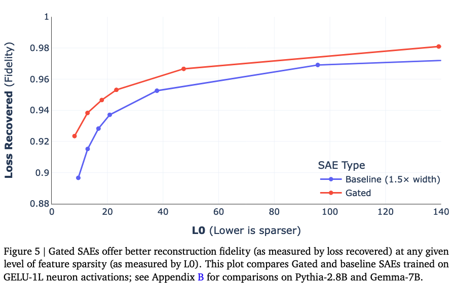
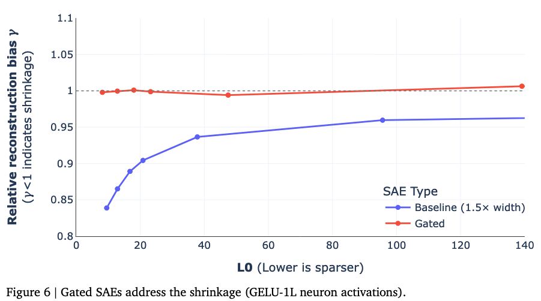
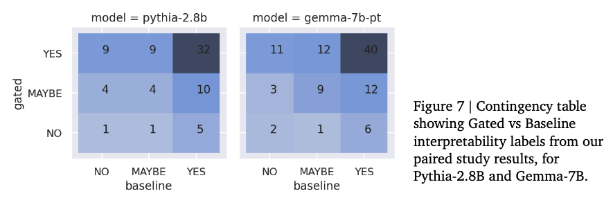

# **Improving Dictionary Learning with Gated Sparse Autoencoders**

下文称 Gated SAE

## 0 Abstract

Gated SAE 在训练效果上比目前主流方法实现了 Pareto 改进，其核心洞察是将功能分离为：
1. 确定使用哪些方向； 
2. 估计这些方向的幅值（大小）。

> 这里标记一下，后文会有详细的原理与数学解释。

## 1 Introduction

传统的 SAE（后称 baseline SAE）根据过完备基（overcomplete basis）或字典（dictionary）来寻找模型激活值的稀疏分解。尽管 SAE 在这方面展现了潜力，但在主流训练方法中用于鼓励稀疏性的 $L_{1}$ 惩罚项也引入了偏差，降低了 SAE 重构的准确性，因为模型可以通过牺牲一定的重构准确性来换取更低的 $L_{1}$ 值以降低总损失，这就是收缩偏差（Shrinkage Bias）。

收缩偏差正是由于 $L_{1}$ 惩罚项的“副作用”导致的：
- $L_{1}$ 的初衷： 它是为了让不重要的激活值归零，从而实现稀疏性。
- 产生的问题： 因为 $L_{1}$ 惩罚项是与激活值的绝对值大小成正比的，它在优化过程中不仅会剔除掉不重要的特征，还会 **无差别地“向下拉扯”** 那些真正代表特征的、SAE 需要保留的激活值。
- 结果： 这导致 SAE 输出的特征激活强度系统性地低于其在原始模型中应有的强度。论文中将其形象地描述为：损失函数在“重构误差”和“$L_{1}$ 惩罚”之间做交易——为了让 $L_{1}$ 这一项变小，模型宁愿牺牲一点重构精度，把激活值缩得更小一些。

本论文引入了对基准 SAE 架构的一种改进——门控 SAE（Gated SAE）——以及配套的损失函数，部分克服了上述局限性。Gated SAE 的核心思想是使用独立的仿射变换来分别执行以下任务：
- 确定在重构中使用哪些字典元素； 
- 估计活跃元素的系数（幅值）；并仅对前者应用稀疏性惩罚。在这些变换之间共享一部分权重，以避免与同等宽度的基准 SAE 相比显著增加参数量和推理计算需求。

本研究的主要贡献：
- 引入 Gated SAE：一种修改后的标准 SAE 架构，将“检测哪些特征存在”与“估计其幅值”解耦 ；
- 实现 Pareto 改进：证明了与基准 SAE 相比，Gated SAE 在稀疏性与重构保真度的权衡上表现更优 ；
- 克服收缩问题：确认 Gated SAE 解决了收缩问题，且优于其他旨在解决该问题的现有方法 ；
- 可解释性评估：通过一项小型双盲研究提供证据，证明 Gated SAE 的特征与基准 SAE 的特征在可解释性上不相上下。

图 1 的详细讲解：
### 1.1 核心结论：Pareto 改进 (Pareto Improvement)

图中的三张小图分别对应 Gemma-7B 模型第 20 层的三个不同位置：**残差流 (Residual stream)**、**MLP 输出 (MLP Output)** 和**注意力层输出 (Attention output)** 。
* **红色曲线 (Gated)** 代表门控 SAE，**蓝色曲线 (Baseline)** 代表基准 SAE 。
* 在所有图表中，红色曲线始终处于蓝色曲线的**左上方** 。这意味着在相同的稀疏度（L0）下，Gated SAE 能恢复更多的模型损失（保真度更高）；或者说，为了达到同样的保真度，Gated SAE 需要激活的特征数量更少 。这种全方位的领先被称为 **Pareto 改进** 。

### 1.2 坐标轴的含义
* **横轴：L0 (Lower is sparser)**
  * 表示平均每个输入样本激活的特征数量 。
  * 数值越低，代表分解越稀疏，可解释性理论上越好 。
  * 注意横轴采用的是**对数刻度 (log-scale)**，范围从 2 到 200 。
* **纵轴：Loss Recovered (Fidelity)**
  * 表示重构保真度，即 SAE 重构的激活值在多大程度上能替代原始激活值而不损失语言模型的性能 。
  * 1 代表完美重构（100% 恢复），0 代表表现等同于零消减（Zero Ablation） 。

### 1.3 实验的公平性：等计算量对比 (Equal Compute)

图中特别注明，这些 SAE 是在**计算量相等**的前提下进行对比的 。
* 由于 Gated SAE 的训练损失计算多出了一个辅助项，其单步训练成本比基准 SAE 高出约 50% 。
* 为了公平竞争，研究人员让基准 SAE 拥有了 **1.5 倍的特征数量（宽度）** 。
* 即便在基准 SAE 拥有更多参数和特征的情况下，Gated SAE 的表现依然显著优于它 。

### 1.4 具体表现亮点
* **效率提升**：论文指出，在典型的超参数范围内，Gated SAE 只需要大约**一半数量**的激活特征就能达到与基准 SAE 相当的重构精度 。
* **一致性**：这种性能提升不仅存在于图中展示的 Gemma-7B 第 20 层，在 GELU-1L、Pythia-2.8B 以及 Gemma-7B 的其他各层中都得到了验证 。

## 2 Sparse Autoencoder Background

现有 SAE 架构和训练方法（即 baseline SAE）所需的各种概念和符号。将在第 3.2 节中定义 **Gated SAEs** 。作者遵循的符号体系与 Bricken 等人 (2023) 大致相似，并建议将该作品作为在语言模型（LMs）上训练 SAE 的更完整介绍 。

SAE 希望将模型的激活值  分解为特征方向的稀疏线性组合 ：
$$x \approx x_0 + \sum_{i=1}^{M} f_i(x) d_i, \quad (1)$$

其中 $d_i$ 是 $M \gg n$ 个潜单元范数（unit-norm）特征方向，$f_i(x) \ge 0$ 是 $x$ 对应的稀疏特征激活值。公式 (1) 的右侧自然具有自编码器的结构：输入激活值 $x$ 被编码为一个（稀疏的）特征激活向量 $f(x) \in \mathbb{R}^M$，接着该向量被线性解码以重构 $x$。

### 公式解读

1. $x$：待分解的激活值
   - 含义：这是语言模型（LM）在处理某个文本时，某一层神经元的输出（比如残差流、MLP层的输出）。
   - 痛点：$x$ 是一个高维向量，里面的每个数字（神经元）通常是多义性的（一个神经元可能同时代表“医学”和“德语”两个无关概念），人类直接看不懂。
2. $d_i$：字典方向 (Dictionary Directions / Features)
   - 含义：这些是 SAE 学习到的 $M$ 个单位向量。每个 $d_i$ 代表一个单一的、可解释的特征（比如“代词的概念”、“关于法律的讨论”等）。
   - 关键点：$M \gg n$（过完备）。这意味着我们相信模型在有限的维度 $n$ 里，通过“叠加”存储了远多于 $n$ 个的特征。这些 $d_i$ 就是试图把这些被挤压在一起的特征重新找出来。
3. $f_i(x)$：特征激活值 (Feature Activations)
   - 含义：这是一个标量数字，表示在当前的输入 $x$ 中，特征 $d_i$ 出现了多少。
   - 稀疏性（Sparsity）：这是 SAE 的灵魂。虽然我们有几万个特征（$d_i$），但在处理某一个特定单词时，绝大多数 $f_i(x)$ 必须为 0。只有极少数（比如几十个）相关的特征会被激活。
   - 线性组合：$\sum f_i(x) d_i$ 的意思就是：我们把这些被激活的特征，按照各自的强度（$f_i$）加权累加起来。
4. $x_0$：中心化项/偏置 (Bias term)
   - 含义：在代码实现中，这通常对应解码器的偏置 $b_{dec}$。
   - 作用：它代表了激活值的“底噪”或平均水平。我们先减去这个平均值，再用特征去解释剩下的差异部分。

所以这个过程其实就是学习 $f_i()$ 这个规则，即：高维向量 $x$ 到 每一个单一字典方向 $d_i$ 的映射关系。

### 2.1 基准架构 (Baseline Architecture) 

利用这种对应关系，Bricken 等人 (2023) 及后续工作尝试通过参数化定义如下的单层自编码器 $(f, \hat{x})$ 来学习合适的稀疏分解：

$$f(x) := ReLU(W_{enc}(x - b_{dec}) + b_{enc}) \quad (2)$$

$$\hat{x}(f) := W_{dec}f + b_{dec} \quad (3)$$

并在训练过程（第 2.2 节）中使其能够重构来自大规模数据集的模型激活值 $x \sim \mathcal{D}$，同时约束隐藏层表示 $f$ 为稀疏的 13。一旦稀疏自编码器训练完成，我们可以通过以下方式获得公式 (1) 形式的分解：将解码器权重矩阵 $W_{dec} \in \mathbb{R}^{n \times M}$ 的（经过适当归一化的）列识别为特征方向字典 $d_i$，将解码器偏置 $b_{dec} \in \mathbb{R}^n$ 识别为中心化项 $x_0$，并将潜表示 $f(x) \in \mathbb{R}^M$ 的（经过适当归一化的）条目识别为特征激活值 $f_i(x)$。

### 2.2 基准训练方法 (Baseline Training Methodology) 

为了训练稀疏自编码器，Bricken 等人 (2023) 使用了一个共同鼓励 (i) 重构准确性和 (ii) 稀疏性的损失函数。重构准确性由 SAE 输入与其重构值之间的平方距离 $\|x - \hat{x}(f(x))\|_2^2$ 鼓励，称之为重构损失 (reconstruction loss)；而稀疏性则由活跃特征的 $L_1$ 范数 $\|f(x)\|_1$ 鼓励，称之为稀疏惩罚 (sparsity penalty)。使用 $L_1$ 系数 $\lambda$ 平衡这两项，优化 SAE 的总损失由下式给出：

$$\mathcal{L}(x) := \|x - \hat{x}(f(x))\|_2^2 + \lambda \|f(x)\|_1 \quad (4)$$

由于可以通过简单地缩小编码器输出并放大解码器权重范数，在不影响重构或稀疏度的情况下任意降低稀疏损失项，因此在训练期间约束 $W_{dec}$ 的列范数至关重要。遵循 Bricken 等人 (2023) 的做法，作者将列约束为精确的单位范数（unit norm）。

### 2.3 评估 (Evaluation)

为了直观了解训练后的 SAE 质量，作者使用了 Bricken 等人 (2023) 的两个指标：**L0（衡量 SAE 稀疏性）** 和 **恢复损失 (loss recovered)**（衡量 SAE 重构忠实度）：

- L0：定义为给定输入下活跃特征的平均数量，即 $\mathbb{E}_{\mathbf{x}\sim\mathcal{D}} \Vert \mathbf{f}(\mathbf{x}) \Vert_0$。
- 恢复损失：通过将 SAE 的重构结果剪接入语言模型（LM），计算模型在评估数据集上的平均交叉熵损失得出。如果我们用 $CE(\phi)$ 表示在模型前向传播中将 SAE 所在位置替换为函数 $\phi : \mathbb{R}^n \rightarrow \mathbb{R}^n$ 后的平均损失，则恢复损失为：
$$1 - \frac{CE(\mathbf{\hat{x}} \circ \mathbf{f}) - CE(Id)}{CE(\zeta) - CE(Id)} \tag{5}$$
其中 $\mathbf{\hat{x}} \circ \mathbf{f}$ 是自编码器函数，$\zeta : \mathbf{x} \mapsto \mathbf{0}$ 是零消融函数（zero-ablation function），而 $Id : \mathbf{x} \mapsto \mathbf{x}$ 是恒等函数。根据此定义，始终输出零向量进行重构的 SAE 的恢复损失为 0%，而能够完美重构输入的 SAE 的恢复损失为 100%。

> 三条注释：
> 注释 3: 在这项工作中，作者仅在 SAE 学习到的特征背景下使用“特征”一词，即通过线性组合产生重构结果的过完备基方向。特别地，学习到的特征始终是线性的，且不一定具有可解释性，这避开了定义“什么是特征”的困难。
> 注释 4: 模型激活通常取自特定的层和位置，例如第 17 层 MLP 部分的输出。
> 注释 5: 请注意，作者无法直接优化 $L0$ 范数（即活跃特征的数量），因为它不是可微函数。但作者确实使用 $L0$ 范数来评估 SAE 的稀疏性。

稀疏自编码器中的 $L1$ 惩罚会导致 **收缩 (shrinkage)** 现象——即便能够实现完美重构，重构结果也会偏向于更小的范数。
图中展示了两条曲线。红色虚线是纯重构损失 $(\hat{x}-1)^2$，其最小值在 $1$ 处；黑色虚线是加入了 $L1$ 惩罚后的总损失 $(\hat{x}-1)^2 + |\hat{x}|$。可以看到，加入惩罚后，总损失的最低点（最优重构值 $\hat{x}^*$）被“拉”向了 $0$ 的方向（即 $1/2$ 处）

## 3 门控稀疏自编码器 (Gated SAEs)

### 3.1 动机 (Motivation)

训练 SAE 的直观想法是在给定的稀疏度水平（由 $L0$ 衡量）下最大化重构忠实度，但在实践中，我们优化的是重构忠实度与 $L1$ 正则化的混合体。这种差异是稀疏自编码器训练中不必要偏差的来源：对于任何固定的稀疏度水平，训练后的 SAE 可以通过牺牲一点重构忠实度来换取更好的 $L1$ 稀疏惩罚表现，从而获得更低的（公式 (4) 中定义的）总损失。

这种偏差最明显的后果就是收缩 (shrinkage)。在保持解码器 $\hat{x}(\bullet)$ 固定不变的情况下，$L1$ 惩罚项会将特征激活值 $f(x)$ 推向零，而重构损失则会将 $f(x)$ 推向足够高的数值以产生准确的重构。因此，最优值落在两者之间，这意味着它系统性地低估了特征激活的幅度，且这种做法对于提升稀疏性并没有任何必然的补偿性收益。

我们该如何减少 $L1$ 惩罚项引入的偏差呢？基准 SAE 编码器 $f(x)$ 的输出承担了两个角色：
1. **检测哪些特征是活跃的**（根据输出是零还是严格正值来判断）。对于这个角色，$L1$ 惩罚是必要的，用以确保分解是稀疏的。
2. **估计活跃特征的幅度**。对于这个角色，$L1$ 惩罚则是一个不必要的偏差来源。

### 3.2 门控稀疏自编码器 (Gated SAEs)

#### 3.2.1 架构 (Architecture)

如何修改基准 SAE 编码器以实现这种权责分离？Gated SAE 的方案是将基准 SAE 的单层 ReLU 编码器替换为门控 ReLU 编码器 (Gated ReLU encoder)。受门控线性单元（Gated Linear Units）的启发，Gated SAE 将门控编码器定义如下：

$$\tilde{f}(x) := \underbrace{\mathbb{I}[\overbrace{(W_{gate}(x - b_{dec}) + b_{gate})}^{\pi_{gate}(x)} > 0]}_{f_{gate}(x)} \odot \underbrace{\text{ReLU}(W_{mag}(x - b_{dec}) + b_{mag})}_{f_{mag}(x)} \tag{6}$$

其中 $\mathbb{I}[\bullet > 0]$ 是（逐点）单位阶跃函数（Heaviside step function），$\odot$ 表示逐元素相乘。在这里，$f_{gate}$ 决定哪些特征被视为活跃，而 $f_{mag}$ 估计特征激活的幅度（仅对被视为活跃的特征有意义）；$\pi_{gate}(x)$ 是 $f_{gate}$ 子层的预激活值，用于下文定义的门控 SAE 损失函数。

从表面上看，我们似乎使编码器的参数量翻倍了，导致总参数量增加了 50%。我们通过权重共享 (weight sharing) 来缓解这一问题：我们对这些层进行参数化，使这两层共享相同的投影方向，但允许这些方向的范数以及层偏置有所不同。具体而言，我们根据 $W_{gate}$ 和一个额外的向量值重缩放参数 $r_{mag} \in \mathbb{R}^M$ 来定义 $W_{mag}$：

$$(W_{mag})_{ij} := (\exp(r_{mag}))_i \cdot (W_{gate})_{ij} \tag{7}$$

通过这种权重绑定方案，门控 SAE 仅比基准 SAE 多出 $2 \times M$ 个参数。

在权重绑定的情况下，门控编码器可以重新解释为带有非标准且不连续的 “跳变 ReLU” (Jump ReLU) 激活函数的单层线性编码器 $\sigma_\theta(z)$。准确地说，利用公式 (7) 的权重绑定方案，$\tilde{f}(x)$ 可以重新表达为 $\tilde{f}(x) = \sigma_\theta(W_{mag} \cdot x + b_{mag})$，其跳变间隙由 $\theta = b_{mag} - e^{r_{mag}} \odot b_{gate}$ 给出。

> 注释 7:仅仅对收缩后的特征激活进行简单的重缩放（如某些研究提出的后续修正方法）并不足以克服 $L1$ 惩罚带来的偏差。原因在于，使用 $L1$ 惩罚训练的 SAE 可能已经学习到了次优 (sub-optimal) 的编码器和解码器方向。即便你在事后调整了数值的大小，这些“歪了”的方向本身并没有得到修正。论文在 5.2 节提供了实验证据，证明 Gated SAE 学习到了比“基础模型+事后修正”更好的方向。 

**Gated SAE 架构**

这张图直观展示了 Gated SAE 的运行机制：
- 输入 $x$ 经过编码器权重 $W_{enc}$ 后，分成了两条路。
- 上方（蓝色）是幅度路径 (Magnitude Path)：负责计算如果特征存在，它的强度应该是多少。它包含一个重缩放/位移层和 ReLU 激活。
- 下方（红色）是门控路径 (Gating Path)：负责做“是/否”的判定。它将预激活值与 $0$ 比较，产生一个二值化的（0 或 1）掩码。
- 结合：两者进行逐元素相乘（即图中圆圈中间有一个点的符号 $\odot$）。如果门控路径判定为 $0$，那么无论幅度路径算出多少，最终结果都是 $0$。
- 权重共享：图中用同样的 $W_{enc}$ 框表示它们共享投影方向，体现了公式 (7) 的低参数量设计。

**Jump ReLU 激活函数**

这张图展示了 Gated SAE 在数学本质上的行为：
- 不连续性：传统的 ReLU 在 $0$ 点是连续的，而 Jump ReLU 在阈值 $\theta$ 处有一个明显的断层（跳变）。
- 物理意义：这意味着特征不会从极小的数值慢慢开启，而是一旦“越过门槛”（门控路径判定为活跃），它就会立即以一个显著的起始幅度激活。
- 解决收缩：这种机制允许模型设置一个较高的“进入门槛”来过滤噪声（保持稀疏），同时一旦进入，就能保持原本的幅度，而不会像 $L1$ 惩罚那样把数值往 $0$ 拽。

#### 3.2.2 训练门控 SAE (Training Gated SAEs)

训练门控 SAE 的一个自然想法是应用等式 (4)，同时将稀疏性惩罚仅限制在 $f_{gate}$ 上：

$$\mathcal{L}_{incorrect}(\mathbf{x}) := \underbrace{\Vert \mathbf{x} - \hat{\mathbf{x}}(\tilde{f}(\mathbf{x})) \Vert_2^2}_{\mathcal{L}_{reconstruct}} + \underbrace{\lambda \Vert f_{gate}(\mathbf{x}) \Vert_1}_{\mathcal{L}_{sparsity}}$$

不幸的是，由于 $f_{gate}$ 中使用了单位阶跃激活函数（Heaviside step function），梯度将无法传播到 $W_{gate}$ 和 $b_{gate}$。为了减轻稀疏惩罚项面临的这一问题，作者改为对预激活值的正部分应用 $L1$ 范数，即 $\text{ReLU}(\pi_{gate}(\mathbf{x}))$。为了确保 $f_{gate}$ 能通过检测活跃特征来辅助重构，Gated SAE 添加了一个辅助任务 (auxiliary task)，要求这些经过修正的预激活值也能被解码器用于产生良好的重构结果：

$$\mathcal{L}_{gated}(\mathbf{x}) := \underbrace{\Vert \mathbf{x} - \hat{\mathbf{x}}(\tilde{f}(\mathbf{x})) \Vert_2^2}_{\mathcal{L}_{reconstruct}} + \underbrace{\lambda \Vert \text{ReLU}(\pi_{gate}(\mathbf{x})) \Vert_1}_{\mathcal{L}_{sparsity}} + \underbrace{\Vert \mathbf{x} - \hat{\mathbf{x}}_{frozen}(\text{ReLU}(\pi_{gate}(\mathbf{x}))) \Vert_2^2}_{\mathcal{L}_{aux}} \tag{8}$$

其中 $\hat{\mathbf{x}}_{frozen}$ 是解码器的冻结副本，$\hat{\mathbf{x}}_{frozen}(f) := W_{dec}^{copy}f + b_{dec}^{copy}$，以确保来自 $\mathcal{L}_{aux}$ 的梯度不会传回给 $W_{dec}$ 或 $b_{dec}$。这通常可以通过停止梯度 (stop gradient) 操作来实现，而不需要真的创建副本——参见附录 G 中关于前向传播和损失函数的伪代码。

计算该损失（或其梯度）时，Gated SAE 需要运行两次解码器：一次用于执行 $\mathcal{L}_{reconstruct}$ 的主重构，另一次用于执行 $\mathcal{L}_{aux}$ 的辅助重构。这导致执行单个训练更新步骤所需的计算量增加了 50%。然而，总体训练时间的增加通常要少得多，因为根据作者的经验，大部分训练耗时都花在了在线生成语言模型激活值或磁盘 I/O（如果是在保存的激活值上训练）上。

## 4 评估 (Evaluation)

在本节中，作者将在多种模型和不同的位置上对门控 SAE (Gated SAEs) 进行基准测试（第 4.1 节）；展示它们解决了收缩问题（第 4.2 节）；并根据专家人类评分者的评估，展示它们产生的特征在可解释性上与基准 SAE (Baseline SAE) 的特征相当，尽管作者目前无法确凿地断定其中一种是否优于另一种（第 4.3 节）。

### 4.1 全面基准测试 (Comprehensive Benchmarking)

原文翻译在本小节中，作者展示了门控 SAE（Gated SAEs）在“恢复损失”（loss recovered）和 $L0$ 指标上相比基准 SAE（baseline SAEs）实现了帕累托改进 (Pareto improvement)。作者通过评估针对以下内容重构训练的 SAE 来证明这一点：
1. GELU-1L 模型中的 MLP 神经元激活：这是与 Bricken 等人 (2023) 研究最直接的对比；
2. Pythia-2.8B 模型（5 个不同层）和 Gemma-7B 基础模型（4 个不同层）中的 MLP 输出、注意力层输出（采样位置在 $W_O$ 之前，参考 Kissane 等人 (2024a)）以及残差流激活。

在这两组实验中，作者通过改变训练 SAE 时使用的 $L1$ 系数 $\lambda$，从而能够比较门控 SAE 与基准 SAE 在 $L0$ 和恢复损失之间的帕累托前沿 (Pareto frontiers)。

门控 SAE 的训练计算量最多是普通 SAE 的 1.5 倍。因此，为了确保评估中的公平比较，作者将门控 SAE 与多出 50% 学习特征（即更宽）的基准 SAE 进行对比。作者在图 5 中展示了 GELU-1L 的结果，在附录 B 中展示了 Pythia-2.8B 和 Gemma-7B 的结果。在附录 B（图 12）中，在所有测试的位置上，门控 SAE 均表现出对普通 SAE 的帕累托改进。在图 12 和图 13 的某些情况下，帕累托前沿出现了非单调的情况，作者将此归因于训练 SAE 时的固有困难。

> 1. 什么是“帕累托改进” (Pareto Improvement)？
> 在 SAE 的语境下，我们有两个互相矛盾的目标：
>  - 稀疏性 ($L0$)：活跃的特征越少越好。
>  - 保真度 (Loss Recovered)：重构的效果越接近原始模型越好。
> 帕累托改进意味着：相比于基准模型，Gated SAE 在不增加特征数量的情况下提高了准确率，或者在保持准确率不变的情况下减少了特征数量。简单来说，它全面超越了旧方法。
>
> 2. 为什么要对比“多出 50% 特征”的基准 SAE？
> 这是一个非常严谨的科研对比逻辑：
> - 成本计算：因为 Gated SAE 在训练时由于要跑两次解码器，多花了 50% 的计算量。
> - 公平竞赛：为了抵消这个“计算量优势”，作者让基准 SAE 的规模（特征数量 $M$）也增加 50%。
> - 结论的含金量：即便在基准 SAE 变宽、变强之后，Gated SAE 依然能在性能上胜过它。这证明了性能的提升来自于架构的优越性，而不是单纯靠增加计算资源。

Figure 5：整体性能的“帕累托改进”

这张图展示了在 GELU-1L 模型（一个单层语言模型）的神经元激活上，Gated SAE 与基准（Baseline）SAE 的性能对比。
- 坐标轴含义：
  - 横轴 (L0)： 代表特征的稀疏度（越往左越稀疏，激活的特征越少）。在可解释性研究中，我们希望 L0 越低越好。
  - 纵轴 (Loss Recovered / Fidelity)： 代表重构保真度（越往上重构越准）。1.0 代表完美重构了原模型的损失。
- 曲线对比：
  - 红色曲线 (Gated)： 代表门控 SAE。
  - 蓝色曲线 (Baseline)： 代表传统的基准 SAE（为了公平对比，这里的基准模型特征数多出 50%，即宽度是 1.5 倍）。
- 核心结论：
  - 红色曲线始终在蓝色曲线的左上方。这意味着在任何给定的稀疏度（L0）下，Gated SAE 的重构效果都更好。
  - 这种现象被称为帕累托改进 (Pareto improvement)，证明了 Gated SAE 的架构设计在处理“稀疏性”与“准确性”的矛盾时更具效率。

### 4.2 收缩现象 (Shrinkage)

正如第 3.1 节所述，用于训练基准 SAE 的 $L1$ 稀疏惩罚会导致特征激活被系统性地低估，这种现象被称为收缩 (shrinkage)。由于这反过来又会缩小 SAE 解码器生成的重构结果，我们可以通过测量其重构结果的平均范数，来观察受训 SAE 受收缩影响的程度。

具体而言，我们使用的指标是相对重构偏差 (relative reconstruction bias) $\gamma$：

$$\gamma := \arg \min_{\gamma'} \mathbb{E}_{x \sim \mathcal{D}} \left[ \left\| \hat{x}_{SAE}(x)/\gamma' - x \right\|_2^2 \right] \tag{9}$$

即 $\gamma^{-1}$ 是为了使 $L2$ 重构损失最小化，SAE 重构结果应该缩放的最优乘法因子。对于无偏的 SAE，$\gamma = 1$；当存在收缩时，$\gamma < 1$。通过显式求解等式 (9) 中的优化问题，相对重构偏差可以用 SAE 平均重构损失、输入激活值的均方范数以及 SAE 重构结果的均方范数来解析地表达，这使得 $\gamma$ 在训练期间易于计算和跟踪：

$$\gamma = \frac{\mathbb{E}_{x \sim \mathcal{D}} [ \| \hat{x}_{SAE}(x) \|_2^2 ]}{\mathbb{E}_{x \sim \mathcal{D}} [ \hat{x}_{SAE}(x) \cdot x ]} = \frac{2\mathbb{E}_{x \sim \mathcal{D}} [ \| \hat{x}_{SAE}(x) \|_2^2 ]}{\mathbb{E}_{x \sim \mathcal{D}} [ \| \hat{x}_{SAE}(x) \|_2^2 ] + \mathbb{E}_{x \sim \mathcal{D}} [ \| x \|_2^2 ] - \mathbb{E}_{x \sim \mathcal{D}} [ \| \hat{x}_{SAE}(x) - x \|_2^2 ]} \tag{10}$$

如图 6 所示，门控 SAE 的重构是无偏的，其 $\gamma \approx 1$，而基准 SAE 则表现出收缩现象 ($\gamma < 1$)，且收缩的影响随着 $L1$ 系数 $\lambda$ 的增加（以及随之而来的 $L0$ 减少）而变得更加严重。在附录 C 中，我们展示了这一结果可以推广到 Pythia-2.8B 模型。

> 数学原理讲解：什么是 $\gamma$？
> 作者定义这个 $\gamma$ 是为了量化模型“缩水”了多少。
> - 直观理解：如果模型重构出来的向量方向是对的，但是长度都变短了，那么 $\gamma$ 就会小于 1。
> - 补偿因子：$\gamma^{-1}$ 就是“补救系数”。比如模型重构出的值是 0.8，但真实值是 1.0，那么 $\gamma = 0.8$，你需要乘上 $1/0.8 = 1.25$ 才能还原 1。
> - 无偏状态：Gated SAE 的设计目标就是让 $\gamma$ 尽可能接近 1，意味着它重构出的特征强度就是它本该有的强度，没有被 $L1$ “拽走”。

Figure 6：精准消除“收缩现象” (Shrinkage)

这张图解释了为什么 Gated SAE 性能更好——因为它解决了传统 SAE 的一个系统性偏差：收缩问题。
- 坐标轴含义：
  - 横轴 (L0)： 同样代表稀疏度。
  - 纵轴 (Relative reconstruction bias $\gamma$)： 这是衡量重构偏差的指标。
    - $\gamma = 1$：代表无偏（重构结果的数值大小是准确的）。
    - $\gamma < 1$：代表收缩（重构出来的特征数值被系统性地拉低/变小了）。
- 曲线对比：
  - 红色曲线 (Gated)： 几乎是一条水平线，始终紧贴 1.0。这证明门控架构在提取特征时，给出的激活强度是准确的。
  - 蓝色曲线 (Baseline)： 随着 L0 减小（稀疏惩罚增大），曲线剧烈下滑。这说明传统 SAE 为了让模型变稀疏，不得不牺牲数值准确性，强行把特征激活值往零的方向拽。
- 核心结论：
  - Gated SAE 彻底解决了收缩问题。
  - 这是因为 Gated SAE 把“判定特征是否存在（开关）”和“计算特征强度（幅度）”分开了，只有开关部分受 L1 惩罚，而幅度部分不受影响，从而保留了最真实的特征强度。

> 注释 8：作者这样定义 $\gamma$ 是为了让 $\gamma < 1$ 在直觉上能对应“收缩”现象。
> 注释 9：第二个等号利用了恒等式 $2a \cdot b \equiv \|a\|_2^2 + \|b\|_2^2 - \|a - b\|_2^2$。请注意，一个无偏的重构（$\gamma = 1$）因此必须满足：
> $$\mathbb{E}_{x \sim \mathcal{D}} [ \| \hat{x}_{SAE}(x) \|_2^2 ] = \mathbb{E}_{x \sim \mathcal{D}} [ \| x \|_2^2 ] - \mathbb{E}_{x \sim \mathcal{D}} [ \| \hat{x}_{SAE}(x) - x \|_2^2 ]$$
> 换句话说，一个无偏但重构不完美的 SAE（即重构损失不为零的 SAE），即使在没有收缩的情况下，其重构结果的均方范数也必然严格小于输入激活值的均方范数。而收缩现象会使重构结果的均方范数变得更小。

### 4.3 手工可解释性评分 (Manual Interpretability Scores)

#### 4.3.1 实验方法 (Experimental Methodology)

虽然作者相信上文调查的各项指标传达了关于 SAE 质量的有意义信息，但它们仅仅是不完美的代理指标。截至目前，对于如何衡量学习到的特征在多大程度上具有“可解释性”，尚未达成共识。为了对学习到的字典特征之间的差异获得更定性的理解，作者进行了一项双盲人类评分者实验，对一组随机抽样的特征的可解释性进行了评分。

作者研究了来自不同层和位置的多种 SAE。
- 对于 Pythia-2.8B：有 5 名评分者，每人对图 12 中每个（位置，层）配对生成的基准 SAE 和门控 SAE 特征各评定一个，总计 150 个特征。
- 对于 Gemma-7B：有 7 名评分者；其中一人对每个（位置，层）配对评定 2 个特征，其余人各评定 1 个特征，特征来自图 13 中相应的基准或门控 SAE，总计 192 个特征。

在这两种情况下，特征以随机顺序展示给评分者，且不透露其来自哪个 SAE、位置或层。为了评估一个特征，评分者需要判断该特征的行为是否存在一种解释，特别是针对其最高激活样本的解释。随后，评分者输入该解释（如果适用），并选择该特征是：
- 可解释的（'Yes'）
- 不可解释的（'No'）
- 可能可解释的（'Maybe'）

作者使用开源的 SAE 可视化库作为实验界面（McDougall, 2024）。

#### 4.3.2 统计分析 (Statistical Analysis) 

为了测试门控 SAE（Gated SAEs）是否更具可解释性并估计其差异，我们将数据点根据所有协变量（模型、层、位置、评分者）进行配对（pairing）；这使我们能够在不进行任何参数假设的情况下控制所有变量，从而减少比较中的方差。我们使用单侧配对 Wilcoxon-Pratt 符号秩检验，并为基准（Baseline）和门控（Gated）标签之间的平均差异提供 90% BCa 自助法（bootstrap）置信区间，其中我们将“No”计为 0，“Maybe”计为 1，“Yes”计为 2。总体而言，针对“门控 SAE 的可解释性至多与基准 SAE 相当”这一原假设的检验得出的 $p$ 值为 0.060（估计值为 0.13，平均差异置信区间为 [0, 0.26]）。

具体细分如下：
- 在 Pythia-2.8B 数据上，$p = 0.15$（平均差异置信区间为 [−.07, .33]）。
- 在 Gemma-7B 数据上，$p = 0.13$（平均差异置信区间为 [−.04, .29]）。

对标签差异进行的 Mann-Whitney U 秩检验（比较两个模型的结果）未能拒绝（$p = 0.95$）“它们来自相同分布”的原假设；直接对标签进行的相同检验同样未能拒绝（$p = 0.84$）“它们整体上具有相似可解释性”的原假设。
用于这些结果的列联表（contingency tables）如图 7 所示。总体结论是，虽然我们不能断定门控 SAE 特征比基准 SAE 特征更具可解释性，但它们至少是相当的。我们在附录 H 中提供了更多按位置和层细分的分析。

Figure 7：展示了门控稀疏自编码器（Gated SAE）与基准 SAE（Baseline SAE）在特征可解释性方面的双盲人工评分对比结果。

这张图是由两张 **列联表（Contingency Tables）** 组成的，分别针对两个不同的语言模型：Pythia-2.8B 和 Gemma-7B。

1. 坐标轴含义
   - 横轴 (Baseline)：人类评分者对基准 SAE 特征给出的评分。
   - 纵轴 (Gated)：人类评分者对门控 SAE 特征给出的评分。
   - 评分等级：
     - YES：特征是可解释的。
     - MAYBE：特征可能具有可解释性。
     - NO：特征不可解释。
2. 如何阅读表中的数字？
表中的每个数字代表了配对测试中的样本数量。由于实验是“配对”进行的（即评分者同时评价来自同一模型、同一层、同一位置但不同 SAE 架构的特征），我们可以通过观察格子的分布来判断优劣：
   - 对角线（左下到右上）：代表两种 SAE 得到的评价一致。例如，在 Gemma-7B 表中，有 40 个特征在两种架构下都被评为“YES”。
   - 左上方区域（对角线以上）：代表 Gated SAE 表现更好。例如，在 Pythia-2.8B 表中，有 9 个样本在 Baseline 下被评为“MAYBE”，但在 Gated 下被评为“YES”。
   - 右下方区域（对角线以下）：代表 Baseline SAE 表现更好。例如，在 Gemma-7B 表中，有 12 个样本在 Baseline 下被评为“YES”，但在 Gated 下被评为“MAYBE”。
3. 核心统计结论
通过这些数据，作者进行了统计学分析（Wilcoxon-Pratt 符号秩检验），得出了以下结论：
   - 性能相当：总体的 $p$ 值为 .060。在统计学上，通常 $p < .05$ 被认为具有显著差异。因为该值略高于 .05，所以不能断定 Gated SAE 绝对比 Baseline 更好懂。
   - 没有退步：虽然 Gated SAE 的重构保真度（数学表现）大幅提升，但人工评分证明其可解释性至少与基准方法处于同一水平。
   - 优势倾向：从热力图颜色深度和数字分布来看，Gated SAE 在“YES”这一行（纵轴最上方）的数字普遍较大，说明它倾向于产生更多高质量、可理解的特征。

## 5 为什么 Gated SAE 能改善 SAE 的训练？ (Why do Gated SAEs improve SAE training?)

在本节中，作者通过消融研究 (Ablation Study) 深入分析了 Gated SAE 训练中的关键组成部分，并将其与另一种解决收缩问题的相关方法进行了基准测试。

