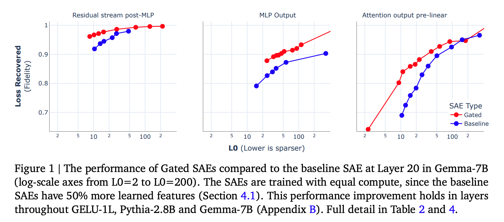

# **Improving Dictionary Learning with Gated Sparse Autoencoders**

下文称 Gated SAE

## 0 Abstract

Gated SAE 在训练效果上比目前主流方法实现了 Pareto 改进，其核心洞察是将功能分离为：
1. 确定使用哪些方向； 
2. 估计这些方向的幅值（大小）。

> 这里标记一下，后文会有详细的原理与数学解释。

## 1 Introduction

传统的 SAE（后称 baseline SAE）根据过完备基（overcomplete basis）或字典（dictionary）来寻找模型激活值的稀疏分解。尽管 SAE 在这方面展现了潜力，但在主流训练方法中用于鼓励稀疏性的 $L_{1}$ 惩罚项也引入了偏差，降低了 SAE 重构的准确性，因为模型可以通过牺牲一定的重构准确性来换取更低的 $L_{1}$ 值以降低总损失，这就是收缩偏差（Shrinkage Bias）。

收缩偏差正是由于 $L_{1}$ 惩罚项的“副作用”导致的：
- $L_{1}$ 的初衷： 它是为了让不重要的激活值归零，从而实现稀疏性。
- 产生的问题： 因为 $L_{1}$ 惩罚项是与激活值的绝对值大小成正比的，它在优化过程中不仅会剔除掉不重要的特征，还会 **无差别地“向下拉扯”** 那些真正代表特征的、我们需要保留的激活值。
- 结果： 这导致 SAE 输出的特征激活强度系统性地低于其在原始模型中应有的强度。论文中将其形象地描述为：损失函数在“重构误差”和“$L_{1}$ 惩罚”之间做交易——为了让 $L_{1}$ 这一项变小，模型宁愿牺牲一点重构精度，把激活值缩得更小一些。

本论文引入了对基准 SAE 架构的一种改进——门控 SAE（Gated SAE）——以及配套的损失函数，部分克服了上述局限性。Gated SAE 的核心思想是使用独立的仿射变换来分别执行以下任务：
- 确定在重构中使用哪些字典元素； 
- 估计活跃元素的系数（幅值）；并仅对前者应用稀疏性惩罚。在这些变换之间共享一部分权重，以避免与同等宽度的基准 SAE 相比显著增加参数量和推理计算需求。

本研究的主要贡献：
- 引入 Gated SAE：一种修改后的标准 SAE 架构，将“检测哪些特征存在”与“估计其幅值”解耦 ；
- 实现 Pareto 改进：证明了与基准 SAE 相比，Gated SAE 在稀疏性与重构保真度的权衡上表现更优 ；
- 克服收缩问题：确认 Gated SAE 解决了收缩问题，且优于其他旨在解决该问题的现有方法 ；
- 可解释性评估：通过一项小型双盲研究提供证据，证明 Gated SAE 的特征与基准 SAE 的特征在可解释性上不相上下。

图 1 的详细讲解：
### 1.1 核心结论：Pareto 改进 (Pareto Improvement)

图中的三张小图分别对应 Gemma-7B 模型第 20 层的三个不同位置：**残差流 (Residual stream)**、**MLP 输出 (MLP Output)** 和**注意力层输出 (Attention output)** 。
* **红色曲线 (Gated)** 代表门控 SAE，**蓝色曲线 (Baseline)** 代表基准 SAE 。
* 在所有图表中，红色曲线始终处于蓝色曲线的**左上方** 。这意味着在相同的稀疏度（L0）下，Gated SAE 能恢复更多的模型损失（保真度更高）；或者说，为了达到同样的保真度，Gated SAE 需要激活的特征数量更少 。这种全方位的领先被称为 **Pareto 改进** 。

### 1.2 坐标轴的含义
* **横轴：L0 (Lower is sparser)**
  * 表示平均每个输入样本激活的特征数量 。
  * 数值越低，代表分解越稀疏，可解释性理论上越好 。
  * 注意横轴采用的是**对数刻度 (log-scale)**，范围从 2 到 200 。
* **纵轴：Loss Recovered (Fidelity)**
  * 表示重构保真度，即 SAE 重构的激活值在多大程度上能替代原始激活值而不损失语言模型的性能 。
  * 1 代表完美重构（100% 恢复），0 代表表现等同于零消减（Zero Ablation） 。

### 1.3 实验的公平性：等计算量对比 (Equal Compute)

图中特别注明，这些 SAE 是在**计算量相等**的前提下进行对比的 。
* 由于 Gated SAE 的训练损失计算多出了一个辅助项，其单步训练成本比基准 SAE 高出约 50% 。
* 为了公平竞争，研究人员让基准 SAE 拥有了 **1.5 倍的特征数量（宽度）** 。
* 即便在基准 SAE 拥有更多参数和特征的情况下，Gated SAE 的表现依然显著优于它 。

### 1.4 具体表现亮点
* **效率提升**：论文指出，在典型的超参数范围内，Gated SAE 只需要大约**一半数量**的激活特征就能达到与基准 SAE 相当的重构精度 。
* **一致性**：这种性能提升不仅存在于图中展示的 Gemma-7B 第 20 层，在 GELU-1L、Pythia-2.8B 以及 Gemma-7B 的其他各层中都得到了验证 。

## 2 Sparse Autoencoder Background

现有 SAE 架构和训练方法（即 baseline SAE）所需的各种概念和符号。将在第 3.2 节中定义 **Gated SAEs** 。我们遵循的符号体系与 Bricken 等人 (2023) 大致相似，并建议将该作品作为在语言模型（LMs）上训练 SAE 的更完整介绍 。

SAE 希望将模型的激活值  分解为特征方向的稀疏线性组合 ：
$$x \approx x_0 + \sum_{i=1}^{M} f_i(x) d_i, \quad (1)$$

其中 $d_i$ 是 $M \gg n$ 个潜单元范数（unit-norm）特征方向，$f_i(x) \ge 0$ 是 $x$ 对应的稀疏特征激活值。公式 (1) 的右侧自然具有自编码器的结构：输入激活值 $x$ 被编码为一个（稀疏的）特征激活向量 $f(x) \in \mathbb{R}^M$，接着该向量被线性解码以重构 $x$。

### 公式解读

1. $x$：待分解的激活值
   - 含义：这是语言模型（LM）在处理某个文本时，某一层神经元的输出（比如残差流、MLP层的输出）。
   - 痛点：$x$ 是一个高维向量，里面的每个数字（神经元）通常是多义性的（一个神经元可能同时代表“医学”和“德语”两个无关概念），人类直接看不懂。
2. $d_i$：字典方向 (Dictionary Directions / Features)
   - 含义：这些是 SAE 学习到的 $M$ 个单位向量。每个 $d_i$ 代表一个单一的、可解释的特征（比如“代词的概念”、“关于法律的讨论”等）。
   - 关键点：$M \gg n$（过完备）。这意味着我们相信模型在有限的维度 $n$ 里，通过“叠加”存储了远多于 $n$ 个的特征。这些 $d_i$ 就是试图把这些被挤压在一起的特征重新找出来。
3. $f_i(x)$：特征激活值 (Feature Activations)
   - 含义：这是一个标量数字，表示在当前的输入 $x$ 中，特征 $d_i$ 出现了多少。
   - 稀疏性（Sparsity）：这是 SAE 的灵魂。虽然我们有几万个特征（$d_i$），但在处理某一个特定单词时，绝大多数 $f_i(x)$ 必须为 0。只有极少数（比如几十个）相关的特征会被激活。
   - 线性组合：$\sum f_i(x) d_i$ 的意思就是：我们把这些被激活的特征，按照各自的强度（$f_i$）加权累加起来。
4. $x_0$：中心化项/偏置 (Bias term)
   - 含义：在代码实现中，这通常对应解码器的偏置 $b_{dec}$。
   - 作用：它代表了激活值的“底噪”或平均水平。我们先减去这个平均值，再用特征去解释剩下的差异部分。

所以这个过程其实就是学习 $f_i()$ 这个规则，即：高维向量 $x$ 到 每一个单一字典方向 $d_i$ 的映射关系。

### 2.1. 基准架构 (Baseline Architecture) 

利用这种对应关系，Bricken 等人 (2023) 及后续工作尝试通过参数化定义如下的单层自编码器 $(f, \hat{x})$ 来学习合适的稀疏分解：

$$f(x) := ReLU(W_{enc}(x - b_{dec}) + b_{enc}) \quad (2)$$

$$\hat{x}(f) := W_{dec}f + b_{dec} \quad (3)$$

并在训练过程（第 2.2 节）中使其能够重构来自大规模数据集的模型激活值 $x \sim \mathcal{D}$，同时约束隐藏层表示 $f$ 为稀疏的 13。一旦稀疏自编码器训练完成，我们可以通过以下方式获得公式 (1) 形式的分解：将解码器权重矩阵 $W_{dec} \in \mathbb{R}^{n \times M}$ 的（经过适当归一化的）列识别为特征方向字典 $d_i$，将解码器偏置 $b_{dec} \in \mathbb{R}^n$ 识别为中心化项 $x_0$，并将潜表示 $f(x) \in \mathbb{R}^M$ 的（经过适当归一化的）条目识别为特征激活值 $f_i(x)$。

### 2.2. 基准训练方法 (Baseline Training Methodology) 

为了训练稀疏自编码器，Bricken 等人 (2023) 使用了一个共同鼓励 (i) 重构准确性和 (ii) 稀疏性的损失函数。重构准确性由 SAE 输入与其重构值之间的平方距离 $\|x - \hat{x}(f(x))\|_2^2$ 鼓励，称之为重构损失 (reconstruction loss)；而稀疏性则由活跃特征的 $L_1$ 范数 $\|f(x)\|_1$ 鼓励，称之为稀疏惩罚 (sparsity penalty)。使用 $L_1$ 系数 $\lambda$ 平衡这两项，优化 SAE 的总损失由下式给出：

$$\mathcal{L}(x) := \|x - \hat{x}(f(x))\|_2^2 + \lambda \|f(x)\|_1 \quad (4)$$

由于可以通过简单地缩小编码器输出并放大解码器权重范数，在不影响重构或稀疏度的情况下任意降低稀疏损失项，因此在训练期间约束 $W_{dec}$ 的列范数至关重要。遵循 Bricken 等人 (2023) 的做法，作者将列约束为恰好具有单位范数（unit norm）。

