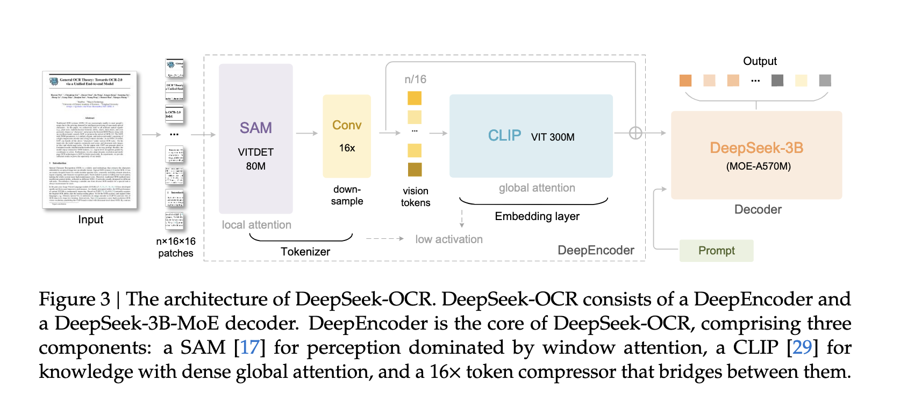

# 核心问题

核心问题：**如何高效地处理长文本的上下文信息？** 特别是 LLM 和 VLM 中，如何通过视觉模态实现对文本的有效压缩。

注意力机制计算的时间复杂度是 $n^2 * d$ ，所以当输入文本很多，或者上下文很长的时候

# 1 引言

## 1.1 研究背景：LLM 的长上下文问题

LLM 在处理长文本时，因为 Transformer 的注意力机制随序列长度呈**平方级增长**，导致内存和计算成本极高，引出关键问题“如何压缩长文本上下文？”，以此来让模型：
1. 减少计算量；
2. 记住更多上下文。

## 1.2 核心思想：用视觉模态进行“光学压缩（Optical Compression）”

论文新思路：

> “一张图片能展示一整页文档的文字，用图像形式表达文本，是一种天然的压缩。”

* 一个文档图像（例如PDF截图）用少量视觉tokens就能表达大量文本信息。
* 相比原始文本tokens，这种“光学压缩”可以带来**7～20倍的token压缩率**。
* 因此，可以用视觉模态作为LLM的**高效信息存储与压缩媒介**。

OCR 任务正好是一个天然的“压缩—解压缩”过程，所以作者使用该方法。

## 1.3 方法与贡献

作者提出了 **DeepSeek-OCR** 作为验证这一思想的模型，主要有三个贡献：

1. **量化验证压缩能力**

   * 在 Fox 基准上，9–10× 压缩下OCR精度仍超过96%；
   * 10–12×压缩精度约90%；
   * 即使20×压缩，也能保持约60%准确率。
     → 证明通过视觉模态进行文本压缩是**可行且高效**的。

2. **提出新型视觉编码器 DeepEncoder**

   * 架构结合**局部窗口注意力（window attention）**和**全局注意力（global attention）**；
   * 通过 **16× 卷积下采样模块** 减少视觉token数量；
   * 能处理高分辨率输入，同时保持**低激活内存和少量视觉tokens**。

3. **构建完整系统 DeepSeek-OCR（基于 DeepEncoder + MoE解码器）**

   * 使用 DeepSeek-3B-MoE 作为解码器；
   * 在 **OmniDocBench** 上性能超过其他端到端OCR模型；
   * 同时支持解析图表、化学式、几何图形等复杂视觉结构；
   * 在生产环境中可实现**每日生成3300万页训练数据**的能力。

# 2 相关工作

## 2.1 Typical Vision Encoders in VLMs

当前开源 VLM 中常见的三种视觉编码器架构：

### （1）双塔结构（Dual-Tower Architecture）—— 代表：**Vary**

* **做法**：使用类似 **SAM** 的并行视觉编码器结构，以提升高分辨率图像的表示能力。
* **优点**：参数量可控，激活内存较低。
* **缺点**：

  * 需要两次图像预处理（dual image preprocessing）；
  * 训练时难以实现高效的并行；
  * 部署复杂。

**问题**：结构复杂、难以扩展，影响模型训练和推理效率。

### （2）分块式结构（Tile-based Encoding）—— 代表：**InternVL2.0**

* **做法**：将高分辨率图像切成小块并并行处理，以降低显存占用。
* **优点**：能处理极高分辨率图像。
* **缺点**：

  * 原生分辨率较低（通常小于512×512）；
  * 图像被切得过碎，导致产生大量视觉tokens；
  * 影响整体语义连续性。

**问题**：虽然节省显存，但牺牲了语义完整性与token效率。

### （3）自适应分辨率编码（Adaptive Resolution Encoding）—— 代表：**Qwen2-VL**

* **做法**：采用 **NaViT** 范式，直接在整张图上进行patch分割，无需分块。
* **优点**：可灵活适配不同分辨率输入。
* **缺点**：

  * 对高分辨率图像激活内存消耗极大（易GPU溢出）；
  * 训练时需要极长序列（大量vision tokens）；
  * 推理时prefill和generation阶段都很慢。

**问题**：虽然灵活但计算开销过高，不适合实际大规模部署。

> 现有视觉编码器要么计算成本高、要么生成的视觉tokens太多、要么结构复杂难部署。
> 因此作者提出了 **DeepEncoder** —— 一种既能处理高分辨率输入，又能在少量视觉tokens下高效工作的新型编码器。

## 2.2 End-to-End OCR Models

近几年OCR领域的发展趋势：

### （1）传统OCR → 端到端OCR

* 过去的OCR需要**检测模型**（文字区域）+**识别模型**（文字内容）两个阶段。
* 随着VLM的发展，OCR逐渐转向 **端到端（end-to-end）** 形式，直接从图像输出文本，系统结构更简单、性能更强。

### （2）典型代表

* **Nougat**：首个在学术论文OCR中使用端到端架构的模型，展示了处理密集文本（如论文PDF）的潜力。
* **GOT-OCR2.0**：扩展OCR2.0概念，加入更多合成图像解析任务，在性能与效率之间做了平衡。
* **Qwen-VL、InternVL** 等通用视觉模型也不断提升OCR能力，推动了密集视觉理解的发展。

### （3）仍未解决的问题

> 当前模型虽然在精度上表现优秀，但有一个**关键问题**：
> “对于一份含1000个词的文档，至少需要多少个视觉tokens才能完整解码？”

这个问题直接关系到视觉压缩的本质，也呼应论文的主题：

> “一张图到底能抵得上多少字？”（A picture is worth a thousand words.）

非常好，这一段（**Section 3: Methodology 方法部分**）是整篇论文最核心的部分，详细介绍了 **DeepSeek-OCR** 的模型结构、编码器设计、解码器原理、数据构建以及训练流程。
我来帮你分成 5 个模块，系统地讲解👇

# 3. Methodology

## **3.1 Architecture —— 整体架构**

* **DeepSeek-OCR** 是一个 **端到端（end-to-end）的视觉语言模型（VLM）**，由两个主要部分组成：

  1. **Encoder（编码器） → DeepEncoder**

     * 功能：提取图像特征、进行视觉token化、完成光学压缩。
     * 参数量约 **3.8亿（380M）**。
     * 由两个子模块串联而成：

       * **SAM-base（80M）**：局部窗口注意力（window attention）部分，用于视觉感知。
       * **CLIP-large（300M）**：全局注意力（global attention）部分，用于视觉知识整合。
  2. **Decoder（解码器） → DeepSeek-3B-MoE**

     * 使用 **Mixture-of-Experts (MoE)** 结构，实际激活参数约 5.7亿。
     * 负责将视觉tokens解码为文本输出。

> 整体是一个统一的「图像→压缩tokens→文字」系统，真正实现了“光学上下文压缩（optical compression）”。

## **3.2 DeepEncoder —— 新型视觉编码器**

### **设计目标**

作者希望设计一个视觉编码器，满足：

1. 可处理高分辨率图像；
2. 高分辨率下激活内存低；
3. 输出视觉tokens少（高压缩率）；
4. 支持多分辨率输入；
5. 参数量中等（计算可控）。

### **3.2.1 架构组成**

DeepEncoder 由三部分组成：

| 模块                  | 作用   | 核心特征                                            |
| ------------------- | ---- | ----------------------------------------------- |
| **SAM-base**     | 视觉感知 | 使用局部窗口注意力（local attention），提取低层视觉特征。            |
| **2层卷积模块（Conv）** | 压缩   | 对SAM输出的4096个patch tokens进行16×下采样，减少到256个tokens。 |
| **CLIP-large**   | 全局理解 | 使用全局注意力（global attention）整合高层视觉语义。              |

例如：输入一张 1024×1024 图像 → 分成 4096 个16×16的patch → 经过16×压缩后只剩 256 个视觉tokens。
这让激活内存大幅下降，计算更可控。

### **3.2.2 多分辨率支持（Multiple Resolution Support）**

DeepEncoder 通过 **动态位置编码插值（dynamic interpolation of positional encoding）** 支持多种输入分辨率。

#### （1）原生分辨率模式（Native Resolution）

分为四档：

| 模式    | 输入尺寸      | 输出tokens |
| ----- | --------- | -------- |
| Tiny  | 512×512   | 64       |
| Small | 640×640   | 100      |
| Base  | 1024×1024 | 256      |
| Large | 1280×1280 | 400      |

> Base 和 Large 模式中，为保持原比例，会用 **padding**，导致有效token数小于总数。

#### （2）动态分辨率模式（Dynamic Resolution）

* 代表模式是 **Gundam 模式**。
* 将图像分为若干 640×640 的局部块（local tiles）+ 一个 1024×1024 的全局视图（global view）。
* 输出token数：`n × 100 + 256`（n为tile数量，2~9之间）。
* 用于超高分辨率图像（如报纸），在不碎片化的前提下降低显存消耗。

> 通过联合训练 Tiny ~ Gundam 多种分辨率模式，模型可“一体化适配”不同图像大小。

---

## **3.3 MoE Decoder —— 专家混合解码器**

* 解码器采用 **DeepSeek-3B-MoE** 架构：

  * 总共有64个专家网络（experts）；
  * 推理时只激活6个 + 2个共享专家；
  * 实际计算约 **5.7亿参数（A570M）**；
  * 在计算成本不变的情况下，能获得相当于3B模型的表达能力。

* 功能：将压缩后的视觉token（Z）映射回文本token表示（X̂）。
  数学形式：
  $$
  f_{dec}: \mathbb{R}^{n×d_{latent}} \to \mathbb{R}^{N×d_{text}}
  $$
  其中 n ≤ N（因为视觉token数远小于文本token数）。

> 意思是：decoder学会了一种「解压缩函数」，把视觉压缩后的信息还原成文字。

## **3.4 Data Engine —— 数据引擎**

作者构建了一个**多层次、多模态训练数据体系**（共数亿样本），包括4类数据：

### （1）OCR 1.0 数据（传统OCR）

* 来源：3000万页PDF，覆盖约100种语言（其中中英约2500万页）。
* 标注类型：

  * 粗标注（coarse）：用工具直接抽取，用于识别文本内容；
  * 精标注（fine）：用 PP-DocLayout、GOT-OCR2.0 等模型生成版面+识别联合标签。
* 少数语言用模型飞轮（model flywheel）策略自动扩增600K样本。
* 还加入 300万 Word 文档，提升表格与公式解析质量。
* 自然场景OCR（来自 LAION 与 Wukong）各1000万样本。

### （2）OCR 2.0 数据（复杂视觉解析）

包含非文本元素：

| 类型                     | 数据量   | 生成方式                                 |
| ---------------------- | ----- | ------------------------------------ |
| 图表（Charts）             | 1000万 | pyecharts / matplotlib 渲染 → HTML表格标签 |
| 化学式（Chemical formulas） | 500万  | 从PubChem抽取SMILES → RDKit渲染为图像        |
| 几何图形（Geometry）         | 100万  | 基于Slow Perception生成，带几何坐标信息          |

### （3）通用视觉数据（General Vision）

* 占比 20%；
* 来源于 DeepSeek-VL2；
* 包括图像描述、检测、grounding任务；
* 作用：保持模型具备基本的视觉理解接口。

### （4）纯文本数据（Text-only）

* 占比 10%；
* 用于维持语言生成能力；
* 每个样本长度8192 tokens。

**数据比例汇总：**

| 数据类型  | 占比  |
| ----- | --- |
| OCR任务 | 70% |
| 通用视觉  | 20% |
| 纯文本   | 10% |

## **3.5 Training Pipelines —— 训练流程**

分两阶段：

### **阶段一：训练 DeepEncoder**

* 使用 Vary 的训练策略；
* 采用 next-token prediction（自回归预测）；
* 数据：OCR 1.0 + OCR 2.0 + 1亿 LAION 通用数据；
* 训练2轮（epoch），batch size=1280；
* 优化器 AdamW + cosine scheduler；
* 学习率 5e-5；
* 序列长度 4096。

### **阶段二：训练 DeepSeek-OCR 整体模型**

* 在 **HAI-LLM 平台** 上训练；
* 使用 **Pipeline Parallelism（流水线并行）** + **Data Parallelism（DP=40）**；
* 总共20个节点 × 每节点8个 A100-40G GPU；
* 总batch size=640；
* DeepEncoder分成两部分：

  * SAM+压缩器（冻结参数）；
  * CLIP部分（可训练）。
* 解码器（DeepSeek-3B-MoE）分两部分（各6层）。
* 优化器 AdamW，学习率 3e-5；
* 文本数据训练速率：90B tokens/天；
* 多模态数据训练速率：70B tokens/天。

