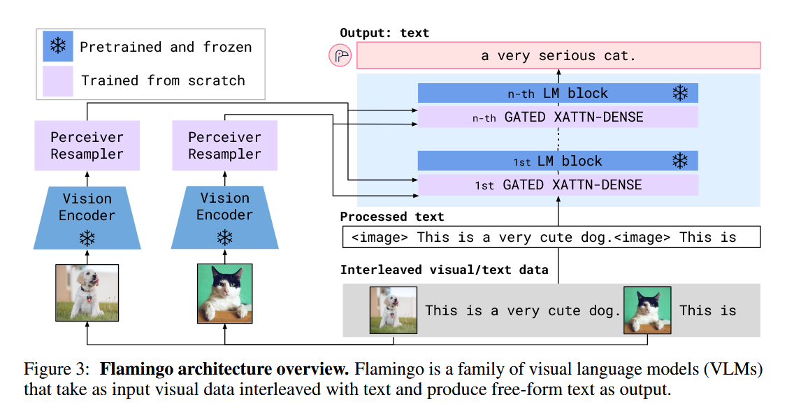
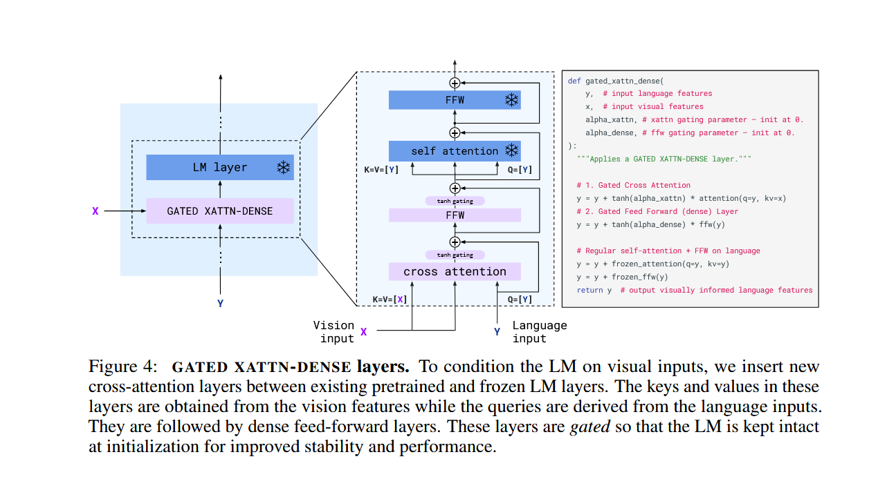

# Abstract

Target:Building models that can be rapidly adapted to novel tasks using only a handful of annotated examples is an open challenge for multimodal machine learning research.

Architectural innovations:
1. bridge powerful pretrained vision-only and language-only models;
2. handle sequences of arbitrarily interleaved visual and textual data;
3. seamlessly ingest images or videos as inputs.

# 1 Introduction

当前难点：
1. **少样本适应性差**
   在视觉和多模态任务中，还没有出现能够像 GPT-3 那样，**只依靠少量标注样本或简单提示，就能快速适应新任务**的通用模型。现有方法大多依赖大规模监督预训练 + 任务特定的微调。

2. **现有方法依赖大量数据和微调**
   多模态模型虽然取得了一些进展，但通常需要**成千上万条标注数据**才能在下游任务上表现良好，并且需要针对不同任务做精细的超参数调整，代价很高。

3. **现有模型的局限性**

   * 对比学习的 VLM（如 CLIP）虽然能零样本迁移，但只能做 **相似度匹配/分类** 这类闭集问题，不会生成语言，因此**不适合开放式任务**（如 VQA、captioning）。
   * 一些探索了“视觉条件下文本生成”的方法，在**低数据场景**下效果仍然不佳。

主要贡献：
1. **架构创新**

   * 可以处理**任意交错的图像/视频 + 文本输入**，并生成开放式输出。
   * 解决了开放式任务（captioning、VQA、visual dialogue 等）的 few-shot 学习问题。

2. **严格的性能评估**

   * 系统性地量化评估 Flamingo 在多任务 few-shot 学习中的表现；
   * 特别保留了大规模 **held-out benchmarks**（完全不参与模型设计/调参），保证了评估的**公平性和无偏性**。

3. **性能突破（SOTA）**

   * 在 **16 个任务**上达到了新的 few-shot SOTA；
   * 在其中 **6 个任务**上甚至超过了全监督微调 SOTA，但只用了 32 个样例（≈少 1000 倍标注）；
   * 若增加标注预算，还能在 **5 个额外任务**上通过 fine-tuning 刷新 SOTA。

# 2 Approach




1. **Perceiver Resampler（视觉侧 → 固定长度 token）**

   * **位置**：在 Vision Encoder（NFNet-F6）之后。
   * **作用**：把不同分辨率、不同帧数的视觉特征（可变长）压缩成 **固定数量（64 个）视觉 token**，保证跨注意力的计算规模不依赖输入分辨率。
   * **创新点**：相比直接用 Transformer/MLP，更高效且泛化性更好（后面消融实验部分会讲到）。

2. **GATED XATTN-DENSE（语言侧桥接层）**

   * **位置**：插入在若干个 **冻结的 LM Block 之间**，并不是“每一层 LM Block 前”。

     * 论文中测试了不同插入频率：每层插入最好，但代价太大；最终 Flamingo-9B 每 4 层插一次，Flamingo-80B 每 7 层插一次。
   * **作用**：通过门控跨注意力把视觉 token 注入语言流，同时保证初始化时输出与原 LM 一致，避免破坏预训练知识。



## 2.1 Visual processing and the Perceiver Resampler

Flamingo 在视觉侧的处理流程，可以分成两步：

1. **Vision Encoder（视觉编码器）**

* **模型**：NFNet-F6。
* **状态**：是 **预训练好后冻结**，不会随着 Flamingo 的训练更新参数。
* **预训练方式**：在大量图文对数据上，用 CLIP 里的**双塔对比学习目标**（Radford et al. 2021 的双项 contrastive loss）。
* **输出特征**：

  * 对图像：输出一个二维空间网格的特征图（spatial grid），最后展平为一维序列。
  * 对视频：先以 **1 FPS** 采帧，每帧独立编码，再加上**时间嵌入**，形成时空特征网格，最后展平成一维序列。

2. **Perceiver Resampler（视觉特征重采样器）**

* **动机**：

  * 图像/视频特征数量通常很大（分辨率和帧数决定），如果直接把它们输入到跨注意力里，计算复杂度过高。
  * 所以需要把**可变长的大特征图 → 固定长度的小 token 序列**。
* **做法**：

  * 学习到一组固定数量（这里是 **64 个**）的“潜在查询向量（latent queries）”。
  * 用 Transformer 结构，让这些查询向量与视觉特征 cross-attend，得到定长的视觉表示。
  * 类似于 **Perceiver** 和 **DETR** 的 latent query 机制。
* **效果**：

  * 大大降低跨注意力的计算量。
  * 实验表明，这种 resampler 比普通 Transformer 或 MLP 更有效（消融实验在 Sec 3.3）。

## 2.2 Conditioning frozen language models on visual representations

Flamingo 如何在 **冻结的** LM 端引入视觉信息。可以分成三块内容：

 1. 文本生成的主体

* 文本生成还是由一个 **Transformer Decoder** 来完成；
* 不同的是，这个解码器使用经过 Vision Encoder 编码且 Perceiver Resampler 特殊处理过的信息。

2. 如何把视觉信息接入 LM

* **LM 主体是冻结的**。
* 在它的层与层之间，**插入新的 GATED XATTN-DENSE 层**（从零训练的）。

  * 这些层通过跨注意力把视觉 token 引入语言流；
  * 每个层有一个 **tanh 门控机制**：

    $$
    y \leftarrow y + \tanh(\alpha)\cdot f(y, x)
    $$

    其中 $\alpha$ 是一个可学习的标量，初始化为 0。
  * **好处**：刚开始训练时，$\tanh(0)=0$，所以新加层几乎没有影响，输出结果等同于原始 LM → **避免破坏预训练知识**，训练更稳定；随着训练，$\alpha$ 学到合适值，视觉信息逐渐注入。
* 论文里还把这种方案和其他替代设计（如 vanilla cross-attention、GRAFTING）对比，发现 GATED XATTN-DENSE 更好。

3. 模型规模设置

* Flamingo 在不同大小的 **Chinchilla LM** 上测试：

  * **1.4B 参数 → Flamingo-3B**
  * **7B 参数 → Flamingo-9B**
  * **70B 参数 → Flamingo-80B**
* 不管多大规模，**视觉编码器 (NFNet-F6) 和 Perceiver Resampler 的大小保持不变**；参数量主要来自语言模型和插入的 GATED XATTN-DENSE 模块。

这里我们来看一下这部分的伪代码：
```python
def gated_xattn_dense( 
   y, # input language features
   x, # input visual features
   alpha_xattn, # xattn gating parameter – init at 0.
   alpha_dense, # ffw gating parameter – init at 0.
):
    """Applies a GATED XATTN-DENSE layer."""
    # 1. Gated Cross Attention
    y = y + tanh(alpha_xattn) * attention(q=y, kv=x)
    # 2. Gated Feed Forward (dense) Layer
    y = y + tanh(alpha_dense) * ffw(y)
    # Regular self-attention + FFW on language
    y = y + frozen_attention(q=y, kv=y)
    y = y + frozen_ffw(y)
    return y # output visually informed language features
```

其实就是学习四个部分：
1. cross-attention；
2. cross-attention 的门控参数 alpha_xattn；
3. FFW；
4. FFW 的门控参数 alpha_dense。

## 2.3 Multi-visual input support: per-image/video attention masking

Flamingo **如何在输入包含多张图像或多段视频时进行跨注意力建模**。核心思想是：

1. 问题背景

在交错序列 `<image> text <image> text ...` 中，每个文本 token 理论上可能看到之前所有图像的特征。

* 如果不加限制 → 每个 token 都 cross-attend 到所有历史图像 → 计算量大，也可能导致学习混乱。
* Flamingo 提出了一种 **“单图跨注意力（single-image cross-attention）”** 的掩码机制。

2. 具体做法：per-image/video attention masking

* 在计算 **文本 token → 图像特征的跨注意力矩阵**时，加了掩码：

  * **规则**：每个文本 token 只能 attend 到它**前面最近出现的一幅图像/视频**的视觉 token。
  * 例如：`<image1> caption1 <image2> caption2`

    * `caption1` 的词只看 `image1` 的特征；
    * `caption2` 的词只看 `image2` 的特征。

* **好处**：

  1. 减少计算复杂度（不用对所有历史图像做注意力）。
  2. 保持建模的因果性（text 只能看“当下相关”的视觉输入）。
  3. 避免信息泄露，结构更清晰。

3. 保证长依赖

* 虽然单个 token 只能直接看前一张图像，但**跨图像的依赖可以通过语言模型的自注意力间接传递**。
* 举例：如果文本部分提到 `<image1>` 的信息，后面 token 就能通过 self-attention 记住它，即使后续 cross-attn 只看 `<image2>`。

4. 泛化能力

* **训练时**：最多只喂 **5 张图像/视频**。
* **推理时**：可以无缝扩展到 **32 张/段**（即 32-shot few-shot setting），并且性能还能继续提升。
* **对比实验**：这种“单图 cross-attn 掩码”方案，比“允许文本 attend 所有历史图像”的方法更有效。

## 2.4 Training on a mixture of vision and language datasets

Flamingo 的**训练数据来源和训练策略**。可以分成三块：

1. 数据来源：三类多模态大规模语料（全部来自 web，非人工标注）

* **M3W (MultiModal MassiveWeb)**

  * 来自约 4300 万网页的 HTML，直接解析 **图像和文本在 DOM 中的相对位置**。
  * 构造方式：在文本中插入 `<image>` 标签表示图片位置，在前后加 `<EOC>`（end of chunk）标记。
  * 从每个文档中采样最多 256 个 token，取前 **≤5 张图像**（更多的丢弃以节省计算）。
  * 用来训练模型对“交错图文输入”的适应性，这正是 Flamingo few-shot 能力的关键。

* **Image–Text Pairs**

  * 基于 **ALIGN**（18 亿图像–alt-text 对）。
  * 自建 **LTIP (Long Text & Image Pairs)** 数据集（3.12 亿对），特点是文本更长、更高质量。

* **Video–Text Pairs (VTP)**

  * 2700 万个短视频（平均 22 秒），配套句子描述。
  * 用法与图文对保持一致，在 caption 前后分别加 `<image>` 和 `<EOC>` 标记。

2. 数据统一化处理

* 为了让不同来源的数据能统一输入模型：

  * 图像对/视频对也被转成和 M3W 相同的语法格式：`<image> caption <EOC>`。
  * 这样所有数据都可以被看作 **“交错的图像+文本”** 序列。

3. 训练目标与优化策略

* **目标函数**：

  * 对所有数据集 $D_m$，最小化加权的文本负对数似然：

    $$
    \sum_{m=1}^{M} \lambda_m \; \mathbb{E}_{(x,y)\sim D_m} \left[-\sum_{\ell=1}^L \log p(y_\ell \mid y_{<\ell}, x_{\le \ell})\right]
    $$
  * 其中 $\lambda_m$ 是每个数据集的权重。
  * 本质上就是：**条件在视觉输入上，做自回归语言建模**。

* **训练策略**：

  * 不同数据集的梯度 **累积混合**（而不是 round-robin 轮流采样），效果更好。
  * 数据集权重 $\lambda_m$ 的调优对性能至关重要。

## 2.5 Task adaptation with few-shot in-context learning

Flamingo 在 **任务适应 (task adaptation)** 阶段是如何用的：

1. 使用方式：in-context learning

* **训练完 Flamingo 之后**，它不会像传统方法那样再做任务特定的微调（fine-tuning）。
* 而是模仿 GPT-3 的做法，用 **few-shot in-context learning**：

  * 给模型一个 **多模态交错的 prompt**，里面包含几个 **支持示例 (support examples)**，形式是 `(image, text)` 或 `(video, text)`。
  * 然后再加上一个 **query visual input**（待测试的图像或视频）。
  * 模型基于这些上下文信息直接生成答案。

2. 评估方法

* **开放式任务 (open-ended)**：

  * 用 **beam search** 生成文本输出。
  * 典型任务：captioning、visual dialogue。

* **封闭式任务 (close-ended)**：

  * 不直接生成，而是用模型的 **log-likelihood** 对每个候选答案打分，选取概率最大的。
  * 典型任务：多项选择式的 VQA（Visual Question Answering）。

3. Zero-shot 设置

* 作者还测试了 **zero-shot 泛化**：

  * 给模型的 prompt 里只放 **两个文本示例**（没有配图），看它能不能在没有图像示例的情况下解决任务。

