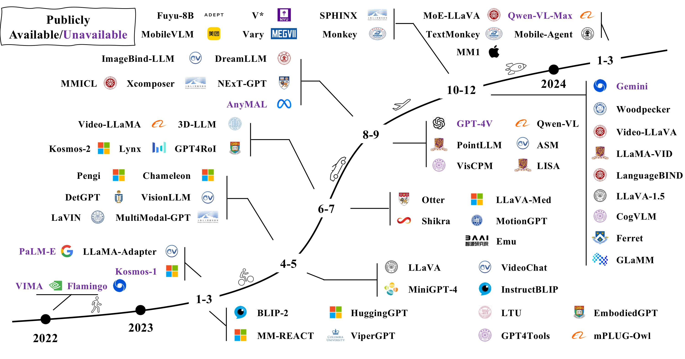
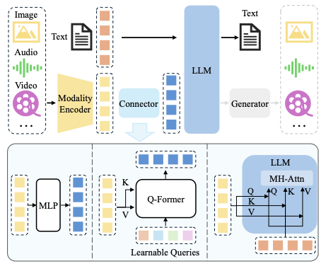
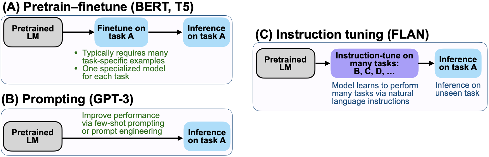

# A Survey on Multimodal Large Language Models

## 多模态大语言模型综述

**论文信息：** arXiv:2306.13549v4

**作者：** Shukang Yin*, Chaoyou Fu*†, Sirui Zhao*, Ke Li, Xing Sun, Tong Xu, Enhong Chen

**机构：** 中国科学技术大学数据科学系 & 腾讯优图实验室

**关键词：** Multimodal Large Language Model, Vision Language Model, Large Language Model

---

## 摘要

近期，以 GPT-4V 为代表的多模态大语言模型（MLLM）成为新兴研究热点，它利用强大的大语言模型（LLM）作为"大脑"来执行多模态任务。MLLM 展现出令人惊讶的涌现能力，例如根据图像编写故事和无 OCR 数学推理等，这些能力在传统多模态方法中十分罕见，暗示了通往通用人工智能的潜在路径。为此，学术界和工业界都在努力开发能够与 GPT-4V 竞争甚至超越它的 MLLM，以惊人的速度推动着研究边界。

本文旨在追踪和总结 MLLM 的最新进展。首先，介绍 MLLM 的基本形式并界定其相关概念，包括架构、训练策略与数据，以及评估方法。然后，介绍如何将 MLLM 扩展以支持更多粒度、模态、语言和场景的研究课题。接着，讨论多模态幻觉问题以及扩展技术，包括多模态上下文学习（M-ICL）、多模态思维链（M-CoT）和 LLM 辅助的视觉推理（LAVR）。最后，讨论现有挑战并指出有前景的研究方向。

GitHub：https://github.com/BradyFU/Awesome-Multimodal-Large-Language-Models

---

## 目录

- [A Survey on Multimodal Large Language Models](#a-survey-on-multimodal-large-language-models)
  - [多模态大语言模型综述](#多模态大语言模型综述)
  - [摘要](#摘要)
  - [目录](#目录)
  - [1. 引言](#1-引言)
  - [2. 架构](#2-架构)
    - [2.1 模态编码器](#21-模态编码器)
    - [2.2 预训练 LLM](#22-预训练-llm)
    - [2.3 模态接口](#23-模态接口)
      - [可学习连接器](#可学习连接器)
      - [专家模型](#专家模型)
  - [3. 训练策略与数据](#3-训练策略与数据)
    - [3.1 预训练](#31-预训练)
      - [训练细节](#训练细节)
      - [数据](#数据)
    - [3.2 指令微调](#32-指令微调)
      - [简介](#简介)
      - [训练细节](#训练细节-1)
      - [数据收集](#数据收集)
      - [数据质量](#数据质量)
    - [3.3 对齐微调](#33-对齐微调)
      - [简介](#简介-1)
      - [RLHF（基于人类反馈的强化学习）](#rlhf基于人类反馈的强化学习)
      - [DPO（直接偏好优化）](#dpo直接偏好优化)
      - [对齐微调数据集](#对齐微调数据集)
  - [4. 评估](#4-评估)
    - [4.1 封闭式评估](#41-封闭式评估)
    - [4.2 开放式评估](#42-开放式评估)
  - [5. 扩展](#5-扩展)
    - [粒度支持](#粒度支持)
    - [模态支持](#模态支持)
    - [语言支持](#语言支持)
    - [场景/任务扩展](#场景任务扩展)
  - [6. 多模态幻觉](#6-多模态幻觉)
    - [6.1 基本概念](#61-基本概念)
    - [6.2 评估方法](#62-评估方法)
    - [6.3 缓解方法](#63-缓解方法)
      - [预纠正（Pre-correction）](#预纠正pre-correction)
      - [过程纠正（In-process-correction）](#过程纠正in-process-correction)
      - [后纠正（Post-correction）](#后纠正post-correction)
  - [7. 扩展技术](#7-扩展技术)
    - [7.1 多模态上下文学习（M-ICL）](#71-多模态上下文学习m-icl)
      - [ICL 能力的提升](#icl-能力的提升)
      - [应用](#应用)
    - [7.2 多模态思维链（M-CoT）](#72-多模态思维链m-cot)
      - [学习范式](#学习范式)
      - [链配置](#链配置)
      - [生成模式](#生成模式)
    - [7.3 LLM 辅助的视觉推理（LAVR）](#73-llm-辅助的视觉推理lavr)
      - [训练范式](#训练范式)
      - [LLM 的角色](#llm-的角色)
  - [8. 挑战与未来方向](#8-挑战与未来方向)
  - [9. 结论](#9-结论)

---

## 1. 引言

近年来，LLM 取得了显著进展。通过扩大数据规模和模型规模，LLM 涌现出非凡的能力，包括指令跟随、上下文学习（ICL）和思维链（CoT）。尽管 LLM 在大多数 NLP 任务上展现了惊人的零样本/少样本推理能力，但由于只能理解离散文本，它们在视觉方面天生"失明"。与此同时，大型视觉模型（LVM）能够"看"得很清楚，但在推理方面通常表现不佳。

鉴于这种互补性，LLM 和 LVM 相向而行，催生了 **多模态大语言模型（MLLM）** 这一新领域。形式上，MLLM 指的是基于 LLM、具备接收、推理和输出多模态信息能力的模型。

在 MLLM 之前，已有大量致力于多模态的工作，可分为**判别式**和**生成式**两种范式：
- **CLIP** 是判别式的代表，将视觉和文本信息投射到统一的表示空间，为下游多模态任务搭建桥梁
- **OFA** 是生成式的代表，以序列到序列的方式统一多模态任务

MLLM 相比传统方法有两个代表性特征：
1. MLLM 基于拥有数十亿参数的 LLM，这在之前的模型中是不可用的
2. MLLM 使用新的训练范式来释放其全部潜力，例如使用多模态指令微调来鼓励模型遵循新指令

凭借这两个特征，MLLM 展现了新能力，例如根据图像编写网站代码、理解表情包的深层含义，以及无 OCR 数学推理。



*图 1：代表性 MLLM 的时间线。我们正在见证这一领域的快速增长。*

自 GPT-4 发布以来，由于其展示的惊人多模态示例，MLLM 引发了研究热潮。学术界和工业界的共同努力推动了快速发展：

1. **更好的粒度支持**：开发了更精细的用户提示控制，通过边界框支持特定区域，或通过点击支持特定对象
2. **增强的输入输出模态支持**：如图像、视频、音频和点云，NExT-GPT 等项目还支持不同模态的输出
3. **改进的语言支持**：努力将 MLLM 的成功扩展到其他语言（如中文）
4. **扩展到更多领域和使用场景**：包括医学图像理解、文档解析，以及具身智能体和 GUI 智能体等

---

## 2. 架构

一个典型的 MLLM 可以抽象为三个模块：预训练的**模态编码器**、预训练的 **LLM** 和连接它们的**模态接口**。类比人类，图像/音频编码器就像人类的眼睛/耳朵，接收和预处理光学/声学信号；LLM 像人类大脑，理解和推理处理后的信号。模态接口则负责对齐不同模态。一些 MLLM 还包括生成器，用于输出文本以外的其他模态。



*图 2：典型 MLLM 架构示意图。它包括编码器、连接器和 LLM。可选的生成器可以附加到 LLM 上以生成文本之外的更多模态。编码器接收图像、音频或视频并输出特征，这些特征经连接器处理后让 LLM 更好地理解。连接器大致分为三类：基于投影的、基于查询的和基于融合的。前两种采用 token 级融合，将特征处理为 token 与文本 token 一起发送；最后一种在 LLM 内部实现特征级融合。*

### 2.1 模态编码器

编码器将原始信息（如图像或音频）压缩为更紧凑的表示。通常使用已与其他模态对齐的预训练编码器，而非从头训练。例如，CLIP 通过大规模图像-文本对预训练，将视觉编码器与文本进行语义对齐。

**常用图像编码器：**

| 变体 | 预训练语料 | 分辨率 | 样本数 (B) | 参数量 (M) |
|------|-----------|--------|-----------|-----------|
| OpenCLIP-ConvNext-L | LAION-2B | 320 | 29 | 197.4 |
| CLIP-ViT-L/14 | OpenAI's WIT | 224/336 | 13 | 304.0 |
| EVA-CLIP-ViT-G/14 | LAION-2B, COYO-700M | 224 | 11 | 1000.0 |
| OpenCLIP-ViT-G/14 | LAION-2B | 224 | 34 | 1012.7 |
| OpenCLIP-ViT-bigG/14 | LAION-2B | 224 | 34 | 1844.9 |

在选择编码器时，需考虑分辨率、参数规模和预训练语料等因素。许多研究实证验证了，使用更高分辨率可以获得显著的性能提升。提升输入分辨率的方法可分为：

- **直接缩放**：将更高分辨率的图像输入编码器，通常需要进一步微调编码器。CogAgent 使用双编码器机制，两个编码器分别处理高分辨率和低分辨率图像，通过交叉注意力将高分辨率特征注入低分辨率分支
- **分块方法**：将高分辨率图像切成小块，重用低分辨率编码器。例如 Monkey 和 SPHINX 将大图像分割成更小的块，并将子图像与下采样的高分辨率图像一起发送给图像编码器

其他模态也有类似的编码器。例如 Pengi 使用 CLAP 模型作为音频编码器；ImageBind-LLM 使用 ImageBind 编码器，支持编码图像、文本、音频、深度、热像和 IMU 数据。

### 2.2 预训练 LLM

与其从头训练 LLM，不如从预训练的 LLM 开始。通过在网络语料上进行海量预训练，LLM 已嵌入丰富的世界知识，并展现出强大的泛化和推理能力。

**常用开源 LLM：**

| 模型 | 发布日期 | 预训练数据规模 | 参数量 (B) | 语言支持 | 架构 |
|------|---------|--------------|-----------|---------|------|
| Flan-T5-XL/XXL | 2022-10 | - | 3/11 | en, fr, de | Encoder-Decoder |
| LLaMA | 2023-02 | 1.4T tokens | 7/13/33/65 | en | Causal Decoder |
| Vicuna | 2023-03 | 1.4T tokens | 7/13/33 | en | Causal Decoder |
| LLaMA-2 | 2023-07 | 2T tokens | 7/13/70 | en | Causal Decoder |
| Qwen | 2023-09 | 3T tokens | 1.8/7/14/72 | en, zh | Causal Decoder |

值得注意的是，扩大 LLM 参数规模也能带来额外收益。Liu 等人发现，仅将 LLM 从 7B 扩展到 13B 就能在各种基准上带来全面提升。更进一步，使用 34B LLM 时，模型展现出涌现的零样本中文能力——即使训练时只使用了英语多模态数据。

也有研究使用较小的 LLM 以方便部署在移动设备上。例如 MobileVLM 系列使用缩小版的 LLaMA（MobileLLaMA 1.4B/2.7B），能在移动处理器上进行高效推理。

近期，混合专家（MoE）架构也受到越来越多关注。与密集模型相比，稀疏架构通过选择性激活参数，在不增加计算成本的情况下扩大总参数规模。

### 2.3 模态接口

由于 LLM 只能感知文本，因此需要弥合自然语言与其他模态之间的差距。

#### 可学习连接器

根据多模态信息的融合方式，大致有两种实现方式：**token 级融合**和**特征级融合**。

**Token 级融合：** 编码器输出的特征被转换为 token，与文本 token 拼接后发送给 LLM。

- **基于查询（Q-Former 风格）**：利用一组可学习的查询 token 以查询方式提取信息，首先在 BLIP-2 中实现，随后被大量工作继承。这种方法将视觉 token 压缩为较少数量的表示向量
- **基于投影（MLP 风格）**：简单使用 MLP 接口来弥合模态差距。例如 LLaVA 系列采用一/两层线性 MLP 来投影视觉 token 并对齐特征维度与词嵌入

MM1 的消融实验发现，对于 token 级融合，模态适配器的类型远不如视觉 token 数量和输入分辨率重要。

**特征级融合：** 插入额外模块以实现文本特征和视觉特征的深层交互和融合。

- **Flamingo**：在 LLM 冻结的 Transformer 层之间插入额外的交叉注意力层，用外部视觉线索增强语言特征
- **CogVLM**：在每个 Transformer 层中插入视觉专家模块，实现视觉和语言特征的双向交互和融合
- **LLaMA-Adapter**：将可学习提示引入 Transformer 层，这些提示首先嵌入视觉知识，然后与文本特征拼接作为前缀

在参数规模方面，可学习接口通常只占编码器和 LLM 的一小部分。以 Qwen-VL 为例，Q-Former 参数约 0.08B，不到总参数的 1%，而编码器和 LLM 分别约占 19.8%（1.9B）和 80.2%（7.7B）。

#### 专家模型

除了可学习接口，使用专家模型（如图像描述模型）也是弥合模态差距的可行方式。基本思想是将多模态输入无需训练即转换为语言，这样 LLM 就可以通过转换后的语言理解多模态信息。例如，VideoChat-Text 使用预训练视觉模型提取视觉信息（如动作），并使用语音识别模型丰富描述。

但使用专家模型可能不如可学习接口灵活——将其他模态转换为文本会导致信息丢失。例如，将视频转换为文本描述会扭曲时空关系。

---

## 3. 训练策略与数据

一个完善的 MLLM 需要经历三个阶段的训练：**预训练**、**指令微调**和**对齐微调**。每个阶段需要不同类型的数据并实现不同的目标。

### 3.1 预训练

#### 训练细节

作为第一个训练阶段，预训练主要旨在**对齐不同模态**和**学习多模态世界知识**。预训练阶段通常需要大规模文本配对数据，如图像描述数据。

以训练 MLLM 对齐视觉与文本的常见场景为例：给定一张图像，模型被训练以自回归方式预测图像的描述，使用标准交叉熵损失。

常见的预训练方法是保持预训练模块（如视觉编码器和 LLM）冻结，仅训练可学习接口。这一思想是在不丢失预训练知识的情况下对齐不同模态。一些方法也会解冻更多模块（如视觉编码器）以启用更多可训练参数。

**预训练数据模板：**

```
Input: <image>
Response: {caption}
```

> 注：`<image>` 是视觉 token 的占位符，`{caption}` 是图像的描述。只有描述部分用于损失计算。

#### 数据

预训练数据主要服务于两个目的：(1) 对齐不同模态；(2) 提供世界知识。根据粒度可分为粗粒度和细粒度数据。

**粗粒度描述数据**的共同特征：
1. 数据量大，样本通常来自互联网
2. 由于网络爬取的性质，描述通常简短且有噪声

**常用预训练数据集：**

| 数据集 | 样本数 | 日期 |
|--------|--------|------|
| **粗粒度图像-文本** | | |
| CC-3M | 3.3M | 2018 |
| CC-12M | 12.4M | 2020 |
| SBU Captions | 1M | 2011 |
| LAION-5B | 5.9B | 2022-03 |
| LAION-2B | 2.3B | 2022-03 |
| LAION-COCO | 600M | 2022-09 |
| COYO-700M | 747M | 2022-08 |
| **细粒度图像-文本** | | |
| ShareGPT4V-PT | 1.2M | 2023-11 |
| LVIS-Instruct4V | 111K | 2023-11 |
| ALLaVA | 709K | 2024-02 |
| **视频-文本** | | |
| MSR-VTT | 200K | 2016 |
| **音频-文本** | | |
| WavCaps | 24K | 2023-03 |

**代表性数据集介绍：**

- **CC（Conceptual Captions）**：CC-3M 包含 330 万图像-描述对，原始描述来自网页图像的 alt-text。通过复杂流水线清洗数据。CC-12M 是 CC-3M 的后续工作，放宽了数据收集管线，收集了 1240 万对
- **SBU Captions**：包含 100 万图像-文本对，图像和描述来自 Flickr
- **LAION**：大规模网络数据集。LAION-5B 包含 58.5 亿图像-文本对；LAION-COCO 包含 6 亿图像，描述由 BLIP 生成，CLIP 选择最佳匹配
- **COYO-700M**：从 CommonCrawl 提取的 7.47 亿图像-文本对

近期，更多研究通过提示强大的 MLLM（如 GPT-4V）生成高质量细粒度数据。这些数据包含更长、更准确的图像描述，实现更细粒度的图像-文本模态对齐。但成本更高，数据量也相对较小。ShareGPT4V 通过先用 GPT-4V 生成 10 万数据训练描述器，再将数据量扩展到 120 万来取得平衡。

### 3.2 指令微调

#### 简介

**指令**指的是对任务的描述。直觉上，指令微调旨在教模型更好地理解用户的指令并完成所需任务。通过这种方式微调，LLM 可以通过遵循新指令来泛化到未见过的任务，从而提升零样本性能。



*图 3：三种典型学习范式的比较。左：监督微调，需要大量任务特定数据训练任务特定模型。中：提示方法，减少对大规模数据的依赖，但零样本性能一般。右：指令微调，学习如何泛化到未见过的任务。*

#### 训练细节

多模态指令样本通常包括可选的指令和输入-输出对。指令是描述任务的自然语言句子（如"详细描述这张图像。"），输入可以是图像-文本对（如 VQA 任务）或仅图像（如图像描述任务），输出是基于输入对指令的回答。

**指令数据模板：**

```
Below is an instruction that describes a task. Write a response that 
appropriately completes the request

Instruction: <instruction>
Input: {<image>, <text>}
Response: <output>
```

形式化地，多模态指令样本可以表示为三元组 $(\mathcal{I}, \mathcal{M}, \mathcal{R})$，分别代表指令、多模态输入和标准答案。训练目标是标准的自回归目标：

$$\mathcal{L}(\theta) = -\sum_{i=1}^{N} \log p(\mathcal{R}_i|\mathcal{I}, \mathcal{R}_{<i}; \theta)$$

#### 数据收集

三种典型的指令数据获取方式：

**1. 数据适配（Data Adaptation）**

利用现有高质量的任务特定数据集构建指令格式的数据集。例如将 VQA 数据集转换：原始的输入-输出对自然构成指令样本的多模态输入和响应，指令（即任务描述）可以来自手工设计或借助 GPT 的半自动生成。

**VQA 数据集的指令模板示例：**
- `<Image> {Question}`
- `<Image> Question: {Question}`
- `<Image> Given the image, answer the following question with no more than three words. {Question}`
- `<Image> Based on the image, respond to this question with a short answer: {Question}. Answer:`

由于现有 VQA 和描述数据集的答案通常简短，直接使用可能限制 MLLM 的输出长度。两种常见策略：
- 在指令中明确指定（如声明"简短"和"简洁"）
- 扩展现有答案的长度（如 M³IT 通过提示 ChatGPT 重写答案）

**2. 自指令（Self-Instruction）**

利用 LLM 生成文本指令跟随数据。LLaVA 将此方法扩展到多模态领域：将图像转换为描述和边界框文本，提示纯文本 GPT-4 生成新数据。由此构建了 LLaVA-Instruct-150k 数据集。后续工作如 MiniGPT-4、ChatBridge 等开发了针对不同需求的数据集。

**自指令生成的代表性数据集：**

| 数据集 | 样本数 | 模态 | 来源 | 构成 |
|--------|--------|------|------|------|
| LLaVA-Instruct | 158K | I+T→T | MS-COCO | 23K 描述 + 58K 多轮 QA + 77K 推理 |
| LVIS-Instruct | 220K | I+T→T | LVIS | 110K 描述 + 110K 多轮 QA |
| ALLaVA | 1.4M | I+T→T | VFlan, LAION | 709K 描述 + 709K 单轮 QA |
| Video-ChatGPT | 100K | V+T→T | ActivityNet | 7K 描述 + 4K 多轮 QA |
| VideoChat | 11K | V+T→T | WebVid | 描述 + 摘要 + 创作 |
| Clotho-Detail | 3.9K | A+T→T | Clotho | 描述 |

**3. 数据混合（Data Mixture）**

除了多模态指令数据外，纯语言的用户-助手对话数据也可以用于提高对话能力和指令跟随能力。LaVIN 通过从纯语言和多模态数据中随机采样直接构建 minibatch。MultiInstruct 探索了混合指令微调和顺序指令微调等不同策略。

#### 数据质量

近期研究表明，指令微调样本的数据质量不亚于数量的重要性。两个重要方面：

- **提示多样性**：指令的多样性对模型性能至关重要。Lynx 实证验证了多样的提示有助于提高模型性能和泛化能力
- **任务覆盖**：在训练数据涉及的任务方面，视觉推理任务优于描述和 QA 任务，且增强指令复杂性可能比增加任务多样性和加入细粒度空间标注更有益

### 3.3 对齐微调

#### 简介

对齐微调更常用于需要将模型与特定人类偏好对齐的场景，例如减少幻觉的回复。目前主要有两种技术：**RLHF** 和 **DPO**。

#### RLHF（基于人类反馈的强化学习）

RLHF 利用强化学习算法将 LLM 与人类偏好对齐，以人类标注作为训练循环中的监督。包含三个关键步骤：

**步骤 1：监督微调。** 微调预训练模型以呈现初步的期望输出行为，得到"策略模型"。

**步骤 2：奖励建模。** 使用偏好对训练奖励模型。给定多模态提示 $x$ 和响应对 $(y_w, y_l)$，奖励模型 $r_\theta$ 学习给偏好响应 $y_w$ 更高的奖励：

$$\mathcal{L}(\theta)=-\mathbb{E}_{(x,y_w,y_l)\sim \mathcal{D}} \left[ \log (\sigma(r_\theta (x, y_w) - r_\theta(x, y_l)) \right]$$

**步骤 3：强化学习。** 使用 PPO 算法优化 RL 策略模型，添加 KL 惩罚以避免偏离原始策略：

$$\mathcal{L}(\phi) = -\mathbb{E}_{x\sim \mathcal{D}, y\sim \pi^{RL}_{\phi}(y|x)} \Big[ r_\theta(x,y) - \beta\cdot \mathbb{D}_{KL}\Big(\pi^{RL}_{\phi}(y|x) || \pi^{REF}(y|x)\Big) \Big]$$

例如，LLaVA-RLHF 收集人类偏好数据，基于 LLaVA 微调出幻觉更少的模型。

#### DPO（直接偏好优化）

DPO 利用简单的二元分类损失从人类偏好标签中学习。相比 RLHF，DPO 无需学习显式奖励模型，将整个流程简化为两步：偏好数据收集和偏好学习。学习目标为：

$$\mathcal{L}(\phi) = -\mathbb{E}_{(x,y_w,y_l)\sim \mathcal{D}} \Big[ \log \sigma\Big( \beta \log \frac{\pi_\phi^{RL}(y_w|x)}{\pi^{REF}(y_w|x)} - \beta \log \frac{\pi_\phi^{RL}(y_l|x)}{\pi^{REF}(y_l|x)} \Big)\Big]$$

- **RLHF-V**：收集细粒度（段级）偏好数据对，通过纠正模型响应中的幻觉，使用获得的数据进行密集 DPO
- **Silkie**：通过提示 GPT-4V 收集偏好数据，并通过 DPO 将偏好监督蒸馏到指令微调模型中

#### 对齐微调数据集

| 数据集 | 样本数 | 模态 | 来源 |
|--------|--------|------|------|
| LLaVA-RLHF | 10K | I+T→T | 人类 |
| RLHF-V | 5.7K | I+T→T | 人类 |
| VLFeedback | 380K | I+T→T | GPT-4V |

---

## 4. 评估

评估是开发 MLLM 的重要环节，它为模型优化提供反馈并帮助比较不同模型的性能。MLLM 的评估相比传统多模态模型有几个新特点：(1) MLLM 通常是多功能的，需要全面评估；(2) MLLM 展现许多涌现能力，需要新的评估方案。

根据问题类型，可分为**封闭式**和**开放式**两类。

### 4.1 封闭式评估

封闭式问题的答案选项是预定义且有限的。评估通常在任务特定数据集上进行，响应可由基准指标自然判断。评估设置通常为零样本或微调。

一些专门为 MLLM 设计的新基准：
- **MME**：综合评估基准，包含 14 个感知和认知任务。所有指令-答案对均手工设计以避免数据泄漏
- **MMBench**：评估模型多维能力，使用 ChatGPT 将开放回答与预定义选项匹配
- **Video-ChatGPT** 和 **Video-Bench**：专注于视频领域
- **POPE**：评估幻觉程度的专用方法

### 4.2 开放式评估

开放式问题的回答更灵活，MLLM 通常充当聊天机器人角色。判断标准分为：

- **人工评分**：人工评估生成的回答。例如 mPLUG-Owl 收集视觉相关评估集来判断图像理解、图表和流程图理解等能力
- **GPT 评分**：使用 GPT 进行评分以替代费时费力的人工评估。LLaVA 提出通过纯文本 GPT-4 从不同方面（如有用性和准确性）评分。纯文本 GPT-4 的局限在于无法直接访问图像，后续使用 GPT-4V 的评估更为准确
- **案例研究**：通过案例研究比较不同 MLLM 的能力

---

## 5. 扩展

近期研究在扩展 MLLM 能力方面取得了重大进展：

### 粒度支持

在**输入侧**，支持更精细控制的模型逐步发展，从图像到区域（边界框）再到像素级别：
- **Shikra**：支持区域级输入和理解，用户通过自然语言形式的边界框引用特定区域
- **Ferret**：支持更灵活的指代，包括点、框和草图等不同形式的提示
- **Osprey**：利用分割模型（SAM）支持点输入，单击即可指定单个实体

在**输出侧**，接地能力也相应提升：
- **Shikra**：支持图像接地的带框标注回复
- **LISA**：支持掩码级理解和推理，实现像素级接地

### 模态支持

- **输入侧**：扩展支持 3D 点云等更多模态
- **输出侧**：扩展生成图像、音频和视频等多模态响应。例如 **NExT-GPT** 支持文本、图像、音频和视频的混合输入输出，借助扩散模型附加到 MLLM 上

### 语言支持

当前模型主要是单语的。一些工作致力于开发多语言模型：
- **VisCPM**：通过多阶段训练方案，以英语为枢纽语言，利用预训练的双语 LLM 将多模态能力迁移到中文
- **Qwen-VL**：基于双语 LLM Qwen 开发，在预训练期间混入中文数据（占总数据量的 22.7%）以保持双语能力

### 场景/任务扩展

- **移动端部署**：MobileVLM 探索开发小型 MLLM 变体，使用更小的 LLM 和量化技术
- **GUI 智能体**：CogAgent、AppAgent、Mobile-Agent 等专为图形用户界面设计
- **文档理解**：mPLUG-DocOwl 利用各种文档级数据增强无 OCR 文档理解能力；TextMonkey 加入位置相关任务减少幻觉
- **医学领域**：LLaVA-Med 将医学知识注入 LLaVA，开发专门的医学图像理解和问答助手

---

## 6. 多模态幻觉

多模态幻觉是指 MLLM 生成的回复与图像内容不一致的现象。这是一个基本而重要的问题，受到越来越多的关注。

### 6.1 基本概念

当前研究将多模态幻觉分为三类：

1. **存在性幻觉**：最基本的形式，模型错误地声称图像中存在某些对象
2. **属性幻觉**：以错误方式描述某些对象的属性，如无法正确识别狗的颜色
3. **关系幻觉**：更复杂的类型，指对对象间关系的错误描述，如相对位置和交互

### 6.2 评估方法

- **CHAIR**：早期指标，评估开放式描述中的幻觉水平，衡量包含幻觉对象的句子比例
- **POPE**：评估封闭式选择的方法，通过二元选择提示查询特定对象是否存在，使用关键词检测机制将开放回答转换为封闭式选择
- **MME**：提供更全面的评估，涵盖存在性、数量、位置和颜色等方面
- **HaELM**：使用纯文本 LLM 作为评判者来自动判断描述是否正确
- **Woodpecker**：使用 GPT-4V 直接基于图像评估模型回复
- **FaithScore**：更细粒度的指标，将描述性子句拆解并逐一评估
- **AMBER**：无需 LLM 的基准，包含判别和生成任务，涉及三种幻觉类型

### 6.3 缓解方法

根据高层思想，当前方法可分为三类：

#### 预纠正（Pre-correction）

收集专门数据（如负例数据）进行微调，生成幻觉更少的模型。

- **LRV-Instruction**：引入视觉指令微调数据集，除常见正例指令外，还包含不同语义层级的精心设计的负例指令
- **LLaVA-RLHF**：收集人类偏好对，使用强化学习技术微调模型

#### 过程纠正（In-process-correction）

在架构设计或特征表示方面进行改进，探索幻觉原因并设计相应的缓解方法。

- **HallE-Switch**：假设存在性幻觉来自未被视觉编码器接地的对象（实际是基于 LLM 嵌入知识推断的），引入连续控制因子来控制推理时模型输出中的"想象"程度
- **VCD**：指出对象幻觉来自训练语料中的统计偏差和 LLM 中嵌入的强语言先验。设计放大-对比解码方案来抵消错误偏差
- **HACL**：研究视觉和语言的嵌入空间，设计对比学习方案拉近配对的跨模态表示，同时推开非幻觉和幻觉文本表示

#### 后纠正（Post-correction）

以事后补救的方式缓解幻觉，在输出生成后纠正幻觉。

- **Woodpecker**：无需训练的通用幻觉纠正框架，利用专家模型补充图像上下文信息，通过流水线逐步纠正幻觉。方法可解释，中间结果可检查
- **LURE**：训练专用修正器，掩盖描述中不确定性高的对象并重新生成回复

---

## 7. 扩展技术

### 7.1 多模态上下文学习（M-ICL）

ICL 是 LLM 的重要涌现能力之一。ICL 有两个优点：
1. 不同于从大量数据中学习隐式模式的传统监督学习范式，ICL 的关键在于**从类比中学习**——从少量示例和可选指令中学习，以少样本方式解决复杂和未见过的任务
2. ICL 通常以**无需训练**的方式实现，可在推理阶段灵活集成到不同框架中

在 MLLM 的背景下，ICL 被扩展到更多模态，产生了**多模态 ICL（M-ICL）**。通过在原始样本中添加演示集（即上下文样本集）来实现。

**M-ICL 查询模板：**

```
<BOS> Below are some examples and an instruction that describes a task.

### Instruction: {instruction}
### Image: <image>
### Response: {response}

### Image: <image>
### Response: {response}

---（以上为上下文示例）---

### Image: <image>
### Response: <EOS>
```

#### ICL 能力的提升

- **MIMIC-IT**：将上下文学习与指令微调结合，构建多模态上下文格式的指令数据集
- **Emu**：引入额外模态的生成和相应训练语料，借助视觉解码器（Stable Diffusion）支持图像形式的回复
- **Link-context learning**：通过对比训练方案加强图像-标签对之间的因果联系
- **MMICL**：增强对多张相关图像的推理能力

#### 应用

M-ICL 主要用于两个场景：
1. **解决各种视觉推理任务**：从少量任务特定示例中学习并泛化到相似的新问题
2. **教 LLM 使用外部工具**：工具使用示例更细粒度，通常包含可依次执行的步骤链

### 7.2 多模态思维链（M-CoT）

CoT 是"一系列中间推理步骤"，在复杂推理任务中被证明是有效的。主要思想是提示 LLM 不仅输出最终答案，还输出导向答案的推理过程，类似于人类的认知过程。

#### 学习范式

获取 M-CoT 能力大致有三种方式：

1. **微调**：构建特定数据集进行 M-CoT 学习。例如 ScienceQA 构建带有讲解和解释的科学问答数据集；Multimodal-CoT 以两步方式生成输出（推理依据 + 最终答案）
2. **少样本学习**：需要手工制作一些上下文示例，使模型更容易学会逐步推理
3. **零样本学习**：不需要任何特定示例，通过设计指令（如"Let's think frame by frame"）利用模型嵌入的知识和推理能力

#### 链配置

- **结构**：单链（广泛使用的逐步推理过程形成单一的问题-依据-答案链）和**树形**（DDCoT 将问题分解为多个子问题）
- **长度**：自适应（LLM 自行决定何时停止推理链）和预定义（以预设长度停止）

#### 生成模式

- **填充模式**：在上下文之间推导步骤以填补逻辑空白
- **预测模式**：给定条件（如指令和先前推理历史）延伸推理链

### 7.3 LLM 辅助的视觉推理（LAVR）

一些研究探索了调用外部工具或视觉基础模型来完成视觉推理任务。以 LLM 作为不同角色的辅助者，构建任务特定或通用的视觉推理系统。

与传统视觉推理模型相比，这些系统具有几个优点：
1. **强泛化能力**：凭借大规模预训练学到的丰富开放世界知识，轻松泛化到未见对象或概念
2. **涌现能力**：借助 LLM 的强推理能力执行复杂任务（如解释一个表情包为什么有趣）
3. **更好的交互性和控制性**：以用户友好界面进行精细控制

#### 训练范式

- **无需训练**：冻结预训练模型，直接提示 LLM。分为少样本模型（使用少量手工上下文示例指导生成程序或执行步骤）和零样本模型（直接利用 LLM 的语言/语义知识）
- **微调**：进一步微调以提高工具使用的规划能力或定位能力

#### LLM 的角色

1. **LLM 作为控制器**：充当中央控制器，(1) 将复杂任务分解为更简单的子任务/步骤，(2) 将这些任务分配给适当的工具/模块。例如 VisProg 提示 GPT-3 输出视觉程序，每行调用一个模块执行子任务

2. **LLM 作为决策者**：以多轮迭代方式解决复杂任务。职责包括：(1) 总结当前上下文和历史信息，决定当前步骤的可用信息是否足够；(2) 组织和总结答案以友好方式呈现

3. **LLM 作为语义精炼器**：主要利用 LLM 丰富的语言和语义知识，将信息整合为连贯流畅的自然语言句子，或根据不同的特定需求生成文本

---

## 8. 挑战与未来方向

MLLM 的发展仍处于初级阶段，有很大的改进空间：

1. **长上下文处理**：当前 MLLM 处理长上下文多模态信息的能力有限，这限制了长视频理解、图文交错长文档等高级模型的发展

2. **复杂指令跟随**：MLLM 应升级以遵循更复杂的指令。目前生成高质量问答对数据的主流方法仍是提示闭源 GPT-4V，因为其他模型通常难以实现其先进的指令跟随能力

3. **M-ICL 和 M-CoT 技术改进**：当前对这两种技术的研究仍处于初级阶段，MLLM 的相关能力较弱。探索底层机制和潜在改进很有前景

4. **具身智能体**：基于 MLLM 开发能与真实世界交互的具身智能体是热门话题，这需要模型具备感知、推理、规划和执行等关键能力

5. **安全问题**：与 LLM 类似，MLLM 容易受到精心设计的攻击，可能被误导输出有偏见或不良的回复。提高模型安全性将是重要课题

---

## 9. 结论

本文对现有 MLLM 文献进行了综述，提供了其主要方向的广阔视角，包括基本方法和相关扩展。此外，还强调了当前需要填补的研究空白并指出了一些有前景的研究方向。希望本综述能为读者提供 MLLM 当前进展的清晰图景并激发更多研究工作。
