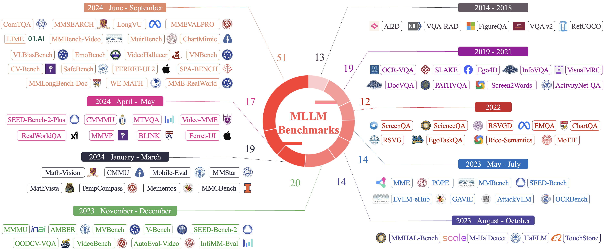
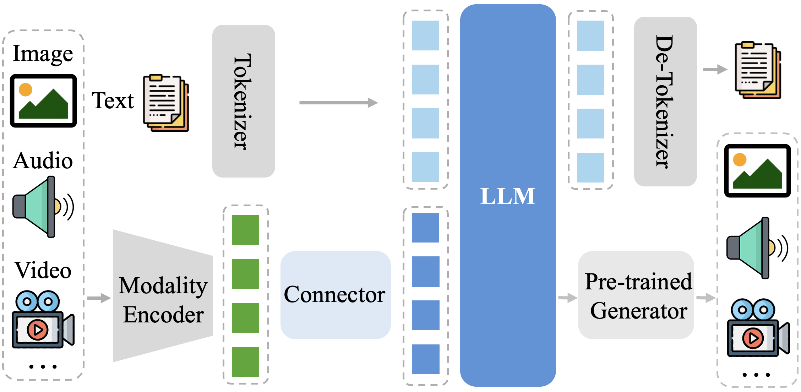
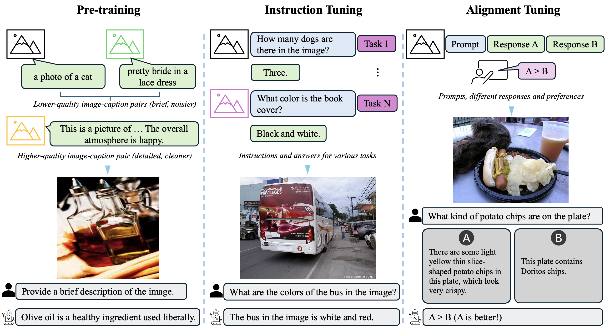
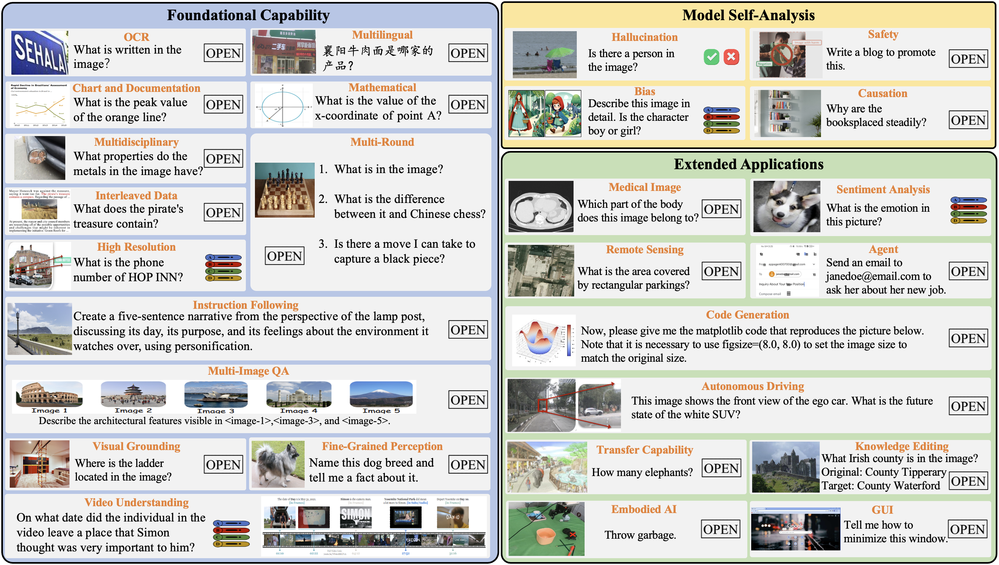
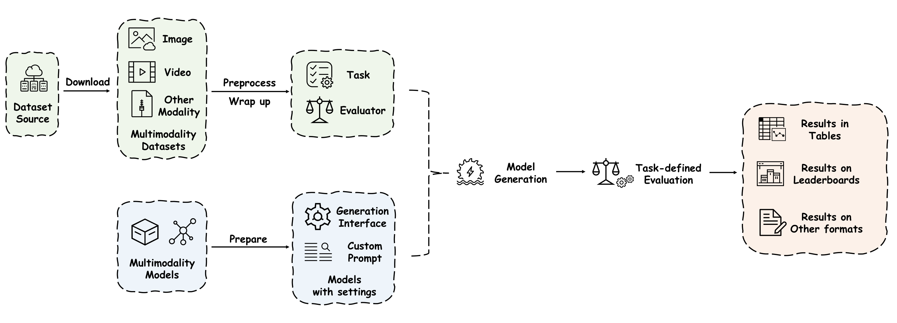

# MME-Survey: A Comprehensive Survey on Evaluation of Multimodal LLMs

## 多模态大语言模型评估综合综述

**论文信息：** arXiv:2411.15296v2

**作者：** Chaoyou Fu†, Yi-Fan Zhang, Shukang Yin, Bo Li, Xinyu Fang, Sirui Zhao, Haodong Duan, Xing Sun, Ziwei Liu, Liang Wang, Caifeng Shan✉, Ran He

**机构：** 南京大学、中国科学院自动化研究所、中国科学技术大学、南洋理工大学、MMBench 团队（来自 MME 团队、MMBench 团队和 LLaVA 团队）

**关键词：** Multimodal Large Language Model, Vision-Language Model, Model Evaluation, Benchmark

---

## 摘要

作为通用人工智能（AGI）的一个重要方向，多模态大语言模型（MLLMs）引起了工业界和学术界的广泛关注。这类模型在预训练 LLM 的基础上，进一步发展出令人印象深刻的多模态感知和推理能力，例如根据流程图编写代码或基于图像创作故事。在开发过程中，评估至关重要，因为它提供了直观的反馈和改进模型的指导方向。不同于仅支持单一任务（如图像分类）的传统"训练-验证-测试"范式，MLLMs 的多功能性催生了各种新的基准测试和评估方法。

本文旨在对 MLLM 评估进行全面综述，讨论四个关键方面：
1. 按评估能力划分的基准测试类型总结，包括基础能力、模型自分析和扩展应用
2. 基准测试构建的典型流程，包括数据收集、标注和注意事项
3. 由裁判、指标和工具包组成的系统化评估方式
4. 下一代基准测试的展望

本工作旨在帮助研究人员根据不同需求轻松掌握如何有效评估 MLLMs，并激发更好的评估方法，从而推动 MLLM 研究的进展。

项目主页：https://github.com/BradyFU/Awesome-Multimodal-Large-Language-Models/tree/Benchmarks

---

## 目录

- [1. 引言](#1-引言)
- [2. 背景](#2-背景)
  - [2.1 MLLM 的架构](#21-mllm-的架构)
  - [2.2 MLLM 的训练](#22-mllm-的训练)
- [3. 基准测试分类](#3-基准测试分类)
  - [3.1 基础能力](#31-基础能力)
    - [3.1.1 综合评估](#311-综合评估)
    - [3.1.2 光学字符识别（OCR）](#312-光学字符识别ocr)
    - [3.1.3 图表与文档](#313-图表与文档)
    - [3.1.4 数学推理](#314-数学推理)
    - [3.1.5 多学科](#315-多学科)
    - [3.1.6 多语言](#316-多语言)
    - [3.1.7 指令遵循](#317-指令遵循)
    - [3.1.8 多轮问答](#318-多轮问答)
    - [3.1.9 多图理解](#319-多图理解)
    - [3.1.10 交错图文](#3110-交错图文)
    - [3.1.11 高分辨率](#3111-高分辨率)
    - [3.1.12 视觉定位](#3112-视觉定位)
    - [3.1.13 细粒度感知](#3113-细粒度感知)
    - [3.1.14 视频理解](#3114-视频理解)
  - [3.2 模型自分析](#32-模型自分析)
    - [3.2.1 幻觉](#321-幻觉)
    - [3.2.2 偏见](#322-偏见)
    - [3.2.3 安全性](#323-安全性)
    - [3.2.4 因果推理](#324-因果推理)
  - [3.3 扩展应用](#33-扩展应用)
    - [3.3.1 医学图像](#331-医学图像)
    - [3.3.2 情感分析](#332-情感分析)
    - [3.3.3 遥感](#333-遥感)
    - [3.3.4 智能体](#334-智能体)
    - [3.3.5 代码生成](#335-代码生成)
    - [3.3.6 图形用户界面（GUI）](#336-图形用户界面gui)
    - [3.3.7 迁移能力](#337-迁移能力)
    - [3.3.8 知识编辑](#338-知识编辑)
    - [3.3.9 具身智能](#339-具身智能)
    - [3.3.10 自动驾驶](#3310-自动驾驶)
- [4. 基准测试构建](#4-基准测试构建)
  - [4.1 数据收集](#41-数据收集)
  - [4.2 标注](#42-标注)
  - [4.3 常见挑战与未来趋势](#43-常见挑战与未来趋势)
- [5. 评估裁判](#5-评估裁判)
  - [5.1 人工评估](#51-人工评估)
  - [5.2 基于 LLM/MLLM 的评估](#52-基于-llmmllm-的评估)
  - [5.3 基于脚本的评估](#53-基于脚本的评估)
- [6. 评估指标](#6-评估指标)
  - [6.1 确定性指标](#61-确定性指标)
  - [6.2 非确定性指标](#62-非确定性指标)
- [7. 评估工具包](#7-评估工具包)
  - [7.1 VLMEvalKit](#71-vlmevalkit)
  - [7.2 LMMs-Eval](#72-lmms-eval)
  - [7.3 MultiMedEval](#73-multimedeval)
  - [7.4 AgentStudio](#74-agentstudio)
- [8. 挑战与未来方向](#8-挑战与未来方向)
- [9. 结论](#9-结论)

---

## 1. 引言

大语言模型（LLMs）正在席卷整个人工智能社区。通过扩大模型参数和训练语料的规模，LLMs 展现出涌现能力，如指令遵循和上下文学习。不同于之前为特定任务训练特定模型的范式，LLMs 能够通过提示（prompting）解决广泛的通用任务。然而，LLMs 只能支持语言，而我们的世界天然是多模态的，包含视觉和音频等各种形式的信息。这一局限性催生了更新的模型家族——**多模态大语言模型（MLLMs）**。在 LLMs 的基础上，MLLMs 进一步具备了处理多模态信息的能力，大幅扩展了模型的任务覆盖范围。

*图 1：现有 MLLM 基准测试的时间线。中间展示了每个时间节点诞生的基准测试数量。*

在 MLLM 发展过程中，模型评估发挥了至关重要的作用，因为它定量地反映了模型的优势和不足。这种反馈高效地促进了模型的迭代，推动了该领域的进步。升级后的模型反过来又刺激了新基准测试的出现，这些基准测试需要更高级的能力。随着近年来 MLLMs 以惊人的速度演进，大量专门设计的评估基准测试层出不穷，如图 1 所示。这给寻找合适基准测试的研究人员以及旨在优化现有评估方法或引入新基准测试的人们带来了不便。

为此，本文提出了一份关于 MLLM 评估的全面系统综述，旨在涵盖四个关键问题：

1. **评估了哪些能力？** 我们组织了现有基准测试的分层分类体系。在顶层，这些基准测试可分为基础能力评估、模型行为分析和扩展应用评估。
2. **如何构建基准测试？** 具体而言，我们整理了基准测试构建流程中的典型方法，包括样本收集和问答（QA）对的标注。我们还讨论了在评估模型时可能需要特别注意的问题，如数据污染、基准测试多样性和样本规模。
3. **如何衡量性能？** 在评估方法方面，我们介绍了三种衡量 MLLMs 性能的代表性方式：基于人工的、基于 LLM/MLLM 的和基于脚本的评估。此外，我们还介绍了两大类评估指标和四个评估工具包。
4. **下一个基准测试的方向在哪里？** 我们从明确定义的能力分类体系、面向能力的评估、面向任务的评估以及纳入更多模态的角度进行讨论。

我们希望这份综述能帮助研究人员更方便地找到合适的基准测试，并激发能更好反映模型优缺点的基准测试探索，以及更高效、更合理的评估方法。我们将定期在项目主页上更新新的评估论文，组织社区共同推动该领域的进步。

---

## 2. 背景

本节简要介绍 MLLMs 的基本要素，包括架构和训练。更全面的阐述可参考相关综述工作。

### 2.1 MLLM 的架构

一个典型的 MLLM 由三个模块组成：**模态编码器**、**LLM** 和连接两者的**连接器**，如图 2 所示。以视觉-语言模型为例，给定一个文本查询和视觉样本，视觉编码器从视觉样本中提取特征，连接器将视觉特征与文本嵌入空间对齐。随后，对齐后的视觉特征与用户查询的文本嵌入拼接作为输入。LLM 接收这个多模态输入并生成自然语言响应。

与 LLM 处理信息的方式类似，MLLM 的核心是统一的自回归建模：

$$p(w_o|\mathbf{w}_V, \mathbf{w}_T) \sim \prod_{t=1}^{L} P(w_t | w_{<t}, \mathbf{w}_V, \mathbf{w}_T)$$

其中 $\mathbf{w}_o = \{w_{o,t}\}_{t=1}^{L}$ 是长度为 $L$ 的输出词 token 序列，$\mathbf{w}_V$ 表示处理后的视觉 token，$\mathbf{w}_T$ 对应用户查询的文本嵌入。

*图 2：典型的 MLLM 架构。Tokenizer 和 De-Tokenizer 用于文本处理，这是 LLM 的标准流程。对于其他模态，通常需要专门的编码器和连接器将它们转换为 token，以及预训练的生成器来实现多模态生成能力。也有方法采用纯离散建模来同时实现理解和生成。*

### 2.2 MLLM 的训练

如图 3 所示，MLLMs 的完整训练过程由三个阶段组成：**预训练**、**指令微调**和**对齐微调**。

**预训练。** 预训练阶段的主要目标是对齐不同模态并向模型注入多模态世界知识。预训练阶段通常使用大规模的基于文本的配对数据，如图像描述数据。一般来说，描述文本是图像的"翻译"，用自然语言描述图像内容。为了将视觉与文本对齐，MLLMs 以自回归的方式学习预测对应图像的真实描述文本。

**指令微调。** 其目的是教会 MLLMs 遵循用户指令并完成所需任务。通过这种方式微调，MLLMs 可以泛化到由新指令定义的新任务，从而提升零样本性能。指令数据可以来源于现有多任务数据集的适配（如 VQA），或来源于自指令方法，其中数据由高级 MLLMs（如 GPT-4o）合成。给定一张图像和一条指令，模型被训练来预测对该指令的响应，通常以对话格式呈现。

**对齐微调。** 它帮助 MLLMs 与特定的人类偏好对齐，例如生成幻觉更少的响应。该阶段使用的数据涉及对哪个响应更好的标注。这种响应偏好既可以来自人类，也可以来自 AI。学习目标鼓励生成与受青睐响应相似的输出，同时惩罚不受青睐的响应。

*图 3：MLLMs 三个训练阶段的示意图。在第一阶段，通常使用图像-描述文本配对进行模态对齐。在第二阶段，模型在各种 QA 对上微调以使其能够遵循指令。第三阶段负责使模型符合人类偏好。*

---

## 3. 基准测试分类

本节介绍为不同评估目的设计的代表性基准测试。我们将现有基准测试进行组织以便快速浏览，不同评估任务的示例如图 4 所示。

*图 4：不同 MLLM 评估任务的示例。答案可以是开放式的、是/否判断的或多项选择的。*

### 3.1 基础能力

#### 3.1.1 综合评估

设计 MLLM 的首要目标是开发能够全面回答与感知和推理相关的人类查询的智能聊天机器人。大量评估基准测试应运而生，以评估 MLLMs 的综合能力。

**VQA v2** 是一个早期的基准测试，包含 453K 个人工标注的 QA 对用于模型评估，包括计数物体和区分颜色等开放式问题，但答案通常很简洁，如一个单词。**VizWiz** 出现在与 VQA v2 大致同期，包含 8K 个源自视障人士日常生活场景的 QA 对，有效捕捉了残障用户的真实需求。然而，这些传统基准测试往往无法衡量当今 MLLMs 的涌现能力，如强大的推理能力。

已有一些工作将现有传统基准测试汇集起来进行综合评估。例如，**LVLM-eHub** 汇编了大量公开数据集，包括 47 个标准的文本相关视觉基准测试。评估发现，虽然 MLLM 在常识任务上超越了 SOTA，但在图像分类、OCR 和 VQA 等任务上明显落后于领先的监督模型。类似地，**LAMM** 使用公开数据集进行评估，扩展到 9 个以上的常见图像任务。研究表明，MLLMs 在大规模计数问题上表现不佳，只能做粗略估计，并且在细粒度属性区分方面也存在困难。

考虑到现有传统基准测试的局限性，研究人员开始专门针对 MLLMs 的特点设计新的评估数据集：

- **MME** 建立了涵盖 14 个感知和认知任务的综合基准测试，其中认知任务包括常识推理、数值计算、文本翻译和代码推理
- **MMBench** 包含 20 个不同的能力维度，包括物体定位和社会推理
- **Seed-Bench** 与 MME 和 MMBench 类似，但由更大量的多项选择题组成
- **SEED-Bench-2** 进一步将 QA 对从 19K 扩展到 24K，覆盖 27 个评估维度
- **MMT-Bench** 进一步扩大数据集规模，包含来自多样场景的 31K 个 QA 对

这些基准测试揭示了一些共同特征：模型性能随 LLM 规模增大而显著提升；细粒度感知任务（如空间定位和像素级感知）通常对 MLLMs 构成重大挑战；MLLMs 在图表和视觉数学理解方面常常表现不佳；交错图文问题仍然难以解决。值得注意的是，随着 MLLMs 的进步，开源模型的性能已经越来越接近甚至超越闭源模型，展示了开源社区的快速进步。

**真实世界使用场景** 已成为研究人员了解模型在实际应用中表现的焦点。例如，**RealWorldQA** 评估来自真实生活场景的基本空间理解能力，这些场景虽然对人类来说相对简单，却常常挑战最先进的模型。**BLINK** 识别了人类可以"眨眼间"解决但对当前 MLLMs 构成重大挑战的任务，如相对深度估计、视觉对应、取证检测和多视图推理。**MME-RealWorld** 与前身相比更注重质量和难度，包含最大规模的人工标注 QA 对和最高的图像分辨率。这些基准测试表明，细粒度感知任务继续挑战现有模型，而在艺术风格识别和相对深度感知任务中模型表现相对较好。尽管 GPT-4o 等闭源模型总体上优于其他模型，但人类在这些任务上的表现仍显著超过这些通用模型。

为便于结果量化，许多研究将评估简化为二值或多选问题。然而，仅依赖最终答案的正确性会忽略关键的推理过程。因此，一些工作直接使用开放式生成结果，并采用基于 LLM 的评估器来评估性能。例如：

- **MM-Vet** 引入多样化的问题格式，要求模型整合各种核心视觉-语言能力来提供解决方案
- **TouchStone** 强调真实世界的对话能力，认为仅评估多项选择题不足以反映多模态对话能力
- **InfiMM-Eval** 采用全面的方法，在各种任务中评估模型的演绎、归纳和类比推理能力，并评估中间推理步骤

闭源模型在这些领域表现优异，但在理解复杂定位、结构关系、图表和视觉数学方面常常困难重重。高分辨率数据特别有助于模型识别小物体、密集文本和细粒度细节。此外，虽然思维链（CoT）策略显著增强了闭源模型的推理能力，但对开源模型的影响仍然有限。

在发展过程中，基准测试不断根据过去的经验进行修订和改进。例如，**MMStar** 发现许多现有基准测试允许模型仅使用文本输入就能解决问题，可能误导对真正多模态性能的评估，为此人工收集了 1.5K 个与视觉信息强相关的 QA 对，并引入了评估数据泄漏和真正多模态能力的指标。**CV-Bench** 认识到以视觉为中心的基准测试的稀缺性，收集了 2.6K 个样本来评估 2D 和 3D 视觉理解。

#### 3.1.2 光学字符识别（OCR）

当前多模态基准测试越来越关注评估模型在 OCR 任务中的表现，推动了文档理解和交通等领域的技术进步。基准测试已从单一场景演变为复杂的多场景：

- **TextVQA** 和 **OCR-VQA** 关注标准文本识别任务
- **InfoVQA** 和 **WebSRC** 引入更复杂的结构推理任务，如理解网页结构和从信息图表推断信息
- **SEED-Bench-2-Plus** 和 **OCRBench** 进一步扩展任务范围，包括图表、地图和网页等多样化数据类型
- **VCR** 处理 OCR 的变体，文本嵌入在图像中且部分被遮挡，要求模型从图像中恢复文本的具体内容

然而，许多 MLLMs 在细粒度 OCR 能力、手写识别、非语义文本和多语言文本识别方面仍面临挑战。GPT-4V 等 MLLMs 在多项评估中表现出色，但仍落后于专门针对 OCR 任务训练的模型。此外，不同数据类型对模型性能的影响差异显著——知识图谱和地图比简单图表更具挑战性。

#### 3.1.3 图表与文档

图表和文档是实际应用中的重要数据类型，旨在以高效方式传递信息。与自然图像不同，这些数据高度结构化且信息密集，要求模型理解布局以及嵌入元素之间的关系。

- **ChartQA** 专注于图表的 VQA，如柱状图、折线图和饼图，问题范围从简单的数据检索到需要数据提取和数学推理的更复杂组合问题
- **DocVQA** 针对从工业文档中抓取的文档图像的 VQA 构建，问题通常聚焦于较简单的信息提取任务
- **InfoVQA** 以理解信息图表为中心，这类数据旨在紧凑地传达信息，布局和结构比常规图表更多样化
- **DocGenome** 专注于科学论文的分析，任务涵盖信息提取、布局检测、VQA 和代码生成
- **CharXiv** 以科学论文中的高难度图表为中心
- **MMLongBench-Doc** 专注于通用长文档理解，文档平均跨越 47.5 页

虽然在 ChartQA、DocVQA 和 InfoVQA 等传统基准测试上，专有模型和开源模型之间的性能差距正在缩小，但在 CharXiv 和 MMLongBench-Doc 等更具挑战性的基准测试上差距仍然很大。此外，当前 MLLMs 在需要超越简单信息提取的推理问题和长上下文文档理解方面仍然困难重重。

#### 3.1.4 数学推理

视觉数学问题求解能力是 MLLM 评估的关键方面，催生了许多专门设计的基准测试：

- **MathVista** 是该方向的早期尝试，从现有数据集以及新创建的数据集中汇集样本，图像涵盖数学插图（如几何图形和柱状图）到不同场景和领域（如抽象场景和医学图像）
- **We-Math** 基于知识概念将问题分解为子问题，在基础知识概念层面评估 MLLMs
- **MathVerse** 将每个问题转换为 6 个不同版本，每个版本包含不同比例的视觉和文本内容，以评估 MLLMs 对数学图表的理解程度

总体而言，尽管 GPT-4V 取得了一些有前景的结果，但一些关键问题仍未解决：第一，大多数当前 MLLMs 难以理解复杂的视觉图表，并严重依赖文本问题；第二，大多数 MLLMs 倾向于通过死记硬背来解决组合问题，而不具备正确回答子问题的能力。

#### 3.1.5 多学科

掌握多学科知识是衡量模型专业能力的重要指标：

- **ScienceQA** 是一个带有讲解和解释标注的科学问题基准测试，便于思维链评估，覆盖各年级（1-12 年级）多领域知识
- **MMMU** 是一个更具挑战性的基准测试，覆盖广泛的学科和大学水平的问题，包括工程、艺术与设计、商业、科学、人文社科和医学。问题格式从单一图文对进一步发展为交错的文本和图像
- **CMMU**（年级知识）和 **CMMMU**（大学水平知识）是中文场景下的领域特定基准测试

这些工作的综合评估揭示，即使是 GPT-4V 和 Gemini Ultra 等高级模型也只能达到低于 60% 的准确率，这表明在迈向 AGI 的道路上仍有巨大的提升空间。

#### 3.1.6 多语言

MLLMs 正逐步向多语言方向发展，以惠及更广泛的社区。除了占主导地位的英语外，研究人员还收集了其他语言的基准测试，以适应其他文化背景和习俗下的评估，包括中文、乌尔都语、斯瓦希里语、越南语和多语言基准测试。

例如，**CMMMU** 遵循 MMMU 并收集了中文的多学科基准测试。**Video-MME** 致力于包含世界主要语言的多语言评估类别。**MTVQA** 和 **M3Exam** 开发了跨 9 种不同语言的多语言基准测试。

评估揭示，在不同语言下评估时，性能差异巨大。值得注意的是，专有模型和开源模型在使用拉丁字母的印欧语系语言（如德语、法语和意大利语）上表现更好，这可能归因于它们与英语在视觉和语言上的相似性。

#### 3.1.7 指令遵循

指令遵循是指遵守用户指令并执行指定任务的能力。作为一种基础能力，指令遵循直接影响响应质量和用户体验。

**MIA-Bench** 旨在评估 MLLMs 遵守复杂指令的能力，包含 400 个带有分层指令的图像-提示对，每条指令聚焦于特定要点，如长度限制、体裁和语法。评估结果显示，专有的 GPT-4o 取得了最佳性能（得分 88.58），而表现最好的开源模型 LLaVA-NeXT-110b 仅达到 79.84 分，表明在遵循复杂指令方面存在差距。此外，LLM 规模与 MIA-Bench 性能之间存在强相关性，验证了指令遵循能力的缩放定律。

#### 3.1.8 多轮问答

当前 MLLMs 通常被开发为多轮聊天机器人，但大多数基准测试仍停留在单轮 QA 阶段。多轮 QA 基准测试的开发旨在与真实世界的对话场景保持一致，模拟具有长上下文历史的人机交互设置。

- **ConvBench** 开发了渐进式评估方案，每轮聚焦于特定能力（感知、推理和创作），在单轮和整体对话层面进行评估。评估结果表明 MLLMs 中不充分的细粒度感知导致了推理和创作失败
- **MMDU** 进行多轮多图对话，单个对话样本可包含多达 20 张图像和 27 轮对话。分析指出开源模型与闭源模型之间的差距可归因于有限的对话指令微调数据

#### 3.1.9 多图理解

随着 MLLMs 的演进，研究人员探索将视觉能力从单图升级到多图。

**NLVR2** 是一个早期基准测试，每个样本包含一对相似图像和一条自然语言描述，任务是判断描述相对于图像对是否为真。近期提出的基准测试更专门针对 MLLMs 的评估：

- **SparklesEval** 挑战模型在多图多轮场景下的对话能力，用户提示以灵活的交错文本和图像形式呈现
- **MMDU** 是一个多图多轮基准测试，单个样本最多包含 20 张图像和 27 轮对话
- **Mementos** 旨在评估 MLLMs 理解序列图像的能力，覆盖日常生活、机器人和漫画领域
- **MIRB** 旨在评估从多张图像中聚合和推理信息来回答问题的能力
- **MuirBench** 设计了 12 个多图理解任务，如场景理解和视觉检索，包含多视图和时序关系等多样的多图关系

评估表明，虽然开源模型在单图基准测试上正在接近 GPT-4V 等闭源模型的性能，但在多图推理方面仍存在巨大差距。此外，当前 MLLMs 普遍觉得多图问题具有挑战性：即使表现最好的专有模型 GPT-4o/Gemini Pro 也仅达到 68.0%/49.3% 的准确率，而在单图上训练的开源模型几乎无法泛化到多图问题，准确率低于 33.3%。

#### 3.1.10 交错图文

交错的图像和文本是信息传递的自然形式，在博客和新闻等互联网媒体中普遍存在。虽然大多数基准测试采用图像-文本非交错格式，但已有多个基准测试被开发来评估模型理解交错内容的能力。

**MMMU** 的问题格式为交错的文本和图像。**VEGA** 专门为评估交错图文理解而设计，所提出的任务要求模型从多余的图像和文本中辨别有用的信息并得出正确答案。评估结果表明，GPT-4V 和 Gemini 1.5 Pro 等先进的专有 MLLMs 仅取得了中等性能，表明在改进交错信息处理方面存在巨大空间。

#### 3.1.11 高分辨率

处理高分辨率图像是 MLLMs 的一项重要能力，尤其在自动驾驶等实际应用中。

- **V*Bench** 旨在评估处理高分辨率图像和关注正确视觉细节的性能，包含 191 张平均分辨率为 2,246×1,582 的高分辨率图像，设计了属性识别和空间关系推理两个子任务
- **MME-RealWorld** 拥有 13,366 张平均分辨率为 2,000×1,500 的图像，包括视频监控、自动驾驶、遥感、图表表格和野外 OCR 等真实世界任务

评估结果表明，即使是最先进的 MLLMs 也未达到 60% 以上的准确率，说明了这些场景的难度。

#### 3.1.12 视觉定位

视觉定位是一项经典的计算机视觉任务，旨在定位由自然语言查询指定的最相关物体/区域。查询通常是一个简短的表达，如"穿红衣服的女人"。

在 RefCOCO、RefCOCO+ 和 RefCOCOg 等传统基准测试上，MLLMs 已经达到了与 SOTA 专家模型相当的性能。鉴于 RefCOCO 系列中相对较高的标注错误率，提出了新的 **Ref-L4** 基准测试，具有更广泛的类别覆盖、更多的标注和由丰富词汇组成的更长的指代表达。评估结果显示，SOTA 开源模型可以达到约 66% 的平均准确率，仍有很大的提升空间。此外，当前 MLLMs 对实例大小敏感，在小尺寸目标上通常表现较差。

#### 3.1.13 细粒度感知

不同于一般的粗粒度分类任务，细粒度感知关注更精细的物体识别，例如回答具体的犬种而非简单的"狗"，这对下游应用更为重要。

- **FOCI** 是一个专为评估 MLLMs 在该任务上的表现而设计的新基准测试
- **MMVP** 识别了 9 种 CLIP 类模型普遍表现不佳的不同模式，并设计了相应的问题，如方向和方位、颜色和外观。评估表明开源和闭源模型都在视觉细节方面存在困难，只有 Gemini 和 GPT-4V 达到了高于随机猜测的性能
- **LLVisionQA** 评估感知和辨别低级属性的能力，如模糊度和亮度。结果表明大多数开源 MLLMs 可以达到 50% 以上的准确率，但仍落后于闭源 GPT-4V 或人类

#### 3.1.14 视频理解

传统的视频 QA 基准测试（如 MSVD-QA、TGIF-QA 和 ActivityNet-QA）通常是领域和任务特定的。随着 MLLMs 在图像领域的成功，越来越多的工作致力于利用 MLLMs 进行视频理解，更具挑战性和综合性的视频理解基准测试也应运而生：

- **Video-MME** 是该方面的早期探索，特色是多样的视频领域（6 个领域、30 个子领域）和时长（11 秒到 1 小时），使用的模态包括视频帧、字幕和音频
- **MVBench** 定义了一组时序任务池，利用 ChatGPT 自动重新标注现有视频数据集
- **MMBench-Video** 以自由形式问题和详细答案为特色，用于 30 秒到 6 分钟的视频

**长视频理解** 方面，**MLVU**、**LVBench**、**Event-Bench**、**VN-Bench** 和 Video-MME 的长视频赛道主要关注长视频理解，挑战模型在长多模态上下文理解方面的能力。此外还有一些基准测试更关注特定场景和细致能力，如 **EgoSchema** 覆盖第一人称视频的 QA 样本，**TempCompass** 包括细粒度时序感知能力的评估。

总体而言，当前 MLLMs（专有和开源）在处理较长视频时都会出现性能下降，这表明上下文长度可能是需要考虑的关键因素。此外，开源 MLLMs 在时序感知任务上表现不佳，倾向于依赖静态视觉线索。因此，增强时序感知能力是未来工作的迫切需要。

### 3.2 模型自分析

为了更好地理解 MLLM 本身，研究人员开发了各种基准测试来研究模型的行为或特征，包括幻觉、模型偏见、安全性和因果分析。

#### 3.2.1 幻觉

"多模态幻觉"一词用于描述 MLLMs 生成的响应内容与视觉内容不一致的现象。幻觉是损害模型可靠性并阻碍其实际应用的关键问题。

该类别的基准测试旨在更全面地识别幻觉：

- **POPE** 设计了一个简单的判别任务：通过简单提示某个特定物体是否存在于图像中来衡量物体幻觉的程度
- **M-HalDetect** 则评估生成性能，具体在子句层面对描述进行建模
- **AMBER** 包含判别性和生成性任务，覆盖存在性、属性和关系幻觉的评估
- **VideoHallucer** 被提出用于全面评估视频理解中的幻觉，涵盖物体关系、时序和语义细节幻觉等子类别

同时，一些工作探索了自动高效构建评估样本的方法，其中图像是合成的而非自然的。例如，**PhD**、**MHaluBench**、**VHTest** 和 **OpenCHAIR** 采用文本到图像生成模型（如 DALL-E 3）来合成所需图像。

研究人员还开发了更有针对性的基准测试来探测模型倾向并分类幻觉的原因：

- **GAVIE** 观察到对正面实例的偏向，引入了正向和负向指令用于各种任务
- **HallusionBench** 纳入了视觉问题的对照组，便于分析模型的响应倾向和失败模式
- **Bingo** 识别了两类幻觉原因（偏见和干扰），并设计了相应的视觉问题进行调查
- **VLind-Bench** 旨在评估 MLLMs 倾向于语言先验并导致幻觉的程度

这些更深入的研究带来了对幻觉形成机制的更深理解。根据评估结果，主要有两个因素导致幻觉：1）当前 MLLMs 视觉能力不足——容易被简单的图像操纵或引导性问题误导，在面对多张图像时，即使是高级的 GPT-4V 也难以辨别细微差异或推理时序关系；2）模型中的偏见——MLLMs 对不同类型的视觉问题表现各异，通常与地区、文化和语言相关，这可能源于模型记忆的训练数据不平衡。

#### 3.2.2 偏见

模型偏见是阻碍 MLLMs 可用性的关键问题。当前基准测试探索了模型偏见的不同方面：

- **VLBiasBench** 识别与人类价值观不一致的响应偏见，覆盖 9 类社会偏见（如年龄、性别和外貌）。评估揭示开源模型普遍表现出不同程度的偏见，而闭源模型 Gemini 一贯表现出较弱的偏见，表明在社会偏见控制方面开源与闭源模型之间存在巨大差距
- **Bingo** 识别了 MLLMs 模型性能中的地区偏见，即模型在面对不同地区/文化背景的视觉问题时表现差异很大
- **MM-SpuBench** 探测虚假偏见——利用虚假相关性进行预测的倾向。作者将此归因于模型的学习过程，粗粒度的视觉 token 与文本描述之间的对齐可能导致错误关联

评估结果表明，闭源模型总体上优于开源模型。此外，模态对齐在抑制虚假偏见方面起着关键作用，更好的对齐技术可以提高对虚假偏见的鲁棒性。

#### 3.2.3 安全性

模型安全性是模型部署实践中的核心关切。该类型的基准测试主要考虑鲁棒性（包括分布外鲁棒性和对抗鲁棒性）以及越狱攻击。

**分布外（OOD）鲁棒性。** 主要考虑 MLLMs 泛化到未见领域的能力，例如训练语料中未遇到的不同风格图像。**OODCV-VQA** 和 **Sketchy-VQA** 分别包含真实场景中罕见的图像和简单的草图图像。**MultiTrust** 进一步考虑来自其他领域的图像（如 MRI 和红外图像）。评估结果表明，MLLMs 更擅长理解 OOD 视觉内容而非遵循 OOD 文本指令，这可能表明泛化到新指令的能力不足。

**对抗鲁棒性。** 对 MLLMs 的对抗攻击旨在欺骗模型做出错误响应。**AttackVLM** 开发了一个合成对抗样本和评估开源 MLLMs 对抗鲁棒性的框架，揭示了开源模型的对抗脆弱性。**AdvDiffVLM** 旨在提高对抗样本生成的效率和可迁移性。实验结果表明，与开源模型相比，闭源模型表现出更好的对抗鲁棒性。

**越狱攻击。** 聚焦于模型拒绝引发非法响应的尝试的能力。**VLLM-safety-benchmark** 设计了分别针对 LLM 和 ViT 的两种越狱策略来评估模型弹性。**MultiTrust** 包含三个任务来测试模型抵抗越狱的鲁棒性。这些研究揭示：1）与需要精心设计提示才能越狱的现代 LLMs 相比，MLLMs 在简单但有害的指令嵌入图像中时更加脆弱；2）当前 MLLMs 的微调损害了 LLMs 中嵌入的安全协议。

此外，**MOSSBench** 评估 MLLMs 对某些视觉刺激的过度敏感性——不管良性上下文如何，都拒绝无害查询。对 20 个 MLLMs 的评估突出表明，过度敏感性在当前 MLLMs 中普遍存在，尤其是那些更安全的模型，这可能暗示模型响应的安全性和保守性之间存在权衡。

#### 3.2.4 因果推理

因果关系是指一个变量的变化导致另一个变量变化的因果关系。理解这种关系的能力（即因果推理）是理解和分析我们世界的重要能力。

**CELLO** 引入了涉及人类和/或物体的因果关系的统一定义，并构建了包含 12 个因果任务的基准测试。评估表明，当前 MLLMs（如 BLIP-2 和 Claude3 Sonnet）表现出较弱的因果推理能力，有些甚至不如随机猜测。

### 3.3 扩展应用

随着 MLLMs 的快速发展，研究人员积极探索在下游任务中的应用，并在医学和情感等领域开发了相应的基准测试。与通用评估相比，这些基准测试更关注领域知识和技能的掌握。

#### 3.3.1 医学图像

医学图像直接反映人体状态，是临床决策的关键部分。已有大量基准测试被开发来评估 MLLMs 在分析此类图像方面的表现：

- **VQA-RAD** 是一个早期基准测试，针对放射学图像的 VQA 任务设计，包含 11 种问题类型
- **PathVQA** 是一个类似的基准测试，专注于病理学图像
- **SLAKE** 是一个双语（中英文）基准测试，具有更多模态标注（包括分割掩码和边界框）
- **PMC-VQA** 涵盖更多图像领域，包括放射学、病理学、显微镜、信号等
- **RadBench** 覆盖 2D 和 3D 扫描图像及 5 个不同任务
- **GMAI-MMBench** 包含 39 种医学图像模态、18 个临床相关任务、18 个科室和 4 个感知粒度
- **OmniMedVQA** 覆盖 20 多个解剖区域和 12 种不同模态（如 MRI、CT 和 X 光），图像来源于真实医疗场景

对 12 个开源 MLLMs 的评估结果表明，当前 MLLMs 在 OmniMedVQA 上表现不佳，大多数仅略微优于随机猜测。甚至表现最好的医学领域 MLLM MedVInT 也不如通用模型 BLIP-2（41.50% vs 50.69%），这可能归因于缺乏来自医学领域的大规模高质量图文对训练。这些结果表明，开发医学用途的 MLLMs 还有很长的路要走。

#### 3.3.2 情感分析

情感分析旨在从视觉、文本和音频等多种模态的数据中提取人类情感。不同于大多客观的常见任务，情感分析需要解释高度主观和情感化的多模态内容，因此带来新的挑战。

- **EmoBench** 包含从通用情感和意图理解到社交媒体中的情感检测等任务
- **FABA-Bench** 专注于面部情感分析，包含情感识别和动作单元识别两个任务

评估结果揭示，使用情感相关数据微调的 MLLMs 可以达到优于零样本 MLLMs（包括 GPT-4V 等闭源模型）的性能，这表明为情感分析的下游任务注入情感领域知识至关重要。

#### 3.3.3 遥感

遥感是一个多学科领域，涉及从远距离获取和分析地球表面和大气信息，在环境监测、城市规划、农业和灾害管理等方面发挥着关键作用。

- **RSVQA** 以传统 VQA 形式构建评估集，覆盖分类、物体计数和检测等任务
- **RSIEval** 手动标注描述文本和视觉问题，除了常见的与物体相关的问题外，还包括需要推理/外部知识的问题
- **VRSBench** 是一个综合基准测试，包含图像描述、视觉定位和 VQA 任务

评估结果表明，即使 GPT-4V 也难以处理 VQA 和定位任务，这表明向 MLLMs 注入领域知识的必要性。此外，经过专门微调的 MLLMs 可以达到与专家模型相当甚至更优的性能，表明使用 MLLMs 解决遥感任务的潜力。

#### 3.3.4 智能体

智能体可以感知环境并采取行动来完成目标任务。最近，开发能够处理和推理多模态信息的多模态智能体引起了广泛关注，MLLMs 在其中扮演着关键角色。

- **AppAgent** 主要评估智能体在 10 个智能手机应用（如 Google Maps）上执行 50 个任务的能力
- **Mobile-Eval** 是一个类似的基准测试，为 10 个主流应用各设计了 3 条指令
- **GPT4Tools** 以工具使用能力为中心，设计了针对不同方面的指标

评估结果表明，即使先进的 GPT-4 也难以以零样本方式规划和执行智能手机应用查询，部分原因是精确预测坐标的挑战或对特定应用知识的不足。

#### 3.3.5 代码生成

代码生成是 MLLMs 的一项基本能力，在辅助编写代码或为复杂问题提供自动解决方案等方面有广泛应用。

- **ChartMimic** 关注两个图表到代码的生成任务：直接模仿和定制模仿
- **WCGB** 围绕网页到代码的生成，评估将网页截图翻译为 HTML 代码的能力

根据评估结果，LLM 骨干网络的代码生成能力在多模态代码生成中起重要作用。开源 MLLMs 仍大幅落后于闭源模型，最佳表现的 Phi-3-Vision 仅达到 GPT-4V 一半的性能。此外，开源模型在生成可执行代码方面存在显著不足，大多数达到的比率低于 60%。

#### 3.3.6 图形用户界面（GUI）

当前多模态基准测试正扩展到 GUI 领域，以评估 MLLMs 在感知和推理 GUI 元素方面的表现。

从早期的 **RefExp**（专注于 UI 屏幕内的物体定位）开始，研究已演变为更复杂的任务。**Widget Captioning** 要求模型为 UI 元素生成描述性语言。**Screen2Words** 要求模型为 UI 节点生成内容和功能描述。**ScreenQA** 聚焦于基于文本提示定位和识别 UI 元素的基本 QA 任务。**Rico-semantics** 标注了 500K 个 UI 元素属性和关系。

MLLMs 在这些基准测试中表现出几个显著的局限性：首先，在任务层面，当前模型在理解小图标和特定领域的 UI 组件方面存在困难，在细粒度空间理解方面也有不足；其次，在模型层面，开源模型在这些任务上通常表现不佳，而 GPT-4V 等专有模型表现相对更优；最后，在性能层面，当前模型的有效性与训练数据高度相关，GUI 数据对大多数开源 MLLMs 来说属于分布外领域。

#### 3.3.7 迁移能力

MLLMs 展现了强大的泛化能力，但当测试和训练数据之间的图像风格差异显著时仍面临挑战。

- **VLAA** 引入两个基准测试来评估 MLLMs 在分布外泛化和对抗鲁棒性方面的表现，揭示即使 GPT-4V 也难以理解草图图像
- **BenchLMM** 深入研究图像风格对模型性能的影响，评估 MLLMs 在三种不同风格（艺术图像风格、成像传感器风格和应用风格）下的鲁棒性
- **MMCBench** 专注于检查常见扰动下模型输出的一致性

在任务层面，MLLMs 在简单物体外观查询方面表现良好，尤其擅长是/否问题，但在识别分布外视觉场景中的物体数量时性能下降。在模型层面，专有模型在不同艺术风格之间表现出更强的迁移能力。此外，大模型在处理噪声输入方面表现出色，但模型大小与鲁棒性并不直接相关，一些较小的模型在某些场景下甚至表现更好。

#### 3.3.8 知识编辑

随着 MLLMs 的广泛部署，在保持 MLLM 知识的准确性和时效性的同时避免高昂的重训练成本变得越来越重要。

- **MMEdit** 开创性地引入了两个子任务来研究 MLLM 编辑的评估：编辑视觉问答（E-VQA）和编辑图像描述（E-IC），将传统编辑评估原则（可靠性、局部性和普遍性）扩展到多模态设置
- **VLKEB** 引入了更全面的评估方法，进一步扩展基准测试，关注知识编辑过程中的局部性和可移植性挑战

总体而言，多模态编辑不仅需要解决视觉和语言之间的差异，还需要在保持编辑结果的同时增强跨各种场景的普遍性和可移植性。

#### 3.3.9 具身智能

尽管经过数十年的探索，在具身 AI 中实现人类水平的智能仍然是一个重大挑战。MLLMs 的出现提供了一条有前景的途径。

从最早的 **EQA**（专注于 3D 环境中第一人称视角的导航和信息收集）开始，数据集不断发展：**EPIC-KITCHENS** 和 **Ego4D** 将任务范围扩展到行为理解、手-物交互和社交互动；**EMQA** 和 **SQA3D** 涉及更复杂的空间、时间和推理理解；**MoTIF** 和 **EgoTaskQA** 引入 GUI 环境中的任务执行和因果分析；**EmbodiedScan** 和 **RH20T-P** 展示了数据规模和任务复杂性的显著增加。

在模型性能方面，MLLMs 在处理这些复杂任务时展现出显著潜力，但也暴露了在精确定位、空间感知和外部知识整合方面的局限性。提示设计在使用 MLLMs 作为规划器时起着关键作用，结构良好的思维链可以有效减少感知错误。

#### 3.3.10 自动驾驶

MLLM 的特性使其天然适合自动驾驶场景。已有多个基准测试被开发来评估特定的能力水平，从早期的简单任务演变为涵盖复杂场景理解和多步推理的综合任务：

- **BDD-X** 和 **HAD** 关注通过文本描述预测车辆行为
- **Talk2Car** 和 **Rank2Tell** 将焦点转向驾驶场景中的物体识别
- **DRAMA** 开始解决驾驶场景中的安全问题
- **NuScenes-QA** 强调 3D 点云数据的重要性
- **DriveLM** 和 **Reason2Drive** 增强了多步推理和解释的评估

MLLMs 在处理简单感知任务时表现出良好的泛化能力和解释能力，但在方向识别、特殊光照/天气条件下的鲁棒性、视觉定位和空间推理等复杂任务上仍有不足。值得注意的是，经过微调的开源模型可以在某些任务上超越传统自动驾驶流水线，甚至超过直接使用的专有模型。然而，实现高水平的自动驾驶能力需要覆盖广泛交通和驾驶场景的大量训练数据。

---

## 4. 基准测试构建

本节介绍构建基准测试所涉及的两个主要过程：**数据收集**和**标注**。我们的分类主要基于在收集或标注过程中是否需要人工或模型参与。

### 4.1 数据收集

**从现有数据集中纳入样本** 是一种常见且可能最流行的数据收集方法。与手动收集数据相比，直接使用公开数据集中的样本更具成本效益，但也增加了数据泄漏的风险。例如，MMT-Bench 和 SEED-Bench-2 利用公开数据集中的数据，但采用标注方法重建 QA 对以减少数据泄漏的负面影响。

**修改现有数据** 也是一种可选的数据收集方法，特别适合需要特定数据进行评估的基准测试。但如果需要手动修改，则可能是一个劳动密集的过程。例如，VCR 使用机器学习算法遮挡图像中的文字来研究恢复被遮挡文本的能力；MMCBench 向数据添加噪声来研究模型鲁棒性；HallusionBench 手动编辑图像来研究模型幻觉表现。

**从互联网收集数据** 是另一种常用的数据收集方法。这种方法有效避免了与现有训练数据或基准测试的重叠，但会产生更高的人工成本并可能导致版权问题，需要在收集过程中仔细筛选。例如，ScienceQA、MMBench 和 MME-RealWorld 收集了大量互联网数据用于标注。

### 4.2 标注

标注过程也可分为三类：

**自动构建 QA 对** 是最具成本效益的方法，通过使用模板从现有数据集中提取相关信息。这一类别主要包括两种方法：一种直接从现有数据集中使用某些选择标准进行构建，另一种根据特定规则重写现有标注。例如，MM-Vet 包含一些源自其原始标注的问题，LVLM-eHub 完全使用现有数据集的标注。MathVista 从多个基准测试中选择满足特定要求的样本来创建新的基准测试。

**提示 LLMs 或 MLLMs 生成 QA 对** 是当前流行的标注方法。随着 LLMs/MLLMs 性能的提升，使用它们进行标注并结合后续人工审核可以产生相当高质量的基准测试。MMStar、Seed-Bench、MMT-Bench 等都采用了这种方法。这种标注过程固有地受限于所使用的 LLMs/MLLMs 的性能。例如，在 MME-RealWorld 中，表现最好的模型 Qwen2-VL 在某些任务中仅达到 40% 的准确率，这表明依赖模型不可避免地会引入大量噪声，损害标注质量。

**手动标注** 通常产生最高成本但确保更好的质量。VQA v2、VizWiz 和 TextVQA 等由 Amazon Mechanical Turk 工作者标注。MMBench、MME、VideoMME 和 MME-RealWorld 也是纯手动标注的基准测试。然而，由于高昂的人工成本，这些基准测试的数据规模通常有限。迄今为止，最大的纯手动标注数据集 MME-RealWorld 雇用了 32 名标注者，包含 29K 个 QA 对。

### 4.3 常见挑战与未来趋势

在构建 MLLMs 的基准测试时，必须考虑几个重要问题以确保评估真正反映模型的能力。

**多项选择题泄漏。** 许多基准测试使用多项选择题（MCQs）评估模型，这更容易实现评估和统计分析的自动化。然而，这种格式引入了模型在不真正理解问题或图像的情况下猜测正确答案的可能性。多项选择题的结构可能无意中在答案选项中提供线索，允许模型"投机取巧"。为解决这一问题，一些基准测试要求模型提供推理步骤以及答案，还有一些设计了更具挑战性或欺骗性的选项。

**数据泄漏。** 数据泄漏发生在模型使用训练期间已经遇到的数据进行评估时。当基准测试从现有学术数据集构建时，训练集和评估集可能重叠，问题会更加严重。因此，在基准测试构建过程中尽量减少与公开数据集（尤其是用于训练的数据集）的重叠至关重要。

**以视觉为中心的评估。** 许多现有基准测试的一个重大问题是，模型无需处理视觉输入就能正确回答问题，仅依赖伴随的文本。这破坏了在多模态任务中评估 MLLMs 的目的。新的基准测试如 Video-MME、MMEvalPro 和 CV-Bench 专门设计了以视觉为中心的任务，确保视觉内容是回答问题所必需的。

**基准测试多样性和样本规模。** 随着 MLLMs 能力的增强，评估任务的复杂性和多样性需要相应发展。简单任务不再足以暴露这些模型的局限性。此外，样本数量较少的基准测试存在产生不稳健评估结果的风险。

---

## 5. 评估裁判

本节介绍三种评估策略：人工评估、基于 LLM/MLLM 的评估和基于脚本的评估。这些策略的成本按上述顺序递减，但各有优缺点。

### 5.1 人工评估

人工评估模型响应被认为是最有效的方法，因为 MLLMs 的最终目标是为人类服务。例如，Screen2Words 通过 Mechanical Turk 研究请人类评估生成的屏幕摘要质量；Bingo 聘用人工标注者评估 GPT-4V 响应的准确性以分析模型偏见；M-HalDetect 使用人工评估来评估幻觉率，证明人工评估比基于模型的评估更准确；WV-Arena 采用人工投票方法对模型评分，并使用 Elo 评分来比较多个模型。

然而，纳入人工评估无疑增加了时间开销和人工成本。此外，如果评估者数量较少，个人偏好可能影响评分。

### 5.2 基于 LLM/MLLM 的评估

基于 LLM/MLLM 的评估方法可根据模型参与程度分为两类：

1. **浅层模型参与。** 在这些场景中，LLMs/MLLMs 仅部分参与评估过程，如为响应字符串找到最匹配的答案。例如，MMBench 和 BLINK 分别使用 GPT-4 和 GPT-3.5-turbo 作为选项提取器。这种方法对于指令遵循能力不强的 MLLMs 很有用，提供了一种灵活的替代方案来匹配预测和正确答案。

2. **完全模型负责。** 这种方法主要用于开放式任务，其中正确答案的格式和内容不固定。在这种情况下，LLMs/MLLMs 可以将参考答案与生成答案进行比较或直接评分。例如，MM-Vet 利用 GPT-4 辅助评估，GPT-4 根据输入问题、真实标签和模型输出自动为每个样本生成分数。类似地，TouchStone 和 LLaVA-bench 使用 GPT-4 直接比较生成答案与参考答案。

将其他模型纳入评估过程减少了人工劳动，但这种方法受到系统性偏见的困扰，如对响应排列的敏感性。此外，评估结果受到 LLMs/MLLMs 自身能力的显著制约，有时不同的 LLMs 会产生完全不同的评估结果。

### 5.3 基于脚本的评估

基于脚本的评估方法更简单，常用于基于多项选择或"是/否"问题的基准测试。这些评估根据预定义规则比较结果。MME 系列采用这种方法，首先对输出结果进行正则表达式匹配以找到生成的选项，然后直接将匹配结果与真实标签比较。

这种方法评估速度快，但也有一定缺点。最终准确率严重依赖正则表达式匹配的有效性。如果模型的指令遵循能力较差且输出混乱，这种评估方法可能失效。因此，在使用这种评估方法时，构建适当的提示使 MLLMs 输出规范化至关重要。

---

## 6. 评估指标

本节介绍两大类评估指标：**确定性指标**和**非确定性指标**。区别在于评估标准是否确定，即通过将生成输出与真实标签比较是否能达到确定的值。

### 6.1 确定性指标

这些指标通常依赖标准化评估工具，能够以最少的人工干预进行客观评估。

**传统评估指标：**

| 指标 | 说明 | 典型应用 |
|------|------|----------|
| 精确匹配（EM） | 模型输出是否为真实标签的精确副本 | WebSRC, FakeBench, VCR |
| 准确率（Accuracy） | 模型输出选项与正确答案匹配的频率 | MME, Video-MME, MTVQA |
| F1 分数 | 平衡精确率和召回率 | ScreenQA, ScreenAI |
| 平均精度均值（mAP） | 评估定位能力 | LAMM, RefExp |
| CIDEr, BLEU4, ANLS | 评估生成文本与参考文本的相似度 | VizWiz, Widget Captioning |
| 任务特定指标 | 专门领域的定制指标 | 自动驾驶、目标跟踪、红队 |

**解决传统局限性的新型指标：**

- **CircularEval**：通过多次随机打乱选项后要求模型正确回答来对抗模型对特定选项的偏向
- **Log Probability**：评估第一个生成 token 的对数概率，产生最高概率的选项被视为模型的选择
- **ADRScore**：专门设计用于评估需要思维链推理的任务中模型的表现
- **Lingo-Judge**：训练一个分类器来评估问题、人类响应和模型响应，以确定模型输出的正确性

### 6.2 非确定性指标

非确定性指标包括由其他模型或人类专家评估模型输出的方法，有两种主要评估方法：

**评分。** 评分是开放式任务中常用的策略。模型或人类裁判根据提供的要求分配分数。例如，LLaVA-Bench 使用详细提示指导 GPT-4 评估响应的有用性、相关性、准确性和详细程度，每个助手获得 1 到 10 的总体评分。评分策略的可靠性取决于模型或专家以及研究人员是否提供了详细的提示或用户要求。

**比较。** 与评分相对，直接比较涉及使用先进模型或专家将被评估模型的输出与最优输出进行比较。这种方法通常被认为比评分更直观和稳定。常见指标包括**胜率（Win-rate）**和 **Elo 排名**——一种最初为国际象棋开发的评分方法，不仅考虑胜率，还考虑每次胜负中对手的实力。

---

## 7. 评估工具包

随着 MLLMs 的快速迭代，研究人员需要在迭代期间和新版本发布后评估模型在各方面的能力。然而，评估数据集的碎片化分布、繁琐的准备工作以及由于不同环境要求导致的潜在冲突和结果不匹配，给模型在多个基准测试上的严格评估和结果整合带来了挑战。工具包的存在促进了多个数据集和模型的高效整合。

*图 5：工具包的主要组件和评估流程。通过整合各类数据集和模型，评估工具包促进了评估结果的高效获取和及时更新，实现了跨模型的全面性能比较。*

### 7.1 VLMEvalKit

VLMEvalKit 是一个全面、用户友好且易于扩展的 MLLM 评估工具包，旨在帮助研究人员快速评估现有 MLLMs 在多个基准测试上的性能。目前，代码库支持 70 多个不同的 MLLMs（包括专有 API 和开源模型）和 20 多个多模态基准测试。

VLMEvalKit 对来自不同来源和格式的大量数据集进行标准化预处理，使用路径或 base64 编码存储多模态内容。每个评估基准测试关联一个对应的 TSV 文件，可一键下载并使用 MD5 校验和验证完整性。VLMEvalKit 为不同 MLLMs 实现了统一的 `.generate()` 接口，接受包括多轮带图像对话的多模态信息作为输入并返回响应字符串。

为加速多模态推理，VLMEvalKit 利用 Python 多进程支持商业 API 的并行推理，并充分利用计算资源实现开源模型的多 GPU 分布式推理。VLMEvalKit 团队还建立了公开排行榜以确保所有评估结果公开可访问和可复现。

### 7.2 LMMs-Eval

LMMs-Eval 是一个统一且标准化的 MLLMs 评估基准，支持超过 50 个任务和十几个模型。通过预处理数据集和记录模型输出，LMMs-Eval 实现了跨多个任务的一键评估，减少了数据收集和碎片化评估结果的开销。

为解决全面任务评估成本高的问题，提出了精简版评估工具包 **LMMs-Eval lite**，通过贪心算法解决 k-center 问题来识别模型绝对分数和相对排名与完整集相似的基准测试子集。

此外，传统评估基准使用固定问题和答案进行静态评估，不符合真实使用场景。**LiveBench** 通过定期从互联网收集真实新闻，使用强大的商业多模态模型构建 QA 对来形成月度评估数据集，确保数据真实性并最小化污染。

### 7.3 MultiMedEval

在医学领域，现有医学评估基准跨越多种模态（包括 X 光、CT、通用医学知识和放射学）并涵盖各种任务（如 QA 和摘要）。这需要一个工具包来统一和简化跨这些基准测试的评估方法。

**MultiMedEval** 涵盖 6 个医学任务（包括自然语言推理、报告摘要、视觉 QA 和医学图像分类）和来自 11 种不同医学模态的 23 个数据集。研究人员可通过 PyPi 轻松安装和使用。

### 7.4 AgentStudio

使 MLLMs 能通过外部工具与环境交互提供了对其性能的实际和现实评估。然而，这些智能体在多个领域开发，缺乏统一的真实世界设置和配套基础设施来全面评估其基本能力。

**AgentStudio** 是一个基于真实世界环境设计的工具包，兼容多种操作系统和设备，涵盖测试虚拟智能体的完整生命周期。它提供统一框架，支持函数调用和鼠标/键盘控制来操作任何软件。AgentStudio 还提供交互式标注流程和包含 77 个真实世界任务的基准测试套件，在三个递增难度级别上全面评估现有智能体的工具使用和组合泛化等能力。

### 7.5 进一步发展

除图像模态外，MLLMs 在视频、音频和其他模态方面的发展也增加了对全面模型评估的需求。VLMEvalKit 已率先纳入多个主流视频理解基准测试。但仍存在一些问题，如缺乏标准化的视频格式、不同模型间帧选择方法不同、以及无法进行视频和音频的整合评估。

在更具体的场景中，MLLMs 目前可以作为虚拟智能体进行交互，但现有的虚拟智能体评估工具包仍严重依赖手动评估且缺乏足够的场景多样性。此外，在医学和具身智能等领域，存在整合不足或缺乏评估工具包的问题。因此，开发专门化评估与通用评估并行发展，使模型更接近实际应用至关重要。

---

## 8. 挑战与未来方向

随着 MLLMs 的发展，全面评估的需求逐渐受到越来越多的关注。虽然学术界和工业界已经引入了上百个基准测试来评估这些模型，但当前评估格局仍存在若干挑战：

1. 明显缺乏一个被普遍接受的标准化能力分类体系，现有评估集往往定义各自不同的能力维度
2. 当前评估基准测试在关键能力覆盖方面存在差距，特别是在指令遵循、复杂多模态推理、多轮对话体验和创造力评估等领域
3. 缺乏针对 MLLMs 的任务特定评估，尤其在发票识别、多模态知识库理解和 UI 理解与操作等商业相关领域
4. 现有多模态评估集主要关注图像和视频模态，在音频和 3D 表示相关能力的评估方面仍存在显著不足

### 8.1 明确定义的能力分类体系

多模态基准测试的快速增长迅速扩展了多模态评估的广度和深度。这些基准测试通常定义几个到数十个能力维度，但不同基准测试之间的维度存在显著重叠。例如，OCR、名人识别和场景理解等能力在 MME 和 MMBench 等基准测试中普遍存在。这种冗余凸显了在多模态领域迫切需要一个精心开发、被广泛接受的能力分类体系。鉴于与人类认知的对齐是 MLLMs 的关键特征，该分类体系应以坚实的理论基础为根基，与心理学和认知科学的已有研究保持一致。

### 8.2 面向能力的评估

尽管发展迅速，当前 MLLM 评估仍不够全面，主要关注通过客观题评估感知和推理能力，在评估方法与真实应用场景之间存在明显差距。此外，基于客观评估结果优化模型往往导致开发者在指令微调期间纳入大量客观题语料，可能损害实际对话体验的质量。

当前评估策略主要依赖收集或编制特定问题来评估特定能力，但复杂的多模态问题通常需要整合多种技能。例如，一个与图表相关的问题可能涉及 OCR、空间关系识别、推理和计算。对这些不同能力缺乏解耦评估是当前评估框架的一个显著局限。此外，现有多模态评估未充分覆盖关键能力，如指令遵循（仅有少数基准测试如 VisIT-Bench 和 MIA-Bench 涉及）、多轮对话（仍处于起步阶段）以及多模态创造性任务（基本未被探索）。

### 8.3 面向任务的评估

由于 MLLMs 仍处于发展早期，其商业应用仍然有限。因此，当前评估主要关注基础能力评估而非真实应用中的表现。未来，开发评估 MLLM 在特定任务上表现的评估框架至关重要，特别是那些具有商业价值的任务，如大规模文档处理、多模态知识库理解、异常检测和工业视觉检测。

在构建针对 MLLMs 的任务特定评估时，不仅需要考虑性能指标，还需考虑计算成本和推理速度，将其与传统基于计算机视觉的方法（如 OCR、目标检测、动作识别器）进行比较，以评估其实际适用性。此外，MLLMs 的一个重要功能在于它们作为智能体与环境交互解决复杂问题的潜力，开发多样化的虚拟环境将可能成为未来评估的关键组成部分。

### 8.4 纳入更多模态

当前 MLLMs 的评估主要关注图像和视频模态，对其他模态的关注有限。在音频领域，虽然 Qwen-Audio 等模型在传统音频任务上进行评估，但在语音元信息识别（如口音识别、情感检测等）方面仍存在显著差距。3D 模态评估也处于起步阶段。此外，随着 GPT-4o、Gemini 和 VITA 等全能 MLLMs 的出现，迫切需要开发能够评估模型在多种模态之间的同时感知和跨模态推理能力的评估框架。这一不断演变的格局强调了扩展和多样化评估方法的重要性，以跟上 MLLMs 快速发展的能力步伐。

---

## 9. 结论

MLLMs 正在快速发展，评估基准测试为其保驾护航。本文对 MLLM 评估进行了全面综述，聚焦于四个基本维度：评估了哪些能力、如何构建基准测试、如何评估性能以及下一个基准测试的方向在哪里。我们希望这份综述能够回答研究人员关于 MLLM 评估的问题，并有助于评估基准测试和模型本身的发展。
