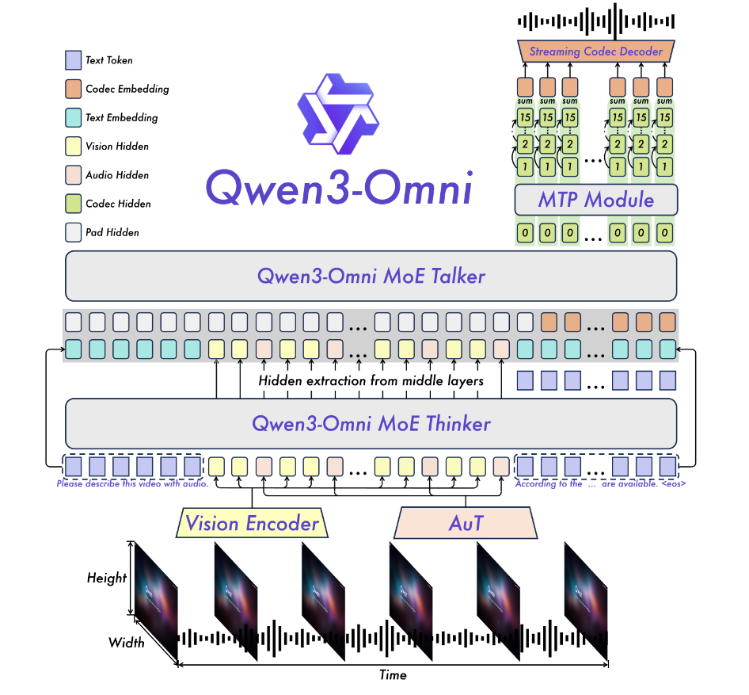

Omni 是指**全部**或**所有**的意思， Qwen3Omni 可以同时处理文本图片视频语音多种模态。

# 0 Abstract

摘要要中的技术性内容有：
1. 架构：Thinker-Talker MoE
2. 输入：Text、Image、Video、Audio
3. 输出：Text、Audio
4. lightweight causal ConvNet replaced block-wise diffusion to reduce inference latency

# 1 Introduction

natively multimodal systems：就是指能原生支持多模态的模型，而非将各种模态的数据分别解码然后嫁接到一个主干模型。

## 1.1 跨模态训练的问题

以前的模型在学习新模态（如图像）时，往往会牺牲原有模态（如文本）的性能，基于这个问题：

* **目标：** 作者的目标是探索一种“集成多模态训练”方法。
* **成果：** 他们证明了联合多模态训练可以**实现所有模态的性能“同等”（parity）**，这意味着在增加新模态能力时，**不会出现特定模态的性能退化**。
* **额外收益：** 这种方法不仅没有导致性能下降，反而还**显著增强了跨模态能力**（例如视频理解）。

### Key Ingredient

* **方法：** 实现这一点的 **“关键因素”**是：在**文本预训练的早期阶段**，就将**单模态数据（如纯文本）和跨模态数据（如图像-文本）混合**在一起。
* **结果：** 论文以 Qwen3-Omni-30B-A3BBase 模型为例，证明了其文本和视觉性能与同等大小的、专门的单模态（文本和视觉）模型**表现得“旗鼓相当”（on par）**，同时还展现了强大的音频和音视频理解能力。

### “无退化”系统的定义

“无退化的多模态系统”是一个可以实现的目标。这种理想的系统具有两个关键特性：

1. 其在单一模态上的能力，能 match 专门的单模态模型。
2. 它能促进新颖的**跨模态推理和交互**（比如边看视频边听声音来进行推理），而这是传统单模态方法所不具备的显著优势。

## 1.2 架构升级

* **(1) 转向 MoE 架构：** “Thinker”（思考者）和 “Talker”（说话者）两个模块都升级为了**混合专家（MoE）设计**。
* **(2) 全新的音频编码器：** 用团队**自研的 AuT（Audio Transformer）编码器**替换了原来的 Whisper 编码器。
    * AuT 是在一个高达 **2000 万小时**的监督音频数据集上从头训练的。
    * 它采用**块状窗口注意力**（block-wise window attention）来实现实时的预填充缓存。
* **(3) 采用多码本：** 在语音生成方面，采用了**多码本（multi-codebook）表示** 。这提高了模型的容量，使其能更真实地模拟多样的声音、语气（副语言线索）和声学现象。
* **(4) 改进 Talker 模块：** “Talker” 模块有多项改进：
    * 它从单轨编解码器建模转向**多轨编解码器建模**。
    * 它通过 **MTP 模块**（多 token 预测模块）来自回归地预测多个码本层。
    * 在最终的波形生成（Code2Wav）阶段，用一个**轻量级的卷积网络（ConvNet）** 替换了计算密集的块状 DiT。
* **(5) 降低音频码率：** 输入和输出的音频码率（code rates）被降低到 **12.5 Hz** ，这使得输出编解码器能够实现**单帧、立即的语音合成**。

## 1.3 功能改进

* **(1) 支持长音频：** 能够理解**超过 40 分钟**的音频输入。
* **(2) 扩大语言支持：**
    * 书面文本交互支持 **119 种**语言。
    * 语音理解支持 **19 种**语言。
    * 语音生成支持 **10 种**语言。
* **(3) 引入“思考”模型：** 增加了一个 “Thinking” 模型，实现了**全模态推理**。
* **(4) 提升流式性能：** 实现了更优的流式传输性能，端到端延迟最低可达 **234 毫秒**。

# 2 Architecture

主要分为这么几个部分：
1. Overview
2. Audio Transformer (AuT)
3. Perceivation
4. Speech Generation
5. Designs for Streaming and Concurrency

## 2.1 “Thinker-Talker 解耦”的结构是什么意思？

Qwen3-Omni 架构设计的核心之一

### 1. “Thinker-Talker 解耦”的结构是什么意思？

"Thinker"类似于**大脑**，"Talker"类似于**声带和嘴巴**。

* *Thinker (大脑):** 负责*理解*所有输入（文本、图像、音频、视频），并*思考*要回复什么内容。它的最终产出是**文本**（Text Generation）。
* **Talker (声带):** 负责*说出*内容。它的产出是**语音**（Speech Tokens）。

**“解耦” (Decoupling) 是什么意思？**

在 Qwen2.5-Omni 中，Talker 的输出非常依赖 Thinker 输出的“高级**文本**表示”（high-level text representations）。类似于一个演员在*阅读*大脑写好的*纯文本文稿*。

而在 Qwen3-Omni 中，这种依赖被“解耦”了。Talker **不再**使用那个“高级文稿”。取而代之，它现在主要依赖两条信息：

1. **多模态特征 (Audio/Visual Features):** Thinker 会把它*感知*到的**原始音频和视觉特征**直接“传递”给 Talker。
2. **最终的文本令牌 (Discrete Tokens):** Thinker 只告诉 Talker *具体要说哪几个字*（离散的 token 和 embedding 在信息上是等效的）。

**总结：**“解耦”就意味着 Talker 不再只听 Thinker 的*文字*指令，而是更能“感同身受”地获取到大脑处理过的*原始多模态感觉*（如声音、画面），从而更生动地说话。

### 2. 为什么要这样设计？(解耦的好处)

**好处一：能保持“音色”与“情感”（保留韵律和音色）**
* **为什么？** 这对于“音视频协调的语音生成”（例如语音翻译）至关重要，目的是为了“**保留（翻译后）的韵律和音色**”。
* **举个例子：** 假如我们用非常*兴奋*的语气说了一句中文，模型需要将其翻译成*英文*语音。
    * 在*耦合*架构下，Talker 只拿到 Thinker 翻译好的*英文文本*，它不知道该用什么语气去读，很可能读得平平无奇。
    * 在*解耦*架构下，Talker 不仅拿到了英文文本，还拿到了您原始中文语音的*音频特征*。它“听”到了原始的兴奋感，因此能用同样*兴奋*的语气说出翻译后的英文。

**好处二：实现“可控”与“安全”（允许外部模块干预）**
* **为什么？** 这种解耦允许**外部模块（如 RAG、函数调用、安全过滤器）在 Thinker 的文本输出上进行“干预”**。
* **举个例子：**
    1. Thinker 生成了一段文本回复。
    2. 在 Talker 准备说话*之前*，系统可以插入一个**“安全过滤器”**（safety filters）。
    3. 这个过滤器会审查 Thinker 生成的*文本*。如果发现内容不当或有害，过滤器可以直接将其拦截或修改，*阻止* Talker 将其说出来。
    * 同理，系统也可以在这里插入 RAG（检索增强生成）或函数调用（Function Calling），在 Talker 说话前丰富或修改文本内容。

**好处三：独立控制“内容风格”与“语音风格”**
* **为什么？** 由于文本表示被解耦，Thinker 和 Talker 现在可以使用**各自独立的系统提示**（distinct system prompts）。
* **举个例子：** 您可以同时给模型下达两个完全独立的指令：
    1. **给 Thinker 的指令：** “你是一个专业的古代历史学家，请用文言文风格回答。”（这控制了**响应风格**）
    2. **给 Talker 的指令：** “请用一种非常兴奋和有活力的孩童语气说话。”（这控制了**音频风格**）
* 模型可以完美地执行这种“角色分裂”——用孩童的兴奋声音，说着专业且严肃的文言文。在耦合架构下，这种精细控制是很难实现的。

**总结：**"解耦"架构让 Qwen3-Omni 变得**更灵活、更可控、语音表现力更强**。它不再是一个简单的“读稿机器”，而更像一个能“感同身受”并能被精细控制的“对话伙伴”。

## 2.2 模型架构

### 1 Thinker

