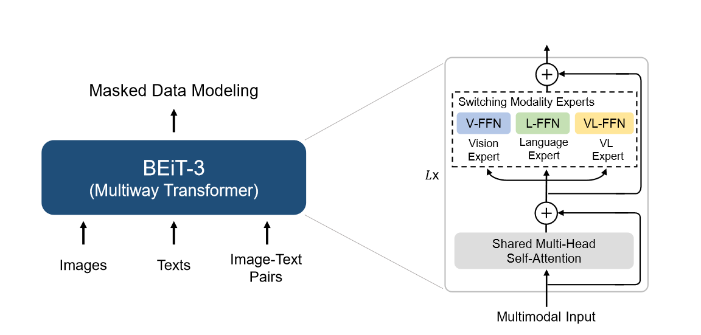

这部分内容比较适合有一定多模态方向基础的人看。

多模态有三条主线（这种划分都是比较刻意的，主要是为了理清思路）：
- 对齐主线
- 生成主线
- LLM主线
- 支线：跨模态蒸馏/视觉自监督融合

# 对齐主线

## CLIP

1. 对比学习；
2. Vision Encoder 与 Text Encoder 分别解码然后计算 ITC；
3. 学一个共享的图文语义空间，使得匹配的图文对在空间中靠得更近，不匹配的拉得更远。

## ALIGN

除双塔所用模型不同外，其余思想训练方法等同 CLIP 相同，训练数据从 4 亿图文对提升到了 13 亿。

## ALBEF

模型：
1. image encoder
2. text encoder
3. multimodal encoder
4. momentum model

损失函数：
1. **ITC**：
我们设 batch 为 N（指一个 batch 中有 N 个图文对），Momentum Model 中维持的的队列大小为 M（M 个图文对），那么对于一个 anchor 样本来说，他就有$ N + M - 1 $个负样本，然后图文分别计算 InfoNCE 便得到了 ITC。
2. **ITM**：
为了形象讲解，我们这里假设 batch 大小 N 为 4（注意，再计算 ITM 部分的时候就不再使用 Momentum Model 中维持的队列中的 M 个图文对了），也就是说有图文对四对（A，a）、（B，b）、（C，c）、（D，d），在分别经过 image encoder 和 text encoder 后得到了各自的特征向量$ V_x $，然后我们分别用$ V_A $与$ V_a,V_b,V_c,V_d $计算相似度矩阵得到下面矩阵，然后对于图片 A，取除正样本外最相似的文本 b 作为负样本，其余同理，于是就得到了正样本对$ {(A,a), (B,b), (C,c), (D,d)} $与负样本对$ {(A,b), (B,c), (C,d), (D,b)} $，然后每个样本对都经过一遍 multimodal encoder(cross-modal Transformer) 后输出 `[CLS]`，`[CLS]` 经过线性层 + softmax 后输出匹配概率，然后计算交叉熵损失：
$
L_{ITM} = - \frac{1}{2N} \sum_{i=1}^{N} \Big[ \log P(y_i=1|pos) + \log P(y_i=0|neg) \Big]
$

| 图像→文本 | a        | b        | c        | d        |
| ----- | -------- | -------- | -------- | -------- |
| **A** | **0.98** | 0.61     | 0.45     | 0.50     |
| **B** | 0.55     | **0.97** | 0.60     | 0.42     |
| **C** | 0.33     | 0.41     | **0.96** | 0.55     |
| **D** | 0.40     | 0.53     | 0.57     | **0.95** |

3. **MLM**：
输入 image + masked text，然后分别经过 image 与 text encoder 后再经过 multimodal encoder 后对 masked 部分进行预测。也就是说 ALBEF 每一个训练的 Iteration 都要经过两次 forward。

# 生成主线

## VLMO

两个动机：
1. CLIP、ALIGN等模型都是 Dual-encoder结构，这种模型在检索匹配类任务上效率高，但是模态之间的交互就用简单的 Cosine Similarity 去计算，即无法胜任生成类任务，复杂多模态任务也做不好；同理模态交互使用一个 Fusion Encoder 的模型和在复杂多模态任务上表现好，但是检索匹配类任务效率低。综上提出了模型结构上的改进，Mixture-of-Modality-Experts；
2. 多模态的数据在当时没有特别大的，所以结合 NLP 与 CV 的数据集进行分阶段训练，现在 NLP 数据集上训练好文本的 Expert，在 CV 的数据集上训练好视觉的 Expert，最后在多模态的数据集上进行 pre-training 得到一个效果更好的模型。

模型方面：
1. 不同的模态数据进来有不同的 FFN，Vision-FFN、Language-FFN，VL-FFN；
2. 除了 FFN 曾其余部分都是 Share weights 的。

训练：
1. Vision Pre-training：与 BEiT 思路类似；
2. Language Pre-Training：采用 masked language modeling (MLM) 学习语言表示；
3. Vision-Language Pre-Training：

## BLIP

两个动机：
1. 模型层面：前人工作中单纯的 Transformer Encoder模型（CLIP、ALBEF）无法原生的进行 Text Generation tasks 类任务，Encoder-Decoder 类模型（SimVLM）无法进行原生的进行 Image-Text Retrieval tasks 类任务。提出一个统一的框架，一个模型将两类任务都很好的进行解决；
2. 数据层面：当前很多模型使用的都是网上直接爬下来非常 Noisy 的数据进行学习的，效果不够好。提出了一个有效的 Clean Noisy Dataset 的办法。

## BLIP2

## BEiT

BEiT 的视觉训练方式不符合我的逻辑直觉，我认为这是一种错误的方式，当时可能只是碍于技术选择了这种方法，但是放在现在来看给我的感觉就是这种方法又不对又低效，所以掠过不讲。

## BEiT v2

略好一些，将提取视觉语义 ID 的 Tokenizer 换成了自己训练，但我还是认为这个方法不够“优雅”。

## BEiT v3

目标：大一统的模型能一个模型处理处理所有的多模态任务，同时只使用一个目标函数就训练好模型。

核心：把图像当作一种语言“Imglish”来进行训练，只使用 MDM(Masked Data Modeling) 这一个损失函数。

