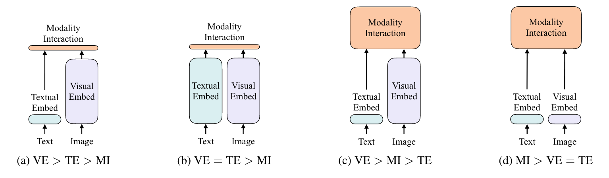
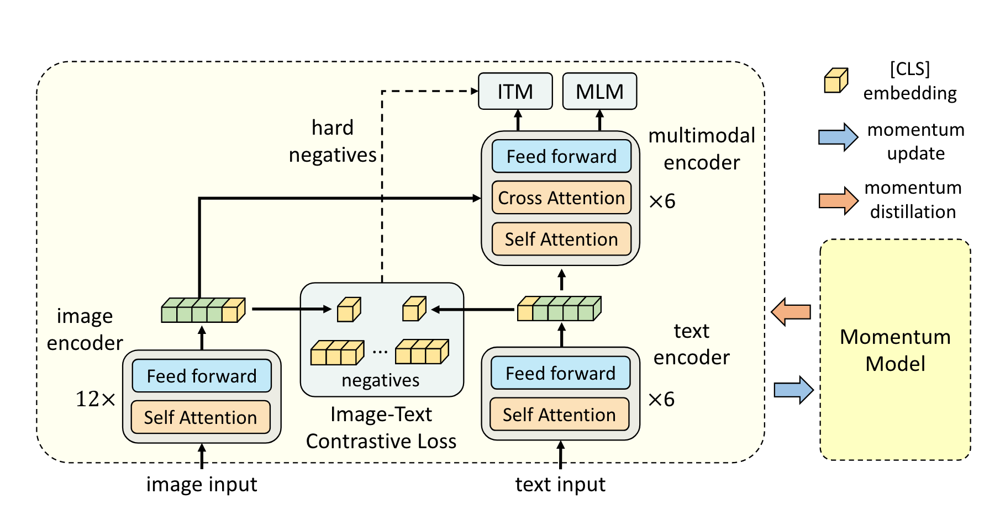

传统多模态学习论文串讲：
- 图文检索（Image Text Retrieval）
- VQA（视觉问答）
- Visual Reasoning（视觉推理）
- Visual Entailment（视觉蕴含）

# 第一部分：只用 Transformer Encoder 的一些方法

# 1.1 CLIP、ViLT 回顾

CLIP模型也是非常简单的一个结构，它是一个典型的双塔模型，他有两个Model，一个对应文本，一个对应视觉，在训练的时候通过对比学习，让已有的图像文本对在空间上拉的更近，然而让不是一个对的图片文本就拉的尽量更远，从而最后学到了非常好的图像文本特征，然后一旦学到很好的图像文本特征之后CLIP只需要做这种很简单的点乘，就能去做多模态任务，尤其是对那种图像文本匹配，或者图像文本检索的这种任务来说，CLIP简直就是神一样的存在，因为它不光效果好，而且很高效，因为往往你去做这种图像文本匹配或者图像文本检索任务的时候，你是有一个很大的已有的数据库的，这个时候如果你新来一张图片，或者新来一个文本，你要去和已有的数据库去做匹配，那其他所有的方法都会非常的慢，因为其他所有的数据都要过一遍编码器，但是CLIP模型就不用，他可以提前把那个数据库里所有的图像文本的特征提前都抽好，而且是想什么时候抽就什么时候抽，抽好放在那就行，等你真正想用的时候直接就做一个点乘就好了。

> 解释：为什么CLIP就可以离线抽取特征，而其他的（比如BLIP、ALBEF、UNITER、ViLT等）就不可以？

> 首先我们看Figure1，基本上绝大部分多模态的模型都是使用这种前向的方式进行推理的，也就是说 Text 先经过一个 Textual Encoder，Image 也先经过一个 Visual Encoder，然后两者经过 Encoder 的输出一起再送入一个 Modality 的 Cross-Encoder。     
CLIP 的特殊之处在于它没有传统意义上的 Cross-Modal Encoder。图像和文本只分别经过各自的 Encoder，输出的向量直接用于计算相似度（如点乘或余弦相似度），这一相似度计算是无参的，仅仅是一个数学操作，不涉及模型推理。所以任何新加入检索任务的数据库的数据只需要经过 Encoder 一次将特征存储起来，要进行对比的时候点乘一下即可。      
而其他模型不行，其他的模型需要同时进过两个前面的 Encoder 后再一起经过一个 Cross-Encoder，而这个过程就很麻烦了，因为同样的 Image 搭配不同的 Text 的输出肯定是不同的，而每一次前向的过程有很费时间和算力，举个例子，假设数据库中原有 1000 条文本和 500 张图片，CLIP 只需要对每个样本编码一次即可得到向量。如果再加入 1000 条新文本和 500 张新图片，只需进行 1500 次 encoder 前向推理。最终只需对所有 2000 个文本向量和 1000 个图像向量计算点乘，开销是 O(N+M)，计算效率非常高；而传统 Cross-Encoder 结构中，每一条文本都需要与所有图像组合编码，例如加入一条新文本就要与 1000 张图像分别组合输入模型做一次推理，计算复杂度是 O(N×M)，所以很难扩展。CLIP 新加入数据的计算量只是相加，而其他模型是直接相乘。

CLIP 做图文匹配效果很好，但是其他VQA、VR、VE等任务就不太行了，因为在模态融合部分只是一个简单的点乘无法涵盖模态融合中比较复杂的情况。

模型：现在多模态领域的共识是想要做一个好的模型视觉部分和模态融合部分一定要够大，也就是 ViT 部分和后面的 Cross-Encoder 要大。       

训练：有了模型后如何训练？CLIP 只用了一个对比学习的 Loss（ITC Loss：Image Text Contrastive Loss）效果就已经很好了，ITC Loss 的效果是很不错的，而且训练也很高效。     
还有两个分别是 MLM（Mask Language Modeling，BERT 的训练方式，完形填空）和 ITM（Image Text Matching，Figure1 中c和d模型中所采用的方法）。

总结：可能对于一个好的多模态学习的模型结构来说，目标函数应该就是 ITC、ITM 和 MLM 三个的合体，最后的效果应该就不错。

## 1.2 ALBEF

   

ALBEF 主要由四个模块组成：
1.	视觉编码器（Vision Encoder）
2.	语言编码器（Text Encoder）
3.	跨模态融合模块（Cross-modal Encoder）
4.	动量蒸馏模块（Momentum Distillation）

配合使用三种训练任务：
- 图文对比学习（ITC）
- 图文匹配（ITM）
- 掩码语言建模（MLM）

主要贡献：
1. 先对齐，再融合（Align Before Fuse）：使用 ITC 将图像和文本的特征先对齐（Align）再融合（Fuse）；
2.  动量蒸馏（Momentum Distillation）：使用 momentum model 来生成 pseudo target以此来克服 noisy data从而做到自训练。

**ALBEF中的ITM任务**：一般的ITM判断负样本很简单，与训练的时候很快就学不到有用的信息了，此时常见的做法是在选择负样本的时候给一些constraint，ALBEF这篇论文中采取了最常见的一个方法，选择那个最难的负样本（hard negative samples，最接近于正样本的负样本）让模型去预测。此时ITM还依赖于之前的ITC，把这张图片和同一个batch里的所有文本做一个 cos simolarity，选择一个除了自己之外相似度最高的文本去做 hard negative，此时这个 negative 已经和图像很接近了，几乎都可以看作是正样本了，这个时候 ITM Loss 就变得非常 challenging 了，一次让模型能够更好的去学习图像文本对之间的关系。

**两次前向**：在计算 ITC 和 ITM 的 loss 时输入的 i 和 t 都是原始的不变的，但是在计算 MLM Loss 的时候输入的是院士的 i 和 Masked 的 t，也就是说整个模型是做两次前向过程。

**Momentum Distillation**：

前向过程：

1. 视觉编码器（Vision Encoder）

    - 使用的是 ViT（Vision Transformer），如 ViT-B/16；
    - 输入：一张图像；
    - 输出：图像的 token 序列（包括 [CLS] token）；
    - 视觉表示记为 I = {i_cls, i_1, ..., i_n}。

2. 语言编码器（Text Encoder）

    - 使用的是 BERT-base；
    - 输入：文本（自然语言描述、问题等）；
    - 输出：文本的 token 序列（包括 [CLS] token）；
    - 文本表示记为 T = {t_cls, t_1, ..., t_m}；
    - 注意：语言编码器也会用于 MLM 掩码语言建模。

3. 图文对齐机制：Align Before Fuse      

    使用图文对比学习（ITC）：     
    - 将视觉编码器输出的 [CLS] token 与文本编码器输出的 [CLS] token 进行投影，得到两个模态的全局嵌入；
    - 使用 对比损失（InfoNCE）拉近正样本图文对之间的距离，拉远负样本；
    - 对比的是 ViT 和 BERT 单独提取的特征 → 先对齐（Align）。

4. 跨模态融合模块（Cross-modal Encoder）

    - 是一个 双流 Transformer 模块；
    - 输入：
    - - 图像 token：从 ViT 提取的 patch embedding；
    - - 文本 token：从 BERT 得到的文本 token；
    - 模块内部进行多层 cross-attention 交互，学习更深层的跨模态语义对齐；
    - 输出用于两个任务：
    - - 图文匹配（ITM）
    - - 掩码语言建模（MLM）

5. 动量蒸馏模块（Momentum Distillation）

    - 使用一个 teacher 模型，它是当前 student 模型的 指数滑动平均（类似 MoCo）；
    - teacher 生成的图文嵌入用于计算 soft label，对 student 的对比学习 loss 进行监督；
    - 优点：
    - - 提高稳定性，缓解 early collapse；
    - - 允许使用未配对图文数据进行训练（semi-supervised setting）。

ALBEF 的训练目标（Loss）：

|训练任务|	模块依赖	|描述|
| -------------- | --------------- | --------------- |
ITC (Image-Text Contrastive Loss)	|ViT + BERT + 投影头 + 蒸馏|	用于训练视觉和语言编码器之间的对齐（先对齐）
ITM (Image-Text Matching)|	Cross-modal Encoder	|输入对齐后的图文，判断它们是否匹配（fine-grained 匹配）
MLM (Masked Language Modeling)|	Cross-modal Encoder	|在图像辅助下恢复被掩盖的文本 token

# 第二部分：Transformer Encoder 和 Decoder 一起用的一些方法

