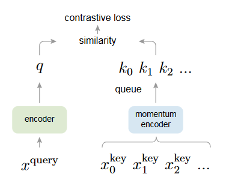
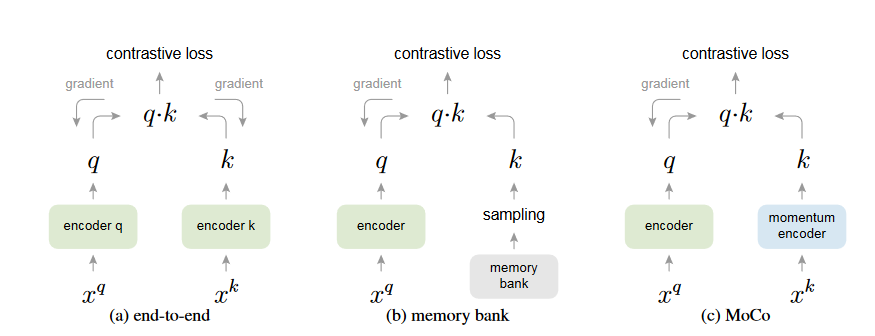

# 背景

MoCo 是视觉领域中使用对比学习的一个里程碑式的工作，作为一个无监督的表征学习的工作，MoCo不仅在分类任务上逼近了有监督的基线模型，而且在很多主流的视觉任务上（比如说检测、分割、人体关键点检测等）都超越了有监督预训练的模型（有的数据集上甚至是大幅度超越）。

## 对比学习

对比学习（Contrastive Learning）是一种 **自监督学习（Self-supervised Learning）*- 方法，主要是通过比较样本之间的相似性和差异性来学习有效的特征表示，使得模型在没有明确标签的情况下，通过设计“相似”和“不相似”的样本对，让模型学习将相似样本的表示拉近，不相似样本的表示拉远。

### 一、核心思想

对比学习的目标是学习一个编码函数 $f(\cdot)$，将输入样本 $x$ 映射到一个表示空间（embedding space），使得：

- **正样本对（positive pairs）**：来自同一图像/文本的不同视图（或具有相同语义的样本）——它们的表示应**相近**。
- **负样本对（negative pairs）**：来自不同图像/文本的样本——它们的表示应**远离**。

### 二、典型流程（以CV领域为例）

1. **数据增强**：对一张图像 $x$ 应用两种随机增强（如裁剪、旋转、颜色扰动等），得到两个视图 $x_i$、$x_j$。

2. **编码表示**：通过编码器（如 ResNet）提取其表示 $z_i = f(x_i), z_j = f(x_j)$。

3. **计算对比损失**：典型的如 **InfoNCE 损失**：

$$
\mathcal{L}_{i,j} = -\log \frac{\exp(\text{sim}(z_i, z_j)/\tau)}{\sum_{k=1}^{2N} \mathbb{1}_{[k \neq i]} \exp(\text{sim}(z_i, z_k)/\tau)}
$$

其中：

- $\text{sim}$ 是余弦相似度（cosine similarity）；
- $\tau$ 是温度系数；
- $2N$ 是 batch 中所有视图的数量；
- 分母中含有负样本。

### 三、代表性方法

| 方法名称   | 主要特点                        |
| ------ | --------------------------- |
| SimCLR | 简单直接的对比学习框架，不使用负样本队列        |
| MoCo   | 使用动态队列存储负样本，适合小 batch 训练    |
| BYOL   | 不显式使用负样本，通过动量编码器实现          |
| DINO   | 应用于视觉 Transformer，学习无监督特征表示 |
| CLIP   | 跨模态对比学习，图文对齐                |

### 四、优点

- 不依赖标签，适合无监督场景。
- 可用于预训练，迁移到下游任务效果好（分类、检测、分割等）。
- 可以应用于图像、文本、音频、多模态等多种领域。

### 五、应用场景

- 图像分类、检索
- 视频理解
- 文本语义匹配（如 SimCSE）
- 图神经网络中的节点表示学习
- 跨模态理解（如 CLIP）

# Abstract

动量对比学习（MoCo）：一种用于无监督的视觉表征学习方法。              
从对比学习中“查字典”的视角出发，构建一个由队列和动量平均编码器组成的动态字典。这种机制能动态构建一个大规模、稳定一致的字典，从而更好地支持对比式的无监督学习。
> 什么是“查字典”？
把对比学习中的“对比”过程，类比成在一个“字典”中查找一个键（key）对应的值（value），**模型要学会在大量“干扰”的负样本中，识别出和查询样本语义一致的“正样本”**。在这个类比中：
- **查询样本（query）*- 是要查找的词；
- **正样本（positive key）*- 是这个词在字典中正确的定义；
- **负样本（negative keys）*- 是字典中其他词的定义（干扰项）；
- 模型的任务是：**在字典中正确找到这个词对应的定义，而不是选错别的定义**。

> MoCo 创新之处是用队列来保存大量负样本，用动量编码器来保证 key 的特征稳定.

MoCo 在 ImageNet 分类任务中的常见线性评估协议下变现很好，特别是，MoCo 学到的表征在下游任务中具有良好的迁移能力。在 PASCAL VOC、COCO 等数据集上的 7 个检测/分割任务中，MoCo 的表现甚至超过了有监督预训练方法，有时优势非常明显。

说明在许多计算机视觉任务中，无监督与有监督表征学习之间的差距已经大大缩小。
> 这在当时是非常重要的。

# Introduction

无监督表征学习在NLP中非常成功，GPT 和 BERT 等模型就证明了这一点。但在CV领域，有监督的预训练仍然占据主导地位，而无监督方法通常落后。作者猜测原因可能在于语言与图像的 **信号空间（signal space）*- 存在差异。          
语言任务具有离散的信号空间（如词语、子词等），可以构建符号化的字典（tokenized dictionaries），为无监督学习提供基础。但是CV领域原始信号是连续的高维空间，而且不是为人类交流而结构化的（不像文字），因此无监督学习需要首先解决如何构建字典的问题。

虽然无监督视觉学习本身较难，但很多近期方法借助 **对比损失（contrastive loss）*- 取得了突破，这些方法中包括了 MoCo、SimCLR、InstDisc 等等。这些方法的出发点各不相同，但它们可以被看作是 **构建“动态字典”*- 的过程。
> 核心思想就是：**无监督对比学习 ≈ 构建一个不断变化的特征字典**，用来查询样本之间的相似关系。

字典中的“key”（或称为 token）是从数据中采样得到的（比如整张图像或图像的 patch），并由一个编码器网络生成其表示。无监督学习的目标是训练编码器进行字典查询：一个被编码的“query”应该和它对应的 key 相似，与其它 key 不相似。所以整个学习过程可以被形式化为最小化一个对比损失函数（contrastive loss）
> 这里的“key”就是对比学习中的参考特征（positive/negative）,是由编码器提取出来的图像特征。
这些特征组成了“查字典”时的备选答案池。

基于此，作者假设理想的对比学习字典应当满足两个条件：
1. 大规模；
2. 在训练过程中保持一致性。

因为一个更大的字典可以更好地对底层连续的高维视觉空间进行采样。同时，字典中的 key 应由相同或相似的编码器生成，以确保它们与 query 的比较是一致。然而，目前已有的对比损失的方法通常在这两个方面中至少存在一个缺陷（后文会详细讨论）。

**Figure 1**: MoCo（Momentum Contrast）方法的核心结构图和说明。它直观展示了 MoCo 的训练流程和两个关键机制：“动量编码器（momentum encoder）”和“队列字典（queue dictionary）”。                   
**左边：Query 分支**
- 输入：一张图像经过数据增强后得到的一个视图 $x^{\text{query}}$
- 通过主编码器（绿色的 encoder），得到其特征向量表示 $q$
- 输出：这个 $q$ ，也就是我们要“查字典”的查询词

**右边：Key 分支**
- 输入：$x^{\text{key}}_0, x^{\text{key}}_1, x^{\text{key}}_2, \dots$，从其他图像中采样或从当前 batch 的其他增强图像中得到。
- 通过一个 **动量编码器（momentum encoder）** 生成多个多个 key 向量 $k_0, k_1, k_2, \dots$
- 这些 $k$ 向量会被放入一个 **队列结构（queue）** 中组成一个 **字典队列** ，供对比使用
- 正样本 key 是与 query 来自同一张原图的增强视图；其他 key 则是负样本。

**上方**：对比损失（Contrastive Loss）

* 使用对比损失（如 InfoNCE）：

  * **最大化 $q$ 与其对应正样本 $k^+$ 的相似度**
  * **最小化 $q$ 与其他负样本 $k^-$ 的相似度**

  $$
  \mathcal{L}_{q} = -\log \frac{\exp(\text{sim}(q, k^+)/\tau)}{\exp(\text{sim}(q, k^+)/\tau) + \sum_{k^-} \exp(\text{sim}(q, k^-)/\tau)}
  $$

**整体解释：**             
- MoCo 通过对比损失训练一个视觉表示编码器，使得编码后的 query $q$ 与字典中的编码 key 进行匹配。     
- 字典中的 key 是由一批数据样本“动态构建”的（这些 key 不是预先存好的，而是由训练过程中不断输入的数据生成的，确保字典不断更新）。                     
- 这个字典是以队列形式构建的：每次将当前 batch 的样本加入队尾，同时移除最旧的 key 样本，从而**让字典大小与 batch 大小无关**（这是 MoCo 的关键创新之一）。                  
- 这些 key 是由一个 **缓慢更新的编码器（动量编码器）** 生成的，其参数通过 query 编码器以动量方式更新得来的。           
- 这个机制可以构建一个大规模且稳定的一致性字典，便于学习图像特征。

MoCo（Momentum Contrast） 是一种用于无监督学习的机制，通过对比损失（见Figure_1）来构建一个大而一致的字典（dictionary）。          
通过一个 **队列（queue）** 来维护这个字典：当前 mini-batch 的编码特征被加入队尾，最老的样本则从队首移除，队列机制使得字典大小不再受限于 mini-batch 的大小，从而可以构建更大的字典。          

* 动量更新公式：

  $$
  \theta_k \leftarrow m \cdot \theta_k + (1 - m) \cdot \theta_q
  $$
* 动量系数 $m \approx 0.999$，确保更新缓慢，特征稳定。
* 保证字典中 key 的特征分布不会抖动太大。

# 2 Related Work

我们依次来讲解。

## a:end-to-end

这种方法采用了q与k两个 encoder 一同接受梯度回传来进行更新，但是这种方式受限于GPU的内存大小，GPU内存中能放下的 batch_size 大小便是对比学习中的负样本的字典的大小，这样模型无法从充分的数据集中学到正确的信息，反而会因为能学习的数据集较小学到一种偷懒的方式（也就是trivial 特征）。

## b:memory bank

这种方法只采用了一个 encoder，字典大小则完全使用 memory bank 方法，也就是将数据集中的所有样本全都放进去。这种方法解决了负样本较少的问题，但是又引进了一个新的问题。
在q编码器对图像特征进行学习之后，会对学习了的内容进行更新，但是受限于GPU内存的大小每次更新的 minibatch 都是有限的，并且在下一轮 epoch 中上一轮抽到的 minibatch 不一定能又抽到一起。举个简单的例子，假设有128个图像，但是受限于GPU的内存每次只能处理4张图像，在这轮 epoch 中先抽到的是0-3这四张图片，这四张经过 encoderA 的处理然后放回 memory bank，这四张图像对比学习后 encoderA 变化了变为 encoderB，然后又选取了4-7这四张图片，然后变为 encoderC，依次下去，到下一个 epoch 中，encoderZ选择的是2-5四张图片，但2、3和4、5的特征缺乏一致性，这就会导致对比学习的特征一致性很差，导致模型训练出来的结果也比较差。

# 总结

我自己来总结一下MoCo的关键点：       
动量编码器能够让对比学习字典保持够大的情况下还能具有一致性。    
- 够大：能够让模型有足够的负样本去对比学习      
- 一致性：保证是使用相同的特征处理（用相同的方法提取特征）提取到的特征去进行对比学习