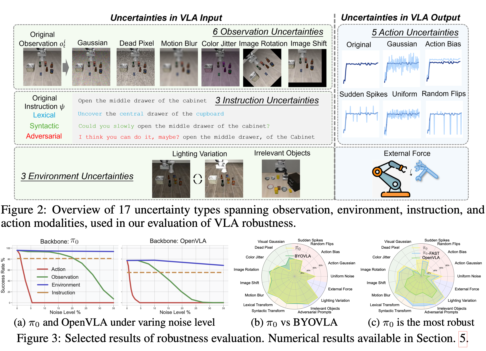

ON ROBUSTNESS OF VISION-LANGUAGE-ACTIONMODEL AGAINST MULTI-MODAL PERTURBATIONS

# 1.What problem does this paper attempt to address?

Recent studies on VLA robustness typically focuses only on scenarios where the images are corrupted, such as:
- Gaussian noise appearing in images;
- Changes in lighting conditions;
- Irrelevant objects appearing in the frame;
- Camera blur or pixel shifting occurring.

However, the uncertainties robots encounter in the real world extend far beyond visual noise. For example:
- Minor errors occurring when motors execute actions;
- Calibration shifts in the robotic arm;
- Interference affecting the control signals;
- User employing different phrasing to issue instructions;
- Irrelevant content mixed into the instructions;
- External force disturbances occuring in the environment.

Therefore, the paper proposes a more comprehensive problem:
**How fragile are VLA models exactly when facing four categories of perturbations-vision, language, action, and environment? And how can the overall robustness of VLAs be improved without relying on external large models?**

# 2.The First Work: Establishing a Multi-Modal VLA Robustness Evaluation System

The paper first constructs an evaluation framework covering 4 modalities and 17 types of perturbations.

## 2.1 Action Output Perturbations: 5 Types

Action perturbations mean that the model has already outputted the control signals, but deviations occur during the actual execution process.
| Perturbation Type | Meaning | Corresponding Real-World Problem |
| --- | --- | --- |
| Uniform Noise | Adds uniform noise to the actions | Random motor or sensor errors | 
| Gaussian Noise | Adds Guassian noise to the actions | Micro-vibrations, actuator fluctuations |
| Action Bias | Introduces a fixed offset across all action dimensions | Robotic arm calibration drift, actuator wear |
| Random Flips | Causes a few action dimensions to suddenly flip to extreme values | Communication errors, actuator jamming |
| Sudden Spikes | Occasional large-amplitude action surges | Control signal spikes, mechanical shocks |

The key here is: these perturbations occur after the model outputs the signal.

In other words, even if the VLA model predicts correctly, the action actually executed by the robot can still deviate from the original action.

## 2.2 Visual Observation Perturbations: 6 Types

| perturbation Type | Meaning |
| --- | --- |
| Gaussion Noise | Image Gaussion Noise |
| Dead Pixel | Dead pixels, black dots, or white dots |
| Motion Blur | Motion blur |
| Color Jitter | Changes in color, brightness, or saturation |
| Image Rotation | Image rotation |
| Image Shift | Image shift |

These perturbations simulate errors from cameras and visual ensors.

## 2.3 Environmental Perturbations: 3 Types

| Perturbation Type | Meaning |
| --- | --- |
| External Force | External force disturbing the obotic arm |
| Irrelevant Objects | Irrelevant objects added to the scene |
| Lighting Variation | Changes in environmental illumination |

Among these, **External Force** is closer to an action output-side perturbation, while Irrelevant Objects and Lighting Variation primarily affect the visual input.

## 2.4 Instruction Perturbations: 3 Types

| Perturbation Type | Meaning |
| --- | --- |
| Lecxial Transform | Replacing synonyms, modifying local vocabulary |
| Syntactic Transform | Adjusting sentence patterns, changing word order |
| Adversarial Prompts | Adding ambiguity, distracting infotmation, or misleading context |

For example, the original instruction could be:
> Open the middle drawer of the cabinet.

After a syntactic perturbation, it might become:
> Could you slowly open the middle drawer of cabinet.

The underlying semantics ave not changed, but the way it is expressed has altered.

# 3.The Second Work: Systematic Evaluation of Mainstream VLA models

The paper eveluates three representative types of models:
- OpenVLA: Autoregressively generates discrete action tokens.
- $\pi_0$-FAST: Uses efficient action tokenization.
- $\pi_0$: Uses a continuous action generation head based on flow matching.

Addtionally, the papser compares them against an existing visual-robust method BYOVLA.
The eveluation was completed base on the LIBERO robotic mainpulation benchmark.

## 3.1 Finding One: Action Modality is the Most Fragile Modiality

This is one of the most important experimental conclusions of the paper.
The paper finds that the visual noise and language perturbations usually need to reach a relatively high intensity to significantly impact the task success rate; however, even a very small deviation in the action output causes the task success rate to drop rapidly.
For example, for $\pi_0$:
- When the action noise is only 0.05, the success rate already drops to 52.4%;
- When the action noise reaches 0.1, the model fails almost completely.

This demonstrates that robotic control is a system prone to servere error accumulation.
An action deviating slightly from the correct trajectory can lead to:
1. The robotic arm entering a new state not covered by the training data;
2. Subsequent visual observations changing according;
3. The model continuing to make predictions under out-of-distribution(OOD) states;
4. Errors continuously accumulating;
5. Ultimate task failure;

Therefore, VLA robustness cannot just focus on visual input; close attention must also be paid to whether the action output itself is stable.

## 3.2 Finding Two: Visual Robustness Cannot Transfer to Other Modalities

The core idea of BYOVLA is to:
1. Identify the regions of the visual input to which the model is sensitive;
2. Call an external vision-language model to perform segmentation;
3. Repair or perform image inpainting on these sensitive regions;
4. Input the processed image back into the VLA.

This approach is effective under certain types of visual noise.For example:
- Gaussion Noise: Improved by 7.3%;
- Dead pixel: Improved by 22.3%;

However, the paper finds that BYOVLA's average improvement under non-visual perturbations is **0.0%**.

In other words, enhancing image robustness cannot naturally resolve:
- Action execution errors;
- Variations in instruction phrasing;
- External force disturbances;
- Multi-model mixed noise;

## 3.3 Finding Three: $\pi_0$ is More Rebust Than OpenVLA

Under the 17 types of perturbations:
- $\pi_0$ is on average 27.9 percentage points higher than OpenVLA;
- $\pi_0$ is on average 5.1 percentage points higher than $\pi_0FAST$.

The paper argues that this demonstrates the **diffusion** / **flow-matching** action head of $\pi_0$ may be better suited for robust control than autoregressive discrete action tokens.
OpenVLA discretizes continuous actions into tokens and then predicts them token-by-token; in contrast, $\pi_0$ directly models continuous action distributions. Therefore, $\pi_0$ has a higher tolerance for small-amplitude action deviations.

# 4. The Third Work: Proposing RobustVLA

Based on the findings mentioned above, the paper peoposes RobustVLA.
It is not a completely brand-new VLA foundation model, but rather a robust fine-tuning framework that can be appended to existing VLAs.
The paper primarily implements RobustVLA on $\pi_0$, while also verifying that that it can be transferred to OpenVLA.
The overall objective can be written as:
$$
\mathcal{L}_{\text{RobustVLA}} = \mathcal{L}_{\pi_0} + \mathcal{L}_{\text{in}} + \mathcal{L}_{\text{out}}
$$
Where:
- $\mathcal{L}_{\pi_0}$: The original task learning loss;
- $\mathcal{L}_{\pi_0}$: The input perturbation robustness loss;
- $\mathcal{L}_{\pi_0}$: The action output perturbation robustness loss.

# 5. How to Add Action Noise

The essence of Action Noise is: the VLA first outputs the action normally, and then, before sending it to the simulation environment or the real robotic arm for execution, this action is artificially corrupted.

It is not added to the image, nor is it added to the language; rather, it is applied at:
$$
A_t \rightarrow \hat{A}_t
$$
Where:
- $A_t$: The clean action originally output by the model.
- $\hat{A}_t$: The action actually executed after adding Action Noise.
  
In Appendix A.1, the paper defines 5 types of action uncertainties: Uniform Noise, Gaussian Noise, Action Bias, Random Flips, and Sudden Spikes. These are utilized to simulate real-world robot execution errors such as sensorimotor noise, actuator wear, and unexpected perturbations.

## 5.1 Where in the Control Pipeline is Action Noise Applied?

The original VLA execution pipeline is:
$$
o_t \rightarrow \text{VLA} \rightarrow A_t \rightarrow \text{Robot/Env}
$$

After incorporating Action Noise, it becomes:
$$
o_t \rightarrow \text{VLA} \rightarrow A_t \rightarrow \text{Action Noise} \rightarrow \hat{A}_t \rightarrow \text{Robot/Env}
$$

That is to say, the model itself is completely unaware that its actions have been modified.

The model assumes it has output:
$$
A_t
$$

But what the robot actually executes is:
$$
\hat{A}_t
$$

## 5.2 How is Action Noise Applied to OpenVLA's Action Tokens?

Internally, OpenVLA first outputs discrete action tokens, for example:

$$Z_t = [140, \; 125, \; 128, \; 129, \; 128, \; 124, \; 190]$$

These tokens are first decoded into continuous actions:

$$A_t = \text{Decode}(Z_t)$$

Suppose we obtain a 7-dimensional action after decoding:

$$A_t = [0.10, \; -0.02, \; 0.00, \; 0.01, \; 0.00, \; -0.03, \; 0.50]$$

Action Noise is not directly added to the token IDs; instead, it is applied to the continuous action $A_t$ **after decoding**.

That is to say:

$$Z_t \rightarrow A_t \rightarrow \hat{A}_t \rightarrow \text{Env}$$

Where:

$$\hat{A}_t = \text{ActionNoise}(A_t)$$

All five types of Action Noise defined in the paper are applied as modifications to this continuous action vector.

## 5.3 How is it Applied to $\pi_0$'s Action Chunk?

If the model outputs a sequence of actions all at once:

$$A_t = [a_t, \; a_{t+1}, \; \dots, \; a_{t+H}]$$

It can be conceptualized as a matrix:

$$A_t \in \mathbb{R}^{H \times d}$$

For example, looking at just 3 time steps and 2 dimensions:

$$A_t = \begin{bmatrix} 0.10 & -0.02 \\ 0.08 & -0.01 \\ 0.05 & 0.00 \end{bmatrix}$$

Action Noise is then applied element-wise to this matrix.

