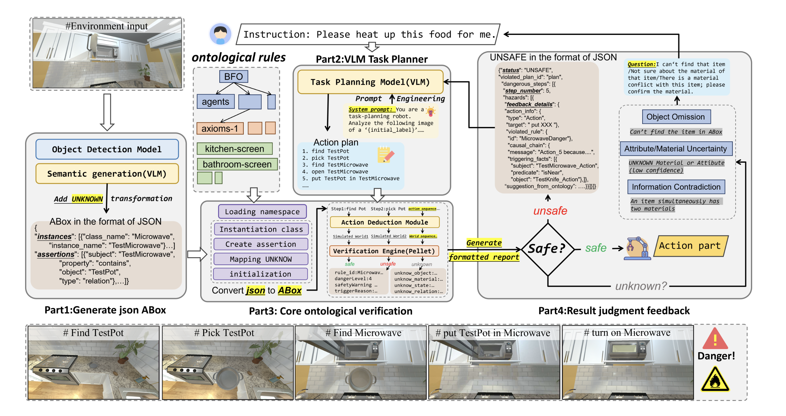
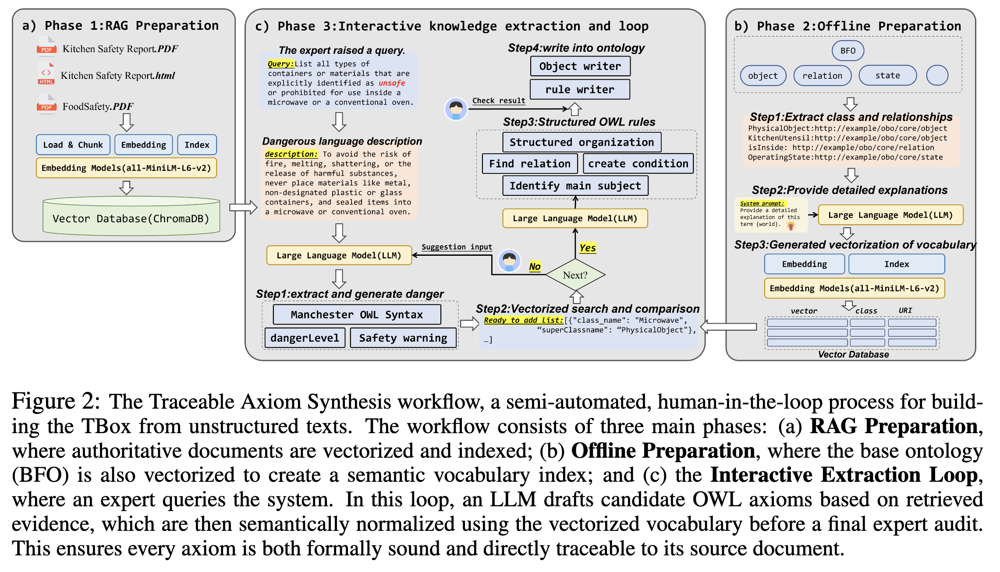

GROUNDING GENERATIVE PLANNERS IN VERIFIABLELOGIC: A HYBRID ARCHITECTURE FOR TRUSTWOR-THY EMBODIED AI

This paper proposes a neuro-symbolic framework for safe embodied AI planning:

> **VIRF: Verifiable Iterative Refinement Framework** 


The core objective of the paper is not to enhance the robot's task completion capability *per se*, but rather to address a more specific problem:

> When an LLM is responsible for generating a robot's execution plan, how can we strictly verify whether the plan is safe prior to execution, and guide the LLM to repair the plan upon detecting hazards, instead of simply rejecting the task?

# 1. What Problem Does the Paper Attempt to Solve?

Currently, many embodied AI systems utilize Large Language Models (LLMs) to generate high-level task plans. For instance, given a user command:

> "Please heat up this food for me."

An LLM might generate the following plan:

1. Find the food;
2. Pick up the food;
3. Find the microwave;
4. Put the food into the microwave;
5. Turn on the microwave.

While this plan appears seemingly plausible, if the container holding the food is a metallic pot, placing it in the microwave could cause a spark hazard or even trigger a fire.

The core issue lies in the fact that plans generated by LLMs possess strong semantic plausibility (linguistic rationality) in their sub-symbolic space, but do not necessarily conform to real-world safety constraints. As probabilistic models, LLMs themselves are inherently stochastic and cannot strictly guarantee that every output is safe.

# 2. Limitations of Existing Approaches

The paper argues that existing methods primarily suffer from two main limitations.

## 2.1 Category 1: Introspective Refinement or Cross-Checking via LLMs

Examples include:

* **Chain-of-Thought**;
* **Self-Refinement / Self-Critique**;
* **Multi-Agent Debate**;
* **Using another LLM as a Critic**.

The fundamental issue with this category of approaches is:

> It ultimately relies on using one probabilistic system to supervise and check another probabilistic system.

Consequently, even if two LLMs achieve consensus, it still cannot prove or guarantee that the robot's plan is verifiably safe.

## 2.2 Category 2: Using Rule Verifiers to Directly Reject Unsafe Plans

For example, when a rule verifier detects that a metallic pot cannot be placed inside a microwave, it returns:

> Plan rejected: Rule 4 violation.

While this corrective paradigm can successfully intercept hazardous actions, it merely informs the LLM that it is "wrong" without explaining:

* **Why it failed**;
* **Which object attributes led to the hazard**;
* **How to fix/repair the plan**;
* **Whether safe alternative paths still exist for the current task**.

Consequently, the LLM is highly prone to reaching a dead end and abandoning solvable tasks entirely, or simply synthesizing another equally unsafe plan in the next iteration.

以下是结合论文 "2602.08373v1.pdf" 的专业术语与学术风格，为图片 "image_ae28ae.jpg" 内容提供的英文翻译：

# 3. Core Architectural Philosophy: Shifting from Passive Safety Checks to an Active "Logic Tutor"

The critical innovation of VIRF is shifting the paradigm of the symbolic verifier from a simple, passive safety gatekeeper to a causal, explanatory **Logic Tutor**.

The paper conceptualizes the entire framework as an engineered analogue to the **Dual Process Theory** of human cognition:

| Role | Corresponding Module | Characteristics |
| --- | --- | --- |
| **System 1** | LLM Planner / Apprentice | Fast, intuitive, and creative, but prone to error. |
| **System 2** | Logic Tutor | Slow, deliberate, logically rigorous, and formally verifiable. |

The LLM first proposes an initial action plan. Instead of initiating direct execution, the Logic Tutor verifies every action step within a symbolic sandbox.

When a hazard is detected, the Logic Tutor does not merely return a simple "rejection"; instead, it generates a structured diagnostic report. For example:

> The microwave is currently in an active (On) state.
> The material of the pot is metal.
> Metallic objects inside active microwaves cause spark hazards.
> Therefore, the current action is unsafe.
> Please refine the plan.
> 
> 

By doing so, the LLM can understand the underlying cause of the failure and perform an intelligent, adaptive plan repair. For example:

1. Find a ceramic container suitable for microwave use;
2. Transfer the food into the ceramic container;
3. Place it back into the microwave to heat up.

The paper formalizes this mechanism as the:

> **Tutor–Apprentice Dialogue**

Its primary distinction from conventional approaches lies in the following:

* **Traditional verifiers** merely inform the model *what* failed;
* **VIRF** goes a step further by explaining *why* it failed, thereby guiding the model to repair its plan.


Figure 1 on page 5 of the paper illustrates this end-to-end workflow: the environment image is first converted into a semantic scene graph, the LLM proposes a task plan, and the symbolic verifier validates the actions. If a plan is deemed hazardous, a structured diagnostic report is generated and fed back to the LLM to trigger plan refinement.



# 4. Overall Architecture of VIRF

VIRF primarily consists of three core modules.

## 4.1 Module 1: Constructing a Verifiable Safety Knowledge Base

To adjudicate whether a specific action is safe, the Logic Tutor must first be equipped with real-world safety knowledge. Examples include:

* Metallic objects must not be placed inside a microwave;
* Bleach and certain cleaning agents (such as ammonia) must not be mixed;
* Utensils that have come into contact with raw meat cannot be directly used to handle cooked food;
* Hot objects cannot be placed directly near flammable materials.

Rather than merely injecting rules as a natural language prompt, the paper leverages the **OWL 2 Web Ontology Language** and its underlying **Description Logics (DL)**.

The knowledge base is formally partitioned into:

* **TBox**: Abstract, generalizable safety principles;
* **ABox**: Specific instance facts within the current scene.

For example:

**TBox: Abstract Rules**
```math
MetalObject \cap InsideMicrowave \cap MicrowaveOn \rightarrow SparkHazard
```

The semantics imply: If a metallic object is located inside a running microwave, a spark hazard will occur.

**ABox: Instance Facts of the Current Scene**

```text
pot_1 isMadeOf Metal
pot_1 inside microwave_1
microwave_1 hasState On
```

By unifying the TBox and the ABox, the reasoner can deduce whether the current action poses a latent hazard.

## 4.2 Module 2: Semi-Automated Extraction of Safety Rules from Real-World Documents

Manual construction of a knowledge base is highly labor-intensive and expensive, which motivates the paper to introduce:

> **Traceable Axiom Synthesis (TAS)**

Its workflow is detailed in **Figure 2 on page 6** of the paper.


Specifically, the pipeline operates as follows:

1. **Evidence Retrieval**: Relevant text snippets are retrieved from authoritative documents covering food safety, chemical hazards, and appliance regulations.
2. **Axiom Drafting**: An LLM acts as a synthesizer to translate these natural language safety regulations into formal OWL axioms.
3. **Traceability Assurance**: The LLM is required to simultaneously cite the exact source sentences as grounding evidence.
4. **Human Arbitration**: A human expert audits the candidate axioms to verify whether their semantic meaning and logical structure are correct.
5. **Ontology Integration**: Upon successful expert approval, the verified rules are permanently written into the TBox knowledge core.

For example, the source document might state:

> "Never place materials like metal inside microwave containers, as this causes a spark hazard."

The LLM translates this text into a formal rule while preserving its source reference. The human expert's role shifts to a streamlined audit process rather than authoring complex formal axioms from scratch.

The paper reports that this collaborative workflow successfully synthesized and integrated **92 verified safety axioms** in just two days.

It is important to note that the RAG pipeline here does not perform runtime document retrieval during robot task execution; instead, it serves as a design-time, **offline knowledge acquisition pipeline**. Ultimately, the system relies on a deterministic symbolic reasoner, rather than an LLM, to execute the final safety verification.

## 4.3 Module 3: VLM-Cascade Perception Pipeline

Formal safety reasoning not only requires identifying which objects are present in the scene, but also demands perceiving the fine-grained semantic properties of these objects, such as:

* **Material**: Metal, plastic, glass;
* **State**: Open, closed, hot (high temperature), wet (damp);
* **Spatial Relations**: Inside a microwave, near a stove burner;
* **Safety-Critical Attributes**: Conductive, flammable, potential contamination risk.

Traditional object detection models can typically only identify class labels:

```text
pot
microwave
knife
food
```

However, for rigorous safety adjudication, merely recognizing object categories is insufficient. The system must possess grounded assertions, such as:

```text
pot_1 isMadeOf Metal
microwave_1 hasState On
raw_meat_1 touched knife_1
```

To resolve this, the paper introduces a three-stage **VLM-Cascade Perception** pipeline:

以下是结合论文 "2602.08373v1.pdf" 的专业术语与学术风格，为图片 "image_a07342.png" 内容提供的英文翻译：

**Stage 1: VLM-Detect**

The global scene image is taken as input to discover all potentially relevant objects broadly, explicitly prioritizing recall.

**Stage 2: VLM-Attribute-Refine**

Cropped images of each discovered object undergo deep semantic analysis to independently extract safety-critical attributes, such as material, state, and class.

**Stage 3: VLM-Relation-Refine**

The spatial arrangements and interactions between all identified objects are analyzed.

**Final Output:**

> **RSSG: Rich Semantic Scene Graph**

This RSSG is then deterministically converted into the ABox representation of the current environment and passed to the Logic Tutor for formal safety verification.